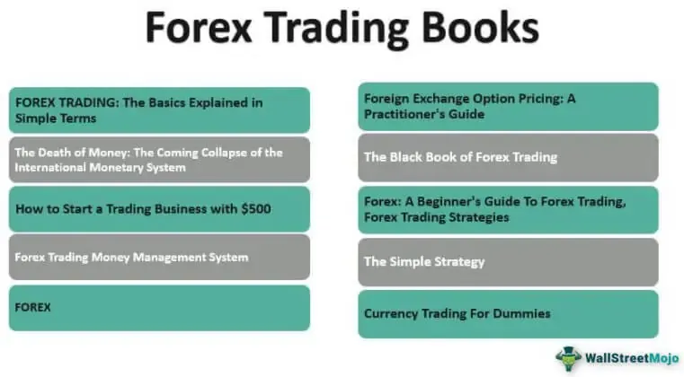

In the rapidly evolving world of finance, algorithmic trading stands as one of the most revolutionary advancements. At its core, algorithmic trading involves using computer algorithms to execute trades at speeds and frequencies far greater than could be achieved by a human trader. This has transformed the landscape of trading by making it more efficient and accessible. As technology continues to advance, so too do the strategies employed in algo trading, making it a dynamic and challenging field for traders to master.

For traders aiming to harness the power of algorithms, a deep understanding of strategy formulation is crucial. Effective strategy formulation requires a solid grasp of both the financial markets and the technical principles behind algorithms. Without this knowledge, traders may struggle to create and adapt strategies that can capitalize on market opportunities. The ability to systematically develop, test, and refine trading strategies is essential for success in this high-tech trading environment.



Books serve as essential tools for learning the intricacies of trading strategies in the context of algorithmic trading. They offer valuable insights not only into the technical aspects of algo trading but also into the strategic and psychological frameworks needed to succeed. These resources can provide traders with the theoretical foundation and practical guidance necessary to develop robust trading systems. By studying the approaches and methodologies discussed in these books, traders can gain a deeper understanding of how to construct and implement effective trading strategies.

This article explores some of the best trading strategy books, offering insights into the principles and practices of algo trading. These books are curated to address a range of topics critical to understanding and succeeding in algorithmic trading, from technical analysis and quantitative methods to trading psychology and risk management. By leveraging the knowledge contained within these works, traders can enhance their ability to develop strategic approaches that align with their individual goals and risk tolerance.

Whether you are a beginner or an advanced trader, these books can enhance your understanding and proficiency in trading. They provide a comprehensive look at the multifaceted world of algorithmic strategies, equipping readers with the necessary tools to thrive in this competitive landscape. Regardless of your level of expertise, investing time in studying these texts can yield significant benefits by enhancing your overall trading acumen.

## Table of Contents

## Understanding Algorithmic Trading

Algorithmic trading uses computer algorithms to automatically execute trades according to predefined criteria, often informed by complex mathematical models and statistical analyses. This approach leverages computational power to process vast amounts of financial data in real-time, enabling traders to capitalize on market inefficiencies and volatilize price discrepancies more efficiently than manual trading methods.

One of the primary advantages of [algorithmic trading](/wiki/algorithmic-trading) is speed, as computers can analyze market conditions and execute orders in fractions of a second, which is crucial in markets where prices can change rapidly. Moreover, algorithms operate with a level of precision and consistency unachievable by human traders, reducing the likelihood of errors associated with manual trading. This precision also facilitates the handling of large volumes of trades, offering scalability that is vital for institutional trading environments.

However, succeeding in algorithmic trading requires more than just technical and programming skills. Traders must have a robust understanding of strategic thinking to develop strategies that can adapt to changing market conditions and optimize performance. Risk management is another critical component, as it helps protect against substantial financial losses in volatile market conditions. Effective risk management strategies might include diversification, setting stop-loss limits, and continuously monitoring and adjusting algorithmic strategies to mitigate exposure to risk.

In summary, while algorithmic trading offers considerable advantages in terms of speed, accuracy, and scalability, effective participation in this market demands comprehensive strategic planning and risk management skills. These competencies help ensure trading algorithms operate optimally and adapt to the dynamic nature of financial markets.

## Essential Books for Algorithmic Trading Strategies

A well-curated selection of [books](/wiki/algo-trading-books) can provide both theoretical knowledge and practical insights into algorithmic trading strategies. These books cover a wide array of topics, from technical analysis and strategy development to trading psychology and risk management. 

1. **Technical Analysis and Strategy Development:**
   Books focusing on technical analysis offer a foundational understanding of chart patterns, indicators, and how they can be used to formulate strategies. These texts often delve into methods for identifying trends and reversals, critical components of successful trading. They also discuss the application of various technical indicators such as moving averages, Bollinger Bands, and Relative Strength Index (RSI), which are often incorporated into trading algorithms to automate decision-making processes.

2. **Trading Psychology:**
   Trading psychology plays a significant role in the success of any trader. Understanding the emotional side of trading can be as important as mastering the technical aspects. Books dedicated to this topic emphasize the need for mental discipline, helping traders manage emotions like fear and greed, which can significantly impact decision-making. Developing psychological resilience is crucial to maintain consistency and objectivity when executing trading strategies.

3. **Risk Management:**
   Effective risk management is another key area of focus. Books on this subject provide insights into setting appropriate risk policies, understanding market [volatility](/wiki/volatility-trading-strategies), and developing strategies to protect capital. They often cover techniques such as stop-loss orders, position sizing, and diversification, which are vital for managing risk in algorithmic trading. Understanding these principles is essential to safeguard against unforeseen market fluctuations and to ensure long-term viability.

4. **Algorithmic Implementation:**
   The practical side of algorithmic trading involves the implementation of strategies through coding. Many books provide code examples, especially in Python, to illustrate how trading algorithms can be executed. These texts guide readers through constructing algorithms, [backtesting](/wiki/backtesting) strategies, and deploying them in live markets. They offer both high-level conceptual frameworks and detailed, hands-on coding exercises, enabling traders to translate theoretical strategies into functional trading systems.

By exploring these areas, traders can gain a comprehensive understanding of the factors affecting market movements and the tools available to capitalize on them. Engaging with such literature not only enhances trading skills but also equips traders with the knowledge required to build robust, effective algorithmic trading strategies.

## Top Recommendations for Trading Strategy Books

In the field of algorithmic trading, the selection of appropriate literature is vital for developing a comprehensive understanding of trading strategies. Here are some top recommendations that provide valuable insights into this complex domain:

1. **'Algorithmic Trading: Winning Strategies and Their Rationale' by Ernie Chan**

Ernie Chan's book is an essential guide for both aspiring and experienced traders. It offers an understanding of various real-life trading strategies, accompanied by coding examples in Python and MATLAB. The book emphasizes the importance of sound rationale behind each strategy, promoting techniques like mean reversion and [momentum](/wiki/momentum) trading. Readers gain hands-on experience through case studies that illustrate how to build, test, and implement these strategies effectively.

2. **'Quantitative Trading' by Ernest Chan**

In this book, Ernest Chan guides readers through the process of setting up a [quantitative trading](/wiki/quantitative-trading) system. It covers the basics of identifying profitable strategies, avoiding pitfalls that can undermine trading endeavors, and effectively deploying and monitoring a trading system. The inclusion of clear and practical guidance makes this book a fundamental resource for those looking to enter the quantitative trading space.

3. **'Inside the Black Box: A Simple Guide to Quantitative and High Frequency Trading' by Rishi Narang**

Rishi Narang provides an insightful look into the complexities of quantitative hedge funds. He demystifies the processes and technologies used by hedge funds to achieve high-frequency trading success. The book serves as a bridge for readers, providing an understanding of how sophisticated models and algorithms operate in decision-making processes. Narang's narrative aids in grasping the mathematical and technical underpinnings of high-frequency quantitative trading.

4. **'New Market Wizards' by Jack Schwager**

Jack Schwager's "New Market Wizards" explores the stories and strategies behind some of the most successful traders. Through interviews, the book uncovers the unique strategies and philosophies that underpin their success. Learning from these experiences can provide traders with motivation and context, fostering a deeper understanding of how personal insight and market behavior interplay in developing effective trading strategies.

5. **'Advances in Financial Machine Learning' by Marcos Lopez de Prado**

Marcos Lopez de Prado's contribution to trading literature lies in his application of advanced [machine learning](/wiki/machine-learning) techniques to finance. The book guides traders through concepts like supercomputing, new algorithmic optimization methods, and the use of machine learning in creating robust models. It is particularly beneficial for traders with a data science background, providing methodologies to revolutionize traditional financial models through enhanced predictive capabilities.

These recommended books offer a broad spectrum of knowledge, including strategic formulation, system setup, quantitative analysis, trading psychology, and the application of machine learning in trading. Together, they form a comprehensive resource base for traders aiming to acquire a diverse and profound understanding of algorithmic trading strategies.

## Building A Trading Strategy: Key Insights

Developing a trading strategy necessitates a comprehensive understanding of market indicators, technical analysis, and the process of backtesting. Market indicators serve as tools used to quantify various aspects of the financial markets, such as trends, momentum, volatility, and [volume](/wiki/volume-trading-strategy). Common examples include moving averages, Relative Strength Index (RSI), and Bollinger Bands. These indicators help traders identify potential entry and [exit](/wiki/exit-strategy) points for trades by analyzing past and current market data.

Technical analysis is the practice of evaluating historical price patterns and trading volume to predict future price movements. This involves the study of chart patterns like head and shoulders, double tops, and various candlestick shapes. Technical analysts use these patterns along with indicators to make informed trading decisions.

Backtesting is essential for validating the effectiveness of a trading strategy. It involves applying a strategy to historical data to assess how well it would have performed in the past. Successful backtesting provides traders with confidence that their strategy could be profitable in live markets. A basic example in Python for backtesting a simple moving average crossover strategy could be implemented as follows:

```python
import pandas as pd
import numpy as np

# Sample data loading, replace with actual financial data
data = pd.read_csv('financial_data.csv')
data['SMA_50'] = data['Close'].rolling(window=50).mean()
data['SMA_200'] = data['Close'].rolling(window=200).mean()

# Generating signals
data['Signal'] = np.where(data['SMA_50'] > data['SMA_200'], 1.0, 0.0)

# Creating positions
data['Position'] = data['Signal'].diff()

# Calculating trends
initial_capital = float(100000.0)
positions = pd.DataFrame(index=data.index).fillna(0.0)
positions['Stock'] = data['Signal']

# Portfolio calculation
portfolio = pd.DataFrame(index=data.index)
portfolio['Holdings'] = positions.multiply(data['Close'], axis=0)
portfolio['Cash'] = initial_capital - (positions.diff().multiply(data['Close'], axis=0)).cumsum()
portfolio['Total'] = portfolio['Holdings'] + portfolio['Cash']
portfolio['Returns'] = portfolio['Total'].pct_change()

# Evaluating strategy performance
print(portfolio['Total'].iloc[-1] - initial_capital)
```

Books provide detailed frameworks that guide the creation of systematic trading strategies tailored to individual goals and risk tolerance. They discuss fundamental principles, including position sizing, risk management, and deploying algorithms that automatically execute trades based on defined criteria. An effective strategy aligns with the trader's objectives and adapts to changing market conditions to sustain long-term profitability and risk management.

## The Role of Trading Psychology

Trading psychology is a pivotal element of successful algorithmic trading, integral to managing the psychological factors that influence trading decisions. Trading is not solely about numerical analysis and algorithmic strategies; it also involves understanding and controlling emotions that can significantly impact decision-making processes. Books like "Trading in the Zone" by Mark Douglas emphasize the importance of mental discipline for consistent trading, highlighting that traders often sabotage their profitability by succumbing to emotional impulsiveness rather than following their well-formulated strategies.

Managing emotions such as fear and greed is crucial to maintaining objectivity and executing strategies effectively. Fear can lead to missed opportunities, as traders hesitate to take necessary risks. Conversely, greed can result in taking excessive risks, potentially jeopardizing the entire trading operation. Emotions can cloud judgment, leading traders to deviate from their tried-and-tested methods, often resulting in suboptimal trading performance.

Effective algorithmic trading involves a structured approach to mitigate emotional biases. Here are key strategies to improve trading psychology:

1. **Develop a Clear Plan**: A well-defined trading plan with predefined entry and exit points helps in reducing uncertainty and emotional stress. Having a structured plan allows traders to focus on execution rather than being swayed by market fluctuations.

2. **Risk Management Techniques**: Implementing risk management techniques such as stop-loss orders can prevent emotional decision-making. These tools act as safeguards, limiting potential losses and allowing traders to make rational decisions uninfluenced by momentary market volatility.

3. **Mindfulness and Stress Management**: Practices such as mindfulness meditation can enhance focus and reduce stress. A calm and focused mind is better equipped to handle the psychological stresses associated with trading, preventing both impulsive actions and emotional burnout.

4. **Continuous Learning and Adaptation**: Engaging with educational resources, including books, webinars, and seminars, reinforces the trader's mindset. Continuous learning helps traders remain adaptable and resilient, enhancing their ability to manage psychological challenges effectively.

Incorporating these strategies, traders can achieve greater consistency and objectivity in their algorithmic trading efforts, harnessing emotions as strengths rather than liabilities. This psychological fortitude allows traders to execute their strategies with precision, ultimately enhancing their performance in the financial markets.

## Conclusion

Books on trading strategies in algorithmic trading are invaluable resources for traders seeking to improve their skills. These texts cover a wide range of critical topics, from enhancing technical proficiency to understanding the intricate psychological aspects that impact trading performance. Whether it is developing a robust quantitative trading system or mastering the mental discipline required for successful trading, these books provide comprehensive guidance. By integrating insights from these books into their trading strategies, traders can better navigate the complexities of the financial markets. 

Algorithmic trading demands an understanding of strategic formulation and risk management. Theoretical knowledge combined with practical insights forms the backbone of a successful trading approach. Books such as 'Algorithmic Trading: Winning Strategies and Their Rationale' and 'Advances in Financial Machine Learning' offer strategies that traders can implement, while others like 'Trading in the Zone' by Mark Douglas emphasize the importance of maintaining emotional balance. Ultimately, these resources provide traders with the knowledge necessary to optimize their strategies and make informed decisions, enhancing their ability to achieve consistent performance in financial markets.

## References & Further Reading

[1]: ["Algorithmic Trading: Winning Strategies and Their Rationale"](https://www.wiley.com/en-us/Algorithmic+Trading%3A+Winning+Strategies+and+Their+Rationale-p-9781118460146) by Ernie Chan

[2]: ["Quantitative Trading: How to Build Your Own Algorithmic Trading Business"](https://books.google.com/books/about/Quantitative_Trading.html?id=j70yEAAAQBAJ) by Ernest P. Chan

[3]: ["Inside the Black Box: A Simple Guide to Quantitative and High Frequency Trading"](https://www.amazon.com/Inside-Black-Box-Quantitative-Frequency/dp/1118362411) by Rishi K. Narang

[4]: ["New Market Wizards"](https://www.amazon.com/New-Market-Wizards-Conversations-Americas/dp/1592803377) by Jack D. Schwager

[5]: ["Advances in Financial Machine Learning"](https://www.amazon.com/Advances-Financial-Machine-Learning-Marcos/dp/1119482089) by Marcos Lopez de Prado

[6]: ["Trading in the Zone"](http://backtothefuturetrading.com/docs/Trading%20in%20the%20Zone%20complete%20and%20formatted%20-%20Mark_Douglas.pdf) by Mark Douglas