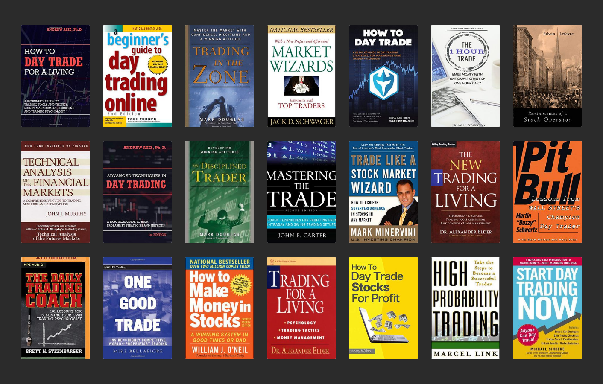

## Table of Contents

## What are the basic concepts of trading strategies that beginners should understand?

Trading strategies are plans that traders use to buy and sell assets in the market. For beginners, it's important to understand a few basic concepts. One key idea is the difference between long and short positions. When you take a long position, you buy an asset with the hope that its price will go up, so you can sell it later for a profit. On the other hand, a short position means you sell an asset you don't own, hoping to buy it back later at a lower price to make a profit. Understanding these positions helps beginners decide when to enter and exit trades.

Another important concept is risk management. This involves setting rules to protect your money, like deciding how much you're willing to lose on a single trade. Beginners should use stop-loss orders, which automatically sell an asset if its price falls to a certain level, to limit losses. Also, knowing about diversification is helpful. This means spreading your money across different assets to reduce the risk of losing everything if one investment goes bad. By understanding and applying these basic concepts, beginners can start trading with more confidence and better control over their investments.

## How can beginners identify a good trading strategy book?

Beginners can identify a good trading strategy book by looking at a few key things. First, check the author's background. A good book is often written by someone with real experience in trading, not just someone who writes about it. Look for authors who have worked in the markets or have a track record of successful trading. Also, read reviews from other readers. If many people say the book helped them understand trading better, it's probably a good choice. Lastly, see if the book covers the basics clearly. A good book for beginners should explain things like long and short positions, risk management, and diversification in a way that's easy to understand.

Another thing to consider is the book's focus. Some [books](/wiki/algo-trading-books) might be too advanced or too specific, like focusing only on one type of trading, such as options or futures. Beginners should look for books that cover a broad range of trading strategies and explain them step-by-step. This helps build a strong foundation. Also, check if the book includes practical examples and exercises. These can help you apply what you learn to real trading situations. By keeping these points in mind, beginners can find a trading strategy book that will truly help them learn and grow as traders.

## What are some recommended trading strategy books for beginners?

A great book for beginners is "A Beginner's Guide to the Stock Market" by Matthew R. Kratter. This book is easy to read and explains the basics of the stock market, including how to pick stocks and manage risk. Kratter uses simple language and gives real-life examples that make it easy for new traders to understand. He also talks about common mistakes beginners make and how to avoid them, which is really helpful.

Another good book is "Trading for Dummies" by Lita Epstein and Grayson D. Roze. This book covers a lot of ground, from the basics of trading to more advanced strategies. It's written in a friendly way that makes learning fun and not too hard. The authors explain things like technical analysis, which is about looking at charts to predict price movements, and [fundamental analysis](/wiki/fundamental-analysis), which is about understanding a company's financial health. This book is perfect for beginners because it helps them build a strong foundation in trading.

"Technical Analysis of the Financial Markets" by John J. Murphy is also worth checking out. While it might be a bit more advanced, it's great for beginners who want to dive deeper into technical analysis. Murphy explains how to read charts and use different tools to make better trading decisions. The book uses clear examples and diagrams, making it easier to understand. It's a good choice for beginners who are ready to move beyond the basics and learn more about how to analyze the market.

## What are the key differences between technical and fundamental analysis in trading?

Technical analysis and fundamental analysis are two different ways to look at the markets. Technical analysis is all about looking at charts and patterns to predict where prices might go next. Traders who use technical analysis look at things like moving averages, which show the average price over a certain time, and support and resistance levels, which are points where prices often stop and turn around. They believe that all the information they need is already in the price movements, so they don't care much about the company's news or financial reports.

On the other hand, fundamental analysis is about understanding the real value of a company. Traders who use this method look at things like earnings reports, which show how much money a company is making, and other financial statements. They also consider things like the company's management team, the industry it's in, and even the economy as a whole. Fundamental analysts believe that if a company is doing well and is undervalued, its stock price will eventually go up, so they focus on finding good companies to invest in for the long term.

In short, technical analysis is more about predicting short-term price movements based on past patterns, while fundamental analysis is about figuring out a company's true worth for long-term investment. Both methods have their strengths and can be used together to make better trading decisions.

## How do intermediate traders benefit from advanced trading strategy books?

Intermediate traders can get a lot out of advanced trading strategy books. These books often go into more detail about different trading techniques and strategies that go beyond the basics. They might talk about things like advanced chart patterns, different types of options trading, or how to use more complex indicators. For an intermediate trader, this can help them understand the market better and find new ways to make money. It's like moving from learning to ride a bike to trying out jumps and tricks – you already know the basics, but now you can learn how to do more advanced stuff.

Also, advanced books can help intermediate traders think about risk and money management in new ways. They might learn about different ways to set stop-losses or how to use leverage more safely. This can help them protect their money better and make smarter trading decisions. By reading these books, intermediate traders can feel more confident and ready to take on bigger challenges in the market. It's like getting a map to explore new areas – you can go further and find new paths to success.

## What are some essential trading strategy books for intermediate traders?

Intermediate traders should check out "The New Trading for a Living" by Dr. Alexander Elder. This book is great because it covers a lot of advanced stuff that intermediate traders need to know. Dr. Elder talks about how to use technical analysis to make better trading decisions, and he also explains how to manage risk and emotions when trading. He uses simple examples and stories to make the ideas easy to understand. This book can help intermediate traders learn new strategies and improve their trading skills.

Another good book is "Technical Analysis of the Financial Markets" by John J. Murphy. While beginners can use this book too, it's really helpful for intermediate traders who want to dive deeper into technical analysis. Murphy explains how to read charts and use different tools to predict price movements. He also talks about how to combine different types of analysis to make better trading decisions. This book is full of clear examples and diagrams, which makes it easier to learn and apply the ideas to real trading situations.

## What advanced techniques are covered in expert-level trading strategy books?

Expert-level trading strategy books often dive into advanced techniques like [quantitative trading](/wiki/quantitative-trading) and [algorithmic trading](/wiki/algorithmic-trading). These books teach traders how to use computer programs and math to find trading opportunities. For example, they might explain how to build and use trading algorithms, which are sets of rules that tell a computer when to buy and sell. They also talk about things like high-frequency trading, where computers make lots of trades very quickly, and how to use data analysis to make better predictions about where prices might go next. These techniques can be complicated, but they help expert traders make more money and manage their risks better.

Another important thing covered in these books is advanced risk management. Expert traders need to know how to protect their money in tricky situations. These books might explain how to use options and futures to hedge against losses, which means using one investment to reduce the risk of another. They also talk about how to use leverage, which is borrowing money to make bigger trades, in a smart way. By learning these advanced techniques, expert traders can handle the ups and downs of the market better and find new ways to make profits.

## How can expert traders apply the strategies learned from books in real-world trading?

Expert traders can use what they learn from books in real trading by first trying out the strategies in a safe way. They can use a practice account, often called a demo account, where they can trade with fake money. This lets them test out new trading algorithms and high-frequency trading methods without risking real money. By practicing, they can see what works and what doesn't, and make changes before using real money. This helps them feel more confident when they start using these strategies for real.

Once they feel ready, expert traders can start using these advanced strategies in the real market. They need to keep a close eye on how well the strategies are working and be ready to make changes if things aren't going as planned. For example, if a trading algorithm isn't making money, they might need to tweak it or try a different one. They also need to keep learning and stay up-to-date with new techniques and market changes. By using what they learn from books and staying flexible, expert traders can handle the market's ups and downs and find new ways to make profits.

## What are the top trading strategy books recommended for expert traders?

One top book for expert traders is "Quantitative Trading" by Ernie Chan. This book is great because it talks about how to use math and computers to trade. Ernie Chan explains how to build trading algorithms and use them to find good trading opportunities. He also talks about high-frequency trading, where computers make lots of trades very fast. This book helps expert traders learn how to use these advanced techniques to make more money and manage their risks better.

Another good book is "Algorithmic Trading: Winning Strategies and Their Rationale" by Ernie Chan. This book goes deeper into how to use algorithms to trade. It explains different strategies and why they work. Expert traders can learn how to use these strategies in real trading situations and how to adjust them if needed. By reading this book, expert traders can get better at using computers to make smart trading decisions and find new ways to make profits.

## How do trading strategy books address risk management and psychological aspects of trading?

Trading strategy books often talk a lot about risk management. They explain how important it is to protect your money when you trade. These books teach traders how to use stop-loss orders, which automatically sell an asset if its price drops too much, to limit losses. They also talk about diversification, which means spreading your money across different assets to reduce risk. Some books even go into advanced risk management techniques, like using options and futures to hedge against losses. By learning these methods, traders can make smarter decisions and keep their money safer.

Psychological aspects of trading are also a big focus in these books. Trading can be stressful, and it's easy to let emotions like fear and greed affect your decisions. Good trading strategy books help traders understand and control these emotions. They talk about things like having a trading plan and sticking to it, even when the market is going crazy. Some books also explain how to keep a trading journal to learn from past trades and improve. By understanding the psychology of trading, traders can stay calm and make better choices, even in tough situations.

## What role do trading strategy books play in developing a personalized trading plan?

Trading strategy books are really helpful when you're trying to make your own trading plan. They give you a lot of ideas and examples of different strategies that other traders use. You can read about things like technical analysis, where you look at charts to predict prices, or fundamental analysis, where you look at a company's financial health. By learning from these books, you can pick out the parts that work best for you and your goals. You might decide to use a mix of strategies or focus on one that fits your style. The books also talk about risk management, which is super important. They can help you figure out how much money you're willing to risk on each trade and how to use tools like stop-loss orders to protect your money.

These books also help you think about the mental side of trading. They explain how emotions like fear and greed can mess up your trading decisions. By reading about other traders' experiences, you can learn how to keep your emotions in check and stick to your plan, even when the market is going crazy. Some books suggest keeping a trading journal to track your trades and learn from your mistakes. This can be a big part of your personalized trading plan. Overall, trading strategy books give you the knowledge and tools you need to create a plan that works for you, helping you trade smarter and more confidently.

## How can traders of all levels stay updated with the latest trading strategies through books?

Traders of all levels can stay updated with the latest trading strategies by regularly reading new books on trading. These books often include the newest ideas and techniques that successful traders are using. For beginners, new books can help them learn the basics and also get a feel for what's working in the market right now. Intermediate traders can find books that go into more detail about advanced strategies and how to improve their current methods. Expert traders can use these books to learn about cutting-edge techniques like quantitative and algorithmic trading, which can give them an edge in the market.

It's also a good idea to check out books written by well-known traders or authors who keep up with the latest trends. These books might talk about new ways to use technology in trading, like using computers to make quick trades or using data to predict prices. By reading these books, traders can stay on top of what's happening in the market and keep their trading strategies fresh and effective. This way, they can adapt to changes and keep making smart trading decisions.

## References & Further Reading

[1]: ["Algorithmic Trading: Winning Strategies and Their Rationale"](https://www.wiley.com/en-us/Algorithmic+Trading%3A+Winning+Strategies+and+Their+Rationale-p-9781118460146) by Ernie Chan

[2]: ["Quantitative Trading: How to Build Your Own Algorithmic Trading Business"](https://books.google.com/books/about/Quantitative_Trading.html?id=j70yEAAAQBAJ) by Ernest P. Chan

[3]: ["Inside the Black Box: A Simple Guide to Quantitative and High Frequency Trading"](https://www.amazon.com/Inside-Black-Box-Quantitative-Frequency/dp/1118362411) by Rishi K. Narang

[4]: ["New Market Wizards"](https://www.amazon.com/New-Market-Wizards-Conversations-Americas/dp/1592803377) by Jack D. Schwager

[5]: ["Advances in Financial Machine Learning"](https://www.amazon.com/Advances-Financial-Machine-Learning-Marcos/dp/1119482089) by Marcos Lopez de Prado

[6]: ["Trading in the Zone"](http://backtothefuturetrading.com/docs/Trading%20in%20the%20Zone%20complete%20and%20formatted%20-%20Mark_Douglas.pdf) by Mark Douglas