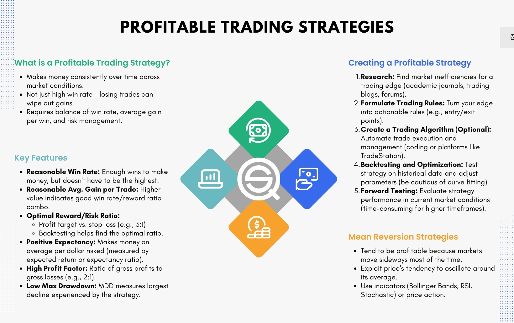

## Table of Contents

## What is a trading strategy and why is it important?

A trading strategy is a set of rules and guidelines that a trader follows to decide when to buy and sell assets like stocks, currencies, or commodities. It helps traders make decisions based on careful analysis rather than emotions or guesses. A good trading strategy considers things like market trends, economic indicators, and the trader's own goals and risk tolerance.

Having a trading strategy is important because it helps traders stay disciplined and consistent. Without a strategy, traders might make impulsive decisions that lead to big losses. A well-thought-out strategy can also help traders manage their risks better and increase their chances of making profits over time. By following a clear plan, traders can avoid common mistakes and improve their overall performance in the markets.

## What are the basic principles of a successful trading strategy?

A successful trading strategy starts with clear goals and a good understanding of the market. Traders need to know what they want to achieve, whether it's making a certain amount of money, growing their portfolio over time, or just learning how markets work. They also need to study the market they're trading in, learning about trends, how different events affect prices, and what other traders are doing. This knowledge helps them make smart choices about when to buy and sell.

Another key part of a successful trading strategy is managing risk. This means setting rules for how much money a trader is willing to lose on a single trade and sticking to those rules. Traders often use tools like stop-loss orders to automatically sell an asset if its price drops too much. They also need to spread their money across different investments to avoid losing everything if one trade goes bad. By keeping risk under control, traders can stay in the game longer and have a better chance of making money in the long run.

Lastly, discipline and consistency are crucial for a successful trading strategy. Traders need to follow their plan even when things get tough. It's easy to get scared and sell too soon or get greedy and hold on too long, but sticking to the strategy helps avoid these mistakes. Keeping a trading journal to track what works and what doesn't can also help traders learn and improve over time. By staying disciplined and consistent, traders can turn their strategy into a reliable way to make money in the markets.

## Can you explain the difference between short-term and long-term trading strategies?

Short-term trading strategies focus on making quick profits from small price changes in the market. Traders who use these strategies might hold onto their investments for just a few minutes, hours, or days. They often use technical analysis, which means looking at charts and patterns to predict what prices will do next. Short-term trading can be exciting because it moves fast, but it can also be risky. Traders need to watch the market closely and make decisions quickly, which can lead to big wins but also big losses.

Long-term trading strategies, on the other hand, are about holding onto investments for a longer time, like months or years. These traders believe that over time, the value of their investments will grow. They often use [fundamental analysis](/wiki/fundamental-analysis), which means looking at the overall health and potential of a company or market. Long-term trading is usually less stressful because it doesn't require watching the market every day. While it might take longer to see profits, the gains can be bigger, and the risk of losing money can be lower because the market has more time to recover from dips.

## What are some common beginner-friendly trading strategies?

One beginner-friendly trading strategy is called "buy and hold." This strategy is about [picking](/wiki/asset-class-picking) good investments and keeping them for a long time. You look for companies or assets that you think will grow over the years. It's a simple way to start because you don't need to watch the market every day. You just need to do your homework once and then wait. This strategy works well for people who want to invest without spending a lot of time on it.

Another easy strategy for beginners is "dollar-cost averaging." This means you invest a fixed amount of money at regular times, no matter what the market is doing. For example, you might put $100 into a stock every month. This helps you avoid trying to guess the best time to buy. Over time, you end up buying more shares when prices are low and fewer when prices are high. It's a good way to smooth out the ups and downs of the market and build your investment slowly.

Lastly, a simple strategy called "[trend following](/wiki/trend-following)" can work well for new traders. This means you watch the market to see if prices are going up or down over time. If a stock is going up, you buy it and hold it until it starts to go down. If it's going down, you might sell it or wait until it starts going up again. This strategy helps you follow the market's direction without needing a lot of fancy tools or deep knowledge. It's all about riding the trends and making simple decisions based on what you see happening.

## How does the 'Buy and Hold' strategy work and who should use it?

The 'Buy and Hold' strategy is a simple way to invest where you pick good investments and keep them for a long time. You look for companies or other assets that you think will grow over the years. Once you buy them, you don't sell them quickly. Instead, you hold onto them, even if the market goes up and down. The idea is that over many years, the value of your investments will go up. This strategy doesn't need you to watch the market every day or make quick decisions, so it's less stressful.

This strategy is good for people who want to invest but don't have a lot of time to spend on it. It's perfect for those who believe in the long-term growth of the market and are okay with waiting for their investments to pay off. People who use this strategy should be patient and not worry about short-term changes in the market. It's also a good choice for beginners because it's simple and doesn't require a lot of trading knowledge or experience.

## What is the 'Moving Average Crossover' strategy and how can it be applied?

The 'Moving Average Crossover' strategy is a way to decide when to buy or sell investments by using moving averages. A moving average is just the average price of an investment over a certain time, like 50 days or 200 days. In this strategy, you use two moving averages: a short one and a long one. When the short moving average goes above the long one, it's called a "golden cross," and it might be a good time to buy. When the short moving average goes below the long one, it's called a "death cross," and it might be a good time to sell.

This strategy can be applied by watching the moving averages on a chart. You start by picking the time periods for your short and long moving averages. For example, you might use a 50-day short moving average and a 200-day long moving average. Then, you keep an eye on the chart. If you see the 50-day moving average line cross above the 200-day line, you might decide to buy the investment. If you see the 50-day line cross below the 200-day line, you might decide to sell. This strategy helps you follow the trends in the market and make decisions based on clear signals, which can be easier for beginners to understand and use.

## Can you describe the 'Scalping' strategy and its risks and rewards?

Scalping is a trading strategy where you buy and sell things really fast, trying to make small profits many times in a day. People who use this strategy, called scalpers, look at the market very closely, often holding onto their investments for just a few seconds or minutes. They try to take advantage of small price changes, like buying something at $10 and selling it at $10.01. To do this well, scalpers need to use special tools and charts to see what's happening in the market in real-time.

The rewards of [scalping](/wiki/gamma-scalping) can be good if you do it right. Since you're making lots of small trades, those little profits can add up to a big amount at the end of the day. It can be exciting and you might make money faster than with other strategies. But scalping is also very risky. Because you're trading so often, even small mistakes can lead to big losses. It takes a lot of time and focus, and you need to be quick to make decisions. Plus, the costs of trading, like fees and commissions, can eat into your profits if you're not careful. So, while scalping can be rewarding, it's not for everyone and needs a lot of practice and skill.

## What is the 'Breakout' trading strategy and how can traders identify potential breakout points?

The 'Breakout' trading strategy is about watching for big moves in the price of something you want to trade. When the price breaks out of a certain range it's been stuck in, that's called a [breakout](/wiki/breakout-trading). Traders using this strategy buy when the price goes above the top of the range, hoping it will keep going up. They sell when the price goes below the bottom of the range, hoping it will keep going down. This strategy works because big moves often happen after a period of calm, and traders try to jump on these moves early.

To find potential breakout points, traders look at charts and watch the price closely. They draw lines on the chart to show where the price has been moving between, like the highest and lowest points over a certain time. If the price stays within these lines for a while, it might be getting ready for a breakout. Traders also use other tools like [volume](/wiki/volume-trading-strategy), which shows how many people are buying and selling, and indicators like the Average True Range (ATR) to guess how big the move might be. When the price finally moves out of the range with a lot of volume, that's a good sign that a breakout is happening.

## How does the 'Pairs Trading' strategy work and what are its advantages?

Pairs trading is a strategy where you trade two things that usually move together but have started to move apart. You buy the one that's gone down and sell the one that's gone up, betting they will come back together. For example, if you think Coca-Cola and Pepsi usually have similar prices but right now Coca-Cola is cheaper, you might buy Coca-Cola and sell Pepsi. If the prices come back together like you expect, you make money from the difference.

The big advantage of pairs trading is that it can help you make money no matter which way the market is going. Since you're betting on the difference between two things, you don't need the whole market to go up or down. This can make it less risky than other strategies. Also, because you're looking at how two things move compared to each other, you can find good trades even when the market is calm. This makes pairs trading a smart choice for traders who want to find opportunities in different kinds of markets.

## What is algorithmic trading and what strategies can be implemented using algorithms?

Algorithmic trading is when computers use math formulas to decide when to buy and sell things like stocks or currencies. Instead of people making these decisions, the computer follows the rules set in the algorithm. This can happen really fast, sometimes in just a few seconds. Traders use algorithms because they can look at a lot of information quickly and make trades without letting feelings get in the way. It's like having a super-smart robot that can trade for you all day and night.

There are many different strategies that can be used with algorithms. One common strategy is called "mean reversion," where the algorithm looks for prices that have moved away from their usual levels and bets they will come back. Another strategy is "[momentum](/wiki/momentum) trading," where the algorithm follows the trend, buying when prices are going up and selling when they start to go down. There's also "[arbitrage](/wiki/arbitrage)," where the algorithm finds small differences in prices between different places and makes money from those differences. All these strategies help traders use the power of computers to find and take advantage of opportunities in the market.

## Can you explain the 'Mean Reversion' strategy and how it can be used to predict market movements?

The 'Mean Reversion' strategy is based on the idea that prices tend to go back to their average over time. Imagine you're looking at the price of a stock over the last year. If the stock's price goes way higher than its usual average, a mean reversion trader might think it's time to sell because the price will likely come back down. On the other hand, if the price drops way below its average, the trader might buy, expecting it to go back up.

To use this strategy to predict market movements, traders look at historical data to find the average price of an asset. They use tools like moving averages to see where the price is compared to its normal range. When the price gets too far from this average, it's a signal to trade. For example, if a stock usually trades around $50 but suddenly jumps to $60, a mean reversion trader might sell, expecting it to fall back to $50. If it drops to $40, they might buy, expecting it to rise back to $50. By watching how far prices move from their average, traders can make guesses about when to buy or sell.

## What advanced technical analysis tools should expert traders use to refine their trading strategies?

Expert traders often use advanced technical analysis tools like the Relative Strength Index (RSI) and the Moving Average Convergence Divergence (MACD) to refine their trading strategies. The RSI helps traders see if a stock is overbought or oversold. If the RSI is above 70, it might mean the stock is too expensive and could go down soon. If it's below 30, it might mean the stock is too cheap and could go up. The MACD shows the relationship between two moving averages of a stock's price. When the MACD line crosses above the signal line, it can be a good time to buy. When it crosses below, it might be time to sell. These tools help traders make better guesses about where the market is heading.

Another useful tool is the Bollinger Bands, which show how much a stock's price moves around its average. The bands get wider when the price is moving a lot and narrower when it's not moving much. Traders watch for the price to touch the upper or lower band as a sign that it might be time to trade. If the price hits the upper band, it might be overbought and ready to fall. If it hits the lower band, it might be oversold and ready to rise. Expert traders also use Fibonacci retracement levels to find good places to buy or sell. These levels are based on the idea that prices often pull back to certain percentages before continuing in the same direction. By using these advanced tools, expert traders can make more informed decisions and improve their chances of success in the market.

## References & Further Reading

[1]: Bergstra, J., Bardenet, R., Bengio, Y., & Kégl, B. (2011). ["Algorithms for Hyper-Parameter Optimization."](https://papers.nips.cc/paper/4443-algorithms-for-hyper-parameter-optimization) Advances in Neural Information Processing Systems 24.

[2]: ["Advances in Financial Machine Learning"](https://www.amazon.com/Advances-Financial-Machine-Learning-Marcos/dp/1119482089) by Marcos Lopez de Prado

[3]: ["Evidence-Based Technical Analysis: Applying the Scientific Method and Statistical Inference to Trading Signals"](https://www.amazon.com/Evidence-Based-Technical-Analysis-Scientific-Statistical/dp/0470008741) by David Aronson

[4]: ["Machine Learning for Algorithmic Trading"](https://github.com/stefan-jansen/machine-learning-for-trading) by Stefan Jansen

[5]: ["Quantitative Trading: How to Build Your Own Algorithmic Trading Business"](https://books.google.com/books/about/Quantitative_Trading.html?id=j70yEAAAQBAJ) by Ernest P. Chan