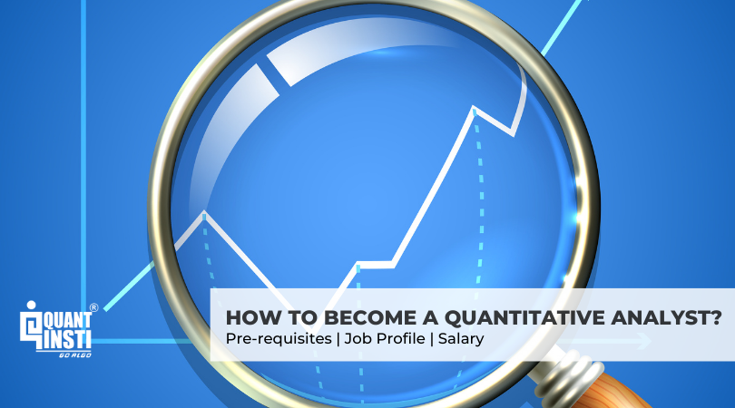

Algorithmic trading, often seen as the convergence of finance and technology, involves using computer algorithms to execute financial trades at speeds and frequencies that are impossible for human traders. These algorithms make trading decisions based on predefined strategies that take into consideration various market parameters. The precision, efficiency, and speed provided by algorithmic trading have reshaped modern financial markets.

A quant major, formally known as quantitative finance, is a specialized field of study integrating mathematics, finance, statistics, and computer science. It focuses on the development and application of mathematical models to solve complex financial problems. In the trading industry, quant majors are indispensable as they lay the foundation for understanding and developing sophisticated algorithmic trading strategies. They apply statistical methods and quantitative analysis to identify profitable opportunities in the market and to devise algorithms that can capitalize on these opportunities. 



The demand for professionals skilled in algorithmic trading is growing rapidly as financial institutions seek to enhance their trading capabilities. This trend is propelled by the increasing complexity and volume of financial data, coupled with the advancement in computing power, enabling more efficient and effective trading strategies. Hedge funds, investment banks, and proprietary trading firms are actively seeking individuals who can harness these technological advancements to gain a competitive edge.

For a career in algorithmic trading, a solid foundation in statistics, mathematics, finance, and computer programming is paramount. Skills such as data analysis, machine learning, and expertise in programming languages like Python, R, and C++ are highly valued. Moreover, a strong understanding of financial markets and trading concepts further positions individuals for success in this dynamic field.

This article aims to explore the intersection between quant major studies and careers in algorithmic trading. It seeks to provide insights into how quantitative finance serves as a cornerstone for algorithmic trading, the educational pathways available for aspiring quants, and the tools and technologies that facilitate success in this evolving industry. In doing so, it underscores the vital role of continuous learning and adaptation in navigating the challenges and seizing the opportunities presented by the ever-changing landscape of algorithmic trading.

## Table of Contents

## Understanding Quantitative Finance

Quantitative finance is a field of finance that employs mathematical models, statistics, and computational techniques to analyze financial markets and securities. It is integral to understanding and solving complex financial problems, allowing professionals to create models that help predict market trends and make informed trading decisions.

Key components of quantitative finance include mathematical modeling, statistical analysis, and computational tools. Mathematical modeling involves the use of equations and formulas to represent financial markets and instruments. Statistical analysis is crucial for interpreting data and identifying patterns or behaviors within the markets. Computational tools and platforms, often employing high-level programming languages like Python or R, are essential for executing these models on a large scale.

Data analysis is fundamental to quantitative finance, as it provides insights into market dynamics and helps in developing algorithms for trading strategies. Massive datasets require sophisticated statistical techniques to process and extrapolate useful information. Techniques such as regression analysis, time-series analysis, and [machine learning](/wiki/machine-learning) are commonly used to identify trends, correlations, and anomalies within financial data. For instance, a simple linear regression model used to predict asset prices can be represented mathematically as:

$$
y = \beta_0 + \beta_1 x + \epsilon
$$

where $y$ is the dependent variable (e.g., asset price), $x$ is the independent variable (e.g., time), $\beta_0$ and $\beta_1$ are coefficients, and $\epsilon$ is the error term.

Mathematical models are foundational to risk management and derivatives pricing. Black-Scholes, a well-known model for option pricing, uses partial differential equations to calculate the theoretical value of options. These models aid in understanding the underlying risks associated with trading activities and in developing strategies to mitigate these risks.

Quantitative finance serves as a cornerstone for [algorithmic trading](/wiki/algorithmic-trading) strategies by providing the tools necessary to analyze market conditions and develop automated trading systems. Algorithms are designed to identify opportunities based on predefined criteria derived from quantitative models. High-frequency trading ([HFT](/wiki/high-frequency-trading-strategies)), a subset of algorithmic trading, utilizes complex algorithms to execute trades at extremely high speeds, taking advantage of small price discrepancies.

In conclusion, quantitative finance represents a dynamic intersection of finance, mathematics, and technology, providing the foundation for modern trading strategies. Its emphasis on data analysis, [statistics](/wiki/bayesian-statistics), and mathematical modeling is crucial for developing effective algorithmic trading systems, highlighting the need for professionals proficient in these areas to drive the future of financial innovation.

## What is Algorithmic Trading?

Algorithmic trading refers to the use of computer programs to execute trades based on pre-defined criteria, removing human intervention from the trading process. This method uses mathematical models and computational techniques to decide on aspects such as timing, price, and order execution, thus facilitating trades at speeds beyond human capability. Originating in the late 20th century, algorithmic trading has significantly transformed financial markets by introducing efficiency and objectivity in trading operations.

One of the primary benefits of algorithmic trading is speed. Algorithms can process and react to market movements in fractions of a second, a feat impossible for human traders. Efficiency is another advantage, as algorithms can execute trades on multiple markets and instruments simultaneously without fatigue. Furthermore, algorithms provide precision by adhering strictly to the defined rules, thus minimizing emotional or irrational trading decisions.

There are various types of algorithmic trading strategies, each with its own unique approach and objectives. High-frequency trading (HFT) is one of the most prominent, characterized by a high number of transactions with short holding periods. HFT firms often profit from small price discrepancies and require substantial technological infrastructure to achieve their millisecond trade executions.

Mean reversion strategies are based on the theory that asset prices tend to revert to their historical averages. An example strategy could be buying a stock when its price is significantly lower than its average and selling when it reverts. Momentum strategies, on the other hand, seek to capitalize on existing market trends, suggesting buying assets that have shown an upward trend or selling those in a downturn.

The historical development of algorithmic trading can be traced back to the 1970s with the advent of computerized trading systems. It gained significant [momentum](/wiki/momentum) in the 1990s and early 2000s with advancements in technology and increased access to low-latency market data. The introduction of electronic trading platforms further accelerated its adoption, making markets more efficient and accessible.

As algorithmic trading continues to evolve, it remains a cornerstone of modern financial markets, offering significant advantages in terms of execution and strategy while also presenting challenges related to market impacts and regulatory concerns.

## The Role of a Quant Professional in Algo Trading

Quantitative professionals, often referred to as quants, play a pivotal role in the trading industry, particularly in the domain of algorithmic trading. Their primary responsibility is the development and optimization of trading algorithms, which are designed to automate trading decisions based on quantitative models and market data. To achieve this, quants rely on a combination of advanced mathematical techniques, sophisticated statistical analyses, and financial expertise.

The development of trading algorithms involves several critical steps. Quants begin by researching and identifying [arbitrage](/wiki/arbitrage) opportunities or inefficiencies in the financial markets. They then create mathematical models to predict future price movements or asset behavior. These models are often grounded in stochastic calculus, Monte Carlo simulations, and time-series analysis. Once a viable model is constructed, it is transformed into a trading algorithm, which is rigorously backtested against historical data to assess its robustness and performance.

An essential aspect of a quant's role is the continuous optimization of these algorithms. Market conditions are dynamic, and factors influencing asset prices can change rapidly. To maintain the efficacy of trading strategies, quants regularly refine their models, incorporating new data and adjusting parameter values. Optimization techniques such as gradient descent or genetic algorithms can be employed to enhance algorithm performance and minimize risks.

Effective participation in algorithmic trading necessitates a diverse skill set. Proficiency in programming languages such as Python, C++, or Java is crucial, as these skills are required to implement and execute models efficiently. Moreover, statistical analysis and data manipulation skills are vital, enabling quants to handle large datasets and extract actionable insights. Financial expertise is equally important, as a deep understanding of market mechanics and instruments underpins successful algorithmic strategies.

Continuous learning is paramount for quants due to the ever-evolving nature of financial markets and the rapid pace of technological advancements. Staying abreast of the latest quantitative techniques, regulatory changes, and technological innovations is essential. Professional development through conferences, workshops, and collaboration with academic and industry experts ensures quants remain competitive and adaptable.

In summary, quant professionals are indispensable to the algorithmic trading landscape, tasked with crafting sophisticated trading algorithms that leverage statistical and financial insights. Their ability to harmonize programming expertise with quantitative rigor forms the backbone of modern trading systems. As markets evolve, the role of quants will continue to expand, emphasizing the need for perpetual learning and innovation in this demanding field.

## Educational Pathways for Aspiring Quants

Educational pathways for aspiring quants are diverse and cater to the interdisciplinary nature of quantitative finance. Quantitative finance, integral to algorithmic trading, combines finance, mathematics, computer science, and statistics. Aspiring quants must navigate through a myriad of academic programs and certifications to build a robust foundation in these disciplines.

### Academic Programs and Courses

A comprehensive education in quantitative finance often begins with a strong undergraduate degree in fields such as mathematics, statistics, computer science, or engineering. These disciplines provide the essential critical thinking and analytical skills needed for advanced study. As students progress, a master's degree in quantitative finance, financial engineering, or a related field is highly recommended. These graduate programs typically cover topics such as stochastic calculus, risk management, derivatives pricing, and financial markets.

For instance, courses like "Derivatives and Risk Management," "Financial Econometrics," and "Computational Finance" are staples in these programs. These courses equip students with the ability to apply mathematical models to real-world financial problems, a skill paramount in algorithmic trading.

### Recommended Degrees and Certifications

To further enhance their credentials, aspiring quants may pursue additional certifications. The Chartered Financial Analyst (CFA) designation is widely respected and focuses on investment management. Additionally, the Certificate in Quantitative Finance (CQF) provides practical exposure to quantitative finance techniques and theory, including advanced data analysis and algorithmic trading strategies.

Ph.D. programs in quantitative finance or related fields also exist for those interested in research or highly specialized roles within the industry. These programs emphasize extensive study in statistical modeling, machine learning, and advanced computational techniques.

### Practical Experience

Practical experience is essential for translating theoretical knowledge into actionable trading strategies. Internships and projects allow students to work on real-world financial problems, often under the guidance of industry professionals. They develop hands-on experience with the tools and technologies prevalent in algorithmic trading, such as Python, R, and MATLAB.

Capstone projects, typical in master's degree programs, simulate real trading environments where students develop and test their trading algorithms. These practical experiences are invaluable in understanding market dynamics and the efficacy of quantitative models.

### Networking and Professional Development

Networking plays a pivotal role in the finance sector. Professional relationships built through internships, industry conferences, and academic seminars can open doors to job opportunities and collaborations. Joining finance and technology clubs or societies can also facilitate networking, providing venues for exchanging ideas and staying updated on industry trends.

Continuous professional development is vital. Attending workshops, seminars, and webinars on the latest topics in algorithmic trading and quantitative finance ensures that quants remain adaptive and innovative. Engaging with professional organizations like the International Association for Quantitative Finance (IAQF) can aid in staying current with evolving industry standards and practices.

In summary, the educational journey for aspiring quants is comprehensive, combining diverse academic programs, practical experience, and continuous professional development. These elements collectively foster the skills and connections necessary for a successful career in algorithmic trading.

## Tools and Technologies in Algorithmic Trading

Algorithmic trading relies on advanced tools and technologies to execute trades with precision, speed, and efficiency. The selection of software and platforms is crucial for developing and deploying trading strategies. Among the most widely used platforms are MetaTrader, NinjaTrader, and TradeStation, each offering robust features for simulating, [backtesting](/wiki/backtesting), and executing trades. These platforms often provide APIs to integrate custom algorithms, allowing traders to tailor strategies according to specific objectives and market conditions.

Proficiency in programming languages such as Python, R, and C++ is essential for algorithmic trading. Python, in particular, has gained prominence due to its simplicity, extensive libraries, and vibrant community. Libraries like Pandas, NumPy, and SciPy facilitate data manipulation and statistical analysis, while Matplotlib and Seaborn assist in visualizing data trends. R is favored for its statistical computing capabilities, and C++ is valued for performance-critical applications due to its execution speed.

Data analysis tools are indispensable in algorithmic trading, enabling traders to extract actionable insights from vast datasets. Tools like Jupyter Notebook provide an interactive platform for data exploration and modeling, while TensorFlow and PyTorch offer powerful frameworks for implementing machine learning models. Machine learning algorithms, including regression analysis, decision trees, and neural networks, are employed to predict price movements and optimize trading strategies. For instance, a simple linear regression model can be implemented in Python as follows:

```python
from sklearn.linear_model import LinearRegression
import numpy as np

# Example data
X = np.array([1, 2, 3, 4, 5]).reshape(-1, 1)
y = np.array([2, 3, 5, 7, 11])

# Create and fit the model
model = LinearRegression()
model.fit(X, y)

# Predict
prediction = model.predict(np.array([[6]]))
print(f"Prediction for x=6: {prediction}")
```

Emerging technologies are reshaping algorithmic trading, introducing new opportunities for innovation. Quantum computing, still in its nascent stages, promises to revolutionize the industry by solving complex optimization problems at unprecedented speeds. Blockchain technology is enhancing transparency and security in trade settlements. Additionally, advancements in natural language processing are empowering trading systems to analyze textual data from news and social media, capturing market sentiment in real-time. These technologies are continuously evolving, presenting both challenges and opportunities for traders to adapt and harness their full potential in the rapidly changing financial landscape.

## Challenges and Opportunities in Algo Trading

Algorithmic trading presents a unique set of challenges and opportunities for quant professionals. One of the foremost challenges is developing robust trading algorithms that can operate effectively across different market conditions. Algorithms require precise programming to ensure that they execute trades at the right times and under the appropriate conditions. This involves an intricate understanding of market dynamics and an ability to model these accurately using mathematical and statistical techniques. These algorithms need to be back-tested thoroughly across historical data to ensure their reliability, posing a technical challenge that demands a high level of expertise.

Furthermore, regulatory considerations are a significant aspect quants must address when engaging in algorithmic trading. Various financial markets are governed by stringent regulations that impact how algorithms can be utilized. For instance, high-frequency trading (HFT) is subject to scrutiny due to concerns about market manipulation and stability. Ethical implications also arise from algorithmic trading, including potential over-reliance on the algorithms without human intervention, which can sometimes result in market anomalies or flash crashes.

Despite these challenges, algorithmic trading offers numerous opportunities for career advancement and growth. As financial markets increasingly adopt technology-driven approaches, there is a strong demand for quant professionals who can develop and manage sophisticated trading models. Those with expertise in machine learning, for example, are particularly sought after, as these technologies are becoming vital for advancing algorithmic trading capabilities.

Looking ahead, several potential future developments and trends may shape the field of algorithmic trading. The integration of [artificial intelligence](/wiki/ai-artificial-intelligence) (AI) and machine learning into trading strategies is one such trend, allowing for more adaptive and intelligent models capable of learning from market data in real time. Quantum computing, though still in its nascent stages, has the potential to revolutionize algorithmic trading by vastly increasing processing power and enabling more complex algorithm development.

In summary, while algorithmic trading presents substantial challenges related to algorithm development, regulatory compliance, and ethical considerations, it simultaneously provides rich opportunities for professionals adept in quantitative finance and cutting-edge technologies. As the field continues to evolve, those who stay abreast of technological advances and regulatory changes will find themselves well-positioned to capitalize on the opportunities algorithmic trading offers.

## Conclusion

The domain of algorithmic trading intricately intertwines the mathematical prowess and analytical acumen of quantitative professionals. Quants serve as the backbone of algorithmic trading, harnessing advanced mathematical models and computational strategies to optimize trading decisions and implement robust algorithms. Their expertise in programming, statistical analysis, and market understanding is crucial for developing systems that operate with precision and speed, thereby amplifying the efficacy of trading operations.

Continuous learning and innovation remain indispensable for professionals in this field due to the ever-changing dynamics of financial markets and technological advancements. The integration of machine learning, artificial intelligence, and big data analytics into trading algorithms exemplifies the need for quants to consistently update their skill sets and embrace cutting-edge technologies. Staying abreast of emerging market trends and regulatory changes is vital for maintaining a competitive edge.

Pursuing a career at the intersection of quantitative finance and algorithmic trading offers a compelling opportunity for individuals passionate about numbers and financial markets. This field not only promises intellectual challenges and professional growth but also places individuals at the forefront of technological innovation in finance. Aspiring professionals are encouraged to cultivate a strong foundation in mathematics, programming, and financial theory while seeking practical experiences through internships and real-world projects. 

In conclusion, the dynamic and rewarding nature of a career in algorithmic trading beckons those who are driven, curious, and willing to adapt. With a commitment to learning and a keen eye for innovation, individuals can make significant contributions to the future landscape of trading and finance.

## References & Further Reading

[1]: Bergstra, J., Bardenet, R., Bengio, Y., & Kégl, B. (2011). ["Algorithms for Hyper-Parameter Optimization."](https://proceedings.neurips.cc/paper/2011/file/86e8f7ab32cfd12577bc2619bc635690-Paper.pdf) Advances in Neural Information Processing Systems 24.

[2]: ["Advances in Financial Machine Learning"](https://www.amazon.com/Advances-Financial-Machine-Learning-Marcos/dp/1119482089) by Marcos Lopez de Prado

[3]: ["Evidence-Based Technical Analysis: Applying the Scientific Method and Statistical Inference to Trading Signals"](https://www.amazon.com/Evidence-Based-Technical-Analysis-Scientific-Statistical/dp/0470008741) by David Aronson

[4]: ["Machine Learning for Algorithmic Trading"](https://github.com/stefan-jansen/machine-learning-for-trading) by Stefan Jansen

[5]: ["Quantitative Trading: How to Build Your Own Algorithmic Trading Business"](https://books.google.com/books/about/Quantitative_Trading.html?id=j70yEAAAQBAJ) by Ernest P. Chan