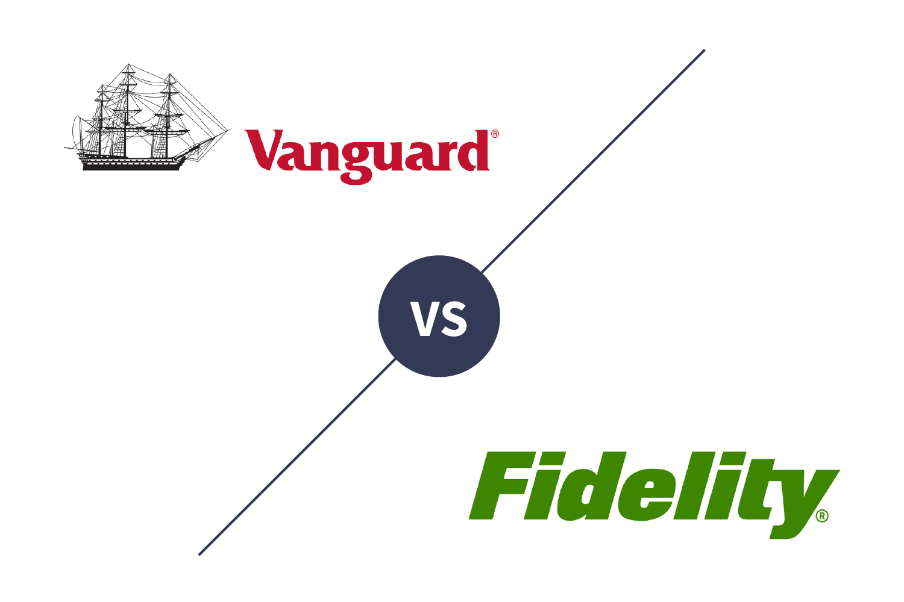

In the evolving landscape of modern finance, algorithmic trading has emerged as an essential tool for traders aiming to optimize their portfolios. By automating trading decisions using complex algorithms, traders can quickly respond to market conditions and capitalize on price movements with precision and speed. This technology-driven approach has revolutionized the way trades are executed, shifting from manual to algorithm-based strategies that leverage advances in machine learning and artificial intelligence.

Vanguard funds, renowned for their low fees and effective returns, are increasingly being considered as integral components within algorithmic trading strategies. Vanguard's investment philosophy centers on offering low-cost, diversified products that have historically delivered strong performance, making them attractive to algorithmic traders who prioritize cost efficiency alongside robust market tracking.



This article explores the best Vanguard funds for algorithmic trading and discusses how these financial instruments can be leveraged to achieve optimal returns. We will examine Vanguard's role in supporting algorithmic trading by offering funds that easily integrate with quantitative models. Additionally, we will address the various considerations investors must keep in mind when incorporating Vanguard funds into trading algorithms, emphasizing the importance of ongoing risk management and adaptation to market shifts. By selecting the right combination of funds and aligning them with sophisticated algorithms, traders can potentially maximize their returns while navigating the complexities of modern financial markets.

## Table of Contents

## Understanding Algorithmic Trading

Algorithmic trading involves the use of automated, pre-programmed trading instructions to execute orders efficiently and accurately. These instructions are based on various factors such as time, price, and [volume](/wiki/volume-trading-strategy), and are executed using sophisticated algorithms that can process massive amounts of data faster than human capabilities. The primary benefit of algorithmic trading lies in its ability to execute trades at optimal times, minimizing human errors and emotional biases.

The integration of machine learning and artificial intelligence into algorithmic trading systems has significantly enhanced their efficiency and accuracy. Machine learning algorithms can learn from historical data patterns and adapt to evolving market conditions, making trading strategies more dynamic and responsive. This adaptability allows for the development of predictive models capable of anticipating market movements based on past behaviors and trends.

One of the crucial factors for achieving success in algorithmic trading is speed. High-frequency trading ([HFT](/wiki/high-frequency-trading-strategies)) strategies exemplify the critical role of speed by executing a large number of orders at extremely high speeds, often in milliseconds. This rapid execution enables traders to capitalize on small market fluctuations that would be imperceptible in longer trading intervals.

Historical data analysis is another backbone of [algorithmic trading](/wiki/algorithmic-trading). Large datasets, encompassing years of market data, are analyzed to identify recurring patterns and potential trading signals. This analysis provides the foundation for the algorithms that determine the optimal conditions under which to buy or sell assets. By [backtesting](/wiki/backtesting) these strategies on historical data, traders can evaluate potential risks and returns, adjusting their models to mitigate risk.

Real-time market conditions further refine the execution of algorithmic strategies. Algorithms monitor live data feeds to adjust trading positions in response to current market dynamics. Considerations such as [liquidity](/wiki/liquidity-risk-premium), market sentiment, and short-term [volatility](/wiki/volatility-trading-strategies) are incorporated into the decision-making process, allowing the algorithm to update its trading strategy in response to significant market events or changes.

In sum, algorithmic trading leverages automation to optimize trade execution through carefully constructed algorithms, enhanced by [machine learning](/wiki/machine-learning) and [artificial intelligence](/wiki/ai-artificial-intelligence). With a focus on speed, historical analysis, and real-time adaptability, algorithmic trading offers a powerful toolset for maximizing trading efficiency and outcomes.

## The Appeal of Vanguard Funds in Algo Trading

Vanguard funds are particularly appealing for algorithmic trading due to their defining characteristics: low fees, broad diversification, and strong performance. One primary reason these funds fit well with algorithmic trading strategies is cost efficiency. The expense ratios of Vanguard funds are generally lower than those of many actively managed funds. This cost advantage is crucial for algorithmic trading, where frequent transactions can accumulate significant fees, eating into potential returns. For example, the Vanguard Total Stock Market Index Fund (VTSAX) has an expense ratio of 0.04% as of the latest reports, significantly lower than the average stock mutual fund fee.

The broad diversification offered by Vanguard funds also aligns well with algorithmic trading. Algorithms thrive on managing risk and optimizing returns through diversification, spread across various asset classes and sectors. Vanguard funds, with their extensive coverage of equities and bonds, allow algorithms to access a wide variety of market segments without excessively weighting any single stock or sector. This inherent diversification minimizes unsystematic risk, which is critical for maintaining balance in automated trading systems.

Moreover, the index-tracking nature of many Vanguard funds makes them exceptionally suitable for algorithmic models that analyze vast amounts of data. Index funds such as the Vanguard 500 Index Fund (VFIAX), which replicates the performance of the S&P 500, provide consistent and reliable data for algorithms to process. These funds maintain a stable composition with periodic rebalancing, creating a predictable and efficient environment for algorithms to operate. As such, algorithms can focus on macro trends and broader market dynamics, enhancing their predictive accuracy and efficiency.

Incorporating Vanguard funds into algorithmic trading models leverages their low-cost structure and broad market exposure, optimizing performance while maintaining stringent risk controls. This integration is further enhanced by data-driven approaches that can exploit the intricate dynamics of these funds, making them indispensable tools for sophisticated trading strategies.

## Top Vanguard Funds for Algorithmic Trading

Vanguard Total Stock Market Index Fund (VTSAX) provides comprehensive exposure to the entire U.S. stock market by encompassing large, mid, small, and micro-cap stocks. This diversification makes VTSAX an attractive choice for algorithmic trading, as it allows algorithms to capitalize on the broad market trends and mitigate the risks associated with individual stock volatility. Investing in VTSAX enables traders to replicate the performance of the U.S. equity market with precision over long periods. Its low expense ratio further enhances its appeal for algorithmic strategies focused on cost-efficiency.

The Vanguard 500 Index Fund (VFIAX) is another pivotal component in algorithmic trading strategies, primarily due to its commitment to tracking the S&P 500, which represents approximately 500 of the largest U.S. companies. The S&P 500 index is often used as a benchmark for the overall market performance. Traders utilizing VFIAX can execute models that benefit from this established benchmark's inherent stability and liquidity. The fund’s emphasis on large-cap stocks ensures less price manipulation and more predictable execution of trades, which is crucial for high-frequency trading algorithms.

Lastly, the Vanguard Total Bond Market Index Fund (VBTLX) offers balanced exposure to the U.S. bond market. This fund includes U.S. Treasury, government agency, and corporate investment-grade bonds, which provide a cushion against the volatility typically associated with equities. VBTLX is especially useful for algorithmic traders who employ risk-parity or mean-variance optimization models, as its inclusion can enhance portfolio diversification and provide a fixed income component. Implementing VBTLX in trading algorithms aids in reducing the overall portfolio risk, which is essential for risk-aware algorithmic strategies.

The selection of these Vanguard funds in algorithmic trading not only capitalizes on their broad market coverage and low costs but also leverages their stability and risk management potential, essential elements for successful algorithmic strategies.

## Integrating Vanguard Funds into Algorithmic Models

When integrating Vanguard funds into algorithmic models, several key elements are essential for optimizing performance and ensuring efficiency. Historical performance data of the funds should be meticulously analyzed, as it provides insight into how funds have reacted in different market conditions. Metrics such as average annual return, volatility, and maximum drawdown serve as foundational inputs for algorithmic strategies, informing about potential risks and returns.

Expense ratios are critical in selecting funds for algorithmic trading. Vanguard funds are known for their low-cost structure, which can significantly enhance net returns when compounded over time. For example, a reduction from an expense ratio of 0.5% to 0.1% could lead to substantial savings when trading large volumes, contributing to the strategy's overall profitability.

Dividend yields also play a pivotal role, particularly for income-focused strategies or when constructing a well-diversified portfolio. High-yield funds might be appealing for algorithms that prioritize income generation or hedge against potential market downturns. These data points can be utilized in risk-adjusted performance metrics like the Sharpe Ratio to gauge efficiency.

Backtesting is an indispensable step in integrating Vanguard funds into algorithms. This involves simulating the trading strategy on historical data to evaluate its performance before actual deployment. Effective backtesting helps in identifying potential flaws or areas of improvement within the strategy. Python is particularly useful for this purpose, with libraries such as PyAlgoTrade and Backtrader available to simplify the backtesting process.

```python
import backtrader as bt

class MyStrategy(bt.Strategy):
    def __init__(self):
        self.dataclose = self.datas[0].close

    def next(self):
        if self.dataclose[0] > self.dataclose[-1]:
            self.buy(size=100)
        elif self.dataclose[0] < self.dataclose[-1]:
            self.sell(size=100)

data = bt.feeds.YahooFinanceData(dataname='VTI', fromdate=datetime(2020, 1, 1), todate=datetime.now())
cerebro = bt.Cerebro()
cerebro.addstrategy(MyStrategy)
cerebro.adddata(data)
cerebro.run()
```

Technical analysis indicators, such as the Moving Average Convergence Divergence (MACD) and Relative Strength Index (RSI), are effective in identifying [momentum](/wiki/momentum) and trend reversals, crucial for boosting Vanguard fund integration in algorithmic models. Machine learning techniques, such as classification algorithms and neural networks, can further augment these models by unveiling complex patterns and enhancing predictive accuracy.

For instance, machine learning models trained on extensive market data can dynamically adjust the allocation of Vanguard funds, optimizing returns by responding adaptively to market signals. The integration of these advanced techniques not only enhances decision-making but also enables the development of more sophisticated trading strategies, allowing traders to remain competitive in swiftly changing markets.

## Risk Management and Considerations

Algorithmic trading, despite its advantages, presents inherent risks that require meticulous management. Vanguard funds, while inherently stable due to their design and historical performance, still require ongoing oversight to navigate potential market volatility effectively. One of the primary tools for risk mitigation in algorithmic trading is the implementation of stop-loss orders. These mechanisms automatically sell a security when it reaches a certain price point, limiting potential losses during adverse market movements. For example, a simple Python script implementing a stop-loss order could look like this:

```python
def execute_stop_loss(current_price, stop_loss_price, volume):
    if current_price <= stop_loss_price:
        # Execute sell order
        return f"Sold {volume} units at {current_price}"
    return "No action taken"

# Example usage
result = execute_stop_loss(current_price=98, stop_loss_price=100, volume=50)
print(result)  # Output: Sold 50 units at 98
```

Diversification is another critical strategy for risk management. By spreading investments across various Vanguard funds, investors can reduce the impact of any single fund's performance on the overall portfolio. This is particularly important in algorithms that incorporate a range of assets to balance risk and reward.

Staying informed about changes is crucial for successful algorithmic trading. This includes monitoring the composition of Vanguard funds, which may shift over time due to market conditions or the fund's strategic adjustments. Regular updates to the algorithm's data inputs and trading strategies are necessary to reflect these changes. Additionally, external market conditions such as economic indicators, geopolitical events, and central bank policies can significantly influence market dynamics and require corresponding adjustments in trading algorithms.

Overall, successful risk management in algorithmic trading involves a blend of automated tools, like stop-loss orders and diversifying assets, and ongoing market vigilance to adapt to ever-changing market environments. This approach not only safeguards against potential losses but also positions traders to capitalize on emerging market opportunities effectively.

## Conclusion

Vanguard funds represent a significant advantage for traders who employ algorithmic strategies, primarily due to their cost-effectiveness and reliable market tracking capabilities. The efficient fee structure and broad diversification associated with Vanguard funds make them a natural fit for algorithmic trading, which seeks to exploit minimal costs and maximize returns through high-frequency trades.

To capitalize on these advantages, selecting the appropriate Vanguard funds is critical. Funds like the Vanguard Total Stock Market Index Fund (VTSAX), Vanguard 500 Index Fund (VFIAX), and Vanguard Total Bond Market Index Fund (VBTLX) can be integrated into well-constructed algorithms, enhancing the potential for maximized returns. Their historical performance data and index-tracking nature are particularly valuable for developing predictive models and executing strategies that rely on vast datasets and detailed market analysis.

Nevertheless, traders should remain vigilant and adaptable to the ever-changing market landscape. Algorithmic trading is inherently dynamic, requiring consistent oversight to effectively manage risks such as market volatility. This vigilance is enhanced by employing robust risk management practices, including diversification and the use of stop-loss orders, alongside continuous monitoring of changes in both Vanguard fund compositions and external market conditions.

In conclusion, effectively integrating Vanguard funds within sophisticated algorithmic frameworks offers traders a feasible path to potentially higher returns. Success in this domain hinges on the continuous refinement of strategies and an acute awareness of prevailing market dynamics, ensuring a resilient and sustainable trading edge.

## Additional Resources

For those interested in enhancing their understanding of algorithmic trading, consider visiting our blog at Quantified Strategies. Our platform is dedicated to providing insights into the intricate world of backtesting and the development of robust trading strategies. Backtesting allows traders to simulate their algorithms using historical data to evaluate performance and identify potential pitfalls before committing real capital. An example of a simple backtesting script in Python might look like this:

```python
import pandas as pd

def backtest_strategy(data, signal_generator):
    initial_capital = 10000
    positions = pd.DataFrame(index=data.index).fillna(0.0)
    portfolio = pd.DataFrame(index=data.index)
    portfolio['holdings'] = positions.multiply(data['Close'], axis=0)
    portfolio['cash'] = initial_capital - (positions.diff() * data['Close']).cumsum()
    portfolio['total'] = portfolio['cash'] + portfolio['holdings']
    return portfolio

# Example usage with historical stock data and a predefined signal_generator
historical_data = pd.read_csv('stock_data.csv', index_col='Date', parse_dates=True)
strategy_performance = backtest_strategy(historical_data, signal_generator)
print(strategy_performance)
```

By engaging with Quantified Strategies, you can access our quantified trading community, which offers exclusive insights through data-driven analytics and comprehensive trading courses. Within this community, members can exchange ideas, refine strategies, and remain informed on the latest advancements in both trading technologies and market dynamics. This collaborative environment fosters the development and improvement of algorithmic skills essential for maintaining a competitive edge in the fast-paced world of finance.

## References & Further Reading

[1]: Bergstra, J., Bardenet, R., Bengio, Y., & Kégl, B. (2011). ["Algorithms for Hyper-Parameter Optimization."](https://dl.acm.org/doi/10.5555/2986459.2986743) Advances in Neural Information Processing Systems 24.

[2]: ["Advances in Financial Machine Learning"](https://www.amazon.com/Advances-Financial-Machine-Learning-Marcos/dp/1119482089) by Marcos Lopez de Prado

[3]: ["Evidence-Based Technical Analysis: Applying the Scientific Method and Statistical Inference to Trading Signals"](https://www.amazon.com/Evidence-Based-Technical-Analysis-Scientific-Statistical/dp/0470008741) by David Aronson

[4]: ["Machine Learning for Algorithmic Trading"](https://github.com/stefan-jansen/machine-learning-for-trading) by Stefan Jansen

[5]: ["Quantitative Trading: How to Build Your Own Algorithmic Trading Business"](https://books.google.com/books/about/Quantitative_Trading.html?id=j70yEAAAQBAJ) by Ernest P. Chan