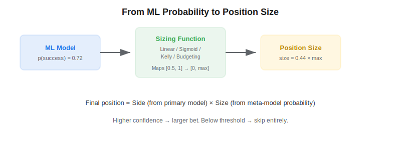
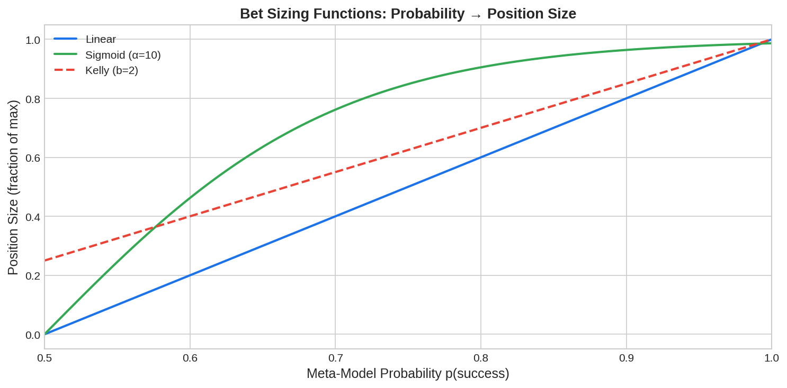

Bet sizing is the process of translating a machine learning model's predicted probabilities into concrete position sizes. In *Advances in Financial Machine Learning* (2018), Marcos Lopez de Prado emphasizes that knowing *when* to trade (the signal) is only half the problem — knowing *how much* to trade is equally critical. A strategy with perfect directional accuracy but poor sizing can still lose money, while modest accuracy with good sizing can be highly profitable.

## Why Bet Sizing Matters

Most quant trading tutorials focus on signal generation and ignore position sizing entirely, defaulting to equal-weighted positions. But the predicted probability from a [meta-labeling](https://paperswithbacktest.com/wiki/meta-labeling) model contains rich information about the model's confidence. A prediction of 0.95 should translate into a larger bet than a prediction of 0.55.



## Sizing Methods

### Linear Sizing

The simplest approach maps probability linearly to position size:

$$m = 2(p - 0.5) \cdot m_{\max}$$

where $p$ is the predicted probability, $m_{\max}$ is the maximum allowed position, and $m$ is the target size. Predictions at 0.5 yield zero position; predictions at 1.0 yield full size.

### Sigmoid Sizing

A sigmoid function provides a smoother transition that concentrates size around high-confidence predictions:

$$m = m_{\max} \cdot \left(\frac{2}{1 + e^{-\alpha(p - 0.5)}} - 1\right)$$

The parameter $\alpha$ controls steepness. Higher $\alpha$ makes sizing more aggressive — small probability differences near 0.5 produce minimal size changes, while high probabilities get near-maximum allocation.

### Kelly Criterion

The [Kelly criterion](https://paperswithbacktest.com/wiki/kelly-criterion-position-sizing) provides the mathematically optimal bet fraction:

$$f^* = \frac{p \cdot b - q}{b}$$

where $p$ is the win probability, $q = 1 - p$, and $b$ is the win/loss ratio. In practice, fractional Kelly (e.g., half-Kelly) is used to reduce variance.



## Python Implementation

```python
import numpy as np
from scipy.stats import norm

def bet_size_linear(prob, max_pos=1.0):
    return max_pos * 2 * (prob - 0.5)

def bet_size_sigmoid(prob, alpha=10, max_pos=1.0):
    return max_pos * (2 / (1 + np.exp(-alpha * (prob - 0.5))) - 1)

def bet_size_kelly(prob, win_loss_ratio=2.0, max_pos=1.0):
    q = 1 - prob
    kelly = (prob * win_loss_ratio - q) / win_loss_ratio
    return np.clip(kelly, 0, max_pos)

def bet_size_budget(probs, max_total_pos=5.0):
    raw = 2 * (probs - 0.5)
    if raw.sum() > max_total_pos:
        raw *= max_total_pos / raw.sum()
    return raw

# Example
probs = np.array([0.55, 0.72, 0.91, 0.48])
sides = np.array([1, -1, 1, 1])  # from primary model
sizes = np.array([bet_size_sigmoid(p) for p in probs])
positions = sides * sizes
print("Probabilities:", probs)
print("Sizes:", sizes.round(3))
print("Final positions:", positions.round(3))
```

## Practical Considerations

| Aspect | Recommendation |
|---|---|
| Use half-Kelly | Full Kelly has extreme drawdowns; half-Kelly cuts variance by ~75% |
| Budget constraint | Limit total notional across all active bets |
| Probability calibration | Raw ML probabilities are often miscalibrated — use Platt scaling or isotonic regression |
| Discrete sizing | Round to tradeable lot sizes; very small sizes may not justify transaction costs |

## Limitations and Risks

Bet sizing amplifies both gains and losses. If the model's probability estimates are poorly calibrated (e.g., it says 0.9 but the true win rate is 0.6), aggressive sizing will magnify losses. Always validate probability calibration before deploying real capital. Additionally, Kelly criterion assumes known and stable win/loss ratios, which rarely hold in financial markets.

## Conclusion

Bet sizing is where [meta-labeling](https://paperswithbacktest.com/wiki/meta-labeling) pays off. By translating the secondary model's probability into a continuous position size, you create a strategy that is aggressive when confident and defensive when uncertain. This is far superior to binary bet/skip decisions and produces smoother equity curves with better risk-adjusted returns.

---

**Explore further on PapersWithBacktest:**
- Browse [backtested strategies](https://paperswithbacktest.com/strategies) with Python code and performance metrics
- Access [clean historical market data](https://paperswithbacktest.com/datasets) for equities, crypto, and futures
- Take the [algo trading course](https://paperswithbacktest.com/course) — 60+ video lessons and notebooks
- Related wiki pages: [Meta-Labeling](https://paperswithbacktest.com/wiki/meta-labeling) · [Kelly Criterion](https://paperswithbacktest.com/wiki/kelly-criterion-position-sizing) · [Triple-Barrier Method](https://paperswithbacktest.com/wiki/triple-barrier-method)
