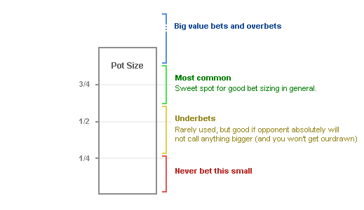

## Table of Contents

## What is bet sizing in gambling and trading?

Bet sizing in gambling and trading refers to how much money a person decides to bet or invest in a single wager or trade. In gambling, this could mean deciding how many chips to put on the table in a game of poker or how much money to bet on a sports event. In trading, it involves choosing the amount of money to invest in a stock, forex, or any other financial instrument. The size of the bet can greatly affect the potential gains or losses, so it's important to think carefully about it.

Choosing the right bet size is crucial because it helps manage risk. If a gambler or trader bets too much, they could lose a lot of money quickly. On the other hand, betting too little might mean missing out on big wins. Many people use different strategies to decide on bet sizes, like setting a fixed percentage of their total money to bet each time. This way, they can keep playing or trading even if they lose some bets, without risking all their money at once.

## Why is bet sizing important for managing risk?

Bet sizing is important for managing risk because it helps you control how much money you might lose. If you bet too much on one thing, you could lose a lot of money quickly. This can be really bad if you don't have much money to start with. By choosing a smaller bet size, you can keep playing or trading even if you lose some bets. This way, you don't risk losing everything all at once.

Using the right bet size also helps you stay in the game longer. If you only bet a small part of your money each time, you can handle losing streaks better. This means you have more chances to win back what you lost. It's like spreading your risk out over many bets instead of putting all your money on one big bet. This way, you can keep trying until you get it right.

## How does bet sizing affect the potential return on investment?

Bet sizing can change how much money you might make or lose. If you bet a lot of money, you could win a lot if things go your way. But if you lose, you lose a lot too. So, bigger bets can lead to bigger wins or bigger losses. This means your potential return on investment can go way up, but so can your risk.

On the other hand, if you bet a smaller amount, your wins won't be as big, but your losses won't be as bad either. This can help you stay in the game longer because you won't lose all your money at once. Smaller bets mean your return on investment might not be as exciting, but it's safer. So, bet sizing is all about finding the right balance between how much you want to win and how much risk you're okay with.

## What are the common bet sizing strategies for beginners?

One common bet sizing strategy for beginners is the fixed percentage method. This means you bet the same small part of your total money each time, like 1% or 2%. This way, if you lose, you don't lose too much of your money at once. It helps you keep playing or trading even if you have some losses. It's simple and helps you manage risk because you always know how much you're betting.

Another strategy is the fixed dollar amount method. With this, you bet the same amount of money each time, no matter how much money you have. For example, you might always bet $10 on a game or trade. This can be easier to understand and stick to because the bet size doesn't change. But it's important to make sure the amount you choose isn't too big compared to your total money, or you could still lose a lot quickly.

A third strategy is the Kelly Criterion, but it's a bit more complicated. It helps you figure out the best bet size based on how likely you are to win and how much you could win. You don't bet all your money, but you bet a part of it that gives you the best chance to grow your money over time. This method can be good for beginners who want to learn more about managing their bets, but it takes some math to use it right.

## How can bet sizing be adjusted based on the confidence in a trade or bet?

Bet sizing can be changed based on how sure you feel about a trade or bet. If you feel really good about it, you might want to bet a bit more money. But you still need to be careful not to bet too much, because even if you feel confident, things can still go wrong. It's about finding a balance where you can bet more when you're sure, but not so much that you risk losing a lot if you're wrong.

On the other hand, if you're not so sure about a trade or bet, it's smart to bet less money. This way, if you're wrong, you won't lose much. It helps you stay in the game longer and gives you more chances to make good bets later. By adjusting your bet size based on how confident you feel, you can manage your risk better and hopefully make more money over time.

## What is the Kelly Criterion and how does it apply to bet sizing?

The Kelly Criterion is a way to figure out how much money to bet to grow your money as fast as possible while keeping risk low. It uses a math formula that looks at how likely you are to win and how much you can win if you do. The formula tells you to bet a part of your money, not all of it. This part is usually less than what you might think, to keep you safe from big losses.

To use the Kelly Criterion, you need to know two things: the chance of winning your bet and the payout if you win. For example, if you think you have a 60% chance of winning and the payout is 2-to-1, the Kelly Criterion might tell you to bet 20% of your money. This way, you're betting enough to make good money if you win, but not so much that you'll lose everything if you lose. It helps you bet smarter by balancing the risk and reward.

## How do professional gamblers and traders use bet sizing to optimize their performance?

Professional gamblers and traders use bet sizing to make the most of their money while keeping risks under control. They often use methods like the Kelly Criterion to figure out the best amount to bet based on how likely they are to win and how much they can win. This helps them bet enough to grow their money fast but not so much that they risk losing everything if they're wrong. By sticking to a smart bet sizing strategy, they can handle losing streaks better and keep playing or trading even when things don't go their way.

They also change their bet sizes based on how sure they feel about a bet or trade. If they're really confident, they might bet a bit more, but they're always careful not to bet too much. If they're not so sure, they'll bet less to keep their losses small. This way, they can stay in the game longer and have more chances to make good bets. By adjusting their bet sizes like this, professional gamblers and traders can make the most of their skills and knowledge to get the best results over time.

## What are the psychological factors that influence bet sizing decisions?

People's feelings can really change how much they decide to bet. If someone feels excited or too sure about winning, they might bet more money than they should. This is called being overconfident. On the other hand, if someone is scared or worried about losing, they might bet too little, even when they have a good chance to win. This fear can stop them from making the most of their bets. Both overconfidence and fear can make people choose the wrong bet size, which can lead to losing more money or missing out on bigger wins.

Another big feeling that affects bet sizing is the need to make up for losses quickly. After losing some money, people might feel a strong urge to bet more to win it back fast. This is called chasing losses, and it often leads to betting too much and losing even more. It's hard to stick to a smart bet sizing plan when emotions are running high. That's why it's important for people to try to stay calm and think clearly about their bets, even when they're feeling strong emotions.

## How can bet sizing strategies be tested and refined over time?

Bet sizing strategies can be tested and made better over time by keeping track of how they work. People can write down how much they bet, how often they win, and how much they win or lose. This helps them see if their bet sizes are helping them make money or if they need to change them. They can try different bet sizes and see which ones work best. By doing this over a long time, they can find a bet sizing plan that fits them well and helps them win more often.

It's also smart to use computer programs or special software to test bet sizing strategies. These tools can run lots of pretend bets to see how different bet sizes might work out. This way, people can try out new ideas without risking real money. They can see how changing their bet sizes might affect their wins and losses. By using these tools and keeping an eye on their results, people can slowly make their bet sizing better and better over time.

## What are the differences in bet sizing approaches between various types of gambling and trading?

In gambling, bet sizing can be different depending on the game. For example, in poker, players might bet more when they have a good hand to scare off others or bet less to trick people into thinking they have a weak hand. In sports betting, people might bet more on a game they feel sure about, like when their favorite team is playing, but they still need to be careful not to bet too much. In casino games like blackjack or roulette, people often use fixed bet sizes or betting systems like the Martingale, where they double their bet after a loss, to try and win back what they lost.

In trading, bet sizing is about how much money to invest in stocks, forex, or other things. Traders often use the Kelly Criterion to figure out how much to bet based on how likely they are to make money and how much they could make. They might also change their bet sizes based on how sure they feel about a trade. For example, if they think a stock will go up a lot, they might invest more, but if they're not sure, they'll invest less. This helps them manage their risk and make the most of their money over time.

Both gambling and trading need careful bet sizing to keep from losing too much money. But in gambling, bet sizes can be more about trying to trick other players or using betting systems, while in trading, it's more about using math and being sure about the investment. Both need to balance how much they want to win with how much they're okay with losing.

## How does bet sizing interact with other aspects of a trading or gambling system?

Bet sizing is a big part of both trading and gambling, and it works together with other parts of the system. In trading, bet sizing goes hand-in-hand with things like how you pick which stocks to buy, how you decide when to buy or sell, and how you manage your risks. If you pick a stock that you think will do well, your bet size might be bigger because you're more sure about it. But you still need to keep an eye on how much you're betting so you don't lose too much if things go wrong. In gambling, bet sizing works with things like the odds of winning, the rules of the game, and how much you could win. If you're playing a game where you can win a lot, you might bet more, but you have to be careful not to bet too much and lose everything.

Bet sizing also affects how well you do over time. If you're always betting too much, you might win big sometimes, but you could also lose a lot quickly. This can make it hard to keep going if you have a few bad bets. On the other hand, if you bet too little, you might not make as much money even if you win a lot. So, it's important to find a good balance. By working together with other parts of your trading or gambling system, like sticking to a plan and not letting your feelings get in the way, you can use bet sizing to help you do better and keep your money safe.

## What advanced techniques exist for dynamic bet sizing in response to market conditions or game states?

In trading, one advanced way to change bet sizes is by using something called "volatility-based sizing." This means you bet more when the market is moving a lot and less when it's calm. Traders use special math formulas to figure out how much the market might move and then decide how much to bet. This helps them make the most of big market moves while keeping their bets small when things are quiet. Another way is to use "trend-following strategies," where traders bet more when they see a clear trend in the market, like a stock going up or down a lot. They might bet less if the market is not moving in a clear direction.

In gambling, dynamic bet sizing can be used in games like poker or blackjack. In poker, players might bet more when they have a strong hand and the other players seem unsure. They might bet less when they have a weak hand but think they can trick others into thinking it's strong. In blackjack, some players use a method called "card counting" to change their bets. If they see a lot of high cards left in the deck, they might bet more because their chances of winning are better. If there are more low cards, they might bet less. Both of these ways help gamblers adjust their bets based on what's happening in the game.

## What is Understanding Bet Sizing?

Bet sizing refers to the calculation of the capital allocation for a specific trade or position. This element plays a vital role in algorithmic trading by balancing the potential rewards against risks, ensuring that the downside of any single trade does not jeopardize the entire portfolio. The process of bet sizing involves multiple considerations, including evaluating one's risk tolerance, understanding market volatility, and the specific trading strategy employed.

Critical to effective bet sizing is the assessment of risk tolerance. Traders must define the maximum potential loss they are willing to accept on a given trade. This assessment helps prevent taking excessive risks that could lead to significant financial losses. Moreover, evaluating market volatility is essential, as it dictates the level of uncertainty in market prices, and subsequently affects the amount of capital that should be safely allocated to a trade.

The trading strategy employed also significantly influences bet sizing. Different strategies may require varying capital allocations depending on their risk-return profiles. For instance, high-frequency trading may necessitate smaller bet sizes due to the frequent entry and [exit](/wiki/exit-strategy) from positions within short timeframes, minimizing exposure to market fluctuations.

Adjusting bet sizes allows traders to manage their exposure dynamically and maintain a balanced approach to trading. By optimally allocating capital, they can protect their portfolios from large drawdowns and maximize profitability. This involves not only adjusting the size of individual trades but also aligning overall portfolio risk to ensure that positions are balanced according to the chosen risk parameters.

In practice, traders can employ mathematical models and algorithms to determine optimal bet sizes. One popular method is the Kelly Criterion, which calculates the proportion of capital to bet based on the edge over the odds and variance in the trading strategy. The formula is:

$$
f^* = \frac{bp - q}{b}
$$

where:
- $f^*$ is the fraction of the capital to bet,
- $b$ is the odds received on the wager,
- $p$ is the probability of winning,
- $q = 1 - p$ is the probability of losing.

By effectively utilizing such mathematical frameworks, traders can optimize their bet sizes, mitigating risks while enhancing potential rewards.

## How does bet sizing work in algo trading?

Algorithmic trading employs sophisticated algorithms that dynamically adjust bet sizes based on predefined criteria and real-time data. This process is pivotal for risk management and optimizing trading performance.

1. **Risk Management**: Algorithms incorporate risk management techniques by calculating optimal trade sizes according to a trader's risk tolerance and market volatility. This is achieved by assessing the Value at Risk (VaR) or employing the Kelly Criterion to determine the proportion of capital to place at risk. The calculation involves understanding both the probability of success and the potential payoff, given by the formula:
$$
   \text{Bet Size} = \frac{bp - q}{b}

$$

   where $b$ is the odds received on the bet (net odds), $p$ is probability of winning, and $q$ is probability of losing (1-p).

2. **Dynamic Adjustments**: Automated systems adjust bet sizes in response to market changes, ensuring consistent risk levels. These systems continually analyze market data and adjust positions based on fluctuations, maintaining an optimal balance between risk exposure and capital efficiency.

3. **Bet Size Charts**: These visual tools are instrumental in managing bet sizes, ensuring they align with trading objectives. By plotting historical data and predictive analytics, traders can visually assess the desirability of adjusting their bet sizes. These charts help in recognizing patterns and making informed decisions about scaling positions up or down as market conditions evolve.

4. **Optimizing Trade Execution**: Efficient algorithms are crucial in determining the best trade size to reduce costs and optimize execution. By calculating the trade-off between the cost of executing large orders and the risk reduction benefits of smaller trades, these algorithms enable precise order execution. Python libraries, such as NumPy for numerical computation and Pandas for data manipulation, can be employed to script these optimizations:

   ```python
   import numpy as np
   import pandas as pd

   def calculate_optimal_size(probabilities, capital, odds):
       kelly_fraction = (probabilities * odds - (1 - probabilities)) / odds
       return capital * kelly_fraction

   # Example usage
   probabilities = 0.55
   capital = 100000
   odds = 2
   optimal_size = calculate_optimal_size(probabilities, capital, odds)
   print(f"The optimal trade size is: {optimal_size}")
   ```

This algorithm-centric approach allows traders to maintain consistent performance by dynamically adjusting bet sizes. This ensures systematic risk management and strategic capital allocation, minimizing human bias and leveraging computational power for sustained trading advantages.

## How can bet sizing be implemented in algorithmic trading?

Implementing bet sizing in algorithmic trading involves a systematic approach to risk management and strategy optimization. The following steps outline essential components for effectively incorporating bet sizing algorithms into automated trading systems:

1. **Defining Risk Parameters**: The foundation of bet sizing lies in establishing clear risk parameters to guide capital allocation per trade. This involves setting a maximum percentage of capital for each trade, which aligns with the trader's risk tolerance and market conditions. The formula for determining optimal trade size, also known as the Kelly Criterion, is often employed in this context:
$$
   f^* = \frac{bp - q}{b}

$$

   where $f^*$ is the fraction of capital to wager, $b$ is the odds received on the bet, $p$ is the probability of winning, and $q$ is the probability of losing ($q = 1 - p$).

2. **Integrating with Trading Strategies**: Effective implementation requires aligning bet sizing algorithms with specific trading strategies. This means that the algorithms should dynamically adjust trade sizes based on the underlying strategy's signals. For instance, a trend-following strategy may require a different bet sizing approach compared to a mean-reversion strategy. Integrating these elements ensures that the bet sizes remain consistent with the strategic objectives.

3. **Continuous Monitoring and Adjustment**: Market conditions are inherently volatile, necessitating ongoing assessment of bet sizing parameters. Algorithms must be capable of real-time adjustments to maintain specified risk levels. This involves using market volatility metrics, such as the Average True Range (ATR), to dynamically recalibrate bet sizes as conditions fluctuate. Regular audits of the system's performance and parameter settings help ensure sustained efficacy.

4. **Testing and Optimization**: Before deploying bet sizing algorithms in a live market environment, thorough backtesting is essential. This process involves analysing historical data to assess how different bet sizing strategies perform under various market scenarios. Python libraries, such as NumPy and pandas, can facilitate the computational aspects of backtesting. An example code snippet for backtesting might look like this:

   ```python
   import numpy as np
   import pandas as pd

   def calculate_kelly_criterion(returns):
       win_prob = np.mean(returns > 0)
       loss_prob = 1 - win_prob
       avg_win = np.mean(returns[returns > 0])
       avg_loss = -np.mean(returns[returns < 0])
       kelly_fraction = (avg_win * win_prob - avg_loss * loss_prob) / avg_win
       return kelly_fraction

   returns = pd.Series([0.05, 0.02, -0.01, -0.03, 0.07])
   kelly = calculate_kelly_criterion(returns)
   print("Optimal Kelly Fraction:", kelly)
   ```

   Optimization involves refining the algorithm based on [backtesting](/wiki/backtesting) results to enhance performance and reduce risk. This phase is crucial in ensuring that the bet sizing methodology is robust and adaptable to future market conditions.

By systematically implementing these steps, traders can effectively incorporate bet sizing mechanisms within their algorithmic trading systems. This approach not only aids in managing risk but also enhances the overall robustness and efficiency of trading strategies.

## References & Further Reading

[1]: Kelly, J. L. (1956). ["A New Interpretation of Information Rate."](https://www.princeton.edu/~wbialek/rome/refs/kelly_56.pdf) Bell System Technical Journal, 35(4), 917-926.

[2]: Thorp, E. O. (1969). ["Optimal Gambling Systems for Favorable Games."](https://www.jstor.org/stable/1402118) Reviews of the International Statistical Institute, 37(3), 273-293.

[3]: Lo, A. W. (2010). ["Hedge Funds: An Analytic Perspective."](https://www.jstor.org/stable/j.ctt7rq28) Princeton University Press.

[4]: Przybyla, E. H., & Zhang, P. G. (2008). ["Behavioral Risk Management in Financial Institutions."](https://pubmed.ncbi.nlm.nih.gov/29426025/) Information Age Publishing.

[5]: Glantz, M., & Kissell, R. (2013). ["Multi-Asset Risk Modeling: Techniques for a Global Economy in an Electronic and Algorithmic Trading Era."](https://www.sciencedirect.com/book/9780124016903/multi-asset-risk-modeling) Academic Press.