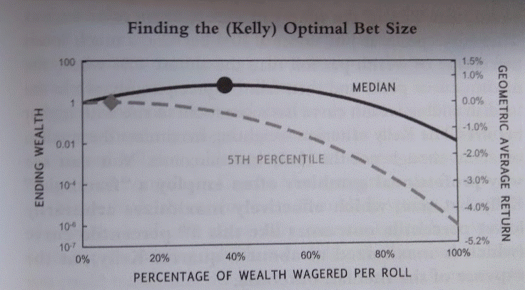

In algorithmic trading, achieving lasting success hinges on the effective management of risk and the strategic allocation of capital. Central to this practice is bet sizing, which systematically determines how much capital is allocated to each trade. This process is crucial in ensuring a balanced approach that mitigates potential losses while maximizing potential gains. As the trading landscape becomes increasingly complex with the integration of advanced algorithms, the role of bet sizing has grown in significance, impacting trading performance directly. This article examines the importance of bet sizing within algorithmic trading, explores its influence on trading outcomes, and presents various strategies to implement it effectively. Whether you are a novice or an experienced trader looking to enhance your strategies, a clear understanding of bet sizing can significantly optimize your trading decisions.

## Table of Contents



## Understanding Bet Sizing

Bet sizing refers to the calculation of the capital allocation for a specific trade or position. This element plays a vital role in algorithmic trading by balancing the potential rewards against risks, ensuring that the downside of any single trade does not jeopardize the entire portfolio. The process of bet sizing involves multiple considerations, including evaluating one's risk tolerance, understanding market volatility, and the specific trading strategy employed.

Critical to effective bet sizing is the assessment of risk tolerance. Traders must define the maximum potential loss they are willing to accept on a given trade. This assessment helps prevent taking excessive risks that could lead to significant financial losses. Moreover, evaluating market volatility is essential, as it dictates the level of uncertainty in market prices, and subsequently affects the amount of capital that should be safely allocated to a trade.

The trading strategy employed also significantly influences bet sizing. Different strategies may require varying capital allocations depending on their risk-return profiles. For instance, high-frequency trading may necessitate smaller bet sizes due to the frequent entry and [exit](/wiki/exit-strategy) from positions within short timeframes, minimizing exposure to market fluctuations.

Adjusting bet sizes allows traders to manage their exposure dynamically and maintain a balanced approach to trading. By optimally allocating capital, they can protect their portfolios from large drawdowns and maximize profitability. This involves not only adjusting the size of individual trades but also aligning overall portfolio risk to ensure that positions are balanced according to the chosen risk parameters.

In practice, traders can employ mathematical models and algorithms to determine optimal bet sizes. One popular method is the Kelly Criterion, which calculates the proportion of capital to bet based on the edge over the odds and variance in the trading strategy. The formula is:

$$
f^* = \frac{bp - q}{b}
$$

where:
- $f^*$ is the fraction of the capital to bet,
- $b$ is the odds received on the wager,
- $p$ is the probability of winning,
- $q = 1 - p$ is the probability of losing.

By effectively utilizing such mathematical frameworks, traders can optimize their bet sizes, mitigating risks while enhancing potential rewards.

## How Bet Sizing Works in Algo Trading

Algorithmic trading employs sophisticated algorithms that dynamically adjust bet sizes based on predefined criteria and real-time data. This process is pivotal for risk management and optimizing trading performance.

1. **Risk Management**: Algorithms incorporate risk management techniques by calculating optimal trade sizes according to a trader's risk tolerance and market volatility. This is achieved by assessing the Value at Risk (VaR) or employing the Kelly Criterion to determine the proportion of capital to place at risk. The calculation involves understanding both the probability of success and the potential payoff, given by the formula:
$$
   \text{Bet Size} = \frac{bp - q}{b}

$$

   where $b$ is the odds received on the bet (net odds), $p$ is probability of winning, and $q$ is probability of losing (1-p).

2. **Dynamic Adjustments**: Automated systems adjust bet sizes in response to market changes, ensuring consistent risk levels. These systems continually analyze market data and adjust positions based on fluctuations, maintaining an optimal balance between risk exposure and capital efficiency.

3. **Bet Size Charts**: These visual tools are instrumental in managing bet sizes, ensuring they align with trading objectives. By plotting historical data and predictive analytics, traders can visually assess the desirability of adjusting their bet sizes. These charts help in recognizing patterns and making informed decisions about scaling positions up or down as market conditions evolve.

4. **Optimizing Trade Execution**: Efficient algorithms are crucial in determining the best trade size to reduce costs and optimize execution. By calculating the trade-off between the cost of executing large orders and the risk reduction benefits of smaller trades, these algorithms enable precise order execution. Python libraries, such as NumPy for numerical computation and Pandas for data manipulation, can be employed to script these optimizations:

   ```python
   import numpy as np
   import pandas as pd

   def calculate_optimal_size(probabilities, capital, odds):
       kelly_fraction = (probabilities * odds - (1 - probabilities)) / odds
       return capital * kelly_fraction

   # Example usage
   probabilities = 0.55
   capital = 100000
   odds = 2
   optimal_size = calculate_optimal_size(probabilities, capital, odds)
   print(f"The optimal trade size is: {optimal_size}")
   ```

This algorithm-centric approach allows traders to maintain consistent performance by dynamically adjusting bet sizes. This ensures systematic risk management and strategic capital allocation, minimizing human bias and leveraging computational power for sustained trading advantages.

## Importance of Bet Sizing in Algorithmic Trading

Bet sizing plays a vital role in [algorithmic trading](/wiki/algorithmic-trading) by influencing risk management and enhancing the overall performance of trading strategies. Its significance is evident in several key areas:

1. **Mitigating Risk:** Effective bet sizing is essential for controlling exposure to individual trades, thereby reducing the overall portfolio risk. By systematically determining the capital allocated to each trade, traders can prevent significant losses from single market events. This approach ensures that no trade adversely impacts the trading system. For instance, using a percentage of the total account balance for each trade, such as 1% or 2%, helps in maintaining portfolio stability.

2. **Enhancing Strategy Performance:** Dynamic bet sizing, which adapts based on real-time data, is crucial for improving the performance of trading strategies. Algorithms that adjust trade sizes in response to fluctuating market conditions can significantly influence profitability. These systems may use volatility measures or momentum indicators to tailor bet sizes, ensuring alignment with market dynamics. This adaptive approach allows traders to capitalize on high-probability opportunities while minimizing potential losses.

3. **Improving Trade Efficiency:** Algorithms designed for optimal trade execution reduce transaction costs by calculating the ideal trade size. By optimizing bet sizes, traders can achieve better slippage management and price impact reduction. Efficient bet sizing is particularly important in markets with high liquidity where large trades can lead to unfavorable price movements. Thus, algorithms that refine trade size contribute directly to cost-effective trading, enhancing net returns.

4. **Maintaining Consistency:** Consistency in trading is achieved by adhering to predefined risk and capital allocation rules, which are enforced through automated bet sizing. These rules ensure that trade sizing is systematic, removing emotional or arbitrary decision-making from the process. This disciplined approach facilitates long-term strategy adherence and promotes stable performance over various market cycles. Automated systems applying consistent bet sizing rules help traders maintain a clear focus on their overall trading objectives.

In conclusion, bet sizing is not merely a risk management technique but an integral part of a successful algorithmic trading strategy, affecting all facets from execution to strategy robustness. By incorporating precise bet sizing mechanisms, traders can better manage risks, improve efficiency, and sustain consistent performance, ultimately optimizing their trading outcomes.

## Implementing Bet Sizing in Algorithmic Trading

Implementing bet sizing in algorithmic trading involves a systematic approach to risk management and strategy optimization. The following steps outline essential components for effectively incorporating bet sizing algorithms into automated trading systems:

1. **Defining Risk Parameters**: The foundation of bet sizing lies in establishing clear risk parameters to guide capital allocation per trade. This involves setting a maximum percentage of capital for each trade, which aligns with the trader's risk tolerance and market conditions. The formula for determining optimal trade size, also known as the Kelly Criterion, is often employed in this context:
$$
   f^* = \frac{bp - q}{b}

$$

   where $f^*$ is the fraction of capital to wager, $b$ is the odds received on the bet, $p$ is the probability of winning, and $q$ is the probability of losing ($q = 1 - p$).

2. **Integrating with Trading Strategies**: Effective implementation requires aligning bet sizing algorithms with specific trading strategies. This means that the algorithms should dynamically adjust trade sizes based on the underlying strategy's signals. For instance, a trend-following strategy may require a different bet sizing approach compared to a mean-reversion strategy. Integrating these elements ensures that the bet sizes remain consistent with the strategic objectives.

3. **Continuous Monitoring and Adjustment**: Market conditions are inherently volatile, necessitating ongoing assessment of bet sizing parameters. Algorithms must be capable of real-time adjustments to maintain specified risk levels. This involves using market volatility metrics, such as the Average True Range (ATR), to dynamically recalibrate bet sizes as conditions fluctuate. Regular audits of the system's performance and parameter settings help ensure sustained efficacy.

4. **Testing and Optimization**: Before deploying bet sizing algorithms in a live market environment, thorough backtesting is essential. This process involves analysing historical data to assess how different bet sizing strategies perform under various market scenarios. Python libraries, such as NumPy and pandas, can facilitate the computational aspects of backtesting. An example code snippet for backtesting might look like this:

   ```python
   import numpy as np
   import pandas as pd

   def calculate_kelly_criterion(returns):
       win_prob = np.mean(returns > 0)
       loss_prob = 1 - win_prob
       avg_win = np.mean(returns[returns > 0])
       avg_loss = -np.mean(returns[returns < 0])
       kelly_fraction = (avg_win * win_prob - avg_loss * loss_prob) / avg_win
       return kelly_fraction

   returns = pd.Series([0.05, 0.02, -0.01, -0.03, 0.07])
   kelly = calculate_kelly_criterion(returns)
   print("Optimal Kelly Fraction:", kelly)
   ```

   Optimization involves refining the algorithm based on [backtesting](/wiki/backtesting) results to enhance performance and reduce risk. This phase is crucial in ensuring that the bet sizing methodology is robust and adaptable to future market conditions.

By systematically implementing these steps, traders can effectively incorporate bet sizing mechanisms within their algorithmic trading systems. This approach not only aids in managing risk but also enhances the overall robustness and efficiency of trading strategies.

## Conclusion

Bet sizing is a crucial element of algorithmic trading, significantly influencing not only risk management but also the performance of trading strategies. By effectively balancing the potential rewards against the inherent risks of individual trades, bet sizing serves as a key [factor](/wiki/factor-investing) in achieving sustainable trading success. The implementation of sophisticated algorithms allows traders to dynamically adjust bet sizes based on market conditions and predefined strategies, thus optimizing the allocation of capital.

Sophisticated algorithmic platforms, such as uTrade Algos, facilitate the integration of advanced bet sizing strategies into automated trading systems. These platforms provide the mechanism for precise execution and consistent performance by handling complex calculations and adjustments in real-time. Through strategic planning and the application of intelligent algorithms, traders can refine their bet sizing approaches, thus improving their overall success rates.

Such platforms support traders in defining risk parameters and integrating these parameters with specific trading strategies, leading to seamless execution. Continuous monitoring and adjustment of bet sizing parameters, underpinned by thorough backtesting and optimization, ensure that traders can adapt to changing market conditions while maintaining desired risk exposure levels.

In summary, bet sizing is an indispensable component of algorithmic trading. By leveraging technology and strategic frameworks, traders can enhance their approach to risk and capital management, resulting in improved consistency and profitability in trading activities.

## References & Further Reading

[1]: Kelly, J. L. (1956). ["A New Interpretation of Information Rate."](https://www.princeton.edu/~wbialek/rome/refs/kelly_56.pdf) Bell System Technical Journal, 35(4), 917-926.

[2]: Thorp, E. O. (1969). ["Optimal Gambling Systems for Favorable Games."](https://www.jstor.org/stable/1402118) Reviews of the International Statistical Institute, 37(3), 273-293.

[3]: Lo, A. W. (2010). ["Hedge Funds: An Analytic Perspective."](https://www.jstor.org/stable/j.ctt7rq28) Princeton University Press.

[4]: Przybyla, E. H., & Zhang, P. G. (2008). ["Behavioral Risk Management in Financial Institutions."](https://pubmed.ncbi.nlm.nih.gov/29426025/) Information Age Publishing.

[5]: Glantz, M., & Kissell, R. (2013). ["Multi-Asset Risk Modeling: Techniques for a Global Economy in an Electronic and Algorithmic Trading Era."](https://www.sciencedirect.com/book/9780124016903/multi-asset-risk-modeling) Academic Press.