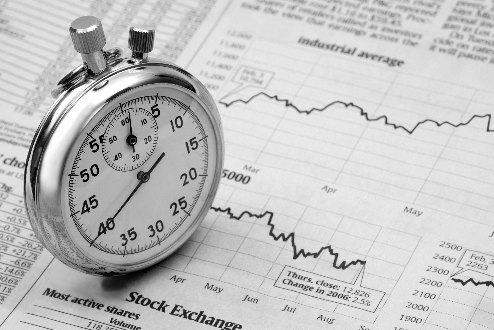

Algorithmic trading, a method that employs computer programs to execute trades at high speeds, relies heavily on the precision of timing to optimize trade execution. The significance of timing in algorithmic trading stems from its direct impact on the profitability and efficiency of trade execution. Accurate timing ensures that trades are executed at the most advantageous moments, enhancing the likelihood of capitalizing on market movements.

Several key elements contribute to the successful implementation of timing strategies in algorithmic trading. Speed is paramount; algorithms must process and execute orders rapidly to take advantage of fleeting market opportunities. The latency, or delay between the decision signal and order execution, must be minimized. Precision in timing also involves the accurate synchronization of trade execution with market signals, which requires access to real-time data and sophisticated algorithms capable of analyzing market conditions swiftly.



The benefits of optimizing trade timing are manifold. By executing trades at opportune moments, traders can maximize profits and minimize the costs associated with unfavorable price changes. Well-timed trades can also contribute to improved capital efficiency and risk management, allowing traders to maintain control over their investment strategies without incurring unnecessary losses.

However, optimizing trade timing presents several challenges. The rapid pace of market movements necessitates the use of advanced technologies and analytics, which can be costly to implement and maintain. Furthermore, the complex nature of financial markets means that unforeseen events can disrupt even the most meticulously planned timing strategies. Traders must continuously monitor and refine their algorithms to adapt to changing market conditions and mitigate potential losses resulting from mistimed trades.

Overall, mastering the art of timing in algorithmic trading is essential for achieving success in today's fast-paced financial markets. Balancing technological capabilities with strategic insights allows traders to navigate the complexities of market timing and leverage opportunities for enhanced trade execution.

## Table of Contents

## The Importance of Timing in Algorithmic Trading

Timing in [algorithmic trading](/wiki/algorithmic-trading) is crucial for enhancing profitability. Precise timing enables traders to capitalize on favorable market conditions and execute trades at optimally chosen moments, maximizing returns and reducing risk. The effectiveness of timing is particularly evident in trend-following and mean reversion strategies, which rely heavily on the ability to execute orders swiftly and at the correct intervals.

Trend-following strategies depend on identifying and capitalizing on established market trends. In this approach, precise timing is essential to enter or [exit](/wiki/exit-strategy) positions at advantageous points along the trend trajectory. For instance, traders seek to initiate trades as a trend gains [momentum](/wiki/momentum) and exit before a reversal occurs. Algorithms programmed with timing rules can detect trends by analyzing moving averages or momentum indicators, and initiate trades automatically when predefined criteria are met. This reduces the decision timeframe and minimizes human error, which can be critical in fast-moving markets. 

Mean reversion strategies, on the other hand, assume that asset prices will revert to their mean or average over time. This strategy is predicated on fluctuations in asset prices, and timing plays a pivotal role in capturing these price deviations. The precise timing of trade execution allows traders to buy low and sell high, profiting from transient price aberrations. Algorithms can be employed to monitor price movements and execute trades when prices deviate from the calculated mean by a certain threshold, ensuring that trades are placed at the optimal juncture to exploit the reversion.

Mistimed trades can significantly impact overall trading performance, leading to suboptimal returns or losses. If a trade is executed too early or too late, the trader may miss out on potential gains or incur additional costs. For example, entering a position prematurely in a trend-following strategy might mean buying before the trend has been confirmed, increasing the likelihood of a false start. Conversely, delayed execution in a mean reversion strategy could result in purchasing at a less favorable price, reducing the strategy's efficacy. Therefore, precise timing is not only beneficial but imperative for maximizing strategy effectiveness and achieving desirable outcomes in algorithmic trading.

## Common Timing Strategies in Algorithmic Trading

Algorithmic trading employs various timing strategies, with each strategy potentially offering unique advantages when applied correctly. The effectiveness of these strategies often hinges significantly on the precise timing of trades.

**Trend-Following Strategies**

Trend-following strategies are designed to capitalize on the momentum of market trends. These strategies rely heavily on algorithmic timing to identify entry and exit points that align with ongoing trends. They analyze past price movements to forecast future trends, typically using tools such as moving averages, trendlines, and momentum indicators. The primary objective is to enter trades in the direction of a trend early and exit before the trend reverses.

For instance, moving average crossovers are a common technique where a short-term moving average crossing above a long-term average generates buy signals, while crossing below generates sell signals. The success of these strategies depends on the timing accuracy — entering a trend too late can diminish potential returns, while premature exits may lead to missed opportunities. Python code to compute moving average crossovers may look like this:

```python
import pandas as pd

def moving_average_crossover(prices, short_window, long_window):
    signals = pd.DataFrame(index=prices.index)
    signals['price'] = prices['Close']
    signals['short_mavg'] = prices['Close'].rolling(window=short_window, min_periods=1, center=False).mean()
    signals['long_mavg'] = prices['Close'].rolling(window=long_window, min_periods=1, center=False).mean()

    signals['signal'] = 0.0
    signals['signal'][short_window:] = np.where(signals['short_mavg'][short_window:] > signals['long_mavg'][short_window:], 1.0, 0.0)
    signals['positions'] = signals['signal'].diff()
    return signals
```

**Mean Reversion Strategies**

Mean reversion strategies are based on the premise that asset prices will revert to their historical mean or average level. Timing is crucial to detect when a price deviation is most likely to correct, offering profit opportunities by buying low and selling high. Statistical tools such as Bollinger Bands, standard deviations, and z-scores are often employed to identify overbought or oversold conditions.

For effective mean reversion, traders must carefully time entries and exits to avoid false signals — buying too early can result in extended losses if the deviation persists, whereas late entries might miss the reversion period entirely. Precise timing in these strategies can be the difference between profit and loss.

**Breakout Strategies**

Breakout strategies seek to exploit opportunities following a market [breakout](/wiki/breakout-trading), where prices move beyond established support or resistance levels. Detecting the right timing is critical to capitalize on the rapid price movements that often follow a breakout. Algorithms leverage real-time data to identify potential breakout points and swiftly execute trades to gain maximum advantage before the wider market reacts.

These strategies rely on technical indicators like trading [volume](/wiki/volume-trading-strategy) spikes, [volatility](/wiki/volatility-trading-strategies) measures, and price patterns such as flags and pennants. Accurate timing is crucial here; delayed execution can drastically reduce profitability as prices tend to stabilize after the initial spike. Breakout strategies, therefore, benefit from leveraging high-frequency trading systems that can process and act on data with minimal latency.

In summary, successful implementation of trend-following, mean reversion, and breakout strategies in algorithmic trading largely relies on precision in trade timing. Each strategy type requires tailored tools and techniques to ensure trades are executed at optimal moments, maximizing potential returns while minimizing risks.

## Technologies Supporting Optimal Timing in Algo Trading

Advanced technologies have become pivotal in enhancing timing strategies for algorithmic trading, allowing traders to execute trades with greater precision and efficiency. Key among these technologies are [artificial intelligence](/wiki/ai-artificial-intelligence) (AI) and [machine learning](/wiki/machine-learning) (ML), which play a critical role in predicting market movements and optimizing trade execution.

AI and machine learning algorithms analyze vast amounts of historical and real-time data to identify patterns and trends that can inform trading decisions. These technologies refine timing in trade execution by learning from market behaviors and continuously adapting to changing conditions. For example, machine learning models can be trained to predict short-term price movements, enabling traders to time their entries and exits more effectively. The iterative learning process of AI and ML models ensures that trading strategies remain aligned with current market dynamics, thereby reducing the latency between market fluctuations and trading actions.

High-frequency trading ([HFT](/wiki/high-frequency-trading-strategies)) systems represent another significant technological advancement that supports optimal timing in algorithmic trading. HFT involves executing a large number of orders at extremely high speeds, often within microseconds. To achieve this, HFT systems rely heavily on sophisticated algorithms and low-latency networks to capitalize on minute price discrepancies. The success of HFT is largely contingent upon the ability to process and act upon information much faster than traditional trading methods allow.

Real-time data and analytics are crucial for making informed timing decisions in algorithmic trading. The constant flow of market data, including price quotes, trade volumes, and economic indicators, is analyzed to forecast potential market movements. Modern trading platforms provide traders with access to real-time analytics tools, enabling them to assess the current market conditions swiftly and accurately. These tools often incorporate visualizations and predictive analytics that highlight potential entry or exit points based on the latest data, thereby supporting the precise timing necessary for successful trades.

Incorporating these technologies into trading strategies can significantly enhance the ability to respond to market opportunities with agility and precision. The synergy between advanced computational techniques and timely data processing forms the bedrock of successful algorithmic trading in today's fast-paced financial markets.

## Evaluating the Effectiveness of Timing Strategies

Evaluating the effectiveness of timing strategies in algorithmic trading is crucial for ensuring that these strategies yield optimal outcomes. It involves a comprehensive assessment of various metrics and methods to refine and perfect the timing of trades. Backtesting is one of the primary methods utilized to validate the effectiveness of a timing strategy before it is deployed in live trading. This involves running the algorithm against historical data to assess how it would have performed in different market conditions. Backtesting helps identify potential weaknesses in the timing strategy and allows for adjustments to enhance accuracy and profitability.

Performance metrics play a pivotal role in the evaluation process. Latency, defined as the delay between a signal being generated and the execution of an order, is a critical [factor](/wiki/factor-investing). Lower latency often equates to better timing and more favorable trade execution. High-frequency trading systems, for example, rely heavily on minimizing latency to maintain a competitive edge. Response time, another essential metric, measures how quickly a system can respond to changing market conditions. Shorter response times are generally preferred as they allow for quicker adaptation to market shifts, thereby improving the timing precision.

Continuous monitoring of the timing strategies, even after their initial deployment, is equally important. This involves the real-time analysis of the trading environment and the performance of the algorithm, ensuring it remains effective under current market conditions. Regular strategy refinement is necessary to adapt to evolving market dynamics, such as shifts in volatility or [liquidity](/wiki/liquidity-risk-premium). This ongoing process of evaluation and refinement can be supported by advanced tools and technologies like machine learning, which can automate the detection of patterns and anomalies, thereby suggesting potential improvements to the timing strategy.

Ultimately, the effectiveness of timing strategies in algorithmic trading is dependent on their adaptability and responsiveness to ever-changing market conditions. By systematically applying [backtesting](/wiki/backtesting), closely monitoring key performance metrics, and engaging in continuous strategy refinement, traders can enhance their timing precision, leading to improved trading outcomes.

## Challenges and Limitations of Timing in Algorithmic Trading

Algorithmic trading, while highly effective, faces several challenges related to timing, primarily due to latency and technological limitations. Latency is the delay that occurs from the initiation of a trade order to its execution. In high-frequency trading environments, even microseconds of delay can cause significant discrepancies in expected and actual trade results. These delays can stem from network transmission speeds, the processing capacity of trading systems, or data feed delays. Reducing latency often involves significant investments in advanced computing technologies and infrastructure, such as colocating servers close to exchange facilities to minimize transmission time.

Technological limitations also pose barriers. While technologies like AI and machine learning attempt to predict market movements with increasing precision, the algorithms are still constrained by the quality and quantity of data available. Moreover, the computational power required to process and analyze vast datasets in real-time can be prohibitive, leading to potential delays in decision-making and execution.

Market volatility significantly affects the efficacy of timing strategies. During periods of high volatility, price movements can be sudden and unpredictable. Timing strategies that are too rigid may fail to adapt to such rapid changes, resulting in missed opportunities or increased risk exposure. Conversely, overly flexible strategies might overreact to transient fluctuations, leading to unnecessary trade adjustments and increased transaction costs.

External factors and unforeseen events, such as political events, economic announcements, or natural disasters, create further complexities. These events can lead to abrupt market shifts that existing algorithms have not been trained to anticipate. As a result, even well-timed strategies can be rendered ineffective in the face of such disruptions. The incorporation of real-time news analytics and sentiment analysis into trading systems is one approach to mitigate this risk, but it requires continuous updating and refinement.

In conclusion, while algorithmic trading offers sophisticated timing strategies, several challenges and limitations persist. Addressing latency issues, technological constraints, and the unpredictability of market and external factors requires ongoing innovation and adaptation in trading technologies and strategies.

## Future Trends in Timing for Algorithmic Trading

The landscape of algorithmic trading is rapidly evolving, with advancements in technology offering novel approaches to enhance timing strategies. One of the most significant technological shifts anticipated is the development and potential deployment of quantum computing. Quantum computing promises exponential increases in processing power compared to classical computers, enabling traders to execute complex algorithms at unprecedented speeds. This speed could drastically reduce latency, which is crucial for high-frequency trading strategies where decisions often need to be made in nanoseconds.

Quantum computing operates on the principles of quantum mechanics, utilizing qubits that can handle complex calculations simultaneously. This capability could, for instance, solve optimization problems and analyze massive datasets more efficiently, allowing algorithms to predict market movements with greater accuracy. Moreover, improvements in factor analysis using quantum algorithms might refine parameter selection in timing strategies, enhancing their success rates.

In parallel with quantum advancements, the integration of real-time analytics is poised to become more sophisticated. Current algorithmic trading systems already leverage real-time data to make instantaneous decisions, but future systems are likely to incorporate even more comprehensive datasets. This includes integrating social media sentiment, global news feeds, and other non-traditional data sources. By harnessing these data streams, trading algorithms can make more informed and timely decisions, possibly leading to more profitable trades.

Emerging technologies such as machine learning and artificial intelligence are expected to further transform timing strategies. The ability of these technologies to evolve by learning from past data could enable them to adapt more effectively to dynamic market conditions. Machine learning models, particularly [deep learning](/wiki/deep-learning), can uncover intricate patterns and relationships within complex datasets that might elude conventional statistical methods. This deep analysis can significantly enhance the predictive accuracy of timing strategies.

The adoption of real-time analytical tools and sophisticated data visualization platforms also provides traders with a deeper understanding of market trends and anomalies, which can be critical in fine-tuning timing strategies. Collaboration between human insight and machine efficiency will likely define future developments in trading strategies, fostering environments where traders can react almost instantaneously to market signals.

Looking ahead, as these technological advancements unfold, the competitive edge in algorithmic trading might hinge more on the ability to implement and adapt to cutting-edge technologies than on the creation of new trading models. Continuous innovation in quantum computing, real-time data analysis, and AI-driven strategy refinement will be pivotal in shaping the future of timing in algorithmic trading.

## Conclusion

Mastering timing strategies is crucial for success in algorithmic trading as it directly influences trade execution and profitability. Precise timing can mitigate risks associated with market volatility and exploit brief pricing inefficiencies. By integrating advanced algorithms, traders can make rapid decisions that leverage minimal time discrepancies for maximal gain.

Continuous learning and adaptation are central to enhancing timing precision in trading activities. The financial markets are dynamic, with constant changes in trading patterns and regulatory environments. Traders and algorithms must evolve alongside these shifts to maintain effectiveness. This requires a commitment to ongoing education and the integration of new data sources and analytic tools. For instance, utilizing advanced machine learning models can offer insights into emerging trends and assist in refining timing strategies.

A balanced approach that combines technology with strategic insights is essential for optimizing timing in algorithmic trading. Technology provides the tools for swift execution and data analysis, but human intuition and strategic planning provide the context and foresight that machines might lack. By leveraging both technological capabilities and human expertise, traders can develop robust strategies that are adaptable and resilient to market fluctuations.

In conclusion, while technology plays a vital role in enhancing timing strategies, the need for strategic insight and continuous learning remains paramount. A comprehensive approach that incorporates both elements will better equip traders to navigate the complexities of algorithmic trading, ultimately leading to sustained success.

## References & Further Reading

[1]: ["Quantitative Trading: How to Build Your Own Algorithmic Trading Business"](https://www.amazon.com/Quantitative-Trading-Build-Algorithmic-Business/dp/0470284889) by Ernest P. Chan

[2]: ["Advances in Financial Machine Learning"](https://www.amazon.com/Advances-Financial-Machine-Learning-Marcos/dp/1119482089) by Marcos Lopez de Prado

[3]: Bergstra, J., Bardenet, R., Bengio, Y., & Kégl, B. (2011). ["Algorithms for Hyper-Parameter Optimization."](https://dl.acm.org/doi/10.5555/2986459.2986743) Advances in Neural Information Processing Systems 24.

[4]: ["Machine Learning for Algorithmic Trading"](https://github.com/stefan-jansen/machine-learning-for-trading) by Stefan Jansen

[5]: ["Evidence-Based Technical Analysis: Applying the Scientific Method and Statistical Inference to Trading Signals"](https://www.amazon.com/Evidence-Based-Technical-Analysis-Scientific-Statistical/dp/0470008741) by David Aronson