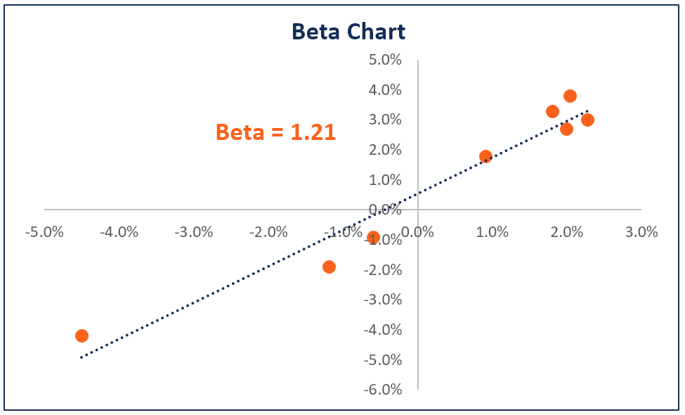

Understanding the dynamics of the stock market is crucial for successful algorithmic trading. In this context, the beta factor emerges as a fundamental measure, offering insights into a stock's volatility in relation to broader market movements. By quantifying how a particular stock's price changes in response to market fluctuations, beta provides traders with a metric to assess systemic risk, which is crucial for making informed trading decisions.

In algorithmic trading, where decisions are guided by predefined criteria and models, the beta factor assumes a pivotal role. It allows for the quantification of volatility and potential risk associated with different stocks within a portfolio. A stock's beta is determined through statistical methods, specifically by running a linear regression on its returns against the market's returns. The outcome indicates whether the stock is expected to be more or less volatile than the market itself. For instance, a beta greater than 1 signifies that the stock is more volatile than the market, whereas a beta less than 1 indicates less volatility. This knowledge enables traders to fine-tune their strategies according to the level of risk they are willing to assume.

This article will explore the concept of beta, examining its mathematical foundation and practical implications in algorithmic trading. Understanding beta not only aids in risk assessment but also empowers traders to optimize their strategies and potentially enhance returns.

## Table of Contents

## Understanding Beta in Financial Markets

Beta measures the expected change in a stock's price relative to market movements. It is a key metric in the Capital Asset Pricing Model (CAPM), which investors and traders use to assess the risk-return profile of stocks. By quantifying how much a stock's price is expected to move compared to the broader market, beta captures systemic market risk—risk inherent to the entire market that cannot be eliminated through diversification.

Stocks with a beta greater than 1 are typically more volatile than the market. This means they are expected to experience larger price swings in response to market movements. For instance, a stock with a beta of 1.5 would theoretically increase by 15% if the market went up by 10%, and conversely, it would decrease by 15% if the market went down by 10%. This increased volatility could result in higher returns, but it also entails greater risk.

Conversely, stocks with a beta less than 1 are less volatile than the market. A beta of 0.8, for example, indicates the stock is expected to move only 8% for every 10% change in the market. These stocks are considered safer investments but often offer lower returns.

The beta of a stock is crucial for constructing a well-balanced portfolio that aligns with investors' risk tolerance. It highlights vulnerability to market trends, allowing traders using algorithmic strategies to adjust their portfolios to achieve a desired risk exposure. By understanding beta, traders can make informed decisions to stabilize or enhance portfolio performance in alignment with market fluctuations.

## Mathematical Definition of Beta

Beta is a fundamental concept in finance used to assess the degree of a stock's [volatility](/wiki/volatility-trading-strategies) in relation to the market. This volatility measure is pivotal in understanding systemic risk, primarily because it utilizes statistical methods to quantify the relationship between the movements of a specific stock and the market as a whole. Mathematically, beta ($\beta$) is derived from the linear regression of a stock's returns against the market's returns, a process that enables traders to gauge how sensitive a stock is to market movements.

The calculation of beta involves two critical statistical concepts: covariance and variance. Covariance measures how two variables move in relation to each other, while variance is a measure of how much a set of numbers differ from their mean. In the context of beta:

1. **Covariance ($Cov(r_i, r_m)$)**: This is calculated between the returns of the stock ($r_i$) and the returns of the market ($r_m$). It indicates the degree to which the stock's returns move in tandem with the market's returns. A positive covariance suggests that the stock typically moves in the same direction as the market, while a negative covariance indicates that it moves inversely.

2. **Variance ($Var(r_m)$)**: This represents the dispersion of the market's returns. It tells us how much the market’s returns fluctuate over time.

The beta formula is given by:

$$
\beta_i = \frac{Cov(r_i, r_m)}{Var(r_m)}
$$

This equation essentially normalizes the covariance by the market's overall volatility, providing a standardized measure of the stock's volatility relative to the market. If $\beta = 1$, it indicates that the stock's price moves with the market. A beta greater than one means the stock is more volatile than the market, leading to potentially higher returns (or losses), while a beta less than one suggests that the stock is less volatile, making it a potentially safer investment. This mathematical framework enables algorithmic models to carefully assess and predict stock behavior in varying market conditions.

## Beta in the Context of Algorithmic Trading

Algorithmic trading employs beta as a vital tool for managing portfolio risk and enhancing performance. By quantifying a stock's volatility relative to the broader market, beta provides insights that help traders tailor their strategies according to the risk profile of the assets in question. 

High-beta stocks, characterized by their greater volatility compared to the market, have the potential to deliver substantial returns. However, the increased volatility also brings about higher risk. To mitigate this risk, [algorithmic trading](/wiki/algorithmic-trading) systems might implement strategies that include dynamic hedging or volatility-targeting, ensuring that potential losses are contained while capitalizing on the upward movements of these stocks.

Low-beta stocks, on the other hand, are less volatile and tend to move more conservatively compared to the market. When incorporated into algorithmic trading, these stocks can contribute to a more stable and balanced portfolio. Algorithms might employ diversification techniques, distributing investments across a variety of low-beta assets to achieve a consistent performance while maintaining a lower risk threshold.

In practice, the usage of beta in algorithmic trading involves not only monitoring the beta values but also continuously adjusting strategies in response to shifting market conditions. This active management allows algorithms to navigate the complexities of the financial markets, optimizing risk-adjusted returns across different stock portfolios. By integrating beta into algorithmic models, traders can systematically align their portfolios with their risk tolerance and investment objectives.

## Special Cases and Considerations

Utility stocks are frequently characterized by their low beta values, which signify that these stocks tend to exhibit less volatility compared to the broader market. Their predictable cash flows and stable [earning](/wiki/earning-announcement)s render them attractive for risk-averse investors seeking consistent returns. The lower volatility associated with utility stocks often results in reduced market sensitivity, thereby presenting a less risky investment profile.

Foreign stocks offer another dimension of diversification, especially valuable for portfolios heavily weighted towards U.S. markets. Historically, including international stocks could reduce overall portfolio risk due to differing economic cycles and geopolitical [factor](/wiki/factor-investing)s. However, it is essential to recognize that global financial integration has increased correlations among international markets. This trend can potentially diminish the diversification benefits previously associated with foreign equities, making it crucial for investors to assess cross-market correlations continually.

Derivatives, such as options and futures, introduce unique complexities due to their inherent non-linearity. The payoff structures of derivatives do not align linearity with primary securities, necessitating advanced volatility measures beyond conventional beta. This complexity arises from the levered nature of derivatives, which can amplify both potential gains and losses. As a result, the volatility of derivative positions may be better captured by metrics like Vega, which measures sensitivity to volatility changes, or Gamma, which indicates the rate of change of Delta in options pricing. To address these nuances, algorithmic strategies must incorporate these volatility measures to effectively manage derivative risks and maximize potential returns.

## Estimating and Adjusting Beta

Estimating and adjusting beta is a crucial task for algorithmic trading strategies to remain effective and relevant in dynamic market conditions. Two prominent methods that are commonly used to predict future beta values are the Blume and Vasicek beta estimators.

The Blume beta adjustment method offers a straightforward approach by recognizing the tendency of historical betas to regress toward the market average beta of one over time. This regression can be mathematically expressed as:

$$
\beta_{\text{adjusted}} = 0.67 \times \beta_{\text{historical}} + 0.33 \times 1
$$

Here, $\beta_{\text{historical}}$ is the beta calculated from historical data. The weighted average reflects the empirical observation that extreme beta values tend to move toward the mean beta of one.

On the other hand, the Vasicek beta adjustment takes a Bayesian approach, giving weight to both the historical beta and the market average beta, based on the variance observed in the historical beta estimates:

$$
\beta_{\text{vasicek}} = \frac{\sigma_{\beta}^2}{\sigma_{\beta}^2 + \sigma_m^2} \times \beta_{\text{historical}} + \frac{\sigma_m^2}{\sigma_{\beta}^2 + \sigma_m^2} \times \beta_m
$$

In this formula, $\sigma_{\beta}^2$ represents the variance of the historical beta, while $\sigma_m^2$ is the variance of the market's beta. $\beta_m$ is the market average beta. The Vasicek method benefits from dynamically adjusting weightages based on the reliability of the beta estimates and the correlation with market movements.

Both methods adjust beta estimates to account for changing market conditions and stock-specific factors, providing a more nuanced view of potential future behavior than relying solely on historical observations. When algorithms deploy these refined beta estimates, they can more effectively anticipate risks and make informed portfolio adjustments to optimize performance, thus improving their capacity for risk management. 

Incorporating such predictive adjustments allows trading algorithms to operate with greater awareness of systemic and specific risk factors, ultimately aiding in achieving more stable and potentially lucrative trading outcomes.

## Limitations of Beta in Trading Strategies

Beta, as a measure of systematic risk, assumes that stock returns follow a normal distribution. However, financial markets often exhibit heavier tails and skewness, suggesting that returns may not be normally distributed. This assumption limits beta's effectiveness, as real-world price movements can be more erratic than predicted, potentially leading to inaccurate risk assessments.

In short-term risk analysis, beta proves useful due to its responsiveness to immediate market fluctuations. Nevertheless, for long-term projections, beta's limitations become apparent. Since beta is predominantly a backward-looking metric, derived from historical data, it may not account for structural changes in a company or industry that could affect future stock behavior. Hence, relying solely on beta could result in misestimating the risk faced over an extended horizon.

Given these constraints, traders should not rely on beta as their sole risk assessment tool. Incorporating [fundamental analysis](/wiki/fundamental-analysis) allows traders to evaluate a company's intrinsic value by examining financial statements, industry conditions, and economic factors. This approach complements beta by providing insights into a company's financial health and growth prospects. Technical analysis also plays a critical role, with its focus on price patterns, trends, and market sentiment, offering a different perspective on stock behavior.

By integrating fundamental and technical analysis with beta, traders can develop a more comprehensive strategy, balancing quantitative metrics with qualitative insights. This integrated approach helps address beta's limitations, offering a clearer understanding of potential risks and enabling better-informed trading decisions.

## Conclusion

Beta remains a critical factor in algorithmic trading for effectively assessing and managing market risk. As a measure of a stock's volatility in relation to the overall market, beta enables traders to identify both systemic risk and potential return. By understanding how a specific stock's price is expected to respond to shifts in the broader market, traders can strategically leverage beta values to enhance risk management and potentially increase returns.

Applying beta in trading strategies allows for the fine-tuning of portfolio exposure to market movements. For instance, a high-beta stock in a bullish market could increase overall portfolio returns, assuming the market trends upward as expected. Conversely, low-beta stocks may serve as a stabilizing force in a volatile or bearish market, reducing overall portfolio exposure to severe fluctuations.

However, to optimize trading outcomes, beta should not be considered in isolation. Future algorithmic strategies are best served by integrating beta with other market indicators. Variables such as economic data releases, [interest rate](/wiki/interest-rate-trading-strategies) changes, and industry-specific trends can complement beta analysis, offering a comprehensive view of potential risks and rewards. In practice, this means utilizing a multi-factor approach where beta, along with additional analytical techniques such as fundamental and technical analysis, synchronize to guide more refined trading decisions.

In summary, while beta is indispensable for evaluating market risk in algorithmic trading, its effectiveness is amplified when combined with other insights, paving the way for a robust and adaptive trading strategy.

## References & Further Reading

[1]: ["Modern Portfolio Theory and Investment Analysis"](https://www.wiley.com/en-us/Modern+Portfolio+Theory+and+Investment+Analysis%2C+9th+Edition-p-9781118469941) by Edwin J. Elton, Martin J. Gruber, Stephen J. Brown, and William N. Goetzmann

[2]: ["Capital Ideas: The Improbable Origins of Modern Wall Street"](https://www.amazon.com/Capital-Ideas-Improbable-Origins-Modern/dp/0471731749) by Peter L. Bernstein

[3]: ["Common Risk Factors in the Returns on Stocks and Bonds"](https://www.sciencedirect.com/science/article/abs/pii/S0304405X98003275) by Eugene F. Fama and Kenneth R. French, Journal of Financial Economics

[4]: ["Betting Against Beta"](https://papers.ssrn.com/sol3/papers.cfm?abstract_id=2040939) by Andrea Frazzini and Lasse Heje Pedersen, Journal of Financial Economics

[5]: ["Quantitative Portfolio Management: The Art and Science of Statistical Arbitrage"](https://www.amazon.com/Quantitative-Portfolio-Management-Science-Statistical/dp/0470366322) by Michael Isichenko

[6]: ["The Black-Scholes-Merton Model as an Idealization"](https://www.jstor.org/stable/3488112) by Fischer Black, Myron Scholes, and Robert Merton, American Economic Review

[7]: ["Algorithmic Trading & DMA: An Introduction to Direct Access Trading Strategies"](https://www.amazon.com/Algorithmic-Trading-DMA-Introduction-Strategies/dp/0956399207) by Barry Johnson