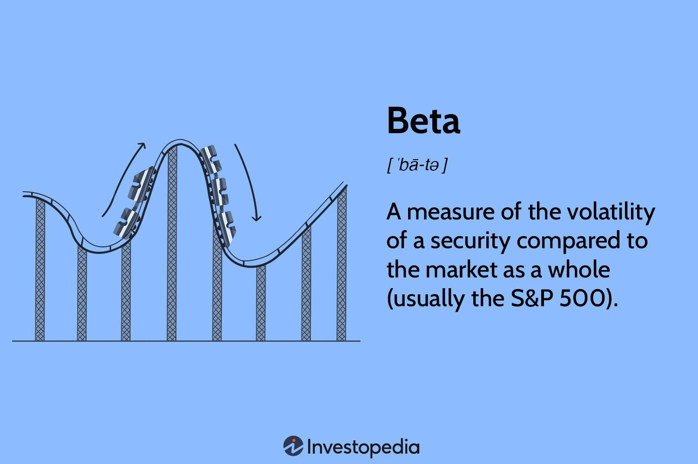

## Table of Contents

## What is the Beta Factor?

The Beta Factor is a way to measure how risky an investment is compared to the whole market. If a stock has a Beta of 1, it moves with the market. If it's more than 1, like 1.5, it's riskier and moves more than the market. If it's less than 1, like 0.5, it's safer and doesn't move as much as the market.

People use the Beta Factor to understand how much risk they are taking with their investments. It helps them decide if they want to invest in something that might go up and down a lot, or something that stays more steady. This can be really helpful when planning how to grow their money over time.

## How is the Beta Factor calculated?

To calculate the Beta Factor, you need to compare how a stock moves with how the whole market moves. First, you find the returns of the stock and the returns of the market over the same time periods. Then, you figure out how much the stock's returns go up or down when the market's returns go up or down. This is done by using a formula that looks at how closely the stock's movements match the market's movements.

The formula for Beta is a bit like a special average. It uses something called covariance, which shows how the stock and the market move together, and it divides that by the variance of the market's returns, which is how much the market's returns change. If the stock moves exactly like the market, the Beta will be 1. If it moves more than the market, the Beta will be higher than 1, and if it moves less, the Beta will be lower than 1. This helps investors see if a stock is more or less risky than the market.

## Why is the Beta Factor important in finance?

The Beta Factor is important in finance because it helps investors understand how much risk they are taking when they invest in a certain stock. It tells them if the stock is likely to move a lot more than the market, a lot less, or just the same. This is really useful because it helps people decide if they want to invest in something that might be more risky but could also give them bigger rewards, or if they want something safer that won't change as much.

Knowing the Beta Factor can also help investors make their investment plans. If someone wants to grow their money without taking too many risks, they might choose stocks with a lower Beta. But if they're okay with more ups and downs and are looking for bigger gains, they might pick stocks with a higher Beta. This way, the Beta Factor helps people match their investments with their own comfort level with risk.

## Can you explain the difference between Beta Factor and Alpha?

The Beta Factor and Alpha are two different ways to measure how well an investment is doing, but they focus on different things. The Beta Factor shows how much an investment goes up and down compared to the whole market. If a stock has a Beta of 1, it moves just like the market. If it's more than 1, it moves more than the market, which means it's riskier. If it's less than 1, it moves less than the market, so it's safer. Beta helps investors see how much risk they're taking with their money.

Alpha, on the other hand, is about how much an investment does better or worse than what you'd expect just from the market's movements. If a stock has a positive Alpha, it means it's doing better than the market, even after you account for how risky it is. If it has a negative Alpha, it's not doing as well as you'd expect. Alpha is important because it shows if a stock or a fund manager is really good at [picking](/wiki/asset-class-picking) investments that beat the market, not just because they're taking more risks.

So, while Beta tells you about the risk of an investment compared to the market, Alpha tells you about the performance of an investment beyond what you'd expect from its risk level. Both are useful for investors, but they give different kinds of information that can help in making smart investment choices.

## How does the Beta Factor relate to market risk?

The Beta Factor is a way to measure how much risk an investment has compared to the whole market. If a stock has a Beta of 1, it moves the same way as the market. This means the risk of the stock is the same as the risk of the market. But if a stock has a Beta higher than 1, like 1.5, it moves more than the market. This means it's riskier than the market because it goes up and down more. If a stock has a Beta lower than 1, like 0.5, it moves less than the market. This means it's safer because it doesn't change as much.

Understanding the Beta Factor helps investors know how much market risk they are taking with their money. If someone wants to be safe, they might choose stocks with a low Beta because these stocks won't move as much as the market. But if someone is okay with taking more risk, they might choose stocks with a high Beta because these stocks could give them bigger rewards, even though they might also lose more money. By looking at the Beta Factor, investors can make choices that match how much risk they are willing to take.

## What does a Beta Factor greater than 1 indicate?

A Beta Factor greater than 1 means that the stock is more risky than the market. When the market goes up or down, this stock will go up or down even more. For example, if the market goes up by 10%, a stock with a Beta of 1.5 might go up by 15%. This shows that the stock is more sensitive to market movements and can be a good choice for people who are okay with taking more risk for the chance of bigger rewards.

But, it's not all good news. A higher Beta also means that when the market goes down, the stock will go down more too. So, if the market drops by 10%, a stock with a Beta of 1.5 could drop by 15%. This makes the stock riskier because it can lose more money when the market is not doing well. Investors need to think carefully about how much risk they want to take before choosing stocks with a Beta greater than 1.

## What does a Beta Factor less than 1 indicate?

A Beta Factor less than 1 means that the stock is less risky than the market. When the market goes up or down, this stock will move less than the market. For example, if the market goes up by 10%, a stock with a Beta of 0.5 might only go up by 5%. This shows that the stock is not as sensitive to market movements, which can be good for people who want to take less risk with their money.

On the flip side, a lower Beta also means that when the market goes down, the stock will go down less too. So, if the market drops by 10%, a stock with a Beta of 0.5 might only drop by 5%. This makes the stock safer because it won't lose as much money when the market is not doing well. Investors who want to keep their investments more stable might choose stocks with a Beta less than 1.

## How can investors use the Beta Factor to manage their portfolios?

Investors can use the Beta Factor to manage their portfolios by figuring out how much risk they want to take. If they want to be safe, they might pick stocks with a low Beta, like less than 1. These stocks won't go up and down as much as the market, so they're less risky. This can help keep their money more stable, which is good if they don't want to lose a lot when the market goes down.

On the other hand, if investors are okay with more risk and want a chance to make more money, they might choose stocks with a high Beta, like more than 1. These stocks move more than the market, so they can go up a lot when the market is doing well. But they can also go down a lot when the market is not doing well. By looking at the Beta Factor, investors can mix and match stocks to make a portfolio that fits how much risk they're comfortable with and what they want to achieve with their investments.

## What are the limitations of using the Beta Factor as a risk measure?

Using the Beta Factor to measure risk has some problems. One big issue is that Beta only looks at how a stock moves with the market, but it doesn't tell you about other kinds of risks. For example, a company might have problems with its business that make it risky, but Beta won't show that. Also, Beta is based on past data, so it might not be a good guess for what will happen in the future. If the market changes a lot, the Beta from the past might not be right anymore.

Another problem with Beta is that it can be different depending on how long you look at the data. If you use a short time, like a few months, the Beta might be different than if you use a longer time, like a few years. This can make it hard to know which Beta to trust. Plus, Beta doesn't work the same for all kinds of investments. It's better for stocks, but it might not be as good for other things like bonds or real estate. So, while Beta can help you understand some risks, it's not perfect and should be used with other ways to measure risk.

## How does the Beta Factor vary across different industries?

The Beta Factor can be different for different industries because each industry has its own way of reacting to what's happening in the market. For example, technology companies often have a higher Beta because they can grow fast and change a lot. This means they might go up and down more than the market. On the other hand, utility companies, like those that provide electricity or water, usually have a lower Beta. They don't change as much because people always need their services, so they're more stable.

Also, industries like consumer goods, which make things like food and clothes, might have a Beta close to 1. This is because people always need these things, but the companies can still be affected by the economy. But industries like mining or oil and gas can have a higher Beta because their prices can change a lot based on what's happening around the world. So, when you're looking at the Beta Factor, it's good to think about what kind of industry the company is in because that can tell you a lot about how risky it might be.

## Can the Beta Factor be used for assets other than stocks?

The Beta Factor is mostly used for stocks, but it can be used for other kinds of investments too, like bonds or real estate. But, it might not work as well for these other things. For example, bonds are usually less risky than stocks, so their Beta might be lower. Real estate can be tricky because it doesn't move with the market the same way stocks do. So, if you use Beta for these other investments, you need to be careful and understand that it might not tell you the whole story about the risk.

Even though the Beta Factor can be used for other assets, it's important to know its limits. For bonds, Beta might not show all the risks, like if the company that issued the bond might have trouble paying it back. For real estate, Beta might not capture things like changes in local markets or interest rates. So, while Beta can give you some idea about how risky an investment might be compared to the market, it's best to use other ways to measure risk too when you're looking at things other than stocks.

## What advanced statistical methods are used to estimate the Beta Factor more accurately?

To estimate the Beta Factor more accurately, people use some advanced statistical methods. One way is called regression analysis. This method looks at how the stock's returns and the market's returns move together over time. It helps figure out the best line that shows how the stock moves with the market. This line gives us the Beta Factor. Another way is using something called the Capital Asset Pricing Model (CAPM). This model uses the Beta Factor to see how much return an investor should expect from a stock, based on how risky it is compared to the market.

Another advanced method is called the GARCH model, which stands for Generalized Autoregressive Conditional Heteroskedasticity. This model is good at looking at how the risk of a stock changes over time. It can help make the Beta Factor more accurate by taking into account that the risk of a stock might not stay the same. Also, some people use something called Bayesian methods. These methods use what we already know about the stock and the market to make better guesses about the Beta Factor. By using these advanced methods, investors can get a clearer picture of how risky a stock might be compared to the market.

## What is the Mathematical Definition of Beta?

Beta is a fundamental concept in finance used to assess the degree of a stock's [volatility](/wiki/volatility-trading-strategies) in relation to the market. This volatility measure is pivotal in understanding systemic risk, primarily because it utilizes statistical methods to quantify the relationship between the movements of a specific stock and the market as a whole. Mathematically, beta ($\beta$) is derived from the linear regression of a stock's returns against the market's returns, a process that enables traders to gauge how sensitive a stock is to market movements.

The calculation of beta involves two critical statistical concepts: covariance and variance. Covariance measures how two variables move in relation to each other, while variance is a measure of how much a set of numbers differ from their mean. In the context of beta:

1. **Covariance ($Cov(r_i, r_m)$)**: This is calculated between the returns of the stock ($r_i$) and the returns of the market ($r_m$). It indicates the degree to which the stock's returns move in tandem with the market's returns. A positive covariance suggests that the stock typically moves in the same direction as the market, while a negative covariance indicates that it moves inversely.

2. **Variance ($Var(r_m)$)**: This represents the dispersion of the market's returns. It tells us how much the market’s returns fluctuate over time.

The beta formula is given by:

$$
\beta_i = \frac{Cov(r_i, r_m)}{Var(r_m)}
$$

This equation essentially normalizes the covariance by the market's overall volatility, providing a standardized measure of the stock's volatility relative to the market. If $\beta = 1$, it indicates that the stock's price moves with the market. A beta greater than one means the stock is more volatile than the market, leading to potentially higher returns (or losses), while a beta less than one suggests that the stock is less volatile, making it a potentially safer investment. This mathematical framework enables algorithmic models to carefully assess and predict stock behavior in varying market conditions.

## How can one estimate and adjust beta?

Estimating and adjusting beta is a crucial task for [algorithmic trading](/wiki/algorithmic-trading) strategies to remain effective and relevant in dynamic market conditions. Two prominent methods that are commonly used to predict future beta values are the Blume and Vasicek beta estimators.

The Blume beta adjustment method offers a straightforward approach by recognizing the tendency of historical betas to regress toward the market average beta of one over time. This regression can be mathematically expressed as:

$$
\beta_{\text{adjusted}} = 0.67 \times \beta_{\text{historical}} + 0.33 \times 1
$$

Here, $\beta_{\text{historical}}$ is the beta calculated from historical data. The weighted average reflects the empirical observation that extreme beta values tend to move toward the mean beta of one.

On the other hand, the Vasicek beta adjustment takes a Bayesian approach, giving weight to both the historical beta and the market average beta, based on the variance observed in the historical beta estimates:

$$
\beta_{\text{vasicek}} = \frac{\sigma_{\beta}^2}{\sigma_{\beta}^2 + \sigma_m^2} \times \beta_{\text{historical}} + \frac{\sigma_m^2}{\sigma_{\beta}^2 + \sigma_m^2} \times \beta_m
$$

In this formula, $\sigma_{\beta}^2$ represents the variance of the historical beta, while $\sigma_m^2$ is the variance of the market's beta. $\beta_m$ is the market average beta. The Vasicek method benefits from dynamically adjusting weightages based on the reliability of the beta estimates and the correlation with market movements.

Both methods adjust beta estimates to account for changing market conditions and stock-specific factors, providing a more nuanced view of potential future behavior than relying solely on historical observations. When algorithms deploy these refined beta estimates, they can more effectively anticipate risks and make informed portfolio adjustments to optimize performance, thus improving their capacity for risk management. 

Incorporating such predictive adjustments allows trading algorithms to operate with greater awareness of systemic and specific risk factors, ultimately aiding in achieving more stable and potentially lucrative trading outcomes.

## References & Further Reading

[1]: ["Modern Portfolio Theory and Investment Analysis"](https://www.wiley.com/en-us/Modern+Portfolio+Theory+and+Investment+Analysis%2C+9th+Edition-p-9781118469941) by Edwin J. Elton, Martin J. Gruber, Stephen J. Brown, and William N. Goetzmann

[2]: ["Capital Ideas: The Improbable Origins of Modern Wall Street"](https://www.amazon.com/Capital-Ideas-Improbable-Origins-Modern/dp/0471731749) by Peter L. Bernstein

[3]: ["Common Risk Factors in the Returns on Stocks and Bonds"](https://www.sciencedirect.com/science/article/abs/pii/S0304405X98003275) by Eugene F. Fama and Kenneth R. French, Journal of Financial Economics

[4]: ["Betting Against Beta"](https://papers.ssrn.com/sol3/papers.cfm?abstract_id=2040939) by Andrea Frazzini and Lasse Heje Pedersen, Journal of Financial Economics

[5]: ["Quantitative Portfolio Management: The Art and Science of Statistical Arbitrage"](https://www.amazon.com/Quantitative-Portfolio-Management-Science-Statistical/dp/0470366322) by Michael Isichenko

[6]: ["The Black-Scholes-Merton Model as an Idealization"](https://www.jstor.org/stable/3488112) by Fischer Black, Myron Scholes, and Robert Merton, American Economic Review

[7]: ["Algorithmic Trading & DMA: An Introduction to Direct Access Trading Strategies"](https://www.amazon.com/Algorithmic-Trading-DMA-Introduction-Strategies/dp/0956399207) by Barry Johnson