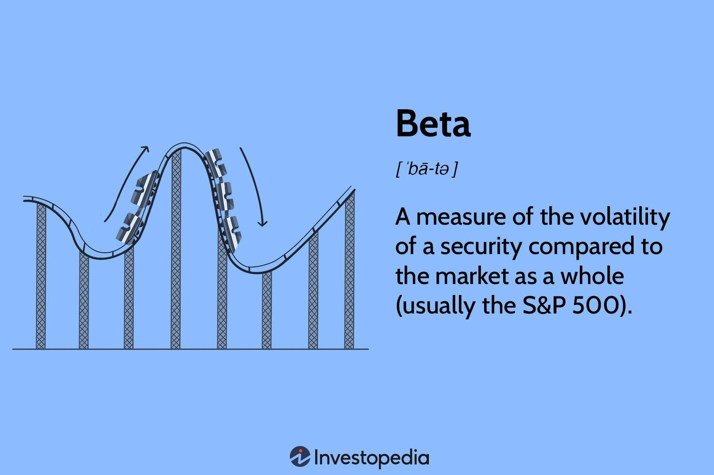

## Table of Contents

## What is beta in finance?

In finance, beta is a measure that shows how much a stock or a portfolio moves compared to the overall market. It helps investors understand the risk of an investment. If a stock has a beta of 1, it moves with the market. A beta higher than 1 means the stock is more volatile than the market, and a beta lower than 1 means it's less volatile.

Beta is important for investors who want to know how risky their investments are. For example, if you have a stock with a beta of 2, it means that stock is twice as volatile as the market. This can be useful when building a diversified portfolio, as it helps balance risk and return. By understanding beta, investors can make smarter choices about which stocks to buy or sell.

## How is beta calculated?

Beta is calculated by comparing the returns of a stock to the returns of the market over a period of time. You start by finding the average return of the stock and the average return of the market. Then, you look at how much the stock's returns move up and down compared to the market's returns. This is done using a formula that involves calculating the covariance between the stock's returns and the market's returns, and then dividing that by the variance of the market's returns.

The formula for beta is: Beta = Covariance(Stock Returns, Market Returns) / Variance(Market Returns). Covariance measures how two things move together, and variance measures how much something moves on its own. If the stock moves a lot when the market moves, the covariance will be high, making the beta high. If the stock doesn't move much even when the market moves, the covariance will be low, making the beta low. This helps investors understand if a stock is riskier or safer than the market.

## What does a beta of 1 mean?

A beta of 1 means that a stock moves exactly the same way as the overall market. If the market goes up by 10%, a stock with a beta of 1 will also go up by 10%. If the market goes down by 5%, the stock will go down by 5% too. This makes the stock as risky as the market itself.

Investors use beta to understand how risky a stock is compared to the market. A beta of 1 tells them that the stock has the same level of risk as the market. This can help them decide if they want to invest in that stock or look for something less or more risky.

## What does a beta greater than 1 indicate?

A beta greater than 1 means a stock is more volatile than the market. If the market goes up by 10%, a stock with a beta of 1.5 might go up by 15%. This shows that the stock moves more than the market does. It can be riskier because it might go up a lot when the market goes up, but it can also go down a lot when the market goes down.

Investors look at beta to see if a stock is riskier than the market. A beta over 1 tells them the stock might give bigger gains but also bigger losses. This can help them decide if they want to take that extra risk or if they want to stick with stocks that are less risky.

## What does a beta less than 1 indicate?

A beta less than 1 means a stock is less volatile than the market. If the market goes up by 10%, a stock with a beta of 0.5 might only go up by 5%. This shows the stock doesn't move as much as the market does. It can be safer because it might not go up as much when the market goes up, but it also won't go down as much when the market goes down.

Investors use beta to see if a stock is less risky than the market. A beta under 1 tells them the stock might give smaller gains but also smaller losses. This can help them decide if they want to invest in a safer stock or if they want to take more risk for potentially bigger rewards.

## How can beta be used in portfolio management?

Beta can help people who manage money, like portfolio managers, to balance risk and reward in their investments. If a manager wants to make their portfolio less risky, they might add stocks with a beta less than 1. These stocks don't move as much as the market, so they can help keep the portfolio stable. On the other hand, if a manager wants to take more risk for the chance of higher returns, they might add stocks with a beta greater than 1. These stocks can move a lot more than the market, which could lead to bigger gains or bigger losses.

By knowing the beta of each stock in their portfolio, managers can see how the whole portfolio might act compared to the market. They can use this information to make smart choices about which stocks to buy or sell. For example, if a manager sees that their portfolio has a high overall beta, they might decide to sell some high-beta stocks and buy some low-beta stocks to lower the risk. This way, they can try to get the right mix of risk and reward that fits their goals.

## What are the limitations of using beta as a risk measure?

Beta has some problems when used to measure risk. One big problem is that it only looks at how a stock moves with the market, not other risks. For example, a company might have a low beta but still be risky because of things like a lot of debt or problems in its industry. Beta doesn't tell you about these other risks, so it might make a stock look safer than it really is.

Another problem with beta is that it can change over time. The beta of a stock can be different depending on what time period you look at. This means that the beta you see today might not be the same in the future. If you make decisions based on past beta, you might be surprised by how the stock acts later on. So, it's important to keep checking and updating the beta to make sure it still makes sense for your investment choices.

## How does beta relate to the Capital Asset Pricing Model (CAPM)?

Beta is really important in the Capital Asset Pricing Model, or CAPM. CAPM is a way to figure out what return you should expect from an investment. It says that the expected return of a stock depends on how risky it is compared to the market. Beta is the number that tells us how much riskier or safer a stock is than the market. In the CAPM formula, beta is used to show how much the stock's return will change if the market's return changes. If a stock has a high beta, it means it's riskier and should give you a higher return to make up for that risk.

But beta isn't perfect. It only looks at how a stock moves with the market, not other kinds of risks. For example, a company might have a lot of debt or be in a troubled industry, which makes it risky even if its beta is low. Also, beta can change over time, so the beta you see today might not be the same in the future. This means you need to keep checking the beta to make sure your investment decisions still make sense. Even with these problems, beta is still a useful tool in CAPM to help you understand and manage the risk of your investments.

## Can beta be negative, and what does it signify?

Yes, beta can be negative. A negative beta means that a stock moves in the opposite direction of the market. If the market goes up, a stock with a negative beta might go down, and if the market goes down, the stock might go up.

This can happen with stocks that are different from most others. For example, gold mining companies often have negative betas because gold prices can go up when the stock market goes down. Investors might use these stocks to balance their portfolios, especially during times when the market is not doing well.

## How does beta differ across various industries?

Beta can be different for different industries because each industry reacts to the market in its own way. Some industries, like technology, can have high betas. This means their stocks move a lot more than the market. Tech companies often grow fast and can be more risky, so their stocks can go up or down a lot when the market changes. On the other hand, industries like utilities, which provide things like electricity and water, usually have low betas. These companies are more stable and don't change as much with the market because people always need their services.

Another reason beta differs across industries is because of how sensitive they are to economic changes. For example, the consumer goods industry might have a beta close to 1 because people keep buying things like food and clothes no matter what the economy is doing. But industries like luxury goods or travel might have higher betas because people spend less on these things when the economy is bad. Understanding these differences can help investors pick stocks that fit their risk and reward goals.

## What are some advanced methods to adjust beta for more accurate risk assessment?

To make beta more useful for figuring out risk, people use advanced ways to adjust it. One way is to use a longer time period to calculate beta. Instead of just looking at the last year, you might look at the last five years. This can give a better idea of how the stock usually acts. Another way is to use different kinds of market indexes. Instead of just using a broad market index like the S&P 500, you might use an index that's more specific to the industry of the stock. This can show how the stock moves with its own industry, which might be more important for understanding its risk.

Another advanced method is to adjust beta for things like the size of the company or how much debt it has. Smaller companies or those with a lot of debt can be riskier, so their beta might need to be adjusted to show this extra risk. Some people also use something called "adjusted beta," which takes the historical beta and moves it closer to 1. This is based on the idea that betas tend to move back toward the market average over time. By using these advanced methods, investors can get a clearer picture of a stock's risk and make better decisions about their investments.

## How can investors use beta in conjunction with other financial metrics for better investment decisions?

Investors can use beta along with other financial metrics to make smarter choices about their investments. Beta tells you how a stock moves compared to the market, but it doesn't tell the whole story. By looking at other metrics like the price-to-earnings (P/E) ratio, which shows how much you're paying for a company's earnings, or the debt-to-equity ratio, which shows how much debt a company has compared to its equity, investors can get a fuller picture of a stock's risk and value. For example, a stock with a high beta might seem risky, but if it also has a low P/E ratio, it could be a good deal because you're getting more earnings for your money.

Another useful metric to use with beta is the company's earnings growth rate. This tells you how fast the company's profits are growing. A stock with a high beta but also high earnings growth might be worth the risk because the company is doing well. On the other hand, a stock with a low beta but slow or no earnings growth might not be as safe as it seems. By combining beta with these other metrics, investors can balance the risk and reward of their investments better and pick stocks that fit their goals.

## What is Beta in Finance and How is it Understood?

Beta is a quantitative measure that indicates how the price of an investment moves relative to the overall market, serving as a crucial tool for understanding risk and volatility in finance. Within the context of the Capital Asset Pricing Model (CAPM), beta is employed to assess a security's systematic risk, which is the inherent risk that affects the entire market or market segment.

Mathematically, beta can be expressed through the following formula:

$$
\beta = \frac{\text{Cov}(r_i, r_m)}{\text{Var}(r_m)}
$$

Where:
- $r_i$ is the return of the asset.
- $r_m$ is the return of the market.
- $\text{Cov}(r_i, r_m)$ represents the covariance between the asset returns and market returns.
- $\text{Var}(r_m)$ denotes the variance of the market returns.

A beta greater than one suggests that the investment is more volatile than the broader market. Such an investment would typically experience larger fluctuations, both gains and losses, compared to the market index. This characteristic is often observed in start-ups or technology companies, which are known for their high [volatility](/wiki/volatility-trading-strategies) and potential for substantial returns in response to market movements.

Conversely, a beta of less than one indicates that the investment is less volatile than the market. Utilities and other stable industries often exhibit low-beta values due to their lesser price fluctuations and consistent performance, offering a more conservative risk profile.

Beta is calculated using historical price data, making it a backward-looking metric. Despite this, it remains instrumental in decision-making processes, helping investors align their portfolios with their risk tolerance levels. By understanding beta, investors can better evaluate and manage the inherent risks associated with their specific stock selections, ensuring their investments align with broader financial goals.

Using programming, such as Python, beta can be calculated with financial data libraries like `pandas` and `numpy` to perform data analysis and regression operations.

```python
import numpy as np
import pandas as pd

def calculate_beta(asset_returns, market_returns):
    covariance_matrix = np.cov(asset_returns, market_returns)
    covariance_asset_market = covariance_matrix[0, 1]
    variance_market = covariance_matrix[1, 1]
    beta = covariance_asset_market / variance_market
    return beta

# Example usage with historical data
# asset_returns and market_returns are pandas Series of historical returns
# asset_returns = pd.Series(...)
# market_returns = pd.Series(...)
# beta_value = calculate_beta(asset_returns, market_returns)
```

This code snippet illustrates how beta can be calculated using numpy and pandas, highlighting the practical application of beta in portfolio management and investment analysis.

## References & Further Reading

[1]: Fama, E. F., & French, K. R. (1992). ["The Cross‐Section of Expected Stock Returns."](https://www.jstor.org/stable/2329112) The Journal of Finance, 47(2), 427-465.

[2]: Sharpe, W. F. (1964). ["Capital Asset Prices: A Theory of Market Equilibrium under Conditions of Risk."](https://onlinelibrary.wiley.com/doi/full/10.1111/j.1540-6261.1964.tb02865.x) The Journal of Finance, 19(3), 425-442.

[3]: Fishburn, P. C. (1977). ["Mean-Risk Analysis with Risk Associated with Below-Target Returns."](https://www.semanticscholar.org/paper/Mean-Risk-Analysis-with-Risk-Associated-with-Fishburn/1fc67913110f2818485c1b9de937606927779e45) The American Economic Review, 67(2), 116-126.

[4]: ["Algorithmic Trading and DMA: An Introduction to Direct Access Trading Strategies"](https://www.amazon.com/Algorithmic-Trading-DMA-introduction-strategies/dp/0956399207) by Barry Johnson

[5]: ["Quantitative Equity Portfolio Management: An Active Approach to Portfolio Construction and Management"](https://www.amazon.com/Quantitative-Equity-Portfolio-Management-Second/dp/1264268920) by Ludwig B. Chincarini and Daehwan Kim

[6]: Mullainathan, S., & Spiess, J. (2017). ["Machine learning: An applied econometric approach."](https://www.aeaweb.org/articles?id=10.1257/jep.31.2.87) Journal of Economic Perspectives, 31(2), 87-106.

[7]: Jegadeesh, N., & Titman, S. (1993). ["Returns to Buying Winners and Selling Losers: Implications for Stock Market Efficiency."](https://www.jstor.org/stable/2328882) The Journal of Finance, 48(1), 65-91.