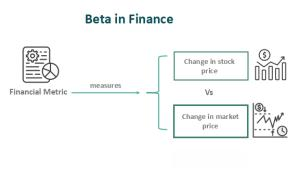

In the rapidly evolving financial landscape, investors are continually seeking innovative strategies to enhance returns while effectively managing risk. This search has led to the integration of three pivotal components: investing finance, beta measures, and algorithmic trading. Each of these elements plays a unique role in facilitating sophisticated investment strategies that can adapt to market fluctuations and investor objectives.

Understanding beta is essential for investors aiming to assess the volatility and risk of financial instruments in relation to the broader market. Beta, a key metric in the Capital Asset Pricing Model (CAPM), quantifies an asset's sensitivity to market movements, allowing investors to gauge potential risk exposure. By comparing a specific investment's beta value with the market as a whole (where the market beta is typically set at 1), investors can classify assets as more or less volatile than the market average. For example, a beta greater than 1 suggests higher volatility and potential return relative to the market, whereas a beta less than 1 indicates lesser volatility.



On the other hand, algorithmic trading has fundamentally transformed investment execution through its use of computerized methodologies. These algorithms process vast quantities of data at high speeds, executing trades based on predetermined criteria with remarkable precision. This has significantly reduced human error, increased execution speed, and enhanced the consistency of trading strategies. Originating in the 1970s along with the advent of computer systems, algorithmic trading has evolved alongside advancements in technology and data analysis techniques, paving the way for more complex and effective trading models.

The interplay between beta measures and algorithmic trading is central to the development of sophisticated trading strategies. By harnessing the analytical power of algorithms and the risk assessment capabilities of beta, investors can create nuanced strategies that balance risk and return in alignment with market conditions. This symbiotic relationship allows for a more targeted approach to investing, promising enhanced risk management and improved returns.

In concluding this introduction, the convergence of beta analytics and algorithmic trading represents a significant opportunity for investors seeking to navigate the complex financial landscape more effectively. As we explore these concepts further, the multifaceted dynamics of their integration will become apparent, underscoring the potential they hold for shaping modern investment strategies.

## Table of Contents

## Understanding Beta in Finance

Beta is a quantitative measure that indicates how the price of an investment moves relative to the overall market, serving as a crucial tool for understanding risk and volatility in finance. Within the context of the Capital Asset Pricing Model (CAPM), beta is employed to assess a security's systematic risk, which is the inherent risk that affects the entire market or market segment.

Mathematically, beta can be expressed through the following formula:

$$
\beta = \frac{\text{Cov}(r_i, r_m)}{\text{Var}(r_m)}
$$

Where:
- $r_i$ is the return of the asset.
- $r_m$ is the return of the market.
- $\text{Cov}(r_i, r_m)$ represents the covariance between the asset returns and market returns.
- $\text{Var}(r_m)$ denotes the variance of the market returns.

A beta greater than one suggests that the investment is more volatile than the broader market. Such an investment would typically experience larger fluctuations, both gains and losses, compared to the market index. This characteristic is often observed in start-ups or technology companies, which are known for their high [volatility](/wiki/volatility-trading-strategies) and potential for substantial returns in response to market movements.

Conversely, a beta of less than one indicates that the investment is less volatile than the market. Utilities and other stable industries often exhibit low-beta values due to their lesser price fluctuations and consistent performance, offering a more conservative risk profile.

Beta is calculated using historical price data, making it a backward-looking metric. Despite this, it remains instrumental in decision-making processes, helping investors align their portfolios with their risk tolerance levels. By understanding beta, investors can better evaluate and manage the inherent risks associated with their specific stock selections, ensuring their investments align with broader financial goals.

Using programming, such as Python, beta can be calculated with financial data libraries like `pandas` and `numpy` to perform data analysis and regression operations.

```python
import numpy as np
import pandas as pd

def calculate_beta(asset_returns, market_returns):
    covariance_matrix = np.cov(asset_returns, market_returns)
    covariance_asset_market = covariance_matrix[0, 1]
    variance_market = covariance_matrix[1, 1]
    beta = covariance_asset_market / variance_market
    return beta

# Example usage with historical data
# asset_returns and market_returns are pandas Series of historical returns
# asset_returns = pd.Series(...)
# market_returns = pd.Series(...)
# beta_value = calculate_beta(asset_returns, market_returns)
```

This code snippet illustrates how beta can be calculated using numpy and pandas, highlighting the practical application of beta in portfolio management and investment analysis.

## Algorithmic Trading: Revolutionizing Financial Markets

Algorithmic trading leverages advanced computer algorithms to execute financial trades based on predefined criteria, significantly enhancing efficiency and precision in financial markets. This form of trading emerged in the 1970s with the integration of computer systems into financial markets and has since evolved in parallel with technological advancements and data analytics capabilities.

In its infancy, [algorithmic trading](/wiki/algorithmic-trading) systems were relatively simple, primarily tasked with executing orders at optimal prices and times to reduce transaction costs. As technology advanced, these systems grew more complex, capable of executing sophisticated trading strategies like statistical [arbitrage](/wiki/arbitrage), which seeks to exploit price differentials between securities.

One of the major advantages of algorithmic trading is the reduction of human intervention. By automating the trading process, algorithms can execute trades at speeds and frequencies that are impossible for human traders, thus capitalizing on short-lived market inefficiencies. This automation leads to rapid executions and consistent strategy implementations, enhancing market [liquidity](/wiki/liquidity-risk-premium) and contributing to more efficient price discovery.

A significant development in algorithmic trading is the integration of complex strategies such as Smart Beta. These strategies aim to systematically capture specific risk factors to construct portfolios with potentially enhanced returns relative to traditional market indices. By employing rule-based approaches, Smart Beta strategies blend the advantageous elements of both active and passive investing, making them an attractive proposition in the algorithmic trading landscape.

In conclusion, algorithmic trading has revolutionized financial markets by harnessing the power of technology to streamline trade execution and implement sophisticated strategies. As this field continues to evolve, it presents new opportunities for innovation and refinement, promising further enhancements in trading efficiency and market dynamics.

## The Role of Beta in Algorithmic Trading

Understanding beta is pivotal in algorithmic trading because it serves as a key metric for balancing risk and return in trading strategies. Beta measures an asset's volatility relative to a market index. For instance, a stock with a beta of 1.5 is theoretically 50% more volatile than the market. This insight helps algorithms make informed decisions about asset selection, focusing on those with volatility profiles aligning with specified risk thresholds.

The integration of beta into algorithmic platforms often takes the form of Smart Beta strategies. These strategies employ systemic rules for asset selection and weighting, transcending traditional passive investment approaches. Smart Beta leans on risk factors—such as size, value, [momentum](/wiki/momentum), and quality—that history suggests can deliver superior risk-adjusted returns. The calculated application of beta within Smart Beta frameworks facilitates enhanced portfolio diversification and improved return potential.

In practice, algorithms can be designed to automate the process of stock selection based on beta values. For example, an algorithm can target stocks with specific beta ranges to construct a balanced portfolio. Below is a simple Python function demonstrating how one might filter stocks based on beta values. This code snippet assumes a list of stocks with their corresponding beta values:

```python
def filter_stocks_by_beta(stocks, beta_min, beta_max):
    """
    Filters stocks based on beta range.

    :param stocks: List of tuples containing stock symbol and beta value.
    :param beta_min: Minimum beta value.
    :param beta_max: Maximum beta value.
    :return: List of stock symbols within the specified beta range.
    """
    return [stock[0] for stock in stocks if beta_min <= stock[1] <= beta_max]

# Example usage
stocks = [('AAPL', 1.2), ('MSFT', 0.8), ('TSLA', 1.6), ('GE', 1.1)]
selected_stocks = filter_stocks_by_beta(stocks, 1.0, 1.5)
print("Selected stocks:", selected_stocks)
```

Implementing beta in a rules-based framework like this supports smart portfolio management by dynamically aligning risk profiles with investor objectives. The deployment of Smart Beta strategies via algorithmic platforms provides investors with sophisticated tools to optimize exposures to desired risk factors, ultimately facilitating more efficient capital allocation.

## Smart Beta: Enhancing Returns and Risk Management

Smart Beta strategies have become increasingly prominent in investment practices, offering a systematic method to capture specific risk factors and consequently enhance portfolio returns beyond traditional market indices. These strategies typically involve a rule-based approach, focusing on targeted [factor](/wiki/factor-investing) exposure and include regular rebalancing to maintain optimal factor weights.

At their core, Smart Beta strategies aim to mitigate concentration risk and afford investors the flexibility to adjust risk exposure in response to shifting market conditions. By employing a set of predefined rules, these strategies seek to deliver more predictable outcomes while optimizing for factors typically overlooked in market cap-weighted index investing.

Several standard factors are commonly employed in Smart Beta strategies, including value, momentum, size, low volatility, and quality. Each of these factors is designed to exploit distinct market inefficiencies:

1. **Value** aims to capture the premium associated with stocks that are undervalued relative to their intrinsic worth.
2. **Momentum** leverages the tendency of stocks that have performed well to continue performing well in the near term.
3. **Size** focuses on smaller firms that often generate higher returns, albeit with increased risk.
4. **Low Volatility** seeks to attain higher risk-adjusted returns by investing in stocks with lower-than-average volatility.
5. **Quality** targets companies with strong financial health, including robust balance sheets and consistent earnings.

The integration of these factors into algorithmic platforms empowers traders to dynamically adjust portfolios in response to market fluctuations. Through the application of algorithms, portfolios can be continuously aligned with current market conditions, taking advantage of real-time data analysis and execution.

For example, a basic implementation of a momentum strategy in Python could involve the following steps:

```python
import pandas as pd
import numpy as np
import yfinance as yf  # For more datasets, visit: https://paperswithbacktest.com/datasets

def calculate_momentum(stock, start, end):
    data = yf.download(stock, start=start, end=end)
    data['Returns'] = data['Adj Close'].pct_change()
    momentum = data['Returns'].rolling(window=12).mean()
    return momentum

start_date = '2021-01-01'
end_date = '2022-01-01'
stock_symbol = 'AAPL'

momentum_scores = calculate_momentum(stock_symbol, start_date, end_date)
print(momentum_scores.tail())
```

This script demonstrates a simple momentum calculation based on rolling average returns. Such algorithms, when fine-tuned and incorporated into trading strategies, can rapidly adapt to market shifts.

Smart Beta strategies, when combined with algorithmic trading, provide a robust framework for achieving enhanced returns and comprehensive risk management. This combination facilitates the systematic, data-driven exploration of market opportunities, thereby enabling investors to respond proactively to the ever-evolving financial landscape.

## Implications and Challenges of Integrating Smart Beta and Algo Trading

The integration of Smart Beta with algorithmic trading systems offers significant potential for enhancing decision-making efficiency and portfolio diversification. By systematically incorporating specific risk factors, Smart Beta strategies can enable algorithmic trading platforms to optimize asset selection and weighting. However, this integration does present several challenges.

One primary concern is the risk of overfitting models. In the context of Smart Beta and algorithmic trading, overfitting occurs when a model is excessively complex, capturing noise rather than the underlying market signals. This can result in models that perform well on historical data, but poorly in real-time trading. A robust approach to mitigate overfitting is to employ out-of-sample testing and cross-validation techniques to ensure model generalizability.

Maintaining factor performance across changing market conditions is another challenge. Market dynamics are not static, and the efficacy of factors such as value, momentum, or low volatility can fluctuate over time. Continuous monitoring and adjustment of factor portfolios are essential to maintain performance. Algorithmic systems may need to implement [machine learning](/wiki/machine-learning) algorithms that adapt to these shifts dynamically. For example, [reinforcement learning](/wiki/reinforcement-learning) techniques can be useful to refine strategies in real-time based on market feedback.

Data quality assurance is critical in algorithmic trading operations. High-quality data inputs are necessary for accurate model predictions and decision-making. This requires constant vigilance in data validation, cleansing, and updating processes. Poor data quality can lead to erroneous insights and trading decisions, adversely affecting performance.

Regulatory compliance is essential to ensure transparency and fairness in algorithmic trading operations. Financial markets are subject to regulatory standards that may vary across jurisdictions. Traders must ensure that their algo trading systems comply with regulations such as the European Union's MiFID II (Markets in Financial Instruments Directive) or the U.S. Securities and Exchange Commission rulings. These standards are designed to promote market integrity and protect investors.

Ethical considerations are also paramount. Rapid trading facilitated by algorithms can impact market liquidity and volatility, potentially leading to adverse outcomes for certain market participants. Ensuring fair treatment of all participants, including retail investors who may not have access to sophisticated trading technology, is a key ethical responsibility.

Continuous innovation in technology and strategy evaluation is necessary to maintain a competitive edge in algorithmic trading. As technological advancements like [artificial intelligence](/wiki/ai-artificial-intelligence) and machine learning continue to evolve, traders must remain proactive in updating and refining their trading models. This involves not only embracing new technologies but also critically assessing their impact on strategy performance and market behavior.

In summary, while the integration of Smart Beta strategies within algorithmic trading platforms offers enhanced portfolio management capabilities, it also necessitates careful consideration of model robustness, regulatory compliance, ethical implications, and ongoing technological innovation.

## Future Trends in Smart Beta and Algorithmic Trading

The future of Smart Beta and algorithmic trading is increasingly influenced by advancements in artificial intelligence (AI), machine learning, and enhanced data analysis technologies. These innovations are transforming the way trading strategies are developed and executed, emphasizing the growing importance of dynamic and adaptive systems.

AI and machine learning have significantly improved pattern recognition capabilities, enabling more sophisticated predictive modeling. These technologies can analyze vast datasets at high speeds, uncovering complex patterns and correlations that were previously difficult to identify. By leveraging these insights, traders can refine their strategy implementations, enhancing both the precision and effectiveness of trading algorithms.

As technological innovations progress, they offer the potential for greater market efficiency and liquidity. Automated systems can execute trades at speeds and volumes beyond human capability, reducing transaction costs and enhancing market responsiveness. However, these advancements also introduce complexities, such as increased system dependencies and the need for robust risk management mechanisms to mitigate potential disruptions.

Emerging trends indicate a heightened focus on adapting strategies to the evolving conditions of financial markets. This adaptability is crucial, as markets are influenced by numerous factors, including geopolitical events, regulatory changes, and economic cycles. AI-driven models can be trained to dynamically adjust strategies in response to these variables, enabling traders to maintain a competitive edge.

To effectively harness these opportunities, traders must remain proactive. This entails continually updating and validating algorithms, ensuring that models remain relevant and accurate in light of shifting market dynamics. Moreover, there is a need to address challenges such as data quality, algorithmic transparency, and ethical considerations related to market impacts and participant equality.

In conclusion, as AI, machine learning, and data analytics continue to evolve, they are poised to significantly shape the future of Smart Beta and algorithmic trading. Embracing these technologies while managing their complexities will be vital for traders and investors aiming to optimize their strategies and maintain a competitive stance in the modern financial landscape.

## Conclusion

The convergence of beta, algorithmic trading, and Smart Beta strategies offers a transformative landscape for investors aiming to achieve superior returns while effectively managing risk. Algorithmic trading platforms, enhanced with Smart Beta methodologies, provide the means to target specific factors with precision, thereby tailoring investment outcomes to align more closely with investors' specific goals and risk appetites. These platforms leverage data-driven decision-making to optimize timing and asset allocation, potentially offering returns above those of traditional market indices.

Investors and traders are encouraged to embrace these methodologies, given their potential benefits. However, it is vital to balance these with an awareness of the associated risks and responsibilities. The rapid execution and automated decision-making inherent in algorithmic trading demand rigorous model testing and validation to prevent overfitting and ensure consistent performance across varying market conditions. Additionally, the ethical implications of algorithmic trading, such as market impact and fairness, must be taken into account to maintain market integrity.

By leveraging the combined power of beta, algorithmic trading, and Smart Beta strategies, market participants can more effectively navigate the ever-changing financial landscape. These tools offer the agility and precision needed to exploit market opportunities and mitigate risks promptly. However, the dynamic nature of modern markets necessitates continuous exploration and adaptation in strategy design. Investors and traders must be prepared to innovate continually, refining their approaches to thrive in the competitive and fast-paced world of contemporary finance. This ongoing commitment to strategy evolution and innovation is crucial for maintaining a competitive edge and achieving sustained success in investment endeavors.

## References & Further Reading

[1]: Fama, E. F., & French, K. R. (1992). ["The Cross‐Section of Expected Stock Returns."](https://www.jstor.org/stable/2329112) The Journal of Finance, 47(2), 427-465.

[2]: Sharpe, W. F. (1964). ["Capital Asset Prices: A Theory of Market Equilibrium under Conditions of Risk."](https://onlinelibrary.wiley.com/doi/full/10.1111/j.1540-6261.1964.tb02865.x) The Journal of Finance, 19(3), 425-442.

[3]: Fishburn, P. C. (1977). ["Mean-Risk Analysis with Risk Associated with Below-Target Returns."](https://www.semanticscholar.org/paper/Mean-Risk-Analysis-with-Risk-Associated-with-Fishburn/1fc67913110f2818485c1b9de937606927779e45) The American Economic Review, 67(2), 116-126.

[4]: ["Algorithmic Trading and DMA: An Introduction to Direct Access Trading Strategies"](https://www.amazon.com/Algorithmic-Trading-DMA-introduction-strategies/dp/0956399207) by Barry Johnson

[5]: ["Quantitative Equity Portfolio Management: An Active Approach to Portfolio Construction and Management"](https://www.amazon.com/Quantitative-Equity-Portfolio-Management-Second/dp/1264268920) by Ludwig B. Chincarini and Daehwan Kim

[6]: Mullainathan, S., & Spiess, J. (2017). ["Machine learning: An applied econometric approach."](https://www.aeaweb.org/articles?id=10.1257/jep.31.2.87) Journal of Economic Perspectives, 31(2), 87-106.

[7]: Jegadeesh, N., & Titman, S. (1993). ["Returns to Buying Winners and Selling Losers: Implications for Stock Market Efficiency."](https://www.jstor.org/stable/2328882) The Journal of Finance, 48(1), 65-91.