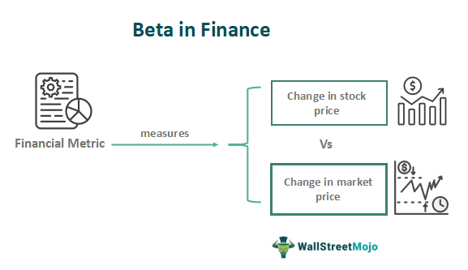

In the world of finance, investment strategies are constantly evolving to maximize returns while minimizing risks. These strategies are shaped by a deep understanding of financial concepts and the application of advanced technologies. One of the key concepts in understanding investment risk is 'beta'. Beta measures the volatility of an asset in relation to the market as a whole. It acts as an indicator of the risk associated with a particular asset, providing insight into how much that asset's price might fluctuate compared to market movements. Assets with higher beta values typically exhibit greater volatility and potentially higher returns, while assets with lower beta values tend to be more stable.

Another significant aspect of modern investing is algorithmic trading, often referred to as algo trading. This method leverages computer programs to execute trades at high speed and frequency based on predetermined criteria. By analyzing vast datasets rapidly, algorithmic trading can capitalize on market inefficiencies that might be imperceptible to human traders. This technological approach reduces the likelihood of human errors and emotional biases, leading to potentially improved profitability and efficiency in trading.

This article explores the interconnectedness of investment risk, beta, and algo trading, and how they collectively influence investment decisions. By considering the role of beta in assessing asset volatility and the implementation of algorithmic trading to optimize trade execution, a comprehensive picture of modern financial strategies emerges. We aim to provide insights into how these elements are shaping the modern financial landscape, offering investors a framework to navigate the complexities of contemporary markets effectively.

## Table of Contents

## Understanding Investment Risk

Investment risk refers to the possibility of losing money on an investment and is an inherent aspect of the investment process. It stems from various uncertainties that can affect the financial markets and the value of assets. Broadly, these risks can be categorized into different types, including market risk, credit risk, and liquidity risk.

Market risk, also known as systematic risk, arises from factors that affect the entire market, such as economic changes, political events, or natural disasters. This type of risk is unavoidable through diversification and impacts all investments within a particular market or market segment. Investors often use strategies like hedging or derivatives to mitigate market risk.

Credit risk, on the other hand, is the danger of loss arising from a borrower failing to repay a loan or meet contractual obligations. It predominantly affects fixed-income investments, such as bonds. The creditworthiness of issuers is evaluated using credit ratings, which help in assessing the likelihood of default. Investors can manage credit risk by diversifying their holdings across multiple issuers or by focusing on high-quality, creditworthy entities.

Liquidity risk pertains to the difficulty of converting an asset into cash without significant loss in value. This risk is particularly relevant for assets that do not have a robust secondary market, making it challenging to sell them quickly. Managing [liquidity](/wiki/liquidity-risk-premium) risk involves ensuring a balanced portfolio with a mix of readily marketable securities and less liquid investments, thereby maintaining the ability to meet financial obligations.

To address these challenges, investors employ various risk assessment tools and strategies to mitigate potential losses while aiming to achieve their target returns. One common tool is the Value at Risk (VaR) model, which estimates the maximum potential loss over a specific time period at a given confidence level. By understanding the range of possible outcomes, investors can set risk limits, adjust portfolio allocations, and implement stop-loss orders to protect against excessive losses.

Investors often balance risk with potential reward by tailoring strategies to suit their risk tolerance. This involves constructing portfolios that align with their financial goals, investment horizon, and risk appetite. For instance, risk-averse investors may prefer a portfolio tilted towards bonds and blue-chip stocks, while risk-tolerant investors might opt for a heavier concentration in high-growth equities or emerging markets.

Understanding and managing risk is crucial for long-term investment success. By comprehensively evaluating and addressing the various risks associated with investments, individuals and institutions can enhance their ability to preserve capital, optimize returns, and navigate the complexities of financial markets. In this evolving landscape, continued education and adaptation are essential to effectively manage investment risk and capitalize on opportunities.

## What is Beta in Finance?

Beta is a financial metric that quantifies an asset's [volatility](/wiki/volatility-trading-strategies) compared to the overall market. The market is conventionally assigned a beta value of 1. Beta values are instrumental in identifying the relative movement of an asset and its sensitivity to market fluctuations. 

Assets with a beta greater than 1 are characterized by higher volatility, indicating they are more responsive to market changes. These assets are thus perceived as riskier, but they also promise the potential for higher returns. Conversely, assets with a beta less than 1 exhibit lower volatility and are considered less risky, often leading to steadier, albeit smaller, returns.

The calculation of beta involves statistical analysis, typically using regression techniques. The formula for beta $(\beta)$ is:

$$
\beta = \frac{{\text{Covariance}(\text{Asset Return}, \text{Market Return})}}{{\text{Variance}(\text{Market Return})}}
$$

This formula calculates beta by dividing the covariance of the asset's returns with the market returns by the variance of the market returns. The resulting beta value helps investors ascertain how changes in the market might affect the asset's price.

Investors leverage beta to evaluate the risk and expected return of a portfolio. By understanding the beta of individual stocks within a portfolio, they can determine the overall risk profile and make informed decisions to optimize diversification. A diversified portfolio typically balances assets of varying betas to align with an investor's risk tolerance while achieving desired financial outcomes.

Overall, beta is a vital tool for managing investment risk, enabling investors to make informed decisions regarding asset selection and portfolio construction. Understanding this metric is crucial for navigating the complexities of market dynamics and enhancing portfolio performance.

## The Rise of Algorithmic Trading

Algorithmic trading, often referred to as 'algo trading', has become a significant force within the financial markets. It utilizes computer-based algorithms to execute trades with precision and speed, adhering to predefined criteria. The primary advantage of these algorithms is their ability to process and analyze vast datasets at remarkable speeds, enabling traders to take advantage of market inefficiencies that may be undetectable to human traders.

Such efficiency reduces the likelihood of human error and mitigates the influence of emotional bias on trading decisions, potentially leading to enhanced profitability. By adhering to strict rules and leveraging computational power, [algorithmic trading](/wiki/algorithmic-trading) systems can execute orders at the most favorable times, respond swiftly to market changes, and manage large volumes of trades with minimal human intervention.

Algo trading has a broad application across various financial markets, encompassing stocks, commodities, and [forex](/wiki/forex-system) trading. This widespread adoption is a testament to its effectiveness in expanding liquidity and improving market efficiency. The capacity of algorithms to adapt to various market conditions has made them indispensable in today's fast-paced trading environment.

The rapid evolution of technology and advances in data analytics have been pivotal in the expansion and sophistication of algorithmic trading. As computational power continues to increase and data processing becomes more refined, algorithmic trading systems are becoming increasingly complex, incorporating [machine learning](/wiki/machine-learning) and [artificial intelligence](/wiki/ai-artificial-intelligence) to further optimize strategy execution. This technological progression enables the continual refinement of algorithms to adapt to new data inputs and market conditions, enhancing their decision-making capabilities and overall effectiveness.

In conclusion, the integration of sophisticated technologies in trading algorithms underscores their expanding role in the modern financial ecosystem. As they continue to evolve, these algorithms will likely remain at the forefront of trading strategies, leveraging their unparalleled speed and efficiency to navigate the ever-changing landscape of financial markets.

## The Interplay Between Beta and Algo Trading

Beta serves as a pivotal component in numerous algorithmic trading models, shaping strategies that rely on market dynamics. It measures an asset's relative volatility compared to the market and thereby informs trading algorithms on the expected response of a stock to market changes. In essence, algorithms utilize beta to optimize trade execution, ensuring alignment with specified risk-return targets.

In practice, this involves leveraging beta values to fine-tune the algorithms that dictate trading decisions. For instance, a high beta stock may predictably exhibit larger price swings in response to market movements, which an algorithm can exploit for potential higher returns. Conversely, low beta stocks offer a more stable outlook, appealing to risk-averse strategies focused on capital preservation.

These algorithmic models adeptly adjust investment positions by continuously monitoring real-time beta fluctuations and corresponding market conditions. By adapting to these changes, they can modify trading parameters such as entry and [exit](/wiki/exit-strategy) points, position sizing, and stop-loss thresholds. This dynamic adjustment aids in maintaining an optimal balance between taking advantage of short-term market opportunities and managing longer-term investment risks.

Integrating beta into algorithmic trading frameworks can significantly enhance performance and bolster risk management efforts. Through precise and systematic application, algorithms can achieve a more refined risk-return tradeoff, catering to diverse investment objectives. This process not only maximizes potential gains but also mitigates exposure to adverse market shifts.

The synergy between beta and algorithmic trading exemplifies a broader technological shift in investment strategies. It underscores how modern technologies are reshaping conventional approaches by providing quantitative tools that improve precision in decision-making. This interplay highlights the evolving landscape of finance, where data-driven insights and advanced computational techniques pave the way for more nuanced and effective investment strategies.

## Challenges and Considerations

Algorithmic trading, while offering significant advantages such as increased speed and reduced human error, presents a unique set of challenges. One primary concern is the risk of technical failures. In an environment where milliseconds count, system malfunctions can lead to substantial financial losses. Technical issues may range from simple connectivity problems to complex algorithmic errors that misinterpret market data, resulting in erroneous trades.

Market volatility further compounds these risks. Algorithms designed to respond to typical market conditions may struggle under unexpected volatility, leading to suboptimal trading decisions. This can cause rapid price movements, sometimes exacerbating volatility through mechanisms such as feedback loops.

Regulatory oversight is critically important in maintaining fair and transparent markets, as the high-speed nature of algorithmic trading can sometimes facilitate manipulative practices like spoofing, where false orders are placed to mislead other traders. Regulatory bodies such as the U.S. Securities and Exchange Commission (SEC) have implemented rules to curb such practices, ensuring that market integrity is upheld.

Investors engaging in algorithmic trading must carefully consider their risk tolerance. Algorithmic models, while sophisticated, are inherently based on historical data and assumptions, which may not hold true under all market conditions. Therefore, ongoing evaluation and adaptation of these models are necessary to ensure their continued relevance and effectiveness.

Continuous monitoring and adjustment of trading strategies are also crucial. As financial markets and technologies evolve, so must the algorithms. Incorporating real-time data analysis and updates into their strategies helps investors respond swiftly to changing market dynamics.

Staying informed about technological advancements and regulatory changes is vital for investors involved in algorithmic trading. As technology evolves, it opens new possibilities for refining trading algorithms, while regulatory frameworks adapt to ensure ethical trading practices. Thus, continuous learning and proactive strategy adjustment become essential components of effective algorithmic trading.

## Conclusion

In the contemporary financial landscape, the integration of investment risk, beta, and algorithmic trading has significantly transformed investment strategies. Understanding these concepts is essential for both novice and seasoned investors seeking to navigate complex markets effectively. As technology continues to advance, the role of beta as a crucial input in trading algorithms is expected to grow. This enhancement facilitates better alignment of investment decisions with desired risk-return profiles.

Investors who skillfully manage risk and harness the power of algorithmic tools can potentially achieve improved financial outcomes. Algorithmic trading's ability to process large datasets rapidly and make calculated investment decisions offers an edge over traditional methods. The incorporation of beta into these algorithms enables dynamic adjustment of investment positions. This adaptability is crucial when responding to market fluctuations and optimizing trade execution.

The trajectory of investing is becoming increasingly data-driven, highlighting the necessity for continuous learning and adaptation. As algorithms gain complexity and predictive capabilities, investors must stay informed about technological innovations and evolving market regulations. This proactive approach will be critical in leveraging algorithmic trading and risk management tools to achieve successful investment outcomes in the future.

## References & Further Reading

[1]: ["Advances in Financial Machine Learning"](https://www.amazon.com/Advances-Financial-Machine-Learning-Marcos/dp/1119482089) by Marcos Lopez de Prado

[2]: ["Evidence-Based Technical Analysis: Applying the Scientific Method and Statistical Inference to Trading Signals"](https://www.amazon.com/Evidence-Based-Technical-Analysis-Scientific-Statistical/dp/0470008741) by David Aronson

[3]: ["Machine Learning for Algorithmic Trading"](https://github.com/stefan-jansen/machine-learning-for-trading) by Stefan Jansen

[4]: ["Quantitative Trading: How to Build Your Own Algorithmic Trading Business"](https://www.amazon.com/Quantitative-Trading-Build-Algorithmic-Business/dp/1119800064) by Ernest P. Chan