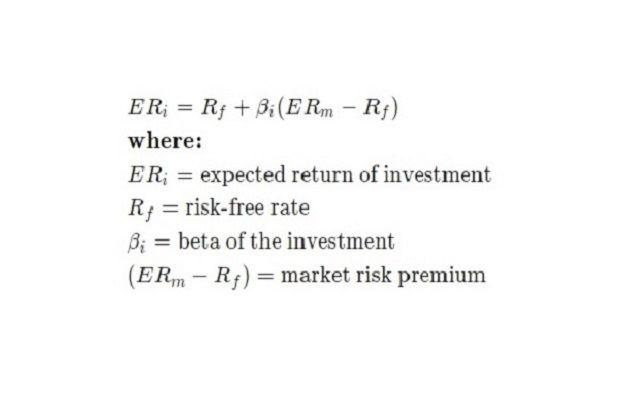

## Table of Contents

## What is beta in the context of stock market analysis?

In the context of stock market analysis, beta is a measure of a stock's volatility in relation to the overall market. It helps investors understand how much a stock's price might move compared to the market as a whole. A beta of 1 means the stock's price tends to move with the market. If a stock has a beta greater than 1, it's considered more volatile than the market, meaning it could go up or down more than the market does. On the other hand, a beta less than 1 suggests the stock is less volatile and might not move as much as the market.

Beta is useful for investors who want to gauge the risk of a stock. For example, if you're looking for a safer investment, you might choose a stock with a low beta, because it won't swing as wildly as the market. Conversely, if you're willing to take on more risk for potentially higher returns, you might look for stocks with a high beta. Remember, though, that beta is just one tool among many, and it doesn't predict future performance—it just gives you an idea of past volatility relative to the market.

## How is beta calculated for a stock?

Beta is calculated by comparing the returns of a stock to the returns of the overall market, usually represented by a broad market index like the S&P 500. To start, you need historical price data for both the stock and the market index over a certain period, like five years. Then, you calculate the returns for each period, which is simply the percentage change in price from one period to the next. After you have the returns, you find the average return for both the stock and the market.

Next, you use a statistical tool called regression analysis to find the beta. In this analysis, the stock's returns are the dependent variable, and the market's returns are the independent variable. The beta is the slope of the regression line, which shows how the stock's returns move with the market's returns. If the stock's returns move exactly with the market, the beta will be 1. If the stock moves more than the market, the beta will be greater than 1, and if it moves less, the beta will be less than 1. This calculation gives investors a simple way to understand a stock's risk relative to the market.

## What does a beta value greater than 1 indicate about a stock's market risk?

A beta value greater than 1 means a stock is more sensitive to market movements than the average stock. If the market goes up, this stock is likely to go up even more. And if the market goes down, the stock might drop more than the market does. This makes the stock riskier because its price can swing a lot.

Investors who like to take more risks might choose stocks with a beta over 1 because they could get bigger rewards. But they should be ready for bigger losses too. It's important to remember that beta is just one way to measure risk and it looks at the past, not the future. So, it's helpful but not perfect for deciding which stocks to buy.

## Can beta be negative, and if so, what does it signify?

Yes, beta can be negative. A negative beta means that a stock moves in the opposite direction of the market. So, if the market goes up, a stock with a negative beta might go down, and if the market goes down, the stock might go up.

This is pretty rare and usually happens with things like gold or some types of bonds. Investors might like these stocks if they want to balance out their portfolio, because they can help protect against market drops. But it's important to know that a negative beta doesn't mean a stock is safe or a sure bet; it just means it moves differently than the market.

## How does beta relate to the overall market's volatility?

Beta is a number that shows how much a stock's price goes up and down compared to the whole market. The market's ups and downs are usually measured by a big index like the S&P 500. If a stock has a beta of 1, it means the stock moves just like the market. So, if the market goes up by 10%, the stock also goes up by about 10%. If the market goes down by 5%, the stock goes down by about 5% too.

But if a stock has a beta higher than 1, it means the stock is more jumpy than the market. For example, if a stock has a beta of 1.5 and the market goes up by 10%, the stock might go up by 15%. And if the market goes down by 5%, the stock might drop by 7.5%. On the other hand, a stock with a beta less than 1 is less jumpy. If a stock has a beta of 0.5 and the market goes up by 10%, the stock might only go up by 5%. If the market goes down by 5%, the stock might only go down by 2.5%.

## What are the limitations of using beta as a measure of risk?

Beta is a helpful tool, but it has some limits. It looks at how a stock moved in the past compared to the market. But the past doesn't always tell us what will happen in the future. A stock might have a low beta now, but that doesn't mean it won't become more risky later. Also, beta only measures how a stock moves with the market, not other kinds of risks like company problems or changes in the economy.

Another thing to think about is that beta doesn't tell the whole story about a stock's risk. It doesn't look at things like how much a company owes or how well it's run. And beta can be different depending on which time period you look at or which market index you use. So, while beta can give you a quick idea of how risky a stock might be compared to the market, it's not the only thing you should look at when deciding if a stock is right for you.

## How can investors use beta to build a diversified portfolio?

Investors can use beta to build a diversified portfolio by choosing stocks with different beta values. If you mix stocks with high betas, which move a lot with the market, and stocks with low betas, which don't move as much, you can balance out the risk. For example, if the market goes down, the high beta stocks might drop a lot, but the low beta stocks won't drop as much, helping to protect your portfolio. This way, you're not putting all your money into stocks that act the same way.

You can also look for stocks with negative betas to add to your mix. These stocks move in the opposite direction of the market, so when the market goes down, they might go up. Adding a few of these can help cushion your portfolio against big market drops. But remember, beta is just one piece of the puzzle. You should also look at other things like how the company is doing, what industry it's in, and how it fits with the rest of your investments to make sure your portfolio is truly diversified.

## What other factors should investors consider alongside beta when assessing market risk?

When investors look at beta to understand a stock's risk, they should also think about other things. One important thing is the company's financial health. This means looking at how much money the company makes, how much it owes, and if it can pay its bills. Another thing to consider is the industry the company is in. Some industries, like technology, can be more risky because they change a lot and face a lot of competition. Other industries, like utilities, might be more stable but grow more slowly.

Investors should also pay attention to the overall economy. If the economy is doing well, companies might do better, but if it's not, they might struggle. Things like interest rates, inflation, and unemployment can all affect how stocks do. It's also a good idea to look at the company's management team. Good leaders can help a company do well even when times are tough. So, while beta gives you a quick idea of how a stock might move with the market, these other factors can help you get a fuller picture of the risks involved.

## How does the concept of beta apply to different sectors of the market?

Beta can be different for different parts of the market, or sectors. Some sectors, like technology and biotech, often have higher betas. This means the stocks in these sectors can go up and down a lot more than the overall market. They're riskier because they're more sensitive to what's happening in the economy and can change quickly. On the other hand, sectors like utilities and consumer staples usually have lower betas. These stocks don't move as much as the market because people always need things like electricity and basic food items, so these companies are more stable.

When investors look at beta for different sectors, they can see how risky each part of the market is compared to the whole market. If you want to take more risks and maybe get bigger rewards, you might put more money into sectors with high betas. But if you want to be safer, you might choose sectors with low betas. It's important to remember that while beta can give you a quick idea of risk, it's just one piece of the puzzle. You should also think about other things like how well the companies in a sector are doing and what's happening in the economy.

## What is the difference between systematic and unsystematic risk in relation to beta?

Systematic risk is the kind of risk that affects the whole market and can't be avoided just by [picking](/wiki/asset-class-picking) different stocks. It's things like changes in the economy, interest rates, or big world events. Beta measures this kind of risk because it shows how much a stock moves with the market. If a stock has a high beta, it means it's more sensitive to these big changes and has more systematic risk. If it has a low beta, it's less sensitive and has less systematic risk.

Unsystematic risk, on the other hand, is the risk that's specific to one company or a small group of companies. It's things like a company's management problems, a new competitor, or a product that doesn't sell well. Beta doesn't measure this kind of risk because it's about how a stock moves with the market, not what's happening inside the company. To lower unsystematic risk, investors can spread their money across different companies and sectors, which is called diversification. This way, if one company does badly, it won't hurt the whole portfolio as much.

## How do financial analysts adjust beta for specific investment strategies?

Financial analysts might adjust beta to fit specific investment strategies by looking at different time periods or using different market indexes. For example, if an analyst wants to see how a stock has acted over the last year instead of the usual five years, they can calculate the beta using just that year's data. This can give a more up-to-date picture of the stock's risk. Also, if an analyst is focusing on a different market, like the tech sector, they might use a tech-specific index instead of the S&P 500 to calculate beta. This helps them see how the stock moves compared to other tech stocks, which can be more useful for their strategy.

Another way analysts adjust beta is by using something called "leverage." If a company has a lot of debt, its stock might be riskier than its beta suggests. So, analysts might adjust the beta to account for this extra risk. They can also look at other factors like the company's size or how it's doing compared to others in its industry. By tweaking the beta this way, analysts can get a better idea of the stock's risk for their specific investment goals. This helps them make smarter choices about which stocks to buy or sell.

## What advanced statistical models can be used to enhance the traditional beta calculation for more accurate risk assessment?

To get a better idea of a stock's risk, financial analysts can use fancy math models that go beyond the simple beta calculation. One popular model is the Capital Asset Pricing Model (CAPM). CAPM looks at how much a stock's return depends on the market's return, but it also adds in a risk-free rate, like what you'd get from a safe investment like a government bond. This model helps analysts see if a stock is giving a good return for the risk it carries. Another model is the Multifactor Model, which looks at more than just the market's movements. It can include things like the size of the company, how much it's growing, and even the price of the stock compared to its earnings. By considering these extra factors, analysts can get a fuller picture of what might affect a stock's price.

Another advanced model is the Arbitrage Pricing Theory (APT), which looks at several different factors that can affect a stock's return. These factors could be things like inflation rates, changes in interest rates, or even how well the stock market is doing in other countries. APT helps analysts understand how these different forces might push a stock's price up or down. By using these models, analysts can make better guesses about how risky a stock might be and whether it fits well with their investment strategy. These models give a more detailed view of risk than just looking at beta alone, helping investors make smarter choices.

## What is the understanding of Market Risk and Beta?

Market risk, also known as systematic risk, refers to the unavoidable risk that impacts an entire market segment or the market as a whole. This type of risk arises from macroeconomic factors such as changes in interest rates, inflation, recessions, or political instability, which can cause widespread effects across all market participants. Unlike unsystematic risk, which is specific to individual companies or sectors, market risk cannot be mitigated through diversification.

Beta ($\beta$) is a statistical metric used to measure the [volatility](/wiki/volatility-trading-strategies) or systematic risk of a stock or portfolio in comparison to the overall market. It is a key component in the Capital Asset Pricing Model (CAPM), which assesses expected investment returns. A beta value indicates how much the price of a stock tends to move relative to the market. A beta greater than 1 suggests that the stock is more volatile than the market, meaning it tends to amplify market movements. Conversely, a beta less than 1 indicates that the stock is less volatile, moving less than the market.

The process of calculating beta involves a regression analysis of the historical returns of a stock relative to a benchmark index, such as the S&P 500. This can be mathematically expressed as:

$$
\beta = \frac{\text{Cov}(R_i, R_m)}{\text{Var}(R_m)}
$$

Where:
- $\text{Cov}(R_i, R_m)$ is the covariance between the returns of the stock ($R_i$) and the returns of the market ($R_m$).
- $\text{Var}(R_m)$ is the variance of the market returns.

In practical terms, this involves plotting the past returns of the stock against the past returns of the benchmark and fitting a line through the data points using linear regression. The slope of this line represents the stock's beta. The steps to calculate beta can be efficiently executed using computational tools like Python. An example implementation using Python's `statsmodels` library is outlined below:

```python
import pandas as pd
import numpy as np
import statsmodels.api as sm

# Example stock and market data
stock_returns = pd.Series([...])  # Substitute with historical stock returns
market_returns = pd.Series([...])  # Substitute with historical market index returns

# Adding constant for regression intercept
X = sm.add_constant(market_returns)
model = sm.OLS(stock_returns, X).fit()

# Beta is the coefficient of the market returns
beta = model.params[1]

print(f"Beta: {beta}")
```

This Python script shows how to perform the regression analysis required to determine the beta. It uses historical return data for both the stock and a benchmark index, conducting an ordinary least squares regression to find the beta coefficient. Understanding beta allows investors and portfolio managers to assess the riskiness of stocks relative to market movements, providing insights for better-informed investment decisions and risk management strategies.

## What are the steps to calculate beta?

To calculate beta, begin by gathering historical price data for the specific stock in question, as well as for a relevant benchmark index, such as the S&P 500. Historical price data can be acquired from financial data providers or platforms like Yahoo Finance or Bloomberg.

Next, compute the daily returns from this price data. Daily returns are determined by calculating the percentage change in price from one day to the next, expressed mathematically as:

$$
\text{Daily Return} = \left( \frac{\text{Price}_{t} - \text{Price}_{t-1}}{\text{Price}_{t-1}} \right) \times 100
$$

After calculating daily returns for both the stock and the benchmark index, use statistical tools like Python's `statsmodels` library to perform regression analysis. This step involves setting up a linear regression model where the dependent variable is the stock's returns and the independent variable is the benchmark index's returns.

The model can be represented by the formula:

$$
R_{\text{stock}} = \alpha + \beta R_{\text{benchmark}} + \epsilon
$$

where:
- $R_{\text{stock}}$ represents the return of the stock,
- $R_{\text{benchmark}}$ represents the return of the benchmark index,
- $\alpha$ denotes the intercept,
- $\beta$ represents the slope, which is the beta of the stock,
- $\epsilon$ is the error term.

To implement this calculation in Python, you may use the following code snippet:

```python
import numpy as np
import pandas as pd
import statsmodels.api as sm

# Example data
stock_returns = np.array([0.01, 0.02, -0.015, 0.03, -0.004])
benchmark_returns = np.array([0.005, 0.015, -0.01, 0.02, 0.001])

# Add a constant to the benchmark returns for the intercept term
benchmark_returns_with_const = sm.add_constant(benchmark_returns)

# Perform linear regression
model = sm.OLS(stock_returns, benchmark_returns_with_const)
results = model.fit()

# Extract beta
beta = results.params[1]
print(f"Beta: {beta}")
```

In this setup, `beta` is extracted as the regression slope, providing insights into how much the stock's return is expected to change in response to changes in the benchmark index. A beta greater than one suggests the stock is more volatile than the market, while a beta less than one implies it is less volatile. This quantitative measure is critical in understanding the stock's market responsiveness and guiding investment decisions.

## References & Further Reading

[1]: ["Advances in Financial Machine Learning"](https://www.amazon.com/Advances-Financial-Machine-Learning-Marcos/dp/1119482089) by Marcos Lopez de Prado

[2]: ["Quantitative Trading: How to Build Your Own Algorithmic Trading Business"](https://www.amazon.com/Quantitative-Trading-Build-Algorithmic-Business/dp/1119800064) by Ernest P. Chan

[3]: ["The Journal of Financial Markets"](https://www.sciencedirect.com/journal/journal-of-financial-markets) - A source of scholarly articles exploring financial market phenomena.

[4]: ["Algorithmic Finance"](https://www.iospress.com/catalog/journals/algorithmic-finance) - A journal featuring research on algorithmic trading and related financial technologies.

[5]: ["Financial Engineering and Risk Management"](https://www.coursera.org/specializations/financialengineering) by Columbia University on Coursera

[6]: ["Business Applications of Hypothesis Testing"](https://www.6sigma.us/six-sigma-in-focus/hypothesis-testing/) by David M. Levine and David F. Stephan - Discusses statistical testing methods which are relevant to beta calculations in finance.