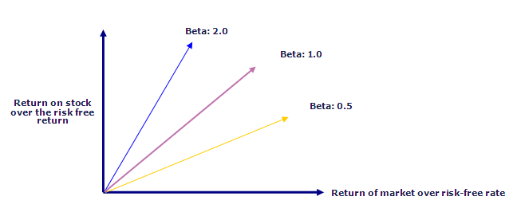

In the rapidly evolving world of finance, comprehending key metrics such as market risk, beta, and algorithmic trading is essential for making informed investment decisions. Market risk, sometimes called systematic risk, represents the inherent uncertainty that affects the entire financial market. It is crucial for investors to understand this risk when formulating investment strategies, as it cannot be mitigated simply through diversification.

Beta, a statistical measure reflecting a stock's volatility relative to the overall market, plays a significant role in evaluating market risk. It helps investors assess how much a stock price is expected to change in response to market movements. Stocks with a beta greater than one are considered more volatile than the market, while those with a beta less than one are less volatile. Calculating beta involves regression analysis of a stock's historical returns against a benchmark market index, such as the S&P 500, enabling investors to determine the stock's sensitivity to market changes.



Algorithmic trading, which uses advanced mathematical models and software to make trading decisions automatically, has become increasingly prevalent in modern finance. Integrating beta into algorithmic trading enhances risk management by allowing algorithms to adjust portfolios based on real-time beta calculations, thus improving trading efficiency and precision.

This article aims to explore the complexities of market risk, the calculation and significance of beta, and the integration of these concepts into algorithmic trading strategies. It also highlights important considerations for traders and investors, including the limitations of relying solely on beta in portfolio management. By understanding these fundamentals, traders and investors can optimize their strategies using beta and algorithmic tools, leading to better-informed investment decisions and a more balanced risk-return profile.

## Table of Contents

## Understanding Market Risk and Beta

Market risk, also known as systematic risk, refers to the unavoidable risk that impacts an entire market segment or the market as a whole. This type of risk arises from macroeconomic factors such as changes in interest rates, inflation, recessions, or political instability, which can cause widespread effects across all market participants. Unlike unsystematic risk, which is specific to individual companies or sectors, market risk cannot be mitigated through diversification.

Beta ($\beta$) is a statistical metric used to measure the volatility or systematic risk of a stock or portfolio in comparison to the overall market. It is a key component in the Capital Asset Pricing Model (CAPM), which assesses expected investment returns. A beta value indicates how much the price of a stock tends to move relative to the market. A beta greater than 1 suggests that the stock is more volatile than the market, meaning it tends to amplify market movements. Conversely, a beta less than 1 indicates that the stock is less volatile, moving less than the market.

The process of calculating beta involves a regression analysis of the historical returns of a stock relative to a benchmark index, such as the S&P 500. This can be mathematically expressed as:

$$
\beta = \frac{\text{Cov}(R_i, R_m)}{\text{Var}(R_m)}
$$

Where:
- $\text{Cov}(R_i, R_m)$ is the covariance between the returns of the stock ($R_i$) and the returns of the market ($R_m$).
- $\text{Var}(R_m)$ is the variance of the market returns.

In practical terms, this involves plotting the past returns of the stock against the past returns of the benchmark and fitting a line through the data points using linear regression. The slope of this line represents the stock's beta. The steps to calculate beta can be efficiently executed using computational tools like Python. An example implementation using Python's `statsmodels` library is outlined below:

```python
import pandas as pd
import numpy as np
import statsmodels.api as sm

# Example stock and market data
stock_returns = pd.Series([...])  # Substitute with historical stock returns
market_returns = pd.Series([...])  # Substitute with historical market index returns

# Adding constant for regression intercept
X = sm.add_constant(market_returns)
model = sm.OLS(stock_returns, X).fit()

# Beta is the coefficient of the market returns
beta = model.params[1]

print(f"Beta: {beta}")
```

This Python script shows how to perform the regression analysis required to determine the beta. It uses historical return data for both the stock and a benchmark index, conducting an ordinary least squares regression to find the beta coefficient. Understanding beta allows investors and portfolio managers to assess the riskiness of stocks relative to market movements, providing insights for better-informed investment decisions and risk management strategies.

## Significance of Beta in Trading

Beta is essential in framing a stock's risk profile, offering insights into risk assessment and portfolio diversification for investors. It acts as a measure of how much risk an investor might be adding to their portfolio with a particular stock, compared to the market. A beta value greater than 1 indicates that a stock is more volatile than the overall market, which implies that the stock is likely to experience more significant price variations. Conversely, a beta less than 1 suggests that the stock is less volatile, thereby offering more stability compared to the market.

For traders looking to capitalize on price movements, stocks with higher betas present potential opportunities for substantial returns, as they are more sensitive to market changes. However, this sensitivity is a double-edged sword; while it allows for the prospect of higher gains, it simultaneously poses the threat of deeper losses. This heightened risk necessitates careful risk management strategies to offset potential downsides.

Incorporating beta into trading strategies allows investors to tailor their portfolios to align with their risk tolerance and investment goals. By understanding and utilizing beta, traders can strive for a balanced risk-return profile that meshes with their individual objectives. For example, an investor aiming for high returns might focus on stocks with high betas, accepting the accompanying higher risk level. Conversely, a risk-averse investor might prefer stocks with low betas to minimize exposure to market fluctuations.

Integrating beta into trading systems can also provide an avenue for dynamic portfolio adjustments. Sophisticated trading algorithms may [factor](/wiki/factor-investing) in real-time beta calculations to modify portfolio allocations quickly in response to market conditions. By doing so, traders can maintain an optimal risk-return balance, enhancing both performance and risk management within their investment approach.

## Algorithmic Trading and Beta

Algorithmic trading utilizes advanced mathematical models and software to automate the decision-making process in trading strategies. A significant aspect of these algorithms is the integration of beta, a measure of a stock's [volatility](/wiki/volatility-trading-strategies) relative to the overall market. By incorporating beta into trading algorithms, traders can enhance risk management practices. The integration enables automatic portfolio adjustments based on real-time beta calculations, thus maintaining a desired risk profile and optimizing investment strategies.

The integration of beta into [algorithmic trading](/wiki/algorithmic-trading) enhances trading precision and efficiency. As beta measures a stock's sensitivity to market movements, algorithms can use this data to predict and respond to market trends. If a stock's beta is particularly high, indicating higher volatility compared to the market, the algorithm might recommend decreasing holdings in that stock to manage risk. Conversely, a lower beta might suggest greater stability, prompting an algorithm to increase exposure to that stock as a safer component of a portfolio. 

Moreover, this approach allows trading systems to quickly adapt to market fluctuations, automatically executing trades based on pre-set criteria and market conditions. For example, if market volatility spikes, algorithms can dynamically adjust portfolio components to mitigate risk exposure, thereby providing a more agile response to uncertainty.

Below is a basic illustration of how Python can be used to integrate beta into an algorithmic trading strategy. This simple example focuses on adjusting position size based on beta:

```python
import yfinance as yf
import numpy as np
from statsmodels.api import OLS

# Fetch historical price data
stock_data = yf.download('AAPL', start='2020-01-01', end='2023-01-01')
market_data = yf.download('^GSPC', start='2020-01-01', end='2023-01-01')

# Calculate daily returns
stock_returns = stock_data['Adj Close'].pct_change().dropna()
market_returns = market_data['Adj Close'].pct_change().dropna()

# Perform regression analysis to calculate beta
X = market_returns.values.reshape(-1, 1)  # Independent variable (market)
Y = stock_returns.values  # Dependent variable (stock)
beta_model = OLS(Y, X).fit()
beta = beta_model.params[0]

# Define a simple trading decision based on beta
position_size = lambda beta: 1000 / beta if beta != 0 else 0  # Example logic
portfolio_adjustment = position_size(beta)

print(f"Calculated beta: {beta}")
print(f"Recommended position size: {portfolio_adjustment} units")
```

This code snippet demonstrates how to calculate the beta of a stock and integrate this information into a trading decision—specifically, adjusting position size based on beta. Such models provide the basis for developing more sophisticated algorithmic trading strategies that can effectively respond to market dynamics, ensuring robust risk management and capitalizing on market opportunities.

## Steps to Calculate Beta

To calculate beta, begin by gathering historical price data for the specific stock in question, as well as for a relevant benchmark index, such as the S&P 500. Historical price data can be acquired from financial data providers or platforms like Yahoo Finance or Bloomberg.

Next, compute the daily returns from this price data. Daily returns are determined by calculating the percentage change in price from one day to the next, expressed mathematically as:

$$
\text{Daily Return} = \left( \frac{\text{Price}_{t} - \text{Price}_{t-1}}{\text{Price}_{t-1}} \right) \times 100
$$

After calculating daily returns for both the stock and the benchmark index, use statistical tools like Python's `statsmodels` library to perform regression analysis. This step involves setting up a linear regression model where the dependent variable is the stock's returns and the independent variable is the benchmark index's returns.

The model can be represented by the formula:

$$
R_{\text{stock}} = \alpha + \beta R_{\text{benchmark}} + \epsilon
$$

where:
- $R_{\text{stock}}$ represents the return of the stock,
- $R_{\text{benchmark}}$ represents the return of the benchmark index,
- $\alpha$ denotes the intercept,
- $\beta$ represents the slope, which is the beta of the stock,
- $\epsilon$ is the error term.

To implement this calculation in Python, you may use the following code snippet:

```python
import numpy as np
import pandas as pd
import statsmodels.api as sm

# Example data
stock_returns = np.array([0.01, 0.02, -0.015, 0.03, -0.004])
benchmark_returns = np.array([0.005, 0.015, -0.01, 0.02, 0.001])

# Add a constant to the benchmark returns for the intercept term
benchmark_returns_with_const = sm.add_constant(benchmark_returns)

# Perform linear regression
model = sm.OLS(stock_returns, benchmark_returns_with_const)
results = model.fit()

# Extract beta
beta = results.params[1]
print(f"Beta: {beta}")
```

In this setup, `beta` is extracted as the regression slope, providing insights into how much the stock's return is expected to change in response to changes in the benchmark index. A beta greater than one suggests the stock is more volatile than the market, while a beta less than one implies it is less volatile. This quantitative measure is critical in understanding the stock's market responsiveness and guiding investment decisions.

## Limitations of Beta

Beta is a widely used metric that measures the volatility of a stock relative to a benchmark market index, such as the S&P 500. Despite its usefulness, beta has several limitations that investors and traders must consider when integrating it into their analysis.

Beta fundamentally depends on historical price data to estimate a stock's volatility. This reliance presents a significant limitation as past performance is not always a reliable predictor of future behavior. Market conditions, economic factors, and investor sentiments can change, causing historical data to lose its relevance. Moreover, beta assumes that historical volatility patterns will persist, which may not hold true in dynamic market environments.

Another notable limitation of beta is its inability to account for company-specific events. Events such as mergers, acquisitions, regulatory changes, or management shifts can influence a company's stock performance independently of the market. Beta, being a market-oriented measure, cannot capture these idiosyncratic factors, potentially leading to inaccurate volatility assessments.

Additionally, rapid market changes further diminish the effectiveness of beta as a sole volatility measure. During periods of economic turmoil or significant market events, correlations between stocks and the market can shift rapidly. Beta, calculated over a historical period, may not adjust quickly enough to reflect these new market realities. This lag underscores the need for incorporating complementary metrics and qualitative analysis to capture a more comprehensive risk profile.

In conclusion, while beta offers valuable insights into market-related risk, its dependence on historical data and exclusion of company-specific events limit its forecasting accuracy. Rapid market changes emphasize the importance of using beta alongside other analytical tools to enhance the robustness of investment strategies.

## Conclusion

Beta is a valuable tool for assessing market risk and guiding strategic investment decisions. By representing the volatility of a stock relative to the overall market, it helps investors understand how particular securities might react to market movements. Beta's utility is most pronounced when incorporated into a comprehensive framework of risk assessment, ideally complementing other metrics to enhance the robustness of trading strategies.

While beta provides a reliable framework for understanding stock volatility, it should not be used in isolation. A sound investment strategy often requires integrating multiple analytical tools such as [fundamental analysis](/wiki/fundamental-analysis), technical indicators, and other statistical measures. Such a holistic approach ensures that investors are not solely dependent on historical volatility data, which might not capture all current or future market dynamics.

For traders utilizing algorithmic models, integrating beta calculations can significantly enhance performance and risk management. By incorporating real-time beta analysis into algorithmic trading strategies, traders can automate portfolio adjustments in response to market volatility. This capability allows for more precise and efficient trading decisions, maximizing returns while maintaining a balanced risk profile. The integration of beta into algorithmic tools requires robust programming skills, often involving libraries like Python's `statsmodels` for real-time regressions and beta computation.

Continual refinement of beta and its application in trading models is essential as market conditions evolve. Traders should stay informed with the latest developments in financial technologies and risk assessment techniques to adapt to the rapid shifts in market landscapes.

## Further Reading and Resources

For those interested in expanding their expertise in [quantitative trading](/wiki/quantitative-trading) and risk management, numerous online courses and resources provide deep dives into these subjects. Platforms like Coursera and edX offer courses taught by leading universities and financial experts, covering various aspects of market risk analysis, including beta computation and its application in portfolio management. Courses such as “Financial Engineering and Risk Management” by Columbia University on Coursera or MIT’s “Algorithmic Trading and Finance Models” provide a structured approach to these topics.

Utilizing financial platforms like Bloomberg Terminal or software such as Python can significantly streamline the calculation of beta for trading strategies. Python, with its extensive libraries like `pandas` for data manipulation and `statsmodels` for statistical analysis, can automate these calculations. Here is a brief Python snippet to calculate beta:

```python
import pandas as pd
import statsmodels.api as sm

# Assume stock_returns and market_returns are pandas Series
# with daily returns for the stock and market index respectively

# Add constant for regression analysis
X = sm.add_constant(market_returns)

# Regression analysis
model = sm.OLS(stock_returns, X).fit()

# Extract beta value
beta = model.params[1]
print(f"The calculated beta is: {beta}")
```

Keeping abreast with the latest research and publications in market risk and algorithmic trading is invaluable. Journals such as the "Journal of Financial Markets" and "Algorithmic Finance" regularly publish articles detailing recent advancements and empirical studies. Additionally, following financial news segments from Bloomberg or Reuters can provide insights into current trends and shifts that may impact market volatility and risk assessments. Engaging with these resources ensures a comprehensive and up-to-date understanding of market dynamics and innovative trading methodologies.

## References & Further Reading

[1]: ["Advances in Financial Machine Learning"](https://www.amazon.com/Advances-Financial-Machine-Learning-Marcos/dp/1119482089) by Marcos Lopez de Prado

[2]: ["Quantitative Trading: How to Build Your Own Algorithmic Trading Business"](https://www.amazon.com/Quantitative-Trading-Build-Algorithmic-Business/dp/1119800064) by Ernest P. Chan

[3]: ["The Journal of Financial Markets"](https://www.sciencedirect.com/journal/journal-of-financial-markets) - A source of scholarly articles exploring financial market phenomena.

[4]: ["Algorithmic Finance"](https://www.iospress.com/catalog/journals/algorithmic-finance) - A journal featuring research on algorithmic trading and related financial technologies.

[5]: ["Financial Engineering and Risk Management"](https://www.coursera.org/specializations/financialengineering) by Columbia University on Coursera

[6]: ["Business Applications of Hypothesis Testing"](https://www.6sigma.us/six-sigma-in-focus/hypothesis-testing/) by David M. Levine and David F. Stephan - Discusses statistical testing methods which are relevant to beta calculations in finance.