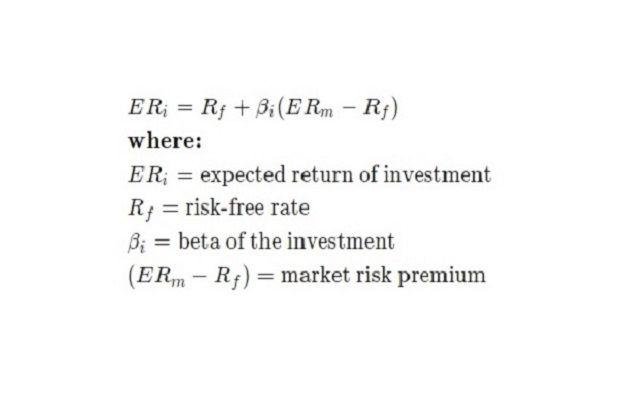

In the intricate world of financial markets, effective risk management and strategic trading decisions are paramount. Financial metrics, such as beta, play a crucial role in understanding and managing systematic risk. Beta represents a statistical measure of a stock's volatility in relation to the overall market, providing insight into how individual securities respond to market-wide movements. Understanding this metric allows traders and investors to assess potential risks and rewards, making it an integral part of informed financial planning. 

Algorithmic trading, on the other hand, has emerged as a sophisticated approach that integrates various financial metrics to achieve optimal decision-making. By leveraging computer algorithms to execute trades based on pre-defined strategies, algorithmic trading often incorporates metrics like beta to address market risk exposure and align trading actions with investor risk tolerance and market conditions. 



This article explores how beta, systematic risk, and algorithmic trading can be combined to enhance trading strategies. By analyzing these components collectively, traders can navigate complex financial landscapes more effectively, adjusting strategies for varying market conditions while aiming for optimal returns. The integration of beta within algorithmic trading not only guides strategic decision-making but also supports robust portfolio optimization, offering a comprehensive framework for managing modern financial investments.

## Table of Contents

## Understanding Beta and Systematic Risk

Beta is a critical measure in finance, serving as a statistical indicator of a stock's volatility relative to the overall market. It aids investors in assessing how the price of a particular security tends to move in alignment with broader market fluctuations. The beta coefficient of a security is derived by examining the covariance of the security's returns with the returns of the market, divided by the variance of the market's returns. Mathematically, this can be expressed as:

$$
\beta = \frac{\text{Cov}(R_i, R_m)}{\text{Var}(R_m)}
$$

where $R_i$ represents the return of the individual security and $R_m$ represents the market return. A beta value higher than 1 indicates that the security is more volatile than the market, suggesting that it may provide higher returns at the expense of increased risk. Conversely, a beta value less than 1 implies lower volatility and, consequently, reduced risk relative to the market.

Systematic risk refers to the inherent market-wide risks that cannot be eliminated through diversification. These risks include economic recessions, political instability, and changes in interest rates, all of which impact the entire market and, consequently, all securities within it. Beta is particularly relevant in the context of systematic risk, as it provides a standard measure through which traders can evaluate the extent of such risks on individual investments.

For traders, understanding beta values is essential in determining the risk level associated with specific stocks relative to the overall market. High-beta stocks are inherently more volatile, offering the potential for substantial returns but also posing a greater risk of losses. In contrast, low-beta stocks tend to offer more stable returns, making them suitable for risk-averse investors or those operating in uncertain market conditions.

In summary, beta offers a quantitative assessment of a security's market risk, enabling investors to make informed choices regarding portfolio composition and risk management. By incorporating beta analysis, traders can better align their investment strategies with their risk tolerance and market outlook.

## The Role of Beta in Algorithmic Trading

Algorithmic trading employs sophisticated computer algorithms to execute trades based on pre-defined strategies, efficiently handling large volumes of data and transactions. In this high-speed environment, the metric of beta proves invaluable for evaluating and managing market risk exposure. Beta, a measure of a security's [volatility](/wiki/volatility-trading-strategies) relative to the overall market, is integrated within these algorithms to optimize trading strategies.

Understanding beta equips traders with the ability to customize their trading strategies according to their risk tolerance and the prevailing market conditions. For instance, traders can design high-beta algorithms to capture potentially greater returns in bullish markets, where price movements are pronounced. These algorithms operate on the principle that securities with a beta greater than one possess greater sensitivity to market fluctuations, thus capitalizing on upward market trends.

Conversely, in periods of market uncertainty or downturns, traders might opt for low-beta strategies aimed at achieving stability. These strategies focus on securities with a beta less than one, implying reduced volatility compared to the broader market. Such strategies are particularly beneficial in preserving capital and reducing exposure in volatile conditions.

Beta thus offers a quantitative foundation for optimizing trading strategies within algorithmic systems. By furnishing a clear measure of expected risk and return relationships, beta allows for precise calibration of trading models. Algorithmic traders leverage beta in conjunction with real-time market data, employing it as a critical input in the decision-making process, often through programming languages such as Python.

For illustration, here is a simple Python snippet to calculate beta using historical price data:

```python
import numpy as np
import pandas as pd

# Sample historical price data
market_returns = pd.Series([0.01, 0.02, -0.01, 0.03, -0.02])
security_returns = pd.Series([0.02, 0.03, -0.02, 0.04, -0.01])

# Calculate covariance and variance
covariance = np.cov(security_returns, market_returns)[0][1]
market_variance = np.var(market_returns)

# Compute beta
beta = covariance / market_variance
print(f"Beta: {beta}")
```

In summary, beta serves as a pivotal tool in [algorithmic trading](/wiki/algorithmic-trading) by aiding in the alignment of strategic pursuits with overall market dynamics. It provides traders with a systematic approach to balance risks and returns, enhancing the effectiveness of algorithmic trading systems.

## Calculating Beta in Trading Strategies

Beta is a fundamental measure in the risk assessment of trading strategies. It is calculated by analyzing the relationship between a security's returns and the overall market returns. Specifically, beta is the quotient of the covariance of the security's returns ($R_i$) with the market returns ($R_m$) and the variance of the market returns.

$$

\text{Beta} (\beta) = \frac{\text{Cov}(R_i, R_m)}{\text{Var}(R_m)}
$$

### Historical Data Utilization

Traders rely on historical data to compute beta values. This data-driven approach allows them to identify how specific securities have historically moved in relation to the market. The historical perspective provides insights into consistent patterns of movement, offering a basis for predicting future behaviors. By aligning strategies with these historical insights, traders can anticipate potential volatility and adjust their approaches to align with their risk tolerance and market expectations.

### Statistical Tools for Calculation

The advent of advanced computational tools has significantly streamlined the process of calculating beta. Programming languages like Python and R are pivotal in performing the necessary statistical analyses. For instance, in Python, libraries such as NumPy and pandas can be employed to calculate beta efficiently. Below is a sample Python code snippet to compute beta using historical data:

```python
import numpy as np
import pandas as pd

# Assume df is a DataFrame containing market and security returns
df = pd.DataFrame({
    'market': [...],  # Market returns
    'security': [...]  # Security returns
})

covariance_matrix = np.cov(df['security'], df['market'])
beta = covariance_matrix[0, 1] / covariance_matrix[1, 1]
print("Beta:", beta)
```

### Precision and Impact on Strategic Decisions

Precision in beta calculation is critical. The accuracy of beta directly affects strategic risk management decisions and investment outcomes. Misestimating beta could lead to flawed risk assessments, potentially resulting in significant financial loss. Therefore, precise calculation and consistent re-evaluation are essential, especially in volatile markets.

Accurate beta estimation aids traders in evaluating the risk-return profile of trades and in optimizing their portfolios. By understanding the exact market sensitivity reflected by beta, traders can make informed decisions that balance potential returns against acceptable risk exposure, thus enhancing tactical trading decisions and facilitating superior investment performance.

## Interpreting Beta Values for Strategic Decisions

Interpreting beta values is crucial for traders aiming to align their investment strategies with market conditions. Beta, a measure of a security's volatility relative to the market, provides insights into a strategy's correlation with overall market movements. 

A beta greater than one implies a high sensitivity to market fluctuations, which indicates that the security or portfolio is likely to experience significant price changes in response to market shifts. This can be advantageous in bullish conditions as it suggests the potential for higher returns; however, it also increases the risk of greater losses during downturns. For example, a stock with a beta of 1.5 is expected to move 50% more than the market. If the market increases by 10%, the stock is expected to rise by 15%.

Conversely, a beta of less than one signals relative stability and lower sensitivity to market changes. Securities with low beta are often sought in volatile markets, where protection against sharp market declines is prioritized. These investments tend to provide steady, albeit moderate, returns. For instance, a beta of 0.7 implies the security is 30% less volatile than the market, reducing the risk exposure during market volatility.

Strategic decisions based on beta interpretations empower traders to align their investment objectives with prevailing market conditions. Adjusting portfolio positions based on a security's beta allows investors to tailor their risk exposure. For example, a risk-averse investor may prefer assets with lower beta values during uncertain times, while a risk-seeking investor may opt for high-beta stocks to capitalize on potential market upswings. In this way, beta serves as a key metric for making informed, strategic adjustments that reflect both market conditions and individual risk tolerance. 

By integrating beta into their analytical framework, traders can achieve optimized risk management, ensuring their portfolios are resilient to both anticipated gains and potential losses.

## Integrating Beta within Portfolio Optimization

Beta is an essential financial metric for portfolio optimization in algorithmic trading, providing critical insights into risk management and return potential. By analyzing a security's beta, traders can align their portfolios with their risk tolerance and market expectations, tailoring compositions to balance returns with acceptable risk levels. This strategic adjustment relies on understanding beta's implications for market volatility, enabling traders to capitalize on growth opportunities while safeguarding against excessive risks.

Portfolio optimization benefits from the analytical application of beta, particularly through advanced techniques like diversification and hedging. Diversification involves distributing investments across various assets to minimize exposure to any single security's idiosyncratic risk, reducing overall portfolio risk. Beta analytics help identify securities with low correlation to the market, facilitating effective diversification strategies. Additionally, hedging strategies, which aim to offset potential losses in one position by taking an opposite position in a related asset, also leverage beta values. By understanding the systematic risk a security contributes to a portfolio, traders can make informed hedging decisions that enhance portfolio resilience.

The adaptability of beta analytics is crucial for constructing portfolios that remain robust across varying market conditions. Traders use beta values to assess how different securities respond to market changes, aiding in crafting portfolios that are resilient to market shifts. By integrating beta within a comprehensive analytical framework, portfolios can be dynamically adjusted to navigate both bullish and bearish market phases, ensuring sustained performance.

Incorporating beta into portfolio optimization involves computational methods for accurate analysis, often utilizing statistical programming tools such as Python. These tools facilitate the calculation of beta through historical data analysis, ensuring precise alignment with market trends. Here's a basic example of how to compute beta using Python:

```python
import numpy as np
import pandas as pd
from pandas_datareader import data as web

# Fetch historical data for the security and the market index
start_date = '2020-01-01'
end_date = '2023-01-01'
security = web.DataReader('AAPL', data_source='yahoo', start=start_date, end=end_date)
market_index = web.DataReader('^GSPC', data_source='yahoo', start=start_date, end=end_date)

# Calculate daily returns
security_returns = security['Adj Close'].pct_change().dropna()
market_returns = market_index['Adj Close'].pct_change().dropna()

# Calculate beta
covariance = np.cov(security_returns, market_returns)[0][1]
market_variance = np.var(market_returns)
beta = covariance / market_variance

print(f"The beta of the security is: {beta}")
```

This computational method underscores the precision required in beta analysis, pivotal for informed portfolio decisions. Beta's role in algorithmic trading's portfolio optimization is not merely reactive but proactive, leveraging data-driven insights to construct portfolios that are both strategic and adaptable, ensuring sustained investment success even amid complex market landscapes.

## Challenges and Considerations in Using Beta

Despite the usefulness of beta as a measure of systematic risk, there are several challenges and considerations traders must acknowledge when incorporating it into their strategies. One of the primary limitations of beta is its reliance on historical data. Beta is typically calculated by examining historical price movements to assess a stock's relative volatility compared to the overall market. Hence, the formula for beta ($\beta_i$) is:

$$
\beta_i = \frac{\text{Cov}(R_i, R_m)}{\text{Var}(R_m)}
$$

where $R_i$ represents the return of the individual asset, and $R_m$ denotes the return of the market. $\text{Cov}(R_i, R_m)$ is the covariance between the asset's returns and the market returns, while $\text{Var}(R_m)$ is the variance of the market returns.

Because beta relies on historical data, its predictive reliability can be compromised during periods of rapid market changes or structural shifts. For instance, unexpected geopolitical events, economic policy changes, or technological disruptions can alter market dynamics swiftly, rendering beta values less effective for forecasting future volatility. In such environments, the backward-looking nature of beta may not adequately capture the evolving risk landscape.

Additionally, emerging markets or sectors characterized by high volatility pose further challenges to traditional beta analysis. These markets may exhibit unique risk factors that are not fully explained by past correlations with broader benchmarks. In these contexts, supplementary metrics and analytics might be necessary to obtain a more comprehensive risk assessment. Metrics such as implied volatility, [value at risk](/wiki/var-value-at-risk) (VaR), or conditional value at risk (CVaR) could provide valuable insights that complement beta.

Emerging technological tools and modern analytics can enhance the precision of beta in risk assessments. For example, [machine learning](/wiki/machine-learning) algorithms can be employed to adapt beta calculations dynamically in response to real-time market data. By incorporating non-linear models and a broader set of market indicators, traders can improve their risk management frameworks. Consider the following Python code snippet as an illustration of using a machine learning approach to adjust beta dynamically:

```python
import numpy as np
from sklearn.linear_model import LinearRegression

# Historical returns data for asset (R_i) and market (R_m)
R_i = np.array([...])  # Substitute with actual historical returns
R_m = np.array([...])  # Substitute with actual historical market returns

# Reshape the data for sklearn model
R_m = R_m.reshape(-1, 1)

# Linear regression model to calculate beta
model = LinearRegression().fit(R_m, R_i)
beta = model.coef_[0]

print(f"Dynamic Beta: {beta}")
```

Finally, integrating beta within a broader analytical framework that includes complementary analytics can help refine strategic decisions. While beta provides essential insights into systematic risk, it should not be used in isolation. Rather, it should be part of a multifaceted approach that accounts for various risk factors and market conditions, ensuring that traders maintain a robust and responsive trading strategy.

## Conclusion

Beta remains a cornerstone metric in understanding and managing risk within algorithmic trading. It provides a critical view into systematic risk, which is essential for traders aiming to make informed strategic decisions and optimize their portfolios. By quantifying the risk exposure of securities relative to the broader market, beta allows traders to fine-tune their strategies in alignment with varying risk tolerances and market conditions.

Incorporating beta into a robust analytical framework can significantly enhance trading performance. Traders can employ advanced statistical tools and machine learning algorithms to refine their use of beta, thus achieving greater precision in their risk assessments. This integration not only aids in managing existing investments but also presents opportunities for innovation in developing algorithmic trading models that adapt dynamically to market shifts.

Continuous learning and adaptation are crucial to leveraging the full potential of beta across diverse market scenarios. As markets evolve, so too must the methodologies and technologies used to assess risk. This entails staying updated with the latest analytical techniques, exploring complementary risk metrics, and constantly recalibrating trading algorithms to reflect real-time data and emerging market patterns. By maintaining this level of agility, traders can ensure that their use of beta is both effective and resilient, ultimately supporting sustained success within the competitive landscape of algorithmic trading.

## References & Further Reading

[1]: ["Advances in Financial Machine Learning"](https://www.amazon.com/Advances-Financial-Machine-Learning-Marcos/dp/1119482089) by Marcos Lopez de Prado

[2]: ["Quantitative Trading: How to Build Your Own Algorithmic Trading Business"](https://www.amazon.com/Quantitative-Trading-Build-Algorithmic-Business/dp/1119800064) by Ernest P. Chan

[3]: ["Machine Learning for Algorithmic Trading"](https://github.com/stefan-jansen/machine-learning-for-trading) by Stefan Jansen

[4]: ["Evidence-Based Technical Analysis: Applying the Scientific Method and Statistical Inference to Trading Signals"](https://www.amazon.com/Evidence-Based-Technical-Analysis-Scientific-Statistical/dp/0470008741) by David Aronson

[5]: Fabozzi, F. J., Focardi, S. M., & Kolm, P. N. (2010). ["Quantitative Equity Investing: Techniques and Strategies."](https://www.semanticscholar.org/paper/Quantitative-Equity-Investing%3A-Techniques-and-Fabozzi-Focardi/1c49a2a53919f7e65cb96f16691b8ff726fd3cd7) Wiley.

[6]: Grinold, R. C., & Kahn, R. N. (2000). ["Active Portfolio Management: A Quantitative Approach for Producing Superior Returns and Controlling Risk."](https://archive.org/details/activeportfoliom0000grin) McGraw-Hill Education.