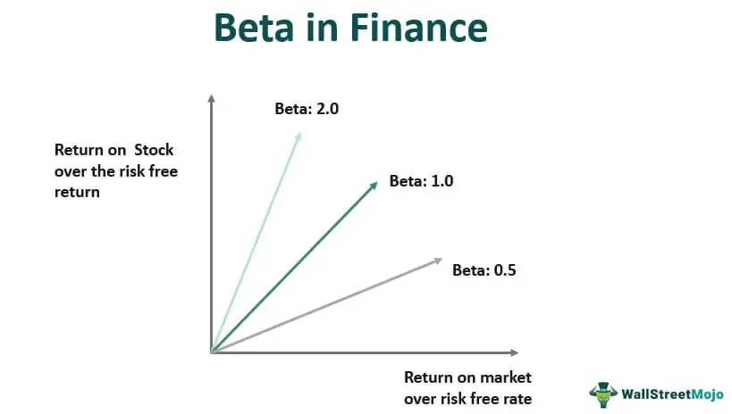

The modern financial landscape is experiencing significant transformations driven by advancements in technology and sophistication in investment strategies. A critical element of this evolving environment is the assessment and management of investment risk. Investors continually seek ways to analyze and mitigate risks associated with market volatility, company performance, and economic fluctuations. Among various financial metrics, beta serves as a central tool for understanding and quantifying these risks.

Beta, a component of the Capital Asset Pricing Model (CAPM), measures the volatility of an investment asset relative to a market benchmark. It reflects how much an asset's price is expected to move in relation to market movements. For instance, a beta greater than 1 indicates that the asset is more volatile than the market, suggesting higher risk and potentially higher returns. Conversely, a beta of less than 1 signifies less volatility, implying more stable, albeit modest, returns.



Incorporating beta into investment strategies allows investors to assess the risk-reward balance of their portfolios. This is particularly relevant in the context of algorithmic trading, where advanced algorithms leverage beta to make real-time trading decisions. Algorithmic trading uses pre-defined criteria and computational algorithms to execute trades, enhancing the efficiency and speed at which trades are conducted. By integrating beta into these algorithms, investors can optimize their strategies to enhance returns while managing risk effectively.

Understanding beta's role in this modern context is crucial for investors aiming to navigate the intricate dynamics of today's financial markets. It serves as a guide not only for traditional investment strategies but also for the innovative approaches enabled by technology, enabling investors to make informed decisions amid market volatility. As the financial landscape continues to evolve, grasping the interplay between beta, investment risk, and technology-driven strategies remains essential for achieving successful investment outcomes.

## Table of Contents

## Understanding Investment Risk

Investment risk refers to the potential for financial loss associated with various investment activities, driven by market dynamics, company-specific factors, and wider economic conditions. Understanding the nuances of investment risk is crucial for investors aiming to make informed decisions and secure financial returns. 

One primary category of investment risk is market risk, which impacts all portfolios and is often a result of broad economic changes, geopolitical shifts, or unpredictable natural disasters. This type of risk is inherent to the entire market or market segments and cannot be fully avoided through diversification. For example, a sudden increase in interest rates might depress the overall stock market, thereby affecting investments widely.

Credit risk, on the other hand, pertains to the possibility that a bond issuer or debtor may be unable to fulfill their financial obligations, leading to a potential default. This form of risk is particularly significant when dealing with bonds or loans, where the borrower's financial stability and creditworthiness are critical.

Liquidity risk emerges when an asset cannot be sold quickly without incurring a substantial price reduction. This type of risk is particularly prevalent in less active markets or with assets that do not have a significant number of buyers and sellers. For example, real estate investments can be highly illiquid compared to stocks traded on major exchanges.

Effectively managing these types of risks is crucial for achieving long-term investment success. This often necessitates the use of comprehensive risk assessment tools and strategies. Investors frequently employ diversification strategies to mitigate market and credit risks by distributing investments across different asset classes and geographies. Additionally, maintaining a proportion of highly liquid assets within a portfolio can help counter [liquidity](/wiki/liquidity-risk-premium) risks, ensuring that investors can respond to sudden market changes or cash needs without significant financial loss.

Overall, a robust risk management framework, informed by quantitative and qualitative analyses, is essential for sustaining portfolio performance and adapting to enhancing investor security amidst uncertain economic landscapes.

## What is Beta in Finance?

Beta is a financial metric that measures an asset's [volatility](/wiki/volatility-trading-strategies) relative to the overall market, and it serves as an essential proxy for assessing investment risk. The beta value provides insight into the degree of risk an asset like a stock carries compared to a broader market index, typically the S&P 500. Fundamentally, beta quantifies how much an asset's price is likely to change in response to market movement. 

A beta greater than 1 signifies that an asset is more volatile than the market. Such assets exhibit higher risk but also present the potential for higher returns. For example, if a stock has a beta of 1.5, this suggests it is expected to be 50% more volatile than the market. Conversely, a beta less than 1 indicates that the asset is less volatile, suggesting lower risk and potentially lower returns. A beta of 0.8 implies the stock is 20% less volatile than the market.

The formula for calculating beta is:

$$
\beta = \frac{\text{Covariance}(\text{Asset Return}, \text{Market Return})}{\text{Variance}(\text{Market Return})}
$$

This calculation uses the covariance between the returns of the asset and the returns of the market to determine the sensitivity of the asset to market movements. The variance of the market return measures market volatility. Python can be employed for beta computation, as illustrated below:

```python
import numpy as np

def calculate_beta(asset_returns, market_returns):
    covariance_matrix = np.cov(asset_returns, market_returns)
    beta = covariance_matrix[0, 1] / covariance_matrix[1, 1]
    return beta

# Example usage
asset_returns = np.array([0.05, 0.12, 0.08, -0.02, 0.03])
market_returns = np.array([0.03, 0.10, 0.07, 0.01, 0.02])
print(calculate_beta(asset_returns, market_returns))
```

Beta is instrumental for investors in determining the risk-reward profile of their investments and informing portfolio diversification strategies. By understanding an asset's beta, investors can better align their portfolios with their risk tolerance and market strategies. Assets with different betas can be combined to optimize the portfolio, balancing out the overall volatility and aligning investment strategies with desired financial goals.

Overall, understanding beta is crucial for investors aiming to optimize their portfolios based on risk tolerance and prevailing market conditions. It enables strategic asset allocation and helps in managing potential risks while striving for optimal returns.

## The Rise of Algorithmic Trading

Algorithmic trading utilizes technology to automate the execution of trades, facilitating increased efficiency and speed in financial markets. This approach relies on sophisticated algorithms to implement trading strategies based on pre-determined criteria, significantly reducing human errors and emotional biases. By harnessing large datasets, these systems can identify and exploit market inefficiencies, optimizing trades in real-time.

The application of [algorithmic trading](/wiki/algorithmic-trading) spans across various financial instruments, including stocks, commodities, and foreign exchange ([forex](/wiki/forex-system)) markets. In stocks, it enhances liquidity by allowing rapid buying and selling, which narrows the bid-ask spread and facilitates smoother trading. In commodities, algorithmic strategies help manage the complexities of trading various commodities with different storage, delivery, and transaction costs. In the forex market, characterized by high liquidity and volatility, algorithmic trading capitalizes on minor price movements, improving market efficiency.

The ongoing advancements in technology continuously refine algorithmic trading systems. The integration of [machine learning](/wiki/machine-learning) and [artificial intelligence](/wiki/ai-artificial-intelligence) allows these systems to adapt to changing market conditions, further enhancing their predictive capabilities. Machine learning algorithms, for instance, can analyze historical and real-time data to forecast price movements, adjusting strategies dynamically to optimize outcomes.

Adaptive trading strategies made possible by artificial intelligence allow systems to learn from historical patterns and predict future market behaviors. This capability enables algorithmic traders to develop more sophisticated strategies that can adjust automatically based on current market conditions. Moreover, with the advancement in computing power, the analysis of ever-expanding data [volume](/wiki/volume-trading-strategy) becomes feasible, providing deeper insights into market trends.

In summary, algorithmic trading represents a convergence of technology and finance, driving enhanced market operations through automated systems. By leveraging sophisticated algorithms and advanced technologies, it continues to transform trading practices, offering significant benefits in terms of speed, efficiency, and strategic adaptability in the financial markets.

## The Interplay Between Beta and Algo Trading

Beta is a crucial component of many algorithmic trading models, playing a significant role in guiding trading decisions based on market volatility and asset performance. Algorithmic trading systems often utilize beta to optimize their strategies by dynamically adjusting their positions in response to changes in market conditions and volatility metrics. 

High-beta stocks, characterized by their sensitivity to market fluctuations, are often preferred in strategies aiming to exploit significant price movements. These stocks provide opportunities to capture large gains during periods of market volatility due to their propensity for greater price swings compared to the broader market. Conversely, low-beta stocks, which exhibit less volatility, are typically favored in strategies focusing on portfolio stabilization and risk mitigation. These assets offer a cushion against market downturns, providing a defense against potential losses.

Algorithmic trading systems leverage real-time data to continuously monitor beta values alongside market conditions, enabling dynamic position adjustment. This adaptability allows the models to not only react to past performance but also anticipate future market movements. By incorporating real-time beta monitoring, these systems can fine-tune their trading strategies to better align with risk-return objectives.

Furthermore, the integration of beta into algorithmic models enhances performance by refining risk management practices. It assists in crafting a balanced investment portfolio that aligns with the investor's risk appetite. The alignment of trading decisions with desired risk profiles contributes to achieving optimal returns while minimizing exposure to undesirable volatility.

In essence, the strategic use of beta within algorithmic trading frameworks not only augments the potential for superior returns but also strengthens the robustness of risk management. This intersection represents an evolution in trading strategies, heavily reliant on quantitative data and mathematical modeling, ensuring that investment decisions are both informed and aligned with strategic imperatives.

## Challenges and Considerations

Algorithmic trading, while offering numerous advantages in speed and efficiency, is not without its challenges. Key among these are technical failures and vulnerability to extreme market conditions. Technical failures can arise from software bugs, data feed errors, or hardware malfunctions, potentially leading to incorrect trades or unexpected market exposure. In high-frequency trading environments, where large volumes of trades are executed rapidly, even minor technical glitches can escalate into significant financial losses. 

Extreme market conditions also pose substantial risks. Sudden market volatility, often triggered by geopolitical events or economic news, can lead to rapid price movements that algorithmic models may not anticipate. These models typically rely on historical data and pattern recognition; hence, unprecedented market behaviors can invalidate the assumptions underlying algorithmic strategies.

Moreover, the necessity of regulatory oversight cannot be overstated in algorithmic trading. Regulatory bodies are tasked with preventing manipulative practices such as spoofing and layering, which could undermine market integrity. High-frequency trading in particular is scrutinized for its potential to exacerbate market instability and create unfair advantages. Regulatory frameworks aim to ensure transparency and fair access, requiring firms to maintain comprehensive records of their trading algorithms and strategies.

Investors and traders must continually assess their algorithmic models for risk tolerance. This involves revising strategies in response to evolving market conditions and staying informed about regulatory changes. Algorithmic models, much like any financial tool, must be dynamic, adapting to new data and shifts in market sentiment. Continuous evaluation and adaptation are essential to maintain their relevance and effectiveness. This might include the implementation of robust testing environments to simulate different market conditions and stress-test algorithms before they are deployed in live markets.

To illustrate the importance of adapting algorithms to safeguard against adverse scenarios, consider a simple moving average crossover strategy. If a trading algorithm is based on a 50-day and 200-day moving average crossover without adapting to significant market shifts (e.g., a major geopolitical event leading to unusual volatility), the system could generate buy or sell signals that are not aligned with the current market reality. Ensuring algorithms are equipped with a mechanism for real-time data analysis and strategy adjustment can mitigate undue risk exposure.

In summary, while algorithmic trading presents substantial opportunities for improved market strategies, it also requires meticulous oversight, continual model refinement, and a robust approach to risk management to remain effective amidst the ever-changing dynamics of financial markets.

## Conclusion

The fusion of beta, investment risk, and algorithmic trading in modern finance marks a profound transformation in how investment strategies are constructed and executed. This integration allows investors to harness the predictive power of beta in assessing market volatility and asset-specific risk, thereby fine-tuning algorithmic trading models for enhanced precision and profitability. By leveraging these components adeptly, investors can better manage risks and optimize returns by capitalizing on both market movements and asset performance metrics.

Beta remains a pivotal [factor](/wiki/factor-investing) in refining trading algorithms, as it quantifies the volatility of an asset in relation to the broader market. This metric enables algorithms to align investment decisions with anticipated risk and return profiles, thus supporting portfolio diversification and enhancing overall stability. Investors can dynamically adjust their strategies in response to real-time beta changes, thereby achieving a more tailored approach to risk management.

The data-driven nature of modern investing necessitates an ongoing commitment to learning and adaptation. As market conditions and technological capabilities continue to evolve, investors must stay abreast of developments in machine learning, artificial intelligence, and high-frequency trading systems. This pursuit of knowledge is essential for maintaining competitive edges in investment strategies, ensuring that algorithms remain relevant and effective amidst shifting market landscapes.

In summary, the amalgamation of beta, investment risk, and algorithmic trading is crucial for investors striving to meet their financial objectives in today’s fast-paced markets. By continuously refining their approach and embracing technological innovations, investors can secure a robust framework for managing investment risk and maximizing returns.

## References & Further Reading

Explore [books](/wiki/algo-trading-books) like *Advances in Financial Machine Learning* by Marcos Lopez de Prado for in-depth analysis. This book offers insights into the application of machine learning techniques to financial data, providing methodologies and frameworks that enhance predictive accuracy and model performance in algorithmic trading. It covers a variety of advanced topics, such as feature selection, [backtesting](/wiki/backtesting), and the design of market-making algorithms, making it an invaluable resource for quants and financial engineers aiming to leverage machine learning in trading strategies.

Consult resources like *Quantitative Trading: How to Build Your Own Algorithmic Trading Business* by Ernest P. Chan for practical insights. This book guides readers through the process of creating their own [quantitative trading](/wiki/quantitative-trading) models. It emphasizes the importance of rigorous backtesting and outlines the steps to develop, implement, and test strategies in real-world market conditions. Chan's work provides a comprehensive guide for both novice and experienced traders interested in building systematic trading models.

Online platforms and courses offer additional learning on algorithmic trading and investment risk management. Websites such as Coursera and edX provide courses on financial engineering, quantitative trading, and data science, which are useful for individuals looking to deepen their understanding of quantitative methods and risk assessment. Platforms like QuantConnect and QuantStart offer tutorials and resources specific to developing and backtesting trading algorithms using Python and other programming languages. These resources are essential for those seeking to integrate technical skills with financial acumen, thereby optimizing their investment and trading strategies.