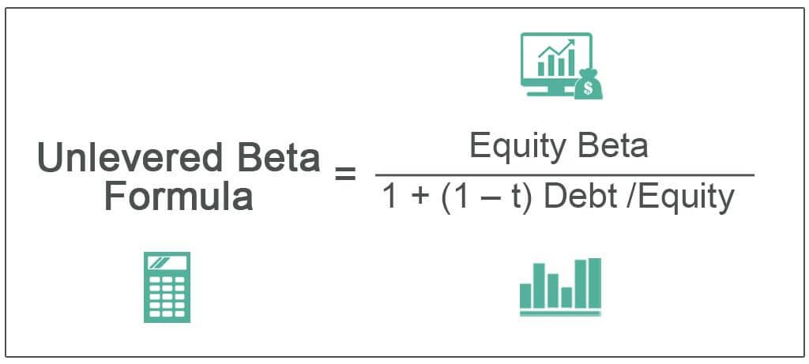

## Table of Contents

## What is Beta in the context of software development?

In software development, Beta refers to a stage in the release cycle of a product where it is made available to a limited group of users outside the company. This stage comes after the Alpha stage, where the software is still being tested internally. The purpose of the Beta stage is to get feedback from real users about how the software works in everyday situations. This helps the developers find and fix problems that they might not have noticed during internal testing.

During the Beta phase, users might encounter bugs or issues that need to be reported back to the developers. These reports are crucial because they help improve the software before it is released to the public. Sometimes, the Beta version is called a "Beta release" or "Beta version." It's important for users to know that Beta software might not be fully stable and could have some issues. However, participating in Beta testing can be a great way to influence the final product and help make it better for everyone.

## How does Beta testing differ from Alpha testing?

Alpha testing and Beta testing are two important stages in the software development process. Alpha testing happens first. It's when the software is still being worked on by the people who made it. They test it inside their company to find and fix problems before anyone else sees it. This stage is all about making sure the software works well enough to show to other people.

Beta testing comes after Alpha testing. This is when the software is given to a small group of people outside the company. These users try the software in their everyday lives and tell the developers what they think. The goal is to find any issues that the Alpha testers might have missed. Beta testing helps make the software better before it's released to everyone.

Both stages are important, but they happen at different times and involve different groups of people. Alpha testing is more private and internal, while Beta testing is more open and involves real users. This helps make sure the software is as good as it can be before it's finished.

## What are the main goals of conducting a Beta test?

The main goal of conducting a Beta test is to get real feedback from users outside the company. When people use the software in their everyday lives, they can find problems that the developers might have missed. This helps make the software better before it's released to everyone. By letting a small group of users try the software, the developers can see how it works in the real world and fix any issues that come up.

Another goal of Beta testing is to make sure the software is easy to use and meets the needs of its users. When users report back on their experiences, the developers can learn what works well and what doesn't. This feedback is really important because it helps the developers improve the software so it's ready for everyone. Beta testing also helps build excitement and interest in the software before its official release.

## Who typically participates in Beta testing?

People who take part in Beta testing are usually a mix of regular users and tech-savvy folks. These can be customers who have signed up to try new software early, or they might be chosen by the company to test it. Sometimes, the company will pick people who are really interested in the type of software being tested, so they can give good feedback.

Beta testers are important because they use the software in real life, not just in a lab. They might be everyday users who want to help make the software better, or they could be experts who know a lot about technology. Either way, their job is to try out the software, find any problems, and tell the developers what they think. This helps the software get better before it's released to everyone.

## What types of software are commonly released for Beta testing?

Software that is often released for Beta testing includes operating systems, like Windows or macOS, and big apps that many people use, like web browsers or office programs. These are usually made by big companies that want to make sure their software works well before everyone starts using it. They need lots of people to try it out and give feedback, so they can fix any problems before the final version comes out.

Another type of software that goes through Beta testing a lot is video games. Game companies want to make sure their games are fun and work well on different computers or consoles. They let gamers play the game early and tell them what they like or don't like. This helps the game developers make changes and improve the game before it's sold to everyone.

Sometimes, smaller apps and tools also go through Beta testing. These might be new apps for smartphones or special programs for businesses. The developers want to make sure these work well for their users, so they let a few people try them out first. This way, they can fix any issues and make the software better before more people start using it.

## How can someone participate in Beta testing programs?

If you want to join a Beta testing program, you can start by looking at the websites of the companies that make the software you're interested in. Many big companies, like Microsoft or Google, have special pages where you can sign up to be a Beta tester. You might need to fill out a form or join a mailing list. Sometimes, you can also find Beta testing opportunities on websites that list new software and apps.

Once you sign up, you might get an email when a new Beta version is ready. You'll download the software and start using it like you normally would. It's important to use it a lot and try different things so you can find any problems. If you find something that doesn't work right, you can report it to the company. They usually have a way for you to send feedback, like a special website or an email address.

Some Beta testing programs are open to everyone, but others might be more selective. For example, if you're really good with computers or know a lot about a certain type of software, you might be chosen to test more advanced programs. No matter what, being a Beta tester is a great way to help make software better and sometimes you even get to use new features before anyone else.

## What are the benefits of Beta testing for developers?

Beta testing helps developers a lot. It lets them see how their software works in the real world, not just in their office. When people outside the company use the software, they can find problems that the developers might have missed. This feedback is really important because it helps the developers fix issues and make the software better before it's released to everyone. It's like having a big group of helpers who can spot things that need to be fixed.

Another benefit is that Beta testing can show developers if their software is easy to use and if it meets the needs of its users. When users report back on their experiences, the developers can learn what works well and what doesn't. This helps them make changes so the software is more user-friendly and useful. Plus, Beta testing can build excitement and interest in the software before its official release, which can be good for the company's reputation and sales.

## What are the potential risks and challenges of Beta testing?

Beta testing can be risky because the software might have bugs or problems that can make it hard to use. If people find these issues, they might get frustrated and not want to use the software again. Sometimes, the problems can be so bad that they cause the software to stop working or even damage the user's computer. This can make people lose trust in the company and the software. Also, if the Beta version gets into the wrong hands, someone might try to copy or steal parts of the software before it's ready.

Another challenge with Beta testing is managing all the feedback that comes in. When lots of people are trying the software, they might report many different problems. It can be hard for the developers to sort through all this information and decide what to fix first. They need to make sure they're listening to the most important feedback and not getting overwhelmed by all the reports. Plus, if the Beta test isn't managed well, it might take longer to get the software ready for everyone, which can delay the final release.

## How do developers collect and manage feedback during Beta testing?

During Beta testing, developers collect feedback in many ways. They might use special websites where users can report problems and share their thoughts. Sometimes, they set up email addresses just for Beta testers to send their feedback. They might also use surveys or online forms to gather information about what users like or don't like about the software. It's important for developers to make it easy for testers to give feedback so they can get as much information as possible.

Managing all this feedback can be hard. Developers need to sort through everything to find the most important issues. They might use special software to keep track of all the reports and decide which ones to fix first. It's like solving a big puzzle where they need to figure out what's most important to make the software better. By listening to the feedback and working on the biggest problems, developers can improve the software before it's ready for everyone to use.

## What metrics are important to track during a Beta test?

During a Beta test, it's important to track how many people are using the software and how often they use it. This helps developers see if the software is popular and if people are interested in it. They also need to keep an eye on how long users stay with the software and if they come back to use it again. This tells them if the software is easy to use and if people like it enough to keep using it.

Another important thing to track is how many problems or bugs users find and report. Developers need to know what's going wrong so they can fix it before the software is released to everyone. They also look at how happy users are with the software by asking for their feedback and seeing if they would recommend it to others. All these metrics help developers understand what they need to do to make the software better.

## How does Beta testing fit into the overall software development lifecycle?

Beta testing is an important part of the software development lifecycle. It happens after the software has been tested inside the company during the Alpha stage. In the Beta stage, the software is given to a small group of people outside the company to try out. This helps the developers see how the software works in real life, not just in a lab. By letting users try the software, the developers can find and fix problems that they might have missed during Alpha testing.

Beta testing comes before the final release of the software. It's a chance for the developers to get feedback from real users and make sure the software is easy to use and meets their needs. After the Beta test, the developers use all the feedback to make the software better. Once they fix the problems and make any needed changes, the software is ready for everyone to use. This helps make sure the final version is as good as it can be.

## What advanced strategies can be used to optimize Beta testing processes?

To make Beta testing better, developers can use a few smart tricks. One good idea is to pick a group of Beta testers who are really different from each other. This way, they can see how the software works for all kinds of people, not just one type. Another trick is to use special tools that help keep track of all the feedback. These tools can sort the reports and show which problems are the most important to fix first. It's also helpful to keep talking to the Beta testers, maybe through online meetings or emails, so they feel involved and can give better feedback.

Another strategy is to test the software in stages. Instead of letting everyone try it at once, developers can start with a small group and then add more people later. This helps them find and fix big problems early on without getting overwhelmed. They can also use something called A/B testing, where they give different groups of testers slightly different versions of the software. This helps them see which version works better and make the software even better before it's released to everyone.

## What is Beta in Algo Trading?

Beta is a quantitative measure that depicts how a trading strategy or investment's return moves in relation to the overall market returns. It serves as a crucial indicator of the strategy's [volatility](/wiki/volatility-trading-strategies), particularly its sensitivity to market movements compared to a market benchmark, typically an index such as the S&P 500.

In the domain of [algorithmic trading](/wiki/algorithmic-trading), beta is utilized to gauge a trading strategy's exposure to systematic risk – the risk intrinsic to the entire market that cannot be mitigated through diversification alone. By understanding a strategy's beta, traders gain insights into how susceptible the strategy is to broad market movements and how it is likely to perform as market conditions shift.

Mathematically, beta is calculated using the formula:

$$
\beta = \frac{\text{Cov}(R, R_m)}{\text{Var}(R_m)}
$$

where:
- $\text{Cov}(R, R_m)$ is the covariance between the returns of the trading strategy or asset $R$ and the market returns $R_m$.
- $\text{Var}(R_m)$ is the variance of the market returns $R_m$.

This mathematical representation helps determine whether a strategy is likely to amplify or dampen the market's overall movements. A beta value greater than 1 indicates that the trading strategy is more volatile than the market, potentially leading to higher returns but also higher risks. Conversely, a beta of less than 1 suggests a less volatile strategy, offering potentially lower returns with reduced risk exposure.

In the landscape of algorithmic trading, traders leverage beta to tailor their strategies according to their risk tolerance and market insights. A higher beta strategy might be favored in bullish market conditions when traders seek to capitalize on rising trends, whereas a lower beta strategy might be adopted to safeguard against downturns. Understanding beta not only aids in risk management but also equips traders with the analytical framework necessary for making informed decisions regarding strategy adjustments and market positioning.

## How do you calculate Beta for trading strategies?

Beta is a key metric used to measure a trading strategy's sensitivity to market movements. The mathematical formula for beta is defined as:

$$
\beta = \frac{\text{Cov}(R_{s}, R_{m})}{\text{Var}(R_{m})}
$$

Where:
- $\text{Cov}(R_{s}, R_{m})$ is the covariance between the strategy's returns ($R_{s}$) and the market's returns ($R_{m}$).
- $\text{Var}(R_{m})$ is the variance of the market's returns ($R_{m}$).

The formula allows traders to quantify how much the strategy's returns are expected to change with a given change in the market's returns. A positive beta indicates that the strategy is likely to move in the same direction as the market, while a negative beta suggests the opposite.

Calculating beta accurately relies heavily on historical data. Traders typically collect time series data of both the strategy and the market performance over a specific period. This data serves as the basis for computing the covariance and variance required for the beta formula.

To streamline this process, numerical computing environments such as Python and R are widely used. Python, for example, provides powerful libraries like NumPy and pandas for handling data manipulation and statistical operations. A basic Python implementation for calculating beta might look like this:

```python
import numpy as np
import pandas as pd

# Assume 'data' is a DataFrame containing columns 'strategy_returns' and 'market_returns'
strategy_returns = data['strategy_returns']
market_returns = data['market_returns']

# Calculating covariance and variance
covariance = np.cov(strategy_returns, market_returns)[0][1]
market_variance = np.var(market_returns)

# Calculating beta
beta = covariance / market_variance
```

Using R, a similar calculation can be performed with built-in functions or the 'quantmod' and 'PerformanceAnalytics' packages, which specialize in financial computations.

While calculating beta is a straightforward statistical operation, it's essential to select an appropriate time frame for historical data to reflect the current market dynamics accurately. Additionally, care must be taken when setting the frequency of data points, as using overly granular or coarse data can skew the analysis.

Ultimately, integrating beta calculations into algorithmic trading systems requires a robust approach, ensuring that the chosen methodology accurately represents the strategy's market exposure and informs risk management effectively. As with any financial metric, beta should be used in conjunction with other analytics to create a comprehensive view of the strategy's risk profile.

## What is the role of Beta in portfolio optimization within algorithmic trading?

Beta plays a crucial role in crafting a well-optimized algorithmic trading portfolio by helping traders balance different assets and strategies to align with desired risk-return profiles. In algorithmic trading, understanding how individual assets contribute to overall portfolio volatility is essential for constructing strategies that can withstand different market environments while achieving expected returns. Beta serves as a key metric for quantifying the market risk associated with assets or strategies relative to the market.

By leveraging beta, traders can identify which assets might provide the right level of exposure to market movements suited to their risk appetite. A portfolio with a higher average beta could suggest greater sensitivity to market fluctuations, often accompanied by the potential for higher returns or losses. Conversely, a portfolio with a lower average beta might be less volatile, appealing to traders seeking stability.

Advanced techniques such as hedging and diversification significantly benefit from the application of beta. Through diversification, traders aim to combine assets with varying beta values to achieve a balanced portfolio that smooths out extremes in performance. By including assets with low or negative betas, traders can mitigate unsystematic risk—the risk unique to individual stocks—thereby stabilizing the portfolio against unpredictable market movements.

Hedging is another technique that can be optimized by utilizing beta. By understanding the beta of different assets, traders can hedge risk more effectively. For instance, if a portfolio is primarily composed of high-beta stocks, a trader might introduce assets with negative or low beta values or employ derivative instruments to offset potential losses during market downturns. This practice helps in maintaining performance consistency across multiple market cycles by reducing exposure to adverse market movements.

Mathematically, if $\beta_p$ is the portfolio beta, it can be expressed as the weighted sum of the betas of the individual assets:

$$
\beta_p = \sum_{i=1}^{n} w_i \beta_i
$$

where $w_i$ represents the weight of asset $i$ in the portfolio, and $\beta_i$ is the beta of asset $i$. This formula underscores the importance of asset allocation in defining the overall risk profile of a trading strategy.

In practice, algorithmic traders often employ programming languages such as Python to implement strategies and calculate portfolio beta. Libraries like Pandas and NumPy facilitate these calculations by processing historical returns effectively. Python code snippets highlight how beta can be used to adjust portfolio strategies dynamically in response to changing market conditions, optimizing for an ideal risk-return tradeoff.

In summary, beta is integral to both the design and execution of algorithmic trading portfolios, guiding strategic decisions on asset selection and allocation to craft portfolios that remain robust across diverse market conditions. By employing beta alongside other metrics, traders can enhance portfolio efficiency, ensuring that risk exposure aligns with strategic objectives.

## References & Further Reading

[1]: ["Algorithmic Trading: Winning Strategies and Their Rationale"](https://www.wiley.com/en-us/Algorithmic+Trading%3A+Winning+Strategies+and+Their+Rationale-p-9781118460146) by Ernest P. Chan

[2]: ["Advances in Financial Machine Learning"](https://www.amazon.com/Advances-Financial-Machine-Learning-Marcos/dp/1119482089) by Marcos Lopez de Prado

[3]: ["Quantitative Trading: How to Build Your Own Algorithmic Trading Business"](https://books.google.com/books/about/Quantitative_Trading.html?id=j70yEAAAQBAJ) by Ernest P. Chan

[4]: Statman, M. (1987). ["How Many Stocks Make a Diversified Portfolio?"](https://www.jstor.org/stable/2330969) Journal of Financial and Quantitative Analysis.

[5]: Berger, A. N. & Bouwman, C. H. S. (2009). ["Bank Liquidity Creation."](https://www.sciencedirect.com/science/article/abs/pii/S1572308917303017) Review of Financial Studies, 22(9), 3779-3837.

[6]: ["Machine Learning for Algorithmic Trading"](https://github.com/PacktPublishing/Machine-Learning-for-Algorithmic-Trading-Second-Edition) by Stefan Jansen