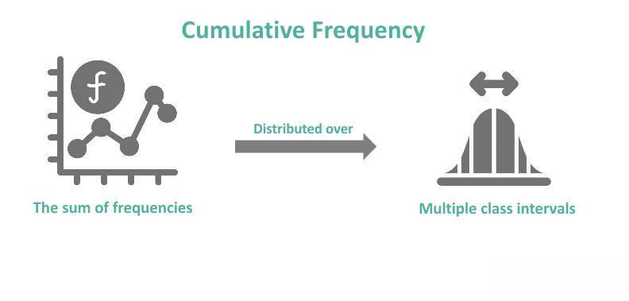

Algorithmic trading, often referred to as algo-trading, incorporates the use of computer algorithms to execute trading decisions at speeds and frequencies beyond human capacity. Central to this approach is the concept of betting frequency, which pertains to how often trades are executed within a given timeframe. Betting frequency depends on various factors, including the strategy employed, market conditions, and available technological infrastructure. A comprehensive understanding of betting frequency is crucial, as it influences market liquidity and the effectiveness of trading strategies.

In algorithmic trading, high betting frequency is associated with high-frequency trading (HFT) strategies, where trades are executed in microseconds to capitalize on minute price discrepancies. Alternatively, mid-frequency trading involves less frequent trades, occurring over longer periods, such as several hours. Both strategies require precise adjustments based on real-time market data to optimize execution and profitability.



The importance of betting frequency extends beyond individual trading outcomes; it plays a significant role in market dynamics. High betting frequency enhances market liquidity by increasing the number of orders placed, thereby narrowing bid-ask spreads and promoting more accurate pricing of assets. However, this frequency also introduces potential challenges, such as the need for significant technological infrastructure and the risk of amplifying market volatility. These challenges necessitate careful management to maintain market stability and foster a reliable trading environment.

Through understanding the intricacies of betting frequency, traders can refine their algo-trading strategies, leading to enhanced performance and more efficient markets. Future advancements in technologies, particularly in artificial intelligence and machine learning, are likely to expand the capabilities of algorithmic trading, offering improved precision and execution in betting strategies.

## Table of Contents

## Understanding Betting Frequency in Algo Trading

Betting frequency in [algorithmic trading](/wiki/algorithmic-trading) refers to the count of trades executed by an algorithm within a designated timeframe. It is a pivotal aspect of trading strategies and directly influences the performance and risk profile of the trading system. 

High-frequency trading ([HFT](/wiki/high-frequency-trading-strategies)) exemplifies a scenario where algorithms are designed to perform a large number of trades at extremely rapid speeds, often within microseconds. This requires cutting-edge technology and robust infrastructure to handle the sheer [volume](/wiki/volume-trading-strategy) and velocity of trade execution. The aim is to exploit small price differentials, often leveraging advanced market data analysis and low-latency trading systems to achieve financial gains. The success of HFT depends on minimizing the time taken for signal processing and order execution, an endeavor that constantly pushes the boundaries of computational and network technology.

In contrast, mid-frequency trading strategies engage in less frequent trades, typically spanning several hours during a trading day. These strategies are characterized by a longer holding period and are generally less reliant on speed and more focused on market trends and data analysis to make trading decisions. While they involve a lower transaction volume compared to HFT, mid-frequency strategies can capitalize on market inefficiencies that may not be as apparent to higher frequency models.

The determination of betting frequency within an algorithmic strategy is contingent upon various factors, including the underlying trading strategy, prevailing market conditions, and the technological capabilities at the trader’s disposal. A high betting frequency may be advantageous in highly liquid markets where price changes are rapid but incremental. Conversely, slower markets or less liquid assets may benefit from mid-frequency strategies, where trades are made based on broader market trends or news events.

Moreover, the choice of betting frequency should align with the risk tolerance and financial goals of the trader. The implementation of mathematical models or simulation environments can assist in calibrating the appropriate frequency, offering a way to simulate and analyze potential outcomes before deploying the strategy in real market conditions.

```Python
# Example of a simple function to simulate betting frequency determination 
def determine_betting_frequency(trade_volume, market_liquidity):
    # Hypothetical thresholds for demonstration
    HIGH_FREQUENCY_THRESHOLD = 1000
    HIGH_LIQUIDITY_THRESHOLD = 0.75

    if trade_volume > HIGH_FREQUENCY_THRESHOLD and market_liquidity > HIGH_LIQUIDITY_THRESHOLD:
        return "High Frequency"
    else:
        return "Mid Frequency"

# Simulating a scenario
trade_volume = 1200
market_liquidity = 0.8
frequency = determine_betting_frequency(trade_volume, market_liquidity)
print(f"Recommended Betting Frequency: {frequency}")
```

Understanding and optimizing betting frequency is essential for developing effective algorithmic trading strategies and can significantly enhance trading performance and risk management.

## Benefits of High Betting Frequency

High betting frequency plays a crucial role in enhancing market efficiency by significantly improving [liquidity](/wiki/liquidity-risk-premium) and narrowing bid-ask spreads. Liquidity, which refers to the ease with which an asset can be bought or sold in the market without affecting its price, is vital for smooth and efficient market operations. As trading algorithms conduct numerous transactions within short periods, they contribute to higher liquidity levels. This increase in liquidity helps in minimizing the bid-ask spread, which is the difference between the highest price that a buyer is willing to pay for an asset and the lowest price a seller is willing to accept. Narrower spreads ensure that transactions can occur at prices closer to their true market value, thus enhancing overall market efficiency.

Moreover, high betting frequency allows traders to exploit small price discrepancies rapidly and effectively. These discrepancies, although typically minor and fleeting, present opportunities for traders to profit by executing trades at advantageous prices. By consistently capturing these small gains, traders contribute to the accurate pricing of assets, thereby aligning them more closely with their intrinsic values.

Furthermore, increased trading frequency results in higher trading volumes, which is beneficial for achieving quicker order executions. For traders, particularly in volatile markets, the ability to execute trades swiftly and in large numbers is critical for capitalizing on momentary market movements. High-frequency trading (HFT) systems are capable of executing trades in microseconds, allowing traders to remain competitive in fast-moving markets.

Another significant advantage of high betting frequency is its ability to minimize total transaction costs. By breaking down large transactions into numerous smaller trades, algorithms can optimize the execution price, effectively reducing slippage. Slippage occurs when there is a difference between the expected price of a trade and the actual price at which the trade is executed. By systematically executing smaller trades, algorithms can secure prices closer to the desired level, thereby lowering the overall costs associated with trading activities.

## Challenges and Risks of High Betting Frequency

High betting frequency in algorithmic trading necessitates a substantial technological infrastructure, often requiring significant investments. This infrastructure ensures that trades are executed in fractions of a second, facilitating the rapid response to market fluctuations. However, establishing and maintaining such an infrastructure can be costly, involving expenditures on high-performance computing hardware, low-latency network connections, and cutting-edge software development.

Latency issues pose a significant challenge as well. Latency, the delay between the initiation of a process and its execution, can adversely affect the profitability of high-frequency trading (HFT). In environments where trades are executed in microseconds, even nanoseconds of delay can lead to missed opportunities and different execution prices than intended. When market conditions change rapidly, traders may find that the prices at which they intended to buy or sell are no longer available, affecting overall profitability. To minimize these issues, firms invest in co-location services, placing their servers in proximity to exchange servers to reduce latency.

The practice of executing a high volume of trades at such rapid speeds can also amplify market [volatility](/wiki/volatility-trading-strategies). High-frequency trading has been linked to market anomalies, such as the "flash crash" of May 6, 2010, where major indices dropped and then partially rebounded within minutes. Such events occur when algorithms react to each other’s trades in a way not anticipated by their designers, leading to extreme volatility and disruption in the market.

Regulatory scrutiny is increasing as authorities aim to mitigate the risks posed by HFT. Regulators worldwide are developing frameworks to ensure market stability and fairness. These frameworks often demand transparency in algo-trading strategies and execution times and may impose restrictions on trading speeds and frequency to prevent manipulation and excessive volatility. Adhering to these evolving regulations requires ongoing adaptation by trading firms, adding another layer of complexity and cost.

In conclusion, while high betting frequency provides opportunities to capitalize on small market inefficiencies, it also presents unique challenges that must be managed with careful planning. The necessity for extensive technological investment, the impact of latency, potential market volatility, and regulatory compliance all contribute to the complexities of executing a successful high-frequency trading strategy.

## Strategies for Optimizing Betting Frequency

Implementing robust algorithms capable of adaptive learning is essential for refining betting frequency in algorithmic trading. Adaptive algorithms dynamically adjust their parameters based on real-time market data, thus making them pivotal in responding effectively to rapidly changing market conditions. For instance, these algorithms can leverage [reinforcement learning](/wiki/reinforcement-learning) to improve decision-making processes by continuously learning from real-time data. This not only enhances the timing of trades but also optimizes execution strategies in volatile markets.

Machine learning models are integral in predicting market conditions, thereby facilitating more effective trade timing. These models utilize large datasets to identify patterns and trends that might not be immediately apparent through traditional analysis methods. For example, support vector machines (SVM) and neural networks can forecast asset price movements based on historical data, allowing traders to pre-emptively adjust their trading strategies. The ability to anticipate market changes before they occur is a significant advantage in maintaining optimal betting frequency.

Developing hybrid strategies that balance high and mid-frequency trading can optimize returns while managing risk. A hybrid approach amalgamates the benefits of both trading frequencies, allowing traders to capitalize on short-term market fluctuations while maintaining stability with longer-term trades. This dual-strategy approach can cushion against the potential volatility and risks associated with high-frequency trading. By diversifying trading strategies, traders can enhance their portfolio's resilience to market disruptions.

Regular [backtesting](/wiki/backtesting) and fine-tuning of algorithms ensure their alignment with current market dynamics and comply with regulatory standards. Backtesting involves running algorithms on historical data to evaluate their performance, identify potential weaknesses, and make necessary adjustments. This process is crucial for ensuring that the strategies remain effective in different market scenarios and continue to meet regulatory guidelines. Routine evaluation and updates to trading algorithms are necessary to adapt to evolving market conditions and regulatory changes. Implementing these strategies can significantly enhance the precision and efficiency of betting frequency in algorithmic trading, leading to optimized performance and profitability.

## Conclusion

Betting frequency is a critical [factor](/wiki/factor-investing) in the success of algorithmic trading strategies. It enables traders to engage in numerous trading opportunities within short time frames, thereby enhancing overall trading efficiency and market liquidity. A higher rate of transaction execution allows for the exploitation of minimal price deviations, contributing to more precise asset valuations and tighter bid-ask spreads. However, the significant advantages of high-frequency betting are accompanied by challenges that necessitate thoughtful management.

The primary challenge is the substantial technological infrastructure needed to support high betting frequency. This infrastructure includes high-speed data feeds, low-latency execution systems, and robust risk management protocols, all of which require considerable investment. Additionally, the rapid pace of trade execution necessitates rigorous measures to mitigate latency issues that could lead to unfavorable price changes. These changes might occur faster than the algorithm can recognize and respond, potentially impacting profitability negatively.

Moreover, high betting frequency poses the risk of increasing market volatility, potentially leading to events such as flash crashes that can distort normal market operations. Regulatory bodies are continually assessing and adapting frameworks to address the risks associated with high-frequency trading, aiming to strike a balance between market efficiency and stability.

By incorporating advanced technologies and strategic planning, traders can maximize the benefits of betting frequency in algorithmic trading. Adaptive algorithms capable of learning and adjusting to dynamic market conditions are key. Machine learning models, for example, can anticipate market trends, enabling timely trade decisions. Hybrid trading strategies, which combine high and mid-frequency tactics, can further optimize returns while effectively managing risk.

As AI and [machine learning](/wiki/machine-learning) technologies continue to evolve, they are expected to enhance the precision and efficiency of betting strategies. These advancements promise to refine the execution processes and improve the profitability and stability of algorithmic trading systems, making the optimization of betting frequency even more attainable in the future.

## References & Further Reading

[1]: Bergstra, J., Bardenet, R., Bengio, Y., & Kégl, B. (2011). ["Algorithms for Hyper-Parameter Optimization."](https://papers.nips.cc/paper/4443-algorithms-for-hyper-parameter-optimization) Advances in Neural Information Processing Systems 24.

[2]: ["Advances in Financial Machine Learning"](https://www.amazon.com/Advances-Financial-Machine-Learning-Marcos/dp/1119482089) by Marcos Lopez de Prado

[3]: ["Evidence-Based Technical Analysis: Applying the Scientific Method and Statistical Inference to Trading Signals"](https://www.amazon.com/Evidence-Based-Technical-Analysis-Scientific-Statistical/dp/0470008741) by David Aronson

[4]: ["Machine Learning for Algorithmic Trading"](https://github.com/stefan-jansen/machine-learning-for-trading) by Stefan Jansen

[5]: ["Quantitative Trading: How to Build Your Own Algorithmic Trading Business"](https://www.amazon.com/Quantitative-Trading-Build-Algorithmic-Business/dp/1119800064) by Ernest P. Chan