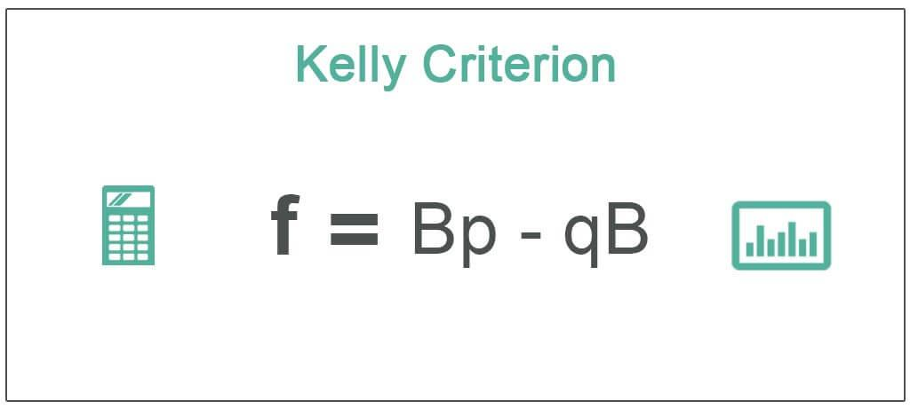

Investors frequently concentrate on the profitability of their chosen strategies, often overlooking critical factors such as investment size. The size of an investment not only influences the potential return but also significantly drives the overall success or failure of a strategy. Determining the appropriate investment size is crucial as it can either enhance the strategy's outcomes or undermine them. 

This article introduces two fundamental methodologies used in algorithmic trading for determining optimal position sizing: the Kelly Criterion and Optimal F. Both techniques originate from mathematical theories applied to finance, with the Kelly Criterion first proposed by John Larry Kelly Jr. in 1956. Initially developed for gambling purposes, this concept has been adapted to guide investors on how much capital to allocate to a particular investment to maximize their long-term growth rate. On the other hand, Optimal F, introduced by Ralph Vince, considers the variability in trade outcomes and helps investors account for risks such as large losses.



While these methodologies offer theoretical frameworks for optimizing investment sizes, managing potential risks associated with excessive leverage cannot be overstated. The mathematical underpinnings of these approaches provide guidelines yet require cautious application since the pursuit of maximizing returns may inadvertently increase the likelihood of significant drawdowns.

To illuminate the practical application of these concepts, the article will present a demonstration utilizing a specified trading strategy. This illustration will underscore how investment sizing, when guided by methodologies like the Kelly Criterion and Optimal F, can be navigated effectively to potentially yield favorable results.

## Table of Contents

## Understanding the Kelly Criterion

John Larry Kelly Jr., a researcher at Bell Labs, introduced the Kelly Criterion in 1956. Originally developed from gambling theories, the Kelly Criterion was designed to calculate optimal bet sizes to maximize the expected geometric growth rate of capital. This method provides a systematic approach to asset allocation and risk management by balancing potential returns with the probability of those returns.

The fundamental idea behind the Kelly Criterion is to find a position size that allows for a consistent increase in capital while minimizing the risk of significant losses. The strategy maximizes the expected logarithm of wealth, effectively seeking a balance between risk and return. Originally intended for binary outcomes, such as winning or losing a bet, the formula has been adapted for partial losses, making it applicable to financial investments and trading scenarios.

The basic formula for the Kelly Criterion is:

$$
f^* = \frac{p \cdot (b + 1) - 1}{b}
$$

where:
- $f^*$ is the fraction of the capital to be wagered or invested,
- $p$ is the probability of winning the trade,
- $b$ represents the ratio of the net return (win) to the amount invested.

In practical financial markets, the Kelly fraction can also be adjusted to safeguard against the possibility of maximum expected losses. This adjustment can involve fractional Kelly strategies, where the calculated Kelly size is often multiplied by a [factor](/wiki/factor-investing) less than one, to protect against [volatility](/wiki/volatility-trading-strategies) and ensure capital preservation. Such adjustments help prevent extreme leverage, which could lead to devastating drawdowns even if theoretically optimal in a mathematical sense. By maintaining a focus on long-term capital growth, the Kelly Criterion helps traders and investors to determine more strategic position sizes, thus promoting a disciplined approach to risk management.

## The Advanced Approach: Optimal F

Optimal F is an advanced method for determining optimal position sizing in trading, introduced by Ralph Vince to overcome the constraints of the Kelly Criterion. Unlike the Kelly Criterion, which is primarily based on fixed probabilities of winning and losing, Optimal F takes into account the varying outcomes of trades, thus providing a more realistic framework for determining the optimal investment size.

The core objective of Optimal F is to maximize the Terminal Wealth Relative (TWR), which reflects the growth of capital over time. TWR is calculated by finding the product of all returns into the future from a set of trades, which distinguishes it from methods focused only on maximizing immediate returns. By considering the biggest losses in a given period, Optimal F aims to balance the potential for growth against the risk of significant capital drawdowns. This focus on maximizing TWR makes Optimal F particularly applicable to traders seeking long-term wealth accumulation.

Despite its sophisticated approach, there is a prominent drawback associated with Optimal F: the risk of over-leverage. This risk stems from overly optimistic assumptions often made during [backtesting](/wiki/backtesting) of strategies. These assumptions may not account for real-world market fluctuations and anomalies, leading to excessive risk exposure when executed in live trading environments. This is particularly concerning because significant losses can result in diminished capital, from which recovery is mathematically challenging due to the logarithmic nature of growth.

To mitigate the risks associated with over-leverage, similar adjustments to those used in the Kelly Criterion can be applied. One recommended method involves dividing the calculated Optimal F by the biggest expected loss, thereby normalizing the position size to account for worst-case scenarios. By reducing the influence of overly positive backtest results, traders can adopt a more prudent approach to position sizing.

The formula for Optimal F is not standardized like the Kelly Criterion, as it relies on empirical data specific to the trading strategy and market conditions. However, practitioners often handle the adjustments through empirical analysis and algorithmic simulations to estimate the biggest loss and adjust accordingly.

In summary, Optimal F offers a nuanced solution to the challenge of position sizing, capable of adapting to varying trade outcomes. However, traders must be vigilant of the inherent risks of over-leverage and apply suitable adjustments to ensure the method's reliability in practice.

## Backtest vs. Reality

Backtesting is a vital tool in [algorithmic trading](/wiki/algorithmic-trading), allowing investors to evaluate investment strategies based on historical data. However, the results derived from backtest simulations often lean towards optimistic projections, which may not align with actual market conditions. This discrepancy arises from several factors, such as the assumption of perfect market conditions, ignoring transaction costs, and the inadvertent reinforcement of overfitting—where a strategy performs exceptionally on past data but fails to generalize in real trading environments.

When it comes to position sizing strategies like Kelly Criterion and Optimal F, these methods are theoretically derived to optimize the geometric growth of capital under certain assumptions. Nonetheless, the full leverage suggested by these models can lead to precarious outcomes, especially when applied without adaptation to varying market conditions. For example, using the Kelly Criterion at full leverage can result in substantial drawdowns during unexpected market downturns, jeopardizing capital preservation.

Therefore, it is practical to perceive the calculated optimal leverage from these models as upper limits rather than targets to relentlessly pursue. Empirical evidence supports this approach, showcasing that maintaining the full Kelly leverage can magnify losses in volatile markets, extending recovery times and potentially leading to margin calls. 

To navigate these challenges, investors are advised to consciously downscale the positon sizes recommended by such models. A common practice includes applying a fraction of the Kelly or Optimal F figure—often halving or even quartering these values—to establish a buffer against unforeseen market shifts. This conservative route not only protects the portfolio from severe drawdowns but also facilitates steadier account growth over time, balancing risk and reward more effectively.

In summary, while backtesting is a crucial component in strategy development, the real-world application of the findings demands adjustment to account for inherent uncertainties and market imperfections. Recognizing the limitations of theoretical models and adapting them judiciously can enhance the sustainability of an investment strategy.

## Downscaling with Bootstrap

Bootstrapping offers a reliable method for determining position sizing by effectively addressing the inherent uncertainty in historical data. This statistical resampling technique is particularly useful in financial contexts where historical returns may not adequately represent future scenarios due to market volatility and unique events. By resampling, bootstrapping creates multiple simulated data sets from the original data, thus generating a broader spectrum of potential outcomes.

The essence of bootstrapping lies in drawing samples with replacement from the existing data to form new datasets. These resampled datasets can then be analyzed to calculate optimal position sizes using techniques like the Kelly Criterion and Optimal F. Importantly, bootstrapping focuses on assessing the worst-performing scenarios within these resampled datasets, which facilitates a more conservative approach to position sizing.

For instance, when using bootstrapping to calculate the fraction of capital to wager (or invest) according to the Kelly Criterion or Optimal F, it may involve the following steps:

1. **Resample Historical Returns**: Generate multiple new datasets by randomly drawing from historical returns with replacement.

2. **Calculate Position Sizing for Each Dataset**: Apply the Kelly Criterion or Optimal F calculations to each resampled dataset to determine the optimal position size.

3. **Evaluate Worst-Performing Samples**: Identify the worst-performing scenarios from the resampled datasets and focus on their calculated optimal sizes. This helps to avoid excessive risk by emphasizing caution.

By relying on bootstrapped samples, investors can mitigate the risk of over-leveraging that might occur if solely relying on a single historical dataset. This approach enhances decision-making by providing a more conservative position sizing estimate, thus curtailing the likelihood of extreme drawdown situations. 

In practice, implementing bootstrapping for position sizing in Python could involve utilizing libraries like NumPy or pandas for resampling, followed by custom implementations of the Kelly Criterion or Optimal F calculations across these samples. The key advantage is arriving at a position size that is resilient to the uncertainties and variabilities characteristic of market behavior.

## Period Returns vs. P&L of Trades

In the context of algorithmic trading, selecting the appropriate basis for position sizing—period returns versus profit and loss (P&L) of trades—can influence the effectiveness and risk management of a strategy. Period returns refer to the percentage change in the value of an investment over a specified period, such as daily or monthly. This approach provides numerous data points due to its frequent assessment intervals, making it suitable for strategies emphasizing consistent returns and volatility measurement.

In contrast, trade P&L focuses on the outcome of specific trades, offering fewer yet potentially more relevant data points. This method aligns with strategies that prioritize the significance of individual trades on overall performance. The aggregated P&L can capture the essence of a trading system's success by highlighting winning and losing trades distinctly.

The choice between these two approaches significantly impacts the calculation of position sizes. Period returns often lead to smoother estimates of risk and return distribution, which might understate the impact of outlier trades. Conversely, trade P&L can emphasize substantial, perhaps less frequent, winning or losing trades, affecting the perception of risk and reward dynamics.

To illustrate the differences, consider a simulation using historical data. Assume a trading strategy with daily close prices and a set of trade events. Calculating position sizes using period returns involves aggregating daily returns and assessing their statistical properties. Here's a simple example using Python:

```python
import pandas as pd
import numpy as np

# Sample daily returns
daily_returns = np.random.normal(0.001, 0.01, 252)  # 252 days of returns

# Calculating period-based position sizes
period_position_size = np.std(daily_returns) / np.mean(daily_returns)
```

For the trade P&L approach, consider the same dataset for analyzing specific trade results:

```python
# Sample trade outcomes
trade_pnl = np.random.normal(1, 0.2, 50)  # 50 trade results

# Calculating trade-based position sizes
trade_position_size = np.std(trade_pnl) / np.mean(trade_pnl)
```

Understanding these two methodologies' implications is crucial for accurately interpreting the risk-reward profile of a trading strategy. Traders should evaluate which approach aligns more closely with their strategy's objectives, whether aiming for consistent returns across periods or optimizing the performance of individual trades. Such analysis ensures informed decision-making, balancing the need for frequent data evaluation and the impact of strategic trade outcomes.

## Demonstrating the Strategy

The Calendar/Seasonal Trading and Momentum Factor strategy exemplifies an innovative approach within algorithmic trading, blending historical patterns with [momentum](/wiki/momentum) indicators to enhance profitability. By leveraging recurring seasonal trends and integrating momentum factors, this strategy seeks to capitalize on predictable market behaviors. 

### Strategy Composition

The strategy operates with a daily frequency, strategically targeting specific trading days. It utilizes a diversified portfolio of equity Exchange-Traded Funds (ETFs), allowing it to spread risk across various market segments and maintain [liquidity](/wiki/liquidity-risk-premium). The calendar component identifies particular time periods, such as end-of-month effects or holiday-related trends, when market behaviors are historically consistent. Meanwhile, momentum factors are incorporated by assessing the prior performance of assets to sustain shifts in market sentiment.

### Optimal Position Sizing

The application of the Kelly Criterion and Optimal F methodologies is crucial in determining the ideal position size for each trade within this strategy. These techniques enable traders to balance risk and return by adjusting their investment size according to historical data-derived probability ratios. For instance, if historical data suggests that a certain [ETF](/wiki/etf-trading-strategies) consistently performs well during a specific time frame, larger positions might be undertaken within acceptable risk limits.

### Practical Application

To demonstrate optimal position sizing, historical return data is employed to simulate prospective trade scenarios. Using Python, one can calculate position sizes by integrating both the Kelly Criterion and Optimal F:

```python
# Python pseudo-code for calculating position sizes
def calculate_position_size(kelly_fraction, largest_loss, capital):
    # Adjusting the size by the largest expected loss to mitigate risk
    position_size = (kelly_fraction / largest_loss) * capital
    return position_size

# Assuming historical data provides kelly_fraction and largest_loss
kelly_fraction = 0.05
largest_loss = 0.10
capital = 100000  # Total capital available

position_size = calculate_position_size(kelly_fraction, largest_loss, capital)
print(f"Optimal position size: ${position_size:.2f}")
```

This code snippet outlines how traders can practically apply theoretical models, adjusting for risk exposure to maintain financial stability.

### Performance Metrics

The strategy takes into account historical performance metrics to revise forecasts and refine position sizes continuously. Backtesting is employed to ensure that the projected profitability aligns with real-world performance, minimizing deviations between expected outcomes and live trading results. This empirical analysis is crucial, especially when adjusting leverage to sustain market conditions without succumbing to excessive drawdowns.

By integrating both historical patterns and comprehensive risk management strategies, the Calendar/Seasonal Trading and Momentum Factor strategy embodies a robust mechanism, enabling traders to optimize their capital deployment effectively while navigating the complexities of the financial markets.

## Conclusion: Optimal Position Sizing Today and In Time

In determining optimal position sizing, both current and historical data play vital roles, serving as the foundation for informed decision-making in investment strategies. Analyzing data through the lenses of the Kelly Criterion and Optimal F methods provides valuable insights into the most suitable position sizes, ideally balancing risk and reward. When these techniques are combined with bootstrapping, the result is a more conservative leverage approach that mitigates risks associated with market volatility and overly optimistic assumptions.

Bootstrapping, by resampling historical return data, brings a pragmatic dimension to position sizing. It allows investors to account for potential uncertainties and tail risks by evaluating the worst-performing samples, ensuring that the chosen leverage does not exceed what empirical evidence suggests as sustainable. This method effectively tempers the leverage levels suggested by Kelly and Optimal F, offering a more cautious strategy that aligns better with real-world trading conditions.

Historical perspectives further highlight the variations in sizing strategies and leverage application. The patterns recognized in past trading scenarios aid in the understanding of how different approaches, such as daily returns versus trade P&L, affect position sizing outcomes. By examining these historical trends, investors can discern how leverage usage has evolved, providing context for the current application of these methodologies.

Despite the rigor and precision these tools and methods afford, no universal solution exists for determining the best position sizing approach. However, utilizing bootstrapping as a supplemental tool enriches the decision-making process, ensuring that the proposed strategies remain robust against a myriad of potential market conditions. By prioritizing conservative sizing through this logical framework, investors can better navigate the complexities of algorithmic trading, balancing growth opportunities with sustainable risk management.

## References & Further Reading

[1]: Kelly, J. L. (1956). ["A New Interpretation of Information Rate."](https://www.princeton.edu/~wbialek/rome/refs/kelly_56.pdf) Bell System Technical Journal, 35(4), 917-926.

[2]: Vince, R. (1992). ["The Mathematics of Money Management: Risk Analysis Techniques for Traders."](https://books.google.com/books/about/The_Mathematics_of_Money_Management.html?id=iUSzmtLJ3AgC) John Wiley & Sons.

[3]: ["Fortune's Formula: The Untold Story of the Scientific Betting System That Beat the Casinos and Wall Street"](https://www.amazon.com/Fortunes-Formula-Scientific-Betting-Casinos/dp/0809045990) by William Poundstone

[4]: Thorp, E. O. (2008). ["The Kelly Criterion in Blackjack, Sports Betting, and the Stock Market."](http://www.eecs.harvard.edu/cs286r/courses/fall12/papers/Thorpe_KellyCriterion2007.pdf) Handbook of Asset and Liability Management: Theory and Methodology.

[5]: Luenberger, D. G. (1998). ["Investment Science."](https://books.google.com/books/about/Investment_Science.html?id=sG5-tABm8vkC) Oxford University Press.