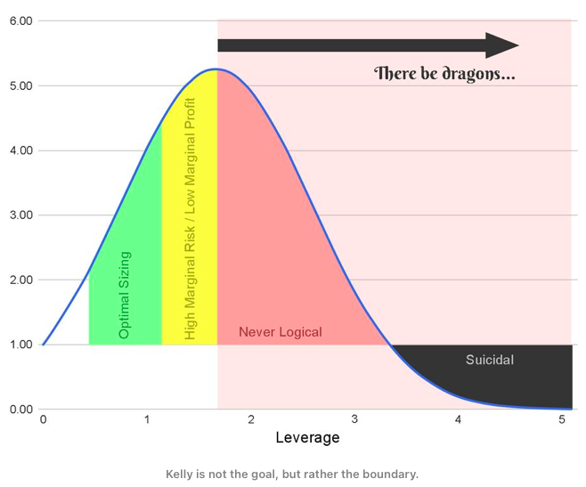

## Table of Contents

## What is leverage in the context of investing?

Leverage in investing means using borrowed money to increase the potential return on an investment. Imagine you want to buy a house but don't have enough money. You can take a loan from the bank to buy the house. If the value of the house goes up, you can sell it for more than you paid, and after paying back the loan, you keep the profit. This is using leverage because you used borrowed money to make a bigger investment than you could have with just your own money.

However, leverage can be risky. If the value of the house goes down instead of up, you still have to pay back the loan. If you can't, you could lose the house and any money you put into it. So, while leverage can help you make more money if things go well, it can also lead to bigger losses if things go badly. It's like a double-edged sword in investing.

## Why should investors be cautious about using excessive leverage?

Investors should be careful about using too much leverage because it can lead to big losses. When you borrow money to invest, you're betting that your investment will grow enough to pay back the loan and still leave you with a profit. But if the investment doesn't do well, you still have to pay back the money you borrowed. This means you could lose not just your initial investment, but also end up owing more money than you started with.

Using too much leverage can also make your financial situation very unstable. If the market goes down, even a little bit, your losses can be much bigger because you're using borrowed money. This can lead to a situation where you have to sell your investments quickly to pay back the loan, often at a loss. It's like walking a tightrope; a small misstep can lead to a big fall. So, it's important for investors to use leverage carefully and understand the risks involved.

## What is the Kelly Criterion and how does it relate to leverage?

The Kelly Criterion is a formula that helps people decide how much money to bet on something to make the most money over time. It was first used for gambling but can also be used for investing. The idea is to figure out the best amount to bet so you grow your money as fast as possible without risking losing everything. The formula looks at how likely you are to win and how much you can win compared to how much you can lose.

When it comes to leverage, the Kelly Criterion can help you decide how much borrowed money to use in your investments. If you use too much leverage, you might make big gains if things go well, but you also risk big losses if they don't. The Kelly Criterion helps you find a balance so you don't use too much leverage. It tells you to only use as much borrowed money as the formula suggests, based on the chances of your investment doing well. This way, you can try to grow your money safely and avoid the big risks that come with using too much leverage.

## How can the Kelly Criterion help in determining optimal bet sizes?

The Kelly Criterion is like a special math trick that helps you figure out how much money to bet on something so you can make the most money over time. It looks at how likely you are to win and how much you can win compared to how much you can lose. If you bet too much, you could lose a lot of money, but if you bet too little, you might not make as much money as you could. The Kelly Criterion helps you find the sweet spot where you can grow your money the fastest without taking too big of a risk.

To use the Kelly Criterion, you need to know two things: the probability of winning and the odds of the bet. For example, if you're betting on a coin flip where you win $2 for every $1 you bet, and the coin is fair, the Kelly Criterion would tell you to bet half of your money. This is because the chance of winning is 50%, and you're getting 2-to-1 odds. By following the Kelly Criterion, you can make sure you're betting the right amount to grow your money over time without risking losing everything in one go.

## What are the basic steps to calculate the Kelly fraction?

To calculate the Kelly fraction, you need to know two things: the chance of winning and the odds of the bet. Let's say you're betting on a game where you have a 60% chance of winning and you win $2 for every $1 you bet. First, you figure out the 'win fraction,' which is the amount you win divided by the amount you bet. In this case, it's $2 divided by $1, which equals 2. Then, you find the 'loss fraction,' which is the amount you lose divided by the amount you bet. Since you bet $1, the loss fraction is 1.

Next, you use these numbers in the Kelly formula: Kelly fraction = (Win probability x Win fraction) - (Loss probability x Loss fraction). The win probability is 60%, or 0.60, and the loss probability is 40%, or 0.40. Plugging in the numbers, you get: Kelly fraction = (0.60 x 2) - (0.40 x 1). That comes out to 1.2 - 0.4, which equals 0.8. So, the Kelly fraction tells you to bet 80% of your money on this bet. This means you should bet a lot because the odds are good, but remember, the Kelly fraction is just a guide and you should always think about how much risk you're comfortable with.

## Can you explain the concept of 'Optimal F' and its purpose?

The concept of 'Optimal F' is a way to figure out how much money to bet to make the most money over time. It's similar to the Kelly Criterion but a bit different. 'Optimal F' looks at how much you can win and how much you can lose, and it tells you the best amount to bet so your money grows as fast as possible. It's called 'Optimal F' because 'F' stands for the fraction of your money you should bet.

The purpose of 'Optimal F' is to help you make smart betting decisions. By using 'Optimal F,' you can find the right balance between betting enough to grow your money quickly and not betting so much that you risk losing everything. It's a useful tool for people who want to make the most out of their bets without taking too much risk.

## How does 'Optimal F' differ from the Kelly Criterion?

'Optimal F' and the Kelly Criterion are both ways to figure out how much money to bet, but they do it a little differently. The Kelly Criterion tells you to bet a certain fraction of your money based on how likely you are to win and how much you can win or lose. It's like a formula that says, "Bet this much to grow your money as fast as possible without risking too much." On the other hand, 'Optimal F' looks at how your bet size affects your money over time. It tries to find the best fraction of your money to bet by testing different amounts and seeing which one makes your money grow the fastest.

While both methods aim to help you make the most money over time, 'Optimal F' can be a bit more flexible. It lets you play around with different bet sizes to see what works best for you. The Kelly Criterion gives you a specific number to bet, but 'Optimal F' can help you find a good bet size even if you don't know the exact chances of winning. Both are useful, but they approach the problem of bet sizing in slightly different ways.

## What are the potential risks of applying the Kelly Criterion or Optimal F in real-world trading?

Using the Kelly Criterion or Optimal F in real-world trading can be risky because these methods assume you know exactly how likely you are to win and how much you can win or lose. But in real life, it's hard to know these things for sure. The stock market can be unpredictable, and things can change quickly. If you bet too much based on what you think will happen, you could lose a lot of money if you're wrong. It's like trying to guess the weather; even if you think it's going to be sunny, it might rain instead.

Another risk is that these methods can make your money grow very fast, but they can also make it shrink very fast if things go badly. If you follow the Kelly Criterion or Optimal F too closely, you might end up betting a lot of money, and if you have a few bad trades in a row, you could lose a big part of your money. It's important to be careful and not bet more than you can afford to lose. Using these methods can help you make smart bets, but you should always think about the risks and maybe bet a little less than what the formula tells you to be safe.

## How can one adjust the Kelly Criterion for more conservative investment strategies?

To make the Kelly Criterion more conservative, you can bet less than what the formula tells you. Instead of betting the full Kelly fraction, you can bet a smaller part of it, like half or a quarter. This way, you're still using the Kelly Criterion to guide your bets, but you're not risking as much money. It's like following a recipe but using less of the main ingredient to make it milder. By betting less, you might not grow your money as fast, but you also won't lose as much if things go wrong.

For example, if the Kelly Criterion says to bet 20% of your money, you could choose to bet only 10% or 5%. This smaller bet size can help you feel more comfortable and reduce the risk of big losses. It's important to find a balance that works for you, where you're still trying to make money but not taking too many chances. Using a smaller fraction of the Kelly bet can help you sleep better at night, knowing that you're being careful with your money.

## What historical examples illustrate the dangers of excessive leverage?

One famous example of the dangers of using too much borrowed money is the story of Long-Term Capital Management (LTCM). LTCM was a [hedge fund](/wiki/hedge-fund-trading-strategies) run by smart people, including some who had won the Nobel Prize. They used a lot of borrowed money to make big bets on the market. At first, they made a lot of money, but then things went wrong. In 1998, the market changed in a way they didn't expect, and their bets lost a lot of value. Because they had borrowed so much money, their losses were huge. They almost caused a big problem for the whole financial system, and the government had to step in to help fix it.

Another example is the 2008 financial crisis. Many banks and financial companies used a lot of borrowed money to buy things like houses and loans. They thought the prices would keep going up, so they borrowed more and more to buy more and more. But when house prices started to fall, they were in big trouble. They couldn't pay back all the money they had borrowed, and many of them went bankrupt. This caused a huge problem that affected the whole world's economy. It showed how dangerous it can be to use too much borrowed money, especially when you're betting on things that might not keep going up in value.

## How do professional traders typically modify Kelly and Optimal F strategies to suit different market conditions?

Professional traders often change how they use the Kelly Criterion and Optimal F to fit different market situations. They know that markets can be unpredictable, so they might bet less than what these formulas suggest. For example, if the market is really up and down, they might use a smaller fraction of the Kelly bet to be safer. They also pay attention to how much the market moves around, called volatility. If the market is very volatile, they might bet even less to avoid big losses. Traders also look at how well their bets have been doing lately. If they've been losing a lot, they might bet smaller amounts until things get better.

Another way traders adjust these strategies is by thinking about how long they want to keep their money in the market. If they're planning to hold onto their investments for a long time, they might be okay with betting a bit more. But if they need to get their money out quickly, they'll bet less to keep things safe. They also consider how much money they have and how much they can afford to lose. If they don't have a lot of money, they'll be more careful and bet smaller amounts. By making these changes, traders can use the Kelly Criterion and Optimal F in a way that works for them, no matter what the market is doing.

## What advanced mathematical models incorporate Kelly and Optimal F for portfolio optimization?

Advanced mathematical models that use Kelly and Optimal F for portfolio optimization help investors figure out the best way to spread their money across different investments. These models take into account how likely each investment is to do well and how much it might win or lose. They use the Kelly Criterion to find the best amount to bet on each investment, making sure the overall portfolio grows as fast as possible without taking too much risk. By using these models, investors can make smarter choices about where to put their money, balancing the chance of making more money with the risk of losing it.

One popular model is the Black-Litterman model, which combines the Kelly Criterion with other ways of thinking about investments. It starts with what the market thinks will happen and then lets investors add their own ideas about which investments might do better or worse. This model uses the Kelly Criterion to figure out how much to bet on each investment based on these ideas, helping to create a portfolio that fits the investor's beliefs and goals. By using these advanced models, investors can feel more confident that they're making the best use of their money, even in tricky market conditions.

## What is the Kelly Criterion and how can it be understood?

John Larry Kelly Jr., a researcher at Bell Labs, introduced the Kelly Criterion in 1956. Originally developed from gambling theories, the Kelly Criterion was designed to calculate optimal bet sizes to maximize the expected geometric growth rate of capital. This method provides a systematic approach to asset allocation and risk management by balancing potential returns with the probability of those returns.

The fundamental idea behind the Kelly Criterion is to find a position size that allows for a consistent increase in capital while minimizing the risk of significant losses. The strategy maximizes the expected logarithm of wealth, effectively seeking a balance between risk and return. Originally intended for binary outcomes, such as winning or losing a bet, the formula has been adapted for partial losses, making it applicable to financial investments and trading scenarios.

The basic formula for the Kelly Criterion is:

$$
f^* = \frac{p \cdot (b + 1) - 1}{b}
$$

where:
- $f^*$ is the fraction of the capital to be wagered or invested,
- $p$ is the probability of winning the trade,
- $b$ represents the ratio of the net return (win) to the amount invested.

In practical financial markets, the Kelly fraction can also be adjusted to safeguard against the possibility of maximum expected losses. This adjustment can involve fractional Kelly strategies, where the calculated Kelly size is often multiplied by a [factor](/wiki/factor-investing) less than one, to protect against [volatility](/wiki/volatility-trading-strategies) and ensure capital preservation. Such adjustments help prevent extreme leverage, which could lead to devastating drawdowns even if theoretically optimal in a mathematical sense. By maintaining a focus on long-term capital growth, the Kelly Criterion helps traders and investors to determine more strategic position sizes, thus promoting a disciplined approach to risk management.

## References & Further Reading

[1]: Kelly, J. L. (1956). ["A New Interpretation of Information Rate."](https://www.princeton.edu/~wbialek/rome/refs/kelly_56.pdf) Bell System Technical Journal, 35(4), 917-926.

[2]: Vince, R. (1992). ["The Mathematics of Money Management: Risk Analysis Techniques for Traders."](https://books.google.com/books/about/The_Mathematics_of_Money_Management.html?id=iUSzmtLJ3AgC) John Wiley & Sons.

[3]: ["Fortune's Formula: The Untold Story of the Scientific Betting System That Beat the Casinos and Wall Street"](https://www.amazon.com/Fortunes-Formula-Scientific-Betting-Casinos/dp/0809045990) by William Poundstone

[4]: Thorp, E. O. (2008). ["The Kelly Criterion in Blackjack, Sports Betting, and the Stock Market."](http://www.eecs.harvard.edu/cs286r/courses/fall12/papers/Thorpe_KellyCriterion2007.pdf) Handbook of Asset and Liability Management: Theory and Methodology.

[5]: Luenberger, D. G. (1998). ["Investment Science."](https://books.google.com/books/about/Investment_Science.html?id=sG5-tABm8vkC) Oxford University Press.