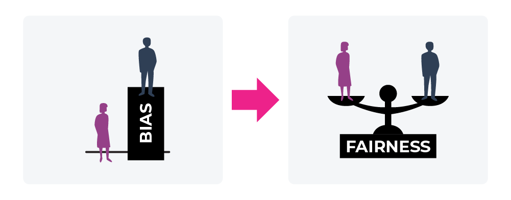

## Table of Contents

## What is bias in the context of machine learning?

Bias in machine learning refers to errors in a model that come from wrong assumptions or simplifications made during the learning process. Imagine you're trying to predict the weather using only the color of the sky. If you assume that a blue sky always means it's sunny, you're making a biased assumption because the sky can be blue even when it's cloudy or about to rain. This kind of bias can lead to models that consistently make the same kind of mistake, like always predicting sunny weather when the sky is blue.

To reduce bias, it's important to use a variety of data and consider many factors when training a model. For example, instead of just looking at the sky's color, you could also consider humidity, wind speed, and temperature to make a more accurate weather prediction. By including more relevant information, the model can learn more about the real patterns in the data and make better predictions. However, finding the right balance is key, as too much complexity can lead to another problem called overfitting, where the model learns the training data too well and doesn't perform well on new data.

## How does bias in machine learning affect fairness and ethics?

Bias in machine learning can lead to unfair outcomes because it can make the model treat certain groups of people differently. For example, if a model used for hiring is trained on data from a company that mostly hires men, it might learn to favor male candidates over equally qualified female candidates. This is unfair because the model's decisions are influenced by biased data, not by the true abilities of the candidates. When this happens, it can harm people and communities, leading to ethical concerns about discrimination and inequality.

To address these issues, it's important to carefully check the data used to train machine learning models. This means looking at the data to see if it represents all groups fairly and making changes if needed. For instance, if the hiring data shows a bias towards men, the company could collect more data on female candidates to balance things out. By doing this, we can create models that make decisions more fairly and ethically, helping to build trust in technology and reduce harm to society.

## What are the common sources of bias in machine learning datasets?

One common source of bias in [machine learning](/wiki/machine-learning) datasets comes from historical data that reflects past biases and inequalities. For example, if a bank uses old loan data to train a model for approving new loans, the model might learn to unfairly reject applications from certain groups if those groups were historically denied loans more often. This happens because the model sees patterns in the data that are actually biased, not because those groups are less likely to repay loans. To fix this, we need to carefully look at the data and adjust it to make sure it doesn't [carry](/wiki/carry-trading) forward old biases.

Another source of bias can come from how data is collected. If the data collection process is not done carefully, it might miss out on including all types of people or situations. For instance, if a health app only collects data from people who can afford smartphones, the data might not represent everyone's health needs, leading to biased models that don't work well for everyone. To avoid this, we should try to collect data in a way that includes everyone and represents the real world as closely as possible.

Lastly, bias can also come from the way data is labeled or categorized. Sometimes, the people labeling the data might have their own biases, which can affect how the data is used to train the model. For example, if images are labeled by people who have certain cultural biases, those biases might show up in how the model sees and understands different groups of people. To reduce this kind of bias, it's helpful to have diverse teams of people labeling the data and to check the labels carefully to make sure they're fair and accurate.

## Can you explain the difference between algorithmic bias and data bias?

Algorithmic bias happens when the way a machine learning model is built or the rules it follows cause it to make unfair decisions. Imagine you're making a recipe for a cake, but the recipe tells you to always use less sugar if the cake is for someone with a certain name. That's like an algorithm that treats people differently based on unfair rules. Even if the data used to train the model is fair, the algorithm itself can still be biased if it's designed in a way that leads to unfair outcomes.

Data bias, on the other hand, comes from the information used to train the machine learning model. If the data itself is not a good representation of the real world, the model will learn from that biased data and make biased decisions. For example, if a model is trained on pictures of dogs but only includes small dogs, it might not recognize big dogs well. The problem here is not with the algorithm itself, but with the data it's learning from. To fix data bias, we need to make sure the data we use is fair and represents everyone and everything it should.

Both types of bias can lead to unfair results, but they come from different places. Algorithmic bias is about the design and rules of the model, while data bias is about the quality and fairness of the information the model learns from. Understanding the difference helps us know where to look when trying to make machine learning models fairer and more ethical.

## What are some examples of bias in machine learning applications?

One example of bias in machine learning is in facial recognition technology. If a system is mostly trained on pictures of people with lighter skin, it might not work well for people with darker skin. This can cause problems like wrongly identifying people or not recognizing them at all. For instance, a security camera might fail to recognize someone with darker skin, leading to unfair treatment or security issues. This bias comes from the data used to train the system, which didn't include enough variety in skin tones.

Another example is in hiring algorithms. If a company uses a machine learning model to help choose job applicants, but the model is trained on data from a time when the company mostly hired men, the model might learn to favor male candidates. Even if women are just as qualified, the algorithm might still pick men more often. This can lead to fewer women being hired, continuing a cycle of bias and inequality. The problem here is with both the data, which reflects past biases, and possibly the algorithm itself if it's designed to focus on certain traits that unfairly disadvantage women.

## How can bias be measured in machine learning models?

Measuring bias in machine learning models involves checking how the model treats different groups of people. One way to do this is by looking at the model's predictions for different groups and seeing if there are big differences. For example, if a model is used to approve loans, you can compare the approval rates for men and women. If the model approves loans for men more often than for women, even when they have similar qualifications, that might show bias. To do this, you can use something called "disparate impact ratio," which compares the outcomes for different groups. If the ratio is far from 1, it suggests there might be bias.

Another way to measure bias is by using fairness metrics. These are special ways of checking if a model is treating everyone fairly. One common fairness metric is "equalized odds," which looks at how well the model predicts the right outcome for different groups. If the model is good at predicting the right outcome for one group but not for another, that's a sign of bias. You can calculate this by comparing the true positive rates and false positive rates for different groups. If these rates are very different, the model might be biased. By using these methods, we can find and fix bias in machine learning models to make them fairer for everyone.

## What techniques can be used to mitigate bias in machine learning?

One technique to mitigate bias in machine learning is to carefully check and adjust the data used to train the model. This means making sure the data includes all kinds of people and situations, not just a small group. If the data is biased, like if it only has information about one type of person, you can add more data to balance it out. For example, if a model for approving loans is biased against women because it was trained on data from a time when mostly men got loans, you can add more data about women to make it fair. Another way to fix data bias is to use techniques like "reweighting," where you give more importance to underrepresented groups in the data to make sure the model learns about them properly.

Another technique is to change how the model works to reduce bias. This can be done by adding fairness rules to the model's learning process. For example, you can tell the model to make sure its predictions are fair for different groups by using something called "fairness constraints." These constraints help the model balance its accuracy with fairness. Another way is to use "adversarial training," where you train another model to find and fix bias in the main model. This helps make sure the main model doesn't learn biased patterns. By using these techniques, we can make machine learning models fairer and more ethical for everyone.

## How do fairness metrics help in assessing bias in machine learning models?

Fairness metrics help us understand if a machine learning model is treating different groups of people the same way. They do this by comparing how the model performs for different groups, like men and women, or people from different backgrounds. For example, if a model is used to approve loans, a fairness metric can show if the model is more likely to approve loans for men than for women, even if they have the same qualifications. One common fairness metric is the "disparate impact ratio," which compares the outcomes for different groups. If the ratio is far from 1, it suggests there might be bias in the model.

Another important fairness metric is "equalized odds," which looks at how well the model predicts the right outcome for different groups. If the model is good at predicting the right outcome for one group but not for another, that's a sign of bias. You can calculate this by comparing the true positive rates and false positive rates for different groups. If these rates are very different, the model might be biased. By using fairness metrics, we can find and fix bias in machine learning models to make them fairer for everyone.

## What are the ethical considerations when deploying biased machine learning models?

When deploying machine learning models that have bias, there are big ethical problems to think about. If a model treats people differently because of their race, gender, or other personal traits, it can cause harm and unfairness. For example, if a model used for hiring is biased against women, it might keep them from getting jobs they deserve. This can make inequality worse and hurt people's lives and chances. It's not fair, and it goes against the idea that everyone should be treated the same.

To fix this, we need to be careful about how we use these models and make sure they're fair. This means checking the data and the model itself to find and fix any bias. It also means being open about how the model works and what decisions it makes, so people can trust it. If we don't take these steps, we risk causing more harm and losing people's trust in technology. It's important to balance the benefits of machine learning with the need to treat everyone fairly and ethically.

## How does bias impact different demographic groups in machine learning?

Bias in machine learning can affect different demographic groups in unfair ways. For example, if a model used for approving loans is biased, it might approve loans for men more often than for women, even if they have the same financial situation. This can make it harder for women to get the money they need to buy a house or start a business. Similarly, if a model for predicting crime is biased against people from certain neighborhoods, it might wrongly target them more often, leading to unfair treatment and harm to those communities.

To fix this, it's important to check the data used to train the model and make sure it includes everyone fairly. If the data is biased, like if it only has information about one type of person, you can add more data to balance it out. Also, you can change how the model works to reduce bias, like by adding rules that make sure the model treats everyone the same. By doing this, we can make machine learning models fairer and help prevent harm to different demographic groups.

## What role does regulatory compliance play in managing bias in machine learning?

Regulatory compliance helps manage bias in machine learning by setting rules that companies must follow to make sure their models are fair. Governments and organizations create laws and guidelines that say how machine learning models should be used. These rules often require companies to check their models for bias and fix any problems they find. For example, laws might say that a model used for hiring must treat men and women the same way. If a company doesn't follow these rules, they could get in trouble and have to pay fines. This pushes companies to take bias seriously and work hard to make their models fair for everyone.

By having these rules, regulatory compliance helps protect people from being treated unfairly by machine learning models. It makes companies think about the impact of their models on different groups of people and take steps to reduce bias. For instance, if a model used for approving loans is found to be biased against certain groups, the company might need to change the data it uses or how the model works to make it fair. This not only helps prevent harm to individuals but also builds trust in technology. When people know that there are rules in place to make sure models are fair, they are more likely to trust and use them.

## How can organizations implement a bias audit in their machine learning pipelines?

To implement a bias audit in their machine learning pipelines, organizations should start by setting clear goals for what they want to check and fix. This means deciding which groups of people they want to make sure the model treats fairly, like men and women or different races. They can then collect data that includes everyone fairly and use this data to train and test the model. During the audit, they should look at the model's predictions and see if there are big differences in how it treats different groups. They can use fairness metrics, like the disparate impact ratio, to measure this. If the ratio is far from 1, it suggests there might be bias. By doing this, organizations can find where the bias is coming from and work on fixing it.

Once the bias is found, organizations can take steps to reduce it. This might mean changing the data they use to train the model, like adding more data about underrepresented groups. They can also change how the model works by adding rules that make sure it treats everyone the same. For example, they might use fairness constraints to make the model balance its accuracy with fairness. It's also important to keep checking the model over time to make sure it stays fair. By doing regular bias audits, organizations can make sure their machine learning models are treating everyone fairly and not causing harm.