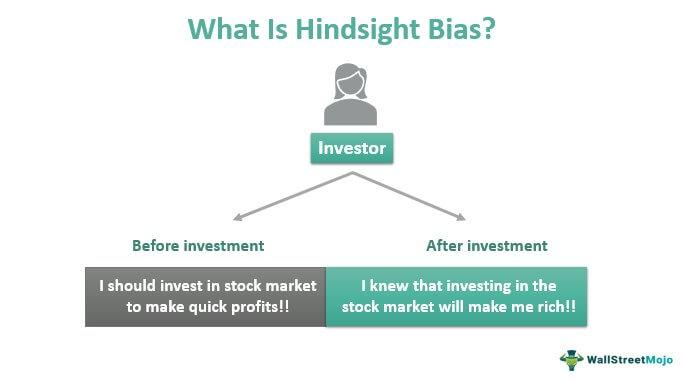

Algorithmic trading, renowned for its unparalleled precision and velocity, is not exempt from the inherent pitfalls of human bias. These biases, often subtle and unintentional, can permeate the very fabric of trading algorithms, affecting their efficiency and decision-making capabilities. Despite the reliance on data-driven strategies, the reality is that these systems are conceived, constructed, and maintained by humans, who may subconsciously impose their cognitive predispositions onto the trading models.

The impact of such biases is profound, influencing market outcomes and trading strategies. For both seasoned traders and novices, understanding the presence and implications of these biases is essential to successfully navigate the complexities of the modern financial landscape. Algorithmic systems, designed to capitalize on minute market discrepancies in milliseconds, can inadvertently propagate biases, leading to skewed results or suboptimal performance. This can be particularly concerning when trading large volumes, where even a small bias can result in significant financial ramifications.

The primary aim of this article is to explore the various cognitive biases that pervade algorithmic trading systems and to provide actionable insights on mitigating their influence. By recognizing and understanding these biases, traders can enhance the robustness of their systems, ensuring that their algorithms function as intended, free from undue subjective influence. As the trading environment becomes increasingly automated and reliant on sophisticated algorithms, the need for heightened awareness and effective management of cognitive biases becomes increasingly vital for maintaining market integrity and achieving desirable trading outcomes.

## Table of Contents

## What is Bias in Algorithmic Trading?

Bias in [algorithmic trading](/wiki/algorithmic-trading) refers to systematic errors that occur due to subjective human judgment, leading to inefficiencies and potential losses. These biases often find their way into the system during the design phase when developers influence trading algorithms with skewed assumptions or interpretations derived from historical data. For instance, if a developer has a preconceived notion about a particular market trend, they may inadvertently encode these beliefs into the algorithm, resulting in a model that emphasizes certain signals while disregarding others, irrespective of the evolving market dynamics.

A common source of bias is the training data itself. Historical market data, used for developing trading algorithms, may not always represent future conditions. If an algorithm is designed primarily using data from a bullish market period, it may perform suboptimally in a bearish scenario as it might be biased towards identifying upward trends. This issue underscores the necessity of diverse and representative datasets during the algorithm development stage.

Machines, despite operating based on data-driven models, can exacerbate these biases if not properly managed. For example, [machine learning](/wiki/machine-learning) algorithms, left unchecked, may overfit the training data, capturing noise instead of meaningful patterns. This can lead to poor generalization to new, unseen market data. Overfitting occurs when a model learns the training data too well, including its anomalies and noise, which can severely limit its predictive power and adaptability.

In algorithmic trading, it is crucial to identify and rectify biases early in the process to avoid compounding errors and inefficiencies. This involves rigorous [backtesting](/wiki/backtesting), validation, and continuous monitoring of algorithm performance across different market conditions. Implementing robust validation techniques and stress-testing algorithms against varied scenarios can help mitigate the impact of bias. Furthermore, introducing a feedback loop whereby models are regularly updated with fresh data can enhance their ability to adapt to new market realities, thereby reducing bias over time.

In summary, understanding and managing bias in algorithmic trading is crucial for minimizing errors and optimizing decision-making processes. By recognizing the human component in algorithm design and the limitations of historical data, traders and developers can take proactive measures to minimize bias and enhance the overall efficacy of trading systems.

## Types of Cognitive Biases in Algo Trading

Algorithmic trading, increasingly pivotal in financial markets, is susceptible to various cognitive biases that stem from human intervention in the system's design and execution. These biases can lead to inefficiencies and potential financial losses. Understanding these biases is crucial for optimizing trading algorithms and minimizing risk.

**Confirmation Bias** is a common cognitive bias in algorithmic trading, where traders and developers tend to prioritize information that corroborates their preconceived notions about market trends or specific strategies, while disregarding contradictory evidence. This bias can result in a narrow focus during data analysis and model building, potentially leading to skewed results and poor trading decisions. For instance, if a trader believes that a certain stock will rise, they may only focus on data that supports this view and overlook indicators suggesting a decline.

**Overconfidence Bias** occurs when traders and developers overestimate their ability to predict market movements or the effectiveness of their trading algorithms. This bias can lead to excessive risk-taking and inadequate contingency planning. Developers may believe that their models are more accurate than they actually are, resulting in an underestimation of risks and improper capital allocation.

**Hindsight Bias** refers to the tendency of individuals to believe, after an event has occurred, that they had accurately predicted its outcome. This bias can significantly affect post-trade evaluations and learning processes. Traders might incorrectly assume they anticipated market moves, leading to inaccurate assessments of their strategies' effectiveness and potentially masking systemic flaws in their algorithms.

**Availability Bias** influences traders to base their decisions on information that is most readily available, rather than thoroughly analyzing all relevant data. This can be particularly problematic in fast-paced trading environments where decisions must be made quickly. A trader may rely on recent news headlines or reports without conducting a comprehensive analysis, possibly resulting in uninformed or misguided trades.

**Anchoring Bias** involves the undue emphasis placed on an initial piece of information or data point, such as an entry stock price, which can skew subsequent decision making. Traders or algorithm designers might anchor their expectations on initial conditions and ignore new data that conflicts with this initial outlook. This can prevent traders from adjusting their strategies to better fit evolving market conditions.

Combating these biases requires careful design and validation of trading algorithms, as well as ongoing education and awareness for those involved in their development and use. Incorporating diverse data sources, using peer reviews, and adopting adaptive learning systems can help mitigate such biases, enhancing the overall robustness and performance of algorithmic trading systems.

## Techniques for Managing Cognitive Biases

To effectively manage cognitive biases in algorithmic trading, several strategies can be adopted. The first critical step involves raising awareness about the existence and impact of biases. Acknowledging these biases allows traders and developers to systematically address them within trading algorithms. This awareness must be built through comprehensive education and ongoing training that highlights the different types of biases and their potential effects on trading outcomes.

Implementing rules-based trading frameworks is another important technique. These frameworks rely on pre-determined rules and conditions to execute trades, thereby minimizing subjective human intervention. By defining clear criteria for trading actions, rules-based systems help in reducing the influence of personal biases. For instance, instead of relying on instinct or recent market news, a rules-based approach will execute trades based on established criteria such as moving averages or relative strength indices.

Feedback loops and peer reviews serve as valuable tools in identifying and mitigating biases. Regular reviews and audits of trading algorithms by independent peers can provide insights into overlooked biases and areas of improvement. Through these feedback mechanisms, developers and traders are exposed to different perspectives, making it easier to identify assumptions and biases that may have been ingrained during the design and development phases.

The use of machine learning models offers another promising avenue for counteracting biases. Machine learning algorithms can be designed to automatically adapt and learn from new data inputs. By continuously updating models with fresh data, these systems can identify patterns and anomalies that reduce the impact of existing biases. Moreover, the adaptability of machine learning models enables them to become increasingly accurate and reliable over time, as they are less likely to be confined by the biases present in historical datasets.

Incorporating these techniques requires an ongoing commitment to revising and improving trading strategies. As the market environment evolves, continuously updating training frameworks and machine learning models ensures that biases do not hinder algorithmic performance. By fostering a culture of awareness, utilizing structured frameworks, and leveraging adaptive technologies, cognitive biases can be more effectively managed in algorithmic trading.

## Case Studies of Bias in Algorithmic Trading

Bias in algorithmic trading has led to significant financial repercussions across several historical instances, accentuating the importance of ongoing vigilance and adaptation within trading systems. Below are some illustrative case studies demonstrating where and how biases have impacted trading outcomes. 

A notable example is the 2012 incident involving Knight Capital Group. The firm experienced a severe trading disruption due to an unrecognized bias embedded within its trading software. This bias was rooted in the legacy code that was accidentally reactivated, resulting in erroneous trade executions amounting to losses of approximately $440 million within 45 minutes. This event underscores the impact of design-related biases and the necessity for thorough code review and rigorous testing protocols, particularly during software updates or system overhauls.

Another significant incident occurred with the sale of "flash crash" in May 2010, where the Dow Jones Industrial Average dropped about 1,000 points in minutes, then recovered most of those losses. Although high-frequency trading algorithms were not solely responsible, the rapid exacerbation of the crash was partly due to trading strategies embedded with anchoring and overconfidence biases. These algorithms acted on limited data inputs without adjusting to real-time market conditions, triggering a cascade of sell orders and illustrating the need for adaptive, real-time algorithmic adjustments.

Additionally, during the early 2000s, Long-Term Capital Management (LTCM), a highly-leveraged [hedge fund](/wiki/hedge-fund-trading-strategies), experienced catastrophic losses due to the confirmation and overconfidence biases within their quantitative models. The firm relied heavily on historical data assumptions, neglecting the low-probability, high-impact events (black swan events) and overestimating the precision of their risk assessment. The subsequent market turmoil stressed the importance of consideration for unforeseen variables and the biases that might skew these risk assessments in the design and operation of algorithmic systems.

These case studies highlight the crucial need for ongoing evaluation and agile improvement in trading strategies. They demonstrate that biases, whether in code, model assumptions, or unanticipated market reactions, can have extensive financial implications. The field should embrace a proactive stance on bias identification and mitigation, utilizing rigorous system checks, validation processes, and continuous updates to trading algorithms to safeguard against unforeseen biases while enhancing algorithmic robustness.

## Ethical Implications of Bias in Trading Algorithms

Biases in algorithmic trading not only affect profitability but also raise ethical concerns regarding fairness and transparency. Trading algorithms that exhibit bias can lead to market manipulation or unethical practices, ultimately shaking investor confidence. These biases often manifest in various forms, including unequal access to trading insights and preferential treatment for certain market participants. For instance, an algorithm may inadvertently favor larger trades over smaller ones due to its design, leading to unequal trading conditions.

Moreover, biases in trading systems can result in decisions based on skewed or incomplete data, potentially leading to market distortions. When trading algorithms consistently favor certain outcomes or strategies, they can inadvertently contribute to systemic risks within the financial markets. This is especially concerning when the biases are subtle and embedded within complex models, making them difficult to detect and rectify.

The ethical implications of biased trading algorithms extend beyond individual traders and affect the broader market ecosystem. Algorithms that operate without transparency and fairness undermine the trust necessary for healthy market functioning. Investors rely on fair and equitable trading practices, and the presence of bias erodes this trust, potentially deterring market participation.

Regulatory bodies play a crucial role in enforcing ethical standards and implementing bias detection measures to maintain market integrity. They are responsible for setting guidelines that ensure algorithms operate transparently and without favoritism. These regulations may include requirements for regular audits of trading algorithms, disclosure of algorithmic strategies, and stringent testing for bias before deployment.

Additionally, regulatory agencies advocate for improved technological solutions to detect and mitigate bias. This includes developing metrics and tools for evaluating the fairness of algorithms and encouraging the use of advanced machine learning techniques that can identify and correct biases in real-time. Through these initiatives, regulatory bodies aim to create an environment where ethical trading practices are standard, not an exception.

In conclusion, addressing the ethical implications of bias in algorithmic trading requires a multifaceted approach involving regulatory oversight, technological advancements, and a commitment to transparency. This ensures that trading algorithms contribute positively to market dynamics and uphold the principles of fairness and integrity.

## Conclusion and Recommendations

Cognitive biases are a significant yet addressable challenge in algorithmic trading. Algorithms, while precise and data-driven, are not immune to the biases introduced by the human developers who design and manage them. These biases can distort trading decisions, leading to inefficiencies and potential financial losses. However, through strategic implementation of solutions combining technology and human judgment, the impact of these biases can be effectively managed.

One key approach to mitigating cognitive biases is to employ technological solutions that enhance objectivity and reduce reliance on subjective human judgment. Utilizing advanced machine learning models that continually adapt and learn from diverse data sets can serve to counter entrenched biases. These models can identify patterns and anomalies that may not be immediately apparent to human traders, thereby reducing the risk of overconfidence or reliance on limited information. For instance, employing reinforced learning algorithms can adjust trading strategies based on real-time feedback, minimizing the influence of any single biased input.

Human oversight remains crucial alongside technological interventions. The complexities of the market and the subtleties of human judgment necessitate a balanced approach. Traders should cultivate awareness of their own cognitive biases and engage in ongoing education to stay informed about the latest developments and techniques in algorithmic trading. Peer reviews and constructive feedback loops within trading teams can further help to identify and rectify biases that might otherwise go unnoticed. Encouraging an environment where team members can point out potential biases ensures that varied perspectives contribute to more robust decision-making.

A commitment to ongoing improvement in systems and processes is essential. As market conditions and data inputs evolve, so too must the algorithms that drive trading strategies. Regularly updating algorithms to refine their predictive capabilities and performance under diverse conditions can help in minimizing the influence of cognitive biases. This continuous learning approach not only helps in maintaining competitive advantage but also ensures ethical and transparent trading practices.

As traders increasingly depend on complex algorithms, a comprehensive understanding and proactive management of cognitive biases become critically important. A strategic combination of cutting-edge technology and insightful human intervention forms the backbone of a resilient and effective trading system, capable of navigating the nuanced challenges posed by cognitive biases in algorithmic trading.

## References & Further Reading

[1]: Bergstra, J., Bardenet, R., Bengio, Y., & Kégl, B. (2011). ["Algorithms for Hyper-Parameter Optimization."](https://papers.nips.cc/paper/4443-algorithms-for-hyper-parameter-optimization) Advances in Neural Information Processing Systems 24.

[2]: ["Advances in Financial Machine Learning"](https://www.amazon.com/Advances-Financial-Machine-Learning-Marcos/dp/1119482089) by Marcos Lopez de Prado

[3]: ["Evidence-Based Technical Analysis: Applying the Scientific Method and Statistical Inference to Trading Signals"](https://www.amazon.com/Evidence-Based-Technical-Analysis-Scientific-Statistical/dp/0470008741) by David Aronson

[4]: ["Machine Learning for Algorithmic Trading"](https://github.com/stefan-jansen/machine-learning-for-trading) by Stefan Jansen

[5]: ["Quantitative Trading: How to Build Your Own Algorithmic Trading Business"](https://books.google.com/books/about/Quantitative_Trading.html?id=j70yEAAAQBAJ) by Ernest P. Chan