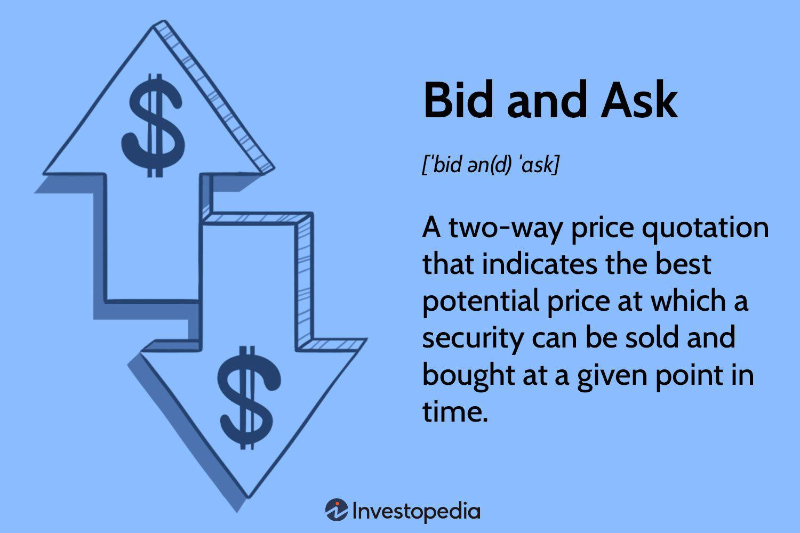

In financial markets, the concepts of bid and ask prices are fundamental to trading operations. The bid price is the highest amount a buyer is willing to pay for an asset, whereas the ask price represents the lowest amount a seller is prepared to accept. The difference between these prices is known as the bid-ask spread, which is a crucial indicator of market liquidity and transaction costs. For any trader, whether operating manually or through sophisticated algorithms, understanding these prices is essential for executing trades efficiently and optimizing returns.

With the advancement of technology, algorithmic trading has become a dominant force in financial markets, profoundly altering the interaction dynamics of bid and ask prices. Algorithms can process vast amounts of data in real time, allowing them to identify and exploit even minor spread fluctuations with exceptional speed and precision. This has led to the widespread use of algorithmic strategies designed to navigate, predict, and capitalize on bid and ask price movements.



The impact of algorithmic trading on bid and ask prices is particularly significant in contexts where rapid execution and market liquidity are paramount. Algorithms not only improve trade execution efficiency but also contribute to the overall reduction of bid-ask spreads, thereby enhancing market fluidity. This exploration highlights how the determination and interaction of bid and ask prices are influenced by the sophisticated machine-driven algorithms that define contemporary trading systems.

## Table of Contents

## Understanding the Bid and Ask Spread

The spread between bid and ask prices serves as a pivotal measure of liquidity in financial markets. Liquidity, in this context, refers to the ease with which an asset can be bought or sold in the market without causing a significant impact on its price. A narrow bid-ask spread typically indicates a liquid market where financial instruments can be traded quickly and cost-effectively. This is because a smaller spread reflects the presence of numerous buyers and sellers willing to transact at prices close to one another, facilitating immediate trade executions.

Conversely, a wide bid-ask spread suggests reduced market liquidity and could lead to higher transaction costs for traders. In these scenarios, the disparity between what buyers are willing to pay (bid) and what sellers accept (ask) is broader, making trades less efficient and potentially more expensive. Traders might face slippage, where the execution price deviates from the expected price, further impacting profits.

Several factors contribute to the size of the bid-ask spread, with trading volume and market volatility being among the most influential. High trading volumes usually correspond with tighter spreads, as they indicate an active market with fierce competition among traders leading to closer bid and ask prices. Meanwhile, increased market volatility often leads to wider spreads, as uncertainty about price movements prompts traders to demand larger compensation for the risks involved.

For traders, understanding the subtleties of the bid-ask spread is instrumental in devising effective trading strategies. When the spread is narrow, traders can exploit quick entry and [exit](/wiki/exit-strategy) opportunities without incurring significant costs. In contrast, in markets with wider spreads, traders need to be more strategic, often waiting for more favorable conditions or employing tactics to mitigate potential losses.

In summary, the bid-ask spread is more than just a number; it encapsulates market sentiment, [liquidity](/wiki/liquidity-risk-premium) dynamics, and trading costs, making it a fundamental concept for active participants in financial markets. Mastery of this concept aids traders in optimizing their approach, reducing costs, and enhancing their overall trade execution strategy.

## Algorithmic Trading and the Bid-Ask Spread

Algorithmic trading relies on sophisticated computer algorithms to execute trades at remarkable speeds, effectively leveraging bid-ask spreads. These algorithms are programmed to analyze large datasets in real-time, detecting and responding to fluctuations in bid-ask spreads to identify profitable trading opportunities. This process involves parsing through various data sources, including market data feeds and historical prices, to develop mathematical models that predict short-term price movements and capitalize on spread variations.

High-frequency trading ([HFT](/wiki/high-frequency-trading-strategies)) represents a significant segment of [algorithmic trading](/wiki/algorithmic-trading), where traders utilize the ability to execute thousands of trades per second to exploit minimal price inefficiencies, including bid-ask spreads. HFT firms design algorithms to swiftly react to market conditions, executing trades at optimal prices before competitors can do so. This rapid execution capability allows traders to benefit from transient discrepancies between bid and ask prices, contributing significantly to their overall profit margins.

A key contribution of algorithmic trading is the enhancement of market liquidity. By continuously placing and updating orders, algorithms help narrow bid-ask spreads, thus reducing the cost of trading for all market participants. This increased liquidity stems from the ability of these algorithms to quickly match buyers and sellers, ensuring that trades are executed with minimal delay and price impact.

Technological advancements have further enhanced the precision and efficiency of trading strategies aimed at exploiting bid-ask spreads. Modern trading platforms incorporate [machine learning](/wiki/machine-learning) and big data analytics to refine trading algorithms continually. These technologies enable more accurate predictions of market movements and optimize the execution of trades based on current market conditions.

For example, consider the following simplified Python snippet that illustrates a basic algorithmic trading strategy targeting bid-ask spreads:

```python
import numpy as np

# Simulation parameters
price_movement = np.random.normal(0, 1, 1000)  # Simulated price changes
bid_ask_spread = 0.02  # Fixed bid-ask spread

# Trading algorithm
capital = 10000
shares = 0
for movement in price_movement:
    if movement > bid_ask_spread:
        # Buy signal
        shares += capital // (100 + bid_ask_spread)
        capital -= shares * (100 + bid_ask_spread)
    elif movement < -bid_ask_spread:
        # Sell signal
        capital += shares * (100 - bid_ask_spread)
        shares = 0

# Calculate net capital after simulation
net_capital = capital + shares * 100
print(f"Net capital after trading: ${net_capital:.2f}")
```

In this example, the algorithm enters buy or sell positions based on the simulated price movement relative to a fixed bid-ask spread, demonstrating how such strategies might operate in a simplified context. Through continuous innovation and adaptation to market dynamics, traders employing algorithmic strategies can maintain competitiveness and profitability by efficiently managing and exploiting bid-ask spreads.

## Strategies for Trading the Bid-Ask Spread

Various trading strategies are crafted to capitalize on bid-ask spreads, particularly within algorithmic frameworks. These strategies are designed to leverage the dynamics of bid and ask prices for profit. 

Market making is a fundamental strategy within this domain. It involves continuously placing buy and sell orders to profit from the bid-ask spread while simultaneously providing liquidity to the market. Market makers aim to benefit from the small differences between the bid and ask prices by buying at the bid price and selling at the ask price. This strategy relies heavily on speed and [volume](/wiki/volume-trading-strategy) to maximize the frequency and profitability of trades.

Algorithmic [arbitrage](/wiki/arbitrage) strategies are employed to exploit pricing discrepancies across different markets or assets. These strategies are contingent upon the ability to execute trades at high speeds, thus making them especially suitable for algorithmic trading. By identifying mispricings and arbitraging these differences, traders can lock in risk-free profits. The speed of execution is critical in these strategies, as price discrepancies are often minimal and short-lived.

Scalping is another strategy focused on capitalizing on bid-ask spreads. It involves executing a large number of tiny trades to take advantage of small price changes. Scalpers aim for numerous small gains and rely on [high frequency](/wiki/high-frequency-trading), leveraging technology to execute trades quickly and efficiently. The objective is to accumulate a significant profit over time through the sheer volume of trades.

Mean reversion strategies are based on the hypothesis that prices will revert to a historical average or norm over time. Traders utilizing this approach look for deviations from the average as potential trading opportunities. By anticipating price movements back to their mean, traders can capitalize on the temporary widening or narrowing of bid-ask spreads. 

These strategies demand robust technological infrastructure and sophisticated algorithms to process large volumes of data and execute trades rapidly. The effectiveness of each strategy is influenced by market conditions, the trader's ability to manage risk, and the precision of the algorithmic models employed. Ultimately, success in trading bid-ask spreads depends on an in-depth understanding of market microstructure and the ability to adapt strategies to evolving market conditions.

## Real-World Implications and Examples

Bid-ask spreads and algorithmic trading significantly influence both retail and institutional markets, affecting trading strategies and financial outcomes. In highly liquid markets such as the S&P 500, the presence of narrow bid-ask spreads is advantageous for algorithmic traders who prioritize speed and efficiency. The reduced transaction costs associated with narrow spreads facilitate high-frequency trading, which thrives on processing large volumes of trades quickly to capitalize on these small price differentials. For example, trades executed in milliseconds can profit from even minimal spread fluctuations, emphasizing the role of advanced technology and algorithms.

Conversely, less liquid markets often present wider bid-ask spreads, which increases the risk but also allows for potentially higher profit margins. Traders in these conditions must carefully weigh the benefit of capturing larger spreads against the increased cost and complexity of executing trades. The ability to accurately predict price movements and manage risk becomes paramount in such environments, requiring sophisticated algorithms designed to assess market conditions and execute trades at opportune moments.

Prominent firms like Hudson River Trading exemplify the effective use of intricate algorithms to exploit market inefficiencies, including those related to bid-ask spreads. These firms employ advanced quantitative models and machine learning techniques to identify patterns and forecast changes in spreads, thereby optimizing their trading strategies. The success of such firms highlights the necessity of leveraging cutting-edge technology to maintain a competitive edge in rapidly evolving markets.

Case studies demonstrate the critical role of technology and strategy in trading bid-ask spreads successfully. For instance, the implementation of machine learning models that incorporate natural language processing can enhance decision-making processes by analyzing news sentiment and its impact on market [volatility](/wiki/volatility-trading-strategies). Additionally, the application of [reinforcement learning](/wiki/reinforcement-learning) algorithms allows traders to develop adaptive strategies that learn from market interactions and adjust in real-time to changing conditions.

In summary, the interplay between bid-ask spreads and algorithmic trading shapes the dynamics of financial markets, underscoring the importance of technology-driven strategies. As market participants continue to innovate and refine their approaches, understanding and optimizing bid-ask spread trading remains a vital component of achieving favorable outcomes in both liquid and illiquid markets.

## Challenges and Considerations

Bid-ask spread trading, particularly in the context of algorithmic and high-frequency trading (HFT), presents various challenges and considerations that traders must navigate to maintain profitability. A significant concern is the phenomenon of spread widening during periods of heightened market volatility. As volatility spikes, the uncertainty in the market often leads to a broader spread between bid and ask prices, which can increase transaction costs and reduce profit margins. This necessitates traders to develop strategies that can predict and compensate for such variations.

The cost of high-frequency trading technology is another barrier, especially for smaller traders and firms. Investment in cutting-edge hardware and software is essential to achieve the speed and precision required in HFT. This includes acquiring powerful servers, co-locating in proximity to exchanges to minimize latency, and continuously upgrading algorithmic models. The financial burden of these technological requirements can be prohibitive, creating an entry barrier and favoring well-capitalized firms.

Regulatory frameworks play a critical role in shaping the dynamics of bid-ask spreads. Regulations such as the Markets in Financial Instruments Directive II (MiFID II) in the European Union impose stringent requirements on trading practices, transparency, and reporting. These regulations aim to protect investors and ensure market integrity but can also influence spread dynamics by imposing constraints on trading activities. Compliance with such regulations requires continuous monitoring and adaptation of trading strategies to align with legal mandates while maintaining profitability.

Continuous optimization of trading strategies is crucial in the fast-paced environment of bid-ask spread trading. Algorithmic models must be regularly refined to respond to changing market conditions and evolving patterns in spread behavior. Moreover, effective risk management is paramount, as the high-speed nature of HFT can exponentially amplify losses if a strategy underperforms or the market behaves unpredictably.

Adapting to market conditions and regulatory changes is essential for sustainable success in trading bid-ask spreads. This includes not only adjusting to technical and legal shifts but also anticipating broader economic trends and their potential impact on market liquidity and spread patterns. Traders must cultivate a robust framework for decision-making that incorporates both quantitative data analysis and qualitative assessments to remain competitive and profitable in an ever-evolving financial landscape.

## Conclusion

The bid-ask spread is a pivotal component of market dynamics, playing a crucial role in determining both liquidity and trading efficiency. In modern financial markets, algorithms harness the power of computational precision and speed to efficiently navigate and exploit these spreads, turning even minute market movements into profitable opportunities. As these algorithms continuously evolve, they drive the need for adaptive trading strategies capable of performing under a myriad of market conditions.

Advanced technologies and strategic methodologies are indispensable tools for traders who aim to navigate the complexities of today's financial landscapes. The application of sophisticated algorithmic systems allows for precise execution and rapid response to market fluctuations, which is particularly important given the fast-paced nature of current trading environments. These systems often employ machine learning techniques to enhance their adaptability and efficacy, adjusting tactics based on real-time data analysis and historical market behavior.

To remain competitive and optimize trading outcomes, traders must maintain a comprehensive understanding of ongoing market trends and the regulatory landscapes within which they operate. For instance, regulations such as MiFID II and others can significantly impact spread dynamics and necessitate compliance adaptations. Staying informed on such developments ensures that trading strategies remain legally compliant and effectively aligned with prevailing market conditions.

Ultimately, success in trading bid-ask spreads is contingent upon a trader's ability to innovate and adapt. The ever-changing nature of financial markets demands a flexible approach, where traders continuously refine their strategies and leverage cutting-edge technology to sustain profitability. By embracing innovation and maintaining a keen awareness of market shifts, traders can effectively harness the potential of bid-ask spread trading in today's dynamic environment.

## References & Further Reading

- **Harris, L. - 'Trading & Exchanges: Market Microstructure for Practitioners'**: This book provides a comprehensive analysis of market microstructure, explaining the mechanisms of financial exchanges. It covers the fundamental concepts related to bid and ask prices, liquidity, and trading strategies, offering insights into the intricacies of market interactions and the importance of efficient trade executions.

- **Lopez de Prado, M. - 'Advances in Financial Machine Learning'**: Lopez de Prado’s work is crucial for understanding the integration of machine learning into financial trading. It explores how advanced algorithms process large datasets to optimize trading decisions, particularly in the context of analyzing bid-ask spreads and identifying profitable opportunities.

- **Jansen, S. - 'Machine Learning for Algorithmic Trading'**: This resource provides practical guidance on applying machine learning techniques to algorithmic trading. It stresses the importance of data analysis and prediction in developing models that efficiently exploit market spreads. Jansen’s book includes examples of how machine learning can enhance trade execution and performance.

- **Aldridge, I. - 'High-Frequency Trading: A Practical Guide to Algorithmic Strategies and Trading Systems'**: Aldridge offers an in-depth exploration of high-frequency trading (HFT) and its role in modern financial markets. The book discusses the technical and strategic aspects of HFT, focusing on how traders can capitalize on bid-ask spreads through rapid execution and sophisticated algorithms.

- **Chan, E. P. - 'Quantitative Trading: How to Build Your Own Algorithmic Trading Business'**: Chan details the steps to creating an algorithmic trading business, illustrating how quantitative methods can be used to develop trading strategies. This work provides insights into harnessing bid-ask spreads for profit through quantitative analysis and systematic trading approaches.

- **Hull, J. C. - 'Options, Futures, and Other Derivatives'**: Hull's renowned book covers the fundamentals and advanced concepts in derivatives trading. While it is primarily focused on options and futures, it provides a solid understanding of how bid-ask spreads are relevant in the pricing and trading of derivative instruments, reinforcing the significance of liquidity and precise execution in financial markets.

