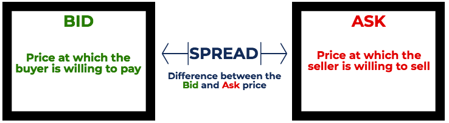

## Table of Contents

## What are bid and ask prices?

The bid price is the highest price that someone is willing to pay to buy a stock or other financial asset at a given time. It's like when you're at a store, and you see the highest amount someone is offering to buy an item from another person. In the stock market, this is the price that buyers are willing to pay.

The ask price, on the other hand, is the lowest price that someone is willing to accept to sell a stock or other financial asset. Think of it as the lowest amount a seller is asking for their item in a store. In the stock market, this is the price that sellers are willing to take to sell their shares.

The difference between the bid and ask prices is called the bid-ask spread. This spread can tell you how easy or hard it might be to trade that stock. A smaller spread usually means it's easier to buy and sell, while a larger spread can mean it's harder.

## How do bid and ask prices affect trading?

Bid and ask prices are really important when you're trading because they tell you the current prices for buying and selling a stock. If you want to buy a stock, you'll have to pay the ask price, which is the lowest price a seller is willing to take. If you want to sell a stock, you'll get the bid price, which is the highest price a buyer is willing to pay. The difference between these two prices, called the bid-ask spread, can affect how much money you make or lose when you trade.

The bid-ask spread can also show you how easy or hard it might be to trade a stock. If the spread is small, it means there are a lot of people wanting to buy and sell, so it's easier to make a trade. But if the spread is big, it might be harder to buy or sell because there aren't as many people interested. This can make trading more expensive because you might have to pay more to buy or get less when you sell. So, understanding bid and ask prices can help you make better trading decisions.

## What is the difference between the bid and ask price?

The bid price is the highest amount someone is willing to pay to buy a stock or other financial asset at a given time. It's what buyers are ready to spend to get the stock. On the other hand, the ask price is the lowest amount someone is willing to accept to sell a stock or other financial asset. It's what sellers want to receive for their stock.

The difference between the bid and ask prices is called the bid-ask spread. This spread is important because it shows how easy or hard it might be to trade the stock. A small spread means there are lots of buyers and sellers, making it easier to trade. A big spread means fewer people are interested, which can make trading more expensive because you might have to pay more to buy or get less when you sell.

## How are bid and ask prices determined in the market?

Bid and ask prices are set by the people who want to buy and sell stocks in the market. When someone wants to buy a stock, they offer a price they're willing to pay, which becomes the bid price. The highest bid price at any moment is what you see as the current bid price. On the other hand, when someone wants to sell a stock, they set a price they're willing to accept, which is the ask price. The lowest ask price at any moment is what you see as the current ask price.

These prices change all the time because lots of people are buying and selling. If more people want to buy a stock than sell it, the bid price might go up because buyers are willing to pay more. If more people want to sell than buy, the ask price might go down because sellers are willing to take less. The difference between the bid and ask price, called the bid-ask spread, can be small if lots of people are trading, or big if fewer people are interested. This spread helps show how easy or hard it is to trade that stock at any given time.

## What is the bid-ask spread and why is it important?

The bid-ask spread is the difference between the highest price someone is willing to pay to buy a stock (the bid price) and the lowest price someone is willing to accept to sell that stock (the ask price). It's like the gap between what buyers want to pay and what sellers want to get. This spread is always changing because it's based on what people in the market are offering at any moment.

The bid-ask spread is important because it shows how easy or hard it is to buy or sell a stock. If the spread is small, it means there are lots of people wanting to buy and sell, so trading is easier and cheaper. But if the spread is big, it can be harder to trade because there aren't as many people interested. This can make trading more expensive because you might have to pay more to buy or get less when you sell. Understanding the bid-ask spread can help you make better decisions when you're trading.

## Can you explain the role of market makers in setting bid and ask prices?

Market makers are important people in the stock market who help make trading easier. They do this by always being ready to buy and sell stocks. When you want to buy a stock, market makers set the ask price, which is the lowest price they're willing to sell the stock for. When you want to sell a stock, they set the bid price, which is the highest price they're willing to buy it for. By doing this, market makers make sure there's always a price for you to buy or sell, even if there aren't many other people trading.

The prices that market makers set can change all the time. They look at how many people want to buy and sell, and they adjust their prices to make a little profit from the difference between the bid and ask prices. This difference is called the bid-ask spread. If lots of people want to trade, the spread can be small because it's easy for market makers to find someone to buy or sell to. But if fewer people are trading, the spread might be bigger because it's harder for market makers to match buyers and sellers. This is why market makers are so important—they help keep the market moving smoothly.

## How do liquidity and volume impact bid and ask prices?

Liquidity and [volume](/wiki/volume-trading-strategy) are important because they affect how easy or hard it is to trade a stock, and they can change the bid and ask prices. Liquidity means how quickly you can buy or sell a stock without affecting its price too much. If a stock has high [liquidity](/wiki/liquidity-risk-premium), there are lots of people wanting to buy and sell it. This usually makes the bid-ask spread smaller because it's easier for market makers to match buyers and sellers. When there's high volume, or a lot of trading happening, it can also make the spread smaller because there are more people in the market, so it's easier to find someone to trade with.

On the other hand, if a stock has low liquidity, it means fewer people are interested in trading it. This can make the bid-ask spread bigger because it's harder for market makers to find someone to buy or sell to. When there's low volume, or not much trading happening, the spread can also be bigger because there are fewer people in the market. So, when you're looking at bid and ask prices, remember that liquidity and volume can make a big difference in how easy it is to trade and how much you might pay or get for a stock.

## What are some strategies traders use to take advantage of bid and ask prices?

Traders use different strategies to make the most of bid and ask prices. One common strategy is called [scalping](/wiki/gamma-scalping). This is when traders quickly buy a stock at the bid price and then sell it at the ask price, making a small profit from the difference, which is the bid-ask spread. They do this many times in a day, hoping that the small profits add up. This works best with stocks that have a lot of trading and a small spread, because it's easier to buy and sell quickly without losing much money.

Another strategy is to use limit orders. Instead of buying at the current ask price or selling at the current bid price, traders can set a limit order to buy or sell at a specific price they choose. This can help them get a better deal if they think the stock's price will move in their favor. For example, if the ask price is too high, a trader might set a limit order to buy at a lower price, hoping the price will drop to that level. This strategy needs patience and a good understanding of how the stock's price might change.

Some traders also look at the [order book](/wiki/order-book-trading-strategies), which shows all the current bid and ask prices. By studying the order book, they can see where there are a lot of buy or sell orders and guess where the price might go next. If they see a lot of buy orders at a certain price, they might think the price will go up and decide to buy before it does. This strategy can help them make better trading decisions by using the information about what other people are doing in the market.

## How do bid and ask prices vary across different types of financial instruments?

Bid and ask prices can be different for different types of financial instruments like stocks, bonds, commodities, and currencies. Stocks usually have pretty tight bid-ask spreads, especially if they are popular and lots of people want to buy and sell them. This is because there are many traders and market makers working to keep the prices close together. On the other hand, stocks that are not traded as often might have bigger spreads because there are fewer people interested in them, making it harder to find someone to trade with.

For bonds and commodities, the bid-ask spreads can be bigger than for stocks. Bonds, especially those that are not as common, can have larger spreads because they are traded less often. Commodities like gold or oil might also have bigger spreads, especially if they are not as liquid, meaning fewer people are buying and selling them at any given time. Currencies, which are traded in the foreign exchange market, can have very small spreads if they are major currencies like the US dollar or the euro, but bigger spreads for less common currencies. The difference in spreads across these instruments shows how easy or hard it is to trade them, and it's important for traders to understand this when they are making decisions.

## What impact do economic reports and news events have on bid and ask prices?

Economic reports and news events can really shake up the bid and ask prices of financial instruments. When important news comes out, like a report on jobs or inflation, it can make people think differently about what a stock or other asset is worth. If the news is good, like more people getting jobs, buyers might want to pay more, so the bid price goes up. If the news is bad, like higher inflation, sellers might want to sell quicker, so the ask price might go down. This can make the bid-ask spread change a lot in a short time.

These changes can happen fast because traders react quickly to new information. If a news event makes people think a stock will do better in the future, they might rush to buy it, pushing the bid price up. On the other hand, if the news makes people worried, they might want to sell, which can push the ask price down. This is why traders watch economic reports and news closely, because they know it can change the prices they see and affect their trading decisions.

## How can one analyze historical bid and ask data to predict future trends?

Analyzing historical bid and ask data can help traders guess what might happen next with stock prices. By looking at past data, traders can see patterns in how bid and ask prices changed over time. They can notice if the bid-ask spread got bigger or smaller at certain times, or if the prices moved a lot after certain events. This can give them clues about what might happen in the future. For example, if the spread usually gets smaller right before a company reports its earnings, a trader might expect the same thing to happen next time and plan their trades accordingly.

Using this historical data, traders can also make charts and use special math tools to find trends. They might see that the bid price often goes up when there's good news about the economy, or that the ask price drops when there's bad news. By understanding these patterns, traders can make better guesses about where the prices might go next. It's not perfect because the market can be unpredictable, but looking at what happened before can give them a better chance of making smart trading choices.

## What advanced techniques are used by institutional investors to manage bid and ask prices?

Institutional investors, like big banks and investment funds, use fancy ways to handle bid and ask prices. One way they do this is by using algorithms. These are like smart computer programs that can look at a lot of information really fast and decide the best time to buy or sell. They can break up big orders into smaller ones to hide what they're doing and not change the price too much. This is called "[algorithmic trading](/wiki/algorithmic-trading)." It helps them get a better price because they can act quickly and smartly without making the market move against them.

Another way institutional investors manage bid and ask prices is by using something called "dark pools." These are private places where big investors can trade without everyone knowing what they're doing. This can help them buy or sell big amounts of stock without making the price go up or down too much. By using dark pools, they can keep their big trades secret and get a better price because they're not affecting the public market as much. Both of these methods help big investors handle their trades in a way that can save them money and get them the best prices.

## References & Further Reading

- **Harris, L. - 'Trading & Exchanges: Market Microstructure for Practitioners'**: This book provides a comprehensive analysis of market microstructure, explaining the mechanisms of financial exchanges. It covers the fundamental concepts related to bid and ask prices, liquidity, and trading strategies, offering insights into the intricacies of market interactions and the importance of efficient trade executions.

- **Lopez de Prado, M. - 'Advances in Financial Machine Learning'**: Lopez de Prado’s work is crucial for understanding the integration of machine learning into financial trading. It explores how advanced algorithms process large datasets to optimize trading decisions, particularly in the context of analyzing bid-ask spreads and identifying profitable opportunities.

- **Jansen, S. - 'Machine Learning for Algorithmic Trading'**: This resource provides practical guidance on applying machine learning techniques to algorithmic trading. It stresses the importance of data analysis and prediction in developing models that efficiently exploit market spreads. Jansen’s book includes examples of how machine learning can enhance trade execution and performance.

- **Aldridge, I. - 'High-Frequency Trading: A Practical Guide to Algorithmic Strategies and Trading Systems'**: Aldridge offers an in-depth exploration of high-frequency trading (HFT) and its role in modern financial markets. The book discusses the technical and strategic aspects of HFT, focusing on how traders can capitalize on bid-ask spreads through rapid execution and sophisticated algorithms.

- **Chan, E. P. - 'Quantitative Trading: How to Build Your Own Algorithmic Trading Business'**: Chan details the steps to creating an algorithmic trading business, illustrating how quantitative methods can be used to develop trading strategies. This work provides insights into harnessing bid-ask spreads for profit through quantitative analysis and systematic trading approaches.

- **Hull, J. C. - 'Options, Futures, and Other Derivatives'**: Hull's renowned book covers the fundamentals and advanced concepts in derivatives trading. While it is primarily focused on options and futures, it provides a solid understanding of how bid-ask spreads are relevant in the pricing and trading of derivative instruments, reinforcing the significance of liquidity and precise execution in financial markets.

