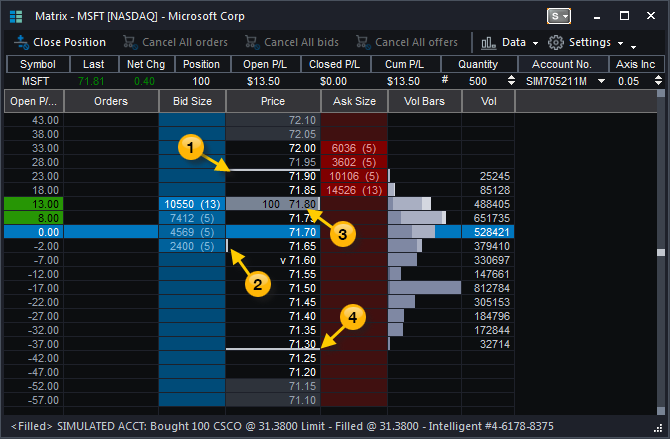

## Table of Contents

## What is a bid-ask matrix?

A bid-ask matrix is a tool used in financial markets to show the different prices at which people are willing to buy and sell a particular asset, like a stock or a currency. It's like a big table where one side shows the prices people are willing to pay to buy the asset (the bids), and the other side shows the prices people are willing to accept to sell the asset (the asks). This matrix helps traders see at a glance how much demand and supply there is for the asset at different price levels.

By looking at a bid-ask matrix, traders can get a sense of the market's current state. If there are lots of bids at high prices, it might mean that many people want to buy the asset, which could push the price up. On the other hand, if there are lots of asks at low prices, it might mean that many people want to sell, which could push the price down. This information helps traders make smarter decisions about when to buy or sell.

## How does a bid-ask matrix differ from a standard bid-ask spread?

A bid-ask matrix and a standard bid-ask spread both show how people want to buy and sell an asset, but they do it in different ways. A standard bid-ask spread is simple: it shows just two numbers, the highest price someone is willing to pay (the bid) and the lowest price someone is willing to accept (the ask). This gives a quick snapshot of the market, showing the difference between these two prices, which is the spread.

On the other hand, a bid-ask matrix is more detailed. Instead of just showing the highest bid and the lowest ask, it lists many different bid and ask prices, along with how much of the asset people want to buy or sell at each price. This gives traders a fuller picture of the market, showing not just the immediate buying and selling prices but also the depth of the market, which can help them make better trading decisions.

## What are the components of a bid-ask matrix?

A bid-ask matrix has two main parts: the bid side and the ask side. The bid side shows all the different prices people are willing to pay to buy the asset. Each price comes with a number that tells you how much of the asset people want to buy at that price. For example, it might show that someone wants to buy 100 shares at $50 each, and someone else wants to buy 50 shares at $49 each.

The ask side of the matrix shows all the different prices people are willing to accept to sell the asset. Just like the bid side, each price on the ask side comes with a number that tells you how much of the asset people want to sell at that price. For instance, it might show that someone wants to sell 75 shares at $51 each, and another person wants to sell 100 shares at $52 each.

Together, these two sides give traders a detailed view of the market. They can see not just the highest price someone is willing to pay and the lowest price someone is willing to accept, but also how much demand and supply there is at different price levels. This helps traders understand the market better and make smarter choices about when to buy or sell.

## How is a bid-ask matrix used in financial markets?

In financial markets, a bid-ask matrix is a helpful tool that traders use to see all the different prices people want to buy and sell an asset at. It's like a big chart that shows not just the highest price someone wants to pay (the bid) and the lowest price someone wants to accept (the ask), but also all the other prices in between. This helps traders understand how much people want to buy or sell the asset at different prices, which is really important for making good trading decisions.

Traders look at the bid-ask matrix to see if there's a lot of demand for the asset, which might mean the price could go up, or if there's a lot of supply, which might mean the price could go down. For example, if there are a lot of bids at high prices, it might be a good time to sell because many people want to buy. On the other hand, if there are a lot of asks at low prices, it might be a good time to buy because many people want to sell. By using the bid-ask matrix, traders can get a better idea of what's happening in the market and plan their next moves.

## Can you explain the role of liquidity in a bid-ask matrix?

Liquidity is really important in a bid-ask matrix because it shows how easy it is to buy or sell an asset without the price changing a lot. In the matrix, you can see liquidity by looking at how many bids and asks there are at different prices. If there are lots of bids and asks close to each other, it means the asset is liquid, and you can buy or sell it quickly without moving the price much. But if there are only a few bids and asks, and they're far apart, the asset might not be very liquid, and it could be harder to trade without affecting the price.

Traders use the bid-ask matrix to check the liquidity of an asset before they make a trade. If they see a lot of bids and asks, they know they can probably buy or sell a lot of the asset without making the price go up or down too much. This is good because it means they can get in and out of trades easily. On the other hand, if the matrix shows low liquidity, traders might be more careful because they know their trades could change the price a lot, which could be risky.

## What are the advantages of using a bid-ask matrix for trading?

Using a bid-ask matrix helps traders see more than just the highest price someone wants to pay and the lowest price someone wants to accept for an asset. It shows all the different prices people are willing to buy and sell at, along with how much of the asset they want to trade at each price. This gives traders a clearer picture of the market, helping them understand how much demand and supply there is at different price levels. By looking at the matrix, traders can spot trends and patterns that might not be obvious from just looking at the bid-ask spread.

Another big advantage of using a bid-ask matrix is that it helps traders see how liquid the market is for an asset. Liquidity means how easy it is to buy or sell something without the price changing a lot. If the matrix shows lots of bids and asks close to each other, it means the asset is liquid, and traders can buy or sell it quickly without moving the price much. This is really helpful because it lets traders make trades more confidently, knowing they can get in and out of the market easily. If the matrix shows low liquidity, traders can be more careful and adjust their strategies to manage the risk of big price changes.

## How does a bid-ask matrix affect market efficiency?

A bid-ask matrix helps make the market more efficient by showing traders all the different prices people want to buy and sell an asset at. This means traders can see not just the highest price someone wants to pay and the lowest price someone wants to accept, but also how much demand and supply there is at different price levels. By having this detailed information, traders can make better decisions about when to buy or sell, which helps the market work better. If everyone knows what prices are available, it's easier for the market to find the right price for an asset, making it more efficient.

Another way a bid-ask matrix improves market efficiency is by showing how liquid the market is. Liquidity means how easy it is to buy or sell something without the price changing a lot. When traders look at the matrix and see lots of bids and asks close to each other, they know the asset is liquid and they can trade it quickly without moving the price much. This helps the market run smoothly because traders can buy and sell more easily, and the prices stay stable. If the market is more liquid, it's more efficient because it can handle more trades without big price changes.

## What are the common challenges faced when interpreting a bid-ask matrix?

One common challenge when interpreting a bid-ask matrix is understanding the sheer amount of information it shows. The matrix lists many different prices for buying and selling an asset, along with how much people want to trade at each price. This can be overwhelming, especially for new traders who might find it hard to quickly see the important patterns and trends. It takes practice to get good at looking at all this data and figuring out what it means for the market.

Another challenge is dealing with changes in the matrix. The bid-ask matrix is always updating as people change their bids and asks. This means the information you're looking at can become outdated very quickly. Traders need to keep an eye on these changes and be ready to adjust their strategies. It can be tough to stay on top of everything and make decisions fast enough to take advantage of the market's movements.

## How can a bid-ask matrix be used to identify market trends?

A bid-ask matrix can help traders spot market trends by showing them where there are lots of bids and asks. If there are many bids at high prices and few asks, it might mean that people think the price of the asset will go up. This is a sign of a bullish trend, where more people want to buy than sell. On the other hand, if there are many asks at low prices and few bids, it might mean that people think the price will go down. This is a sign of a bearish trend, where more people want to sell than buy. By looking at these patterns, traders can guess where the market might be heading.

Another way to use a bid-ask matrix to find trends is by watching how the bids and asks change over time. If the highest bids keep getting higher and the lowest asks keep getting lower, it could mean the market is getting more bullish. But if the highest bids are going down and the lowest asks are going up, it might mean the market is getting more bearish. By keeping an eye on these changes, traders can see if the market is moving in one direction or if it's just staying the same. This helps them make better choices about when to buy or sell.

## What advanced strategies can traders employ using a bid-ask matrix?

Traders can use a bid-ask matrix to do something called "order book imbalance trading." This means they look at the matrix to see if there are a lot more bids than asks, or a lot more asks than bids. If there are way more bids, it might mean the price will go up soon, so traders might buy the asset hoping to sell it later for more money. If there are way more asks, it might mean the price will go down, so traders might sell the asset or even short sell it, hoping to buy it back later for less money. By watching the balance between bids and asks, traders can try to guess what the market will do next and make trades based on that.

Another advanced strategy is called "layering." This is when traders put in a lot of fake orders at different prices to make the bid-ask matrix look different than it really is. They might put in a bunch of bids at high prices to make it look like there's a lot of demand, or a bunch of asks at low prices to make it look like there's a lot of supply. This can trick other traders into thinking the market is moving in a certain direction, and they might make trades based on that. The traders who put in the fake orders can then take them away and make trades that take advantage of the other traders' mistakes. This is a tricky strategy and it's not allowed in many places because it's a form of market manipulation.

## How does the bid-ask matrix interact with order book dynamics?

The bid-ask matrix and the order book are closely related because the matrix shows all the bids and asks that make up the order book. The order book is like a list of all the orders people have put in to buy or sell an asset, and the bid-ask matrix is a way to see this list in a more organized way. It shows all the different prices people are willing to buy and sell at, and how much of the asset they want to trade at each price. This helps traders see the whole market at once and understand how the orders in the book are affecting the price of the asset.

When traders look at the bid-ask matrix, they can see how the orders in the book are changing and how this might affect the market. If a lot of new bids come in at high prices, it might push the price up because it shows more people want to buy. If a lot of new asks come in at low prices, it might push the price down because it shows more people want to sell. By watching these changes in the order book through the bid-ask matrix, traders can make better decisions about when to buy or sell. This helps them understand the market better and react quickly to what's happening.

## What are the latest research findings on the impact of bid-ask matrices on market microstructure?

Recent research on bid-ask matrices has shown that they play a big role in how markets work, especially in understanding market microstructure. Market microstructure is all about how trades happen and how prices are set. Studies have found that bid-ask matrices help traders see the depth of the market, which means how many people want to buy or sell at different prices. This can help traders make better guesses about where the price might go next. For example, if there are a lot of bids at high prices, it might mean the price will go up because more people want to buy.

Another important finding is that bid-ask matrices can affect how liquid the market is. Liquidity means how easy it is to buy or sell an asset without the price changing a lot. When traders can see a lot of bids and asks close to each other in the matrix, they know the market is liquid, and they can trade more confidently. This can make the market more stable because traders can get in and out of trades easily. On the other hand, if the matrix shows that the market is not very liquid, it might make traders more careful because their trades could move the price a lot.

## What are examples of Bid–Ask Matrices?

In financial markets, the bid–ask matrix provides a structured way to represent exchange rates between different assets. Let's illustrate this concept with examples.

Consider a simplified market with two assets, A and B. If $x$ units of asset A are exchanged for one unit of asset B, and $y$ units of asset B are exchanged for one unit of asset A, the bid–ask matrix can be represented as follows:

$$
\begin{bmatrix}
1 & x \\
y & 1
\end{bmatrix}
$$

Here, the diagonal elements are 1, indicating that trading an asset for itself incurs no change and hence, the rate is unity. The off-diagonal elements $x$ and $y$ represent the exchange rates between the two different assets.

Expanding this concept to a market involving three assets—A, B, and C—the bid–ask matrix extends to a 3x3 format. For illustration, assume you have exchange rates such that $u$ units of A trade for one of B, $v$ units of B trade for one of C, and $w$ units of C trade for one of A. The bid-ask matrix then becomes:

$$
\begin{bmatrix}
1 & u & z \\
1/v & 1 & x \\
1/w & 1/y & 1
\end{bmatrix}
$$

In this scenario, additional constraints must be applied to the bid-ask matrix to prevent arbitrage opportunities. This means ensuring that the product of exchange rates around any cycle in the matrix does not result in a profit. Mathematically, this can be expressed by verifying that:

$$
u \cdot v \cdot w \geq 1
$$

This inequality ensures that the cost of trading around the cycle A → B → C → A is not less than the cost of a direct exchange, thereby eliminating risk-free profit opportunities from cycling through multiple trades. These constraints are essential to maintain a balanced market where no arbitrageur can exploit the price discrepancies in different trading paths.

## What is the Relation to Solvency Cone?

The solvency cone is a critical concept in financial markets, particularly when dealing with multiple assets. It is constructed using the bid–ask matrix and represents the set of asset portfolios that are solvable within the specified exchange rates. This means it defines which asset combinations can be legally and practically maintained by a trader or an institution given the prevailing market conditions.

To build the solvency cone, one must consider the bid–ask matrix $\Pi$, a $d \times d$ matrix, where $d$ is the number of assets. For each asset pair $(i, j)$, the matrix element $\pi_{ij}$ represents how many units of asset $i$ are required to exchange for one unit of asset $j$. The solvency cone is then the convex cone generated by these exchange rates, capturing all feasible trades.

Mathematically, the solvency cone $\mathcal{K}$ is spanned by unit vectors $\mathbf{e}_i$ of assets and the possible negative combinations of these vectors through the bid rates, minus the combinations possible through the ask rates. This can be illustrated as follows:

$$
\mathcal{K} = \left\{ \mathbf{x} \in \mathbb{R}^d \mid \mathbf{x} = \sum_{i=1}^d \alpha_i \mathbf{e}_i - \sum_{i=1}^d \beta_i \mathbf{e}_i, \, \alpha_i, \, \beta_i \geq 0 \right\}
$$

The strength of the solvency cone lies in its straightforward ability to check an asset combination's solvency without the need to test each asset pair individually. By utilizing the unit vectors and their weighted differences, the solvency cone directly derives its shape from the bid–ask matrix, allowing for efficient computation of valid portfolio moves, given the trade constraints inherent in the market.

In essence, the solvency cone provides a feasible region for trading strategies, helping ensure that all potential trades respect market conditions and thereby reduce risk from infeasible asset allocations.

## What is the relationship between Bid–Ask Spread and Frictionless Markets?

The bid–ask spread is a critical concept in trading, directly impacting the cost-efficiency of transactions. In mathematical terms, the bid–ask spread refers to the difference between the lowest price a seller is willing to accept (ask price) and the highest price a buyer is willing to pay (bid price). When mapping this concept to a bid–ask matrix, the spread between two asset pairs is calculated by considering the inverse of the matrix's element positions.

In a frictionless market, this spread is effectively zero, indicating that there are no transaction costs, fees, or price discrepancies between the buying and selling prices. This ideal condition means that traders can exchange assets without incurring additional costs, facilitating more direct and accurate trading strategies.

For any pair of assets $i$ and $j$ in the bid–ask matrix $\Pi$, the frictionless condition can be mathematically expressed as:

$$
\pi_{ij} = \frac{1}{\pi_{ji}}
$$

This equality signifies that the cost of converting asset $i$ to asset $j$ and then back to asset $i$ is neutral, ensuring no loss or gain—an ideal trading scenario.

Ultimately, understanding and minimizing the bid–ask spread is vital for traders aiming to optimize transactions and reduce costs. Regularly monitoring these spreads enables traders to identify markets that closely resemble frictionless conditions, maximizing efficiency and profitability.

## What are the arbitrage opportunities in bid-ask matrices?

Arbitrage opportunities arise when differences in price across markets allow traders to exploit these variations for risk-free profit. In the context of a bid–ask matrix, such opportunities often emerge if the matrix does not uphold the transitivity condition. This condition refers to the logical consistency required among exchange rates in a multi-asset scenario. If transitivity is violated, it indicates that discrepancies in the exchange rates allow for profit generation through a cycle of trades involving different assets.

Consider a simple example with three assets: A, B, and C. An arbitrage opportunity might exist if:

$$
\pi_{AB} \times \pi_{BC} \times \pi_{CA} < 1
$$

where $\pi_{XY}$ denotes the exchange rate between assets X and Y. If this inequality holds, a trader could exchange a unit of asset A for B, then B for C, and finally C back into A, yielding more than one unit of A, thus creating risk-free profit.

Identifying such opportunities within a bid–ask matrix involves assessing whether it's arbitrage-free. One practical method involves an iterative portfolio evaluation across multiple assets:

1. **Initialization**: Begin with an initial amount of one asset.
2. **Matrix Application**: Traverse the exchange paths defined by the bid–ask matrix, cyclically reinvesting the result back into the initial asset.
3. **Evaluation**: After completing the cycle, compare the resulting amount of the starting asset to its initial quantity.

Here's a simplified Python code that demonstrates this concept:

```python
import numpy as np

def detect_arbitrage(matrix):
    n = len(matrix)
    for i in range(n):
        value = 1
        visited = set()
        current_asset = i
        while current_asset not in visited:
            visited.add(current_asset)
            next_asset = (current_asset + 1) % n
            value *= matrix[current_asset][next_asset]
            current_asset = next_asset
        if value > 1:
            return True
    return False

# Example bid-ask matrix for three assets
matrix = [
    [1, 0.8, 0.75],  # Rates from A: 1 A -> 0.8 B, 0.75 C
    [1.2, 1, 0.9],   # Rates from B: 1 B -> 1.2 A, 0.9 C
    [1.3, 1.1, 1]    # Rates from C: 1 C -> 1.3 A, 1.1 B
]

if detect_arbitrage(matrix):
    print("Arbitrage opportunity exists")
else:
    print("No arbitrage opportunity")
```

In this example, the matrix provides exchange rates between three hypothetical assets, and the code evaluates if an arbitrage opportunity exists by checking if any cyclic trading sequence yields more than the original investment. If such a profit is possible, the matrix is not arbitrage-free, warning traders of potential market inefficiencies.

## References & Further Reading

[1]: Bergstra, J., Bardenet, R., Bengio, Y., & Kégl, B. (2011). ["Algorithms for Hyper-Parameter Optimization."](https://papers.nips.cc/paper/4443-algorithms-for-hyper-parameter-optimization) Advances in Neural Information Processing Systems 24.

[2]: ["Advances in Financial Machine Learning"](https://www.amazon.com/Advances-Financial-Machine-Learning-Marcos/dp/1119482089) by Marcos Lopez de Prado

[3]: ["Evidence-Based Technical Analysis: Applying the Scientific Method and Statistical Inference to Trading Signals"](https://www.amazon.com/Evidence-Based-Technical-Analysis-Scientific-Statistical/dp/0470008741) by David Aronson

[4]: ["Machine Learning for Algorithmic Trading"](https://github.com/stefan-jansen/machine-learning-for-trading) by Stefan Jansen

[5]: ["Quantitative Trading: How to Build Your Own Algorithmic Trading Business"](https://www.amazon.com/Quantitative-Trading-Build-Algorithmic-Business/dp/0470284889) by Ernest P. Chan