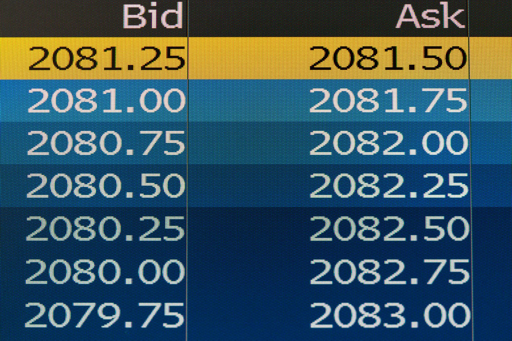

Algorithmic trading has transformed financial markets by leveraging complex mathematical models to facilitate rapid and precise decision-making. One pivotal model in this domain is the bid–ask matrix. This matrix provides critical insights into the exchange rates between assets, enabling traders to evaluate market dynamics comprehensively. By mapping out exchange rates as a structured matrix, traders gain a clear picture of the trading landscape, paving the way for optimized strategy formulation. Understanding the intricacies of the bid–ask matrix is of paramount importance for traders aiming to refine their strategies and achieve peak efficiency in trading operations. As markets grow increasingly complex, the ability to interpret these matrices effectively becomes an invaluable skill for traders seeking to capitalize on market movements while mitigating risks.

## Table of Contents



## Understanding the Bid–Ask Matrix

A bid–ask matrix is a structured representation where each element signifies the exchange rate between pairs of different assets. Unlike traditional currency conversions, where values are typically expressed in terms of a single numeraire, the bid–ask matrix employs physical units to convey exchange rates. This approach allows traders to understand exactly how many units of one asset can be obtained in exchange for another, helping to provide a more intuitive grasp of potential trades.

The structure of the matrix is such that any position (i, j) within it reveals the quantity of asset $i$ that can be exchanged for a single unit of asset $j$. This matrix serves as a crucial tool in comprehending the dynamics of asset exchanges, making it a foundational component for traders and systems involved in asset valuation and trading strategies. For example, consider a situation with two assets, A and B. If the exchange matrix indicates that 5 units of A can be traded for 1 unit of B, the element corresponding to this transaction would be represented in the matrix as $\Pi_{AB} = 5$.

By providing detailed insights into how different assets are valued against one another without the intermediation of a standard currency, the bid–ask matrix becomes a significant asset in designing optimized trading strategies that are both efficient and profitable.

## Mathematical Definition

The bid–ask matrix, denoted as Π, is mathematically defined as a $d \times d$ matrix where $d$ represents the number of assets being considered in the financial market. This matrix plays a significant role in understanding and optimizing trade strategies, offering a structured way to represent exchange rates between multiple assets. 

To qualify as a valid bid–ask matrix, three critical conditions must be met:

1. **Positivity of Exchange Rates:** Each element $\pi_{ij}$ of the matrix, which denotes the exchange rate from asset $i$ to asset $j$, must be positive. This ensures that all exchange rates are feasible in terms of trading one asset for another.

2. **Identity Exchange Rate for Same Asset:** The diagonal elements of the matrix, $\pi_{ii}$, corresponding to the exchange rate from an asset to itself, must equal 1. This condition essentially reflects the trivial fact that exchanging an asset with itself yields no gain or loss, keeping the rate naturally to 1.

3. **Economy of Direct Exchanges:** Direct exchanges should be more beneficial than any indirect, multi-step trades. Mathematically, this translates into a form of the triangle inequality in the context of trading, where the direct exchange rate $\pi_{ij}$ should be less than or equal to the product of exchange rates for trading through an intermediate asset. This condition is crucial to prevent arbitrage opportunities, which can occur if a trader can profit by exploiting discrepancies in indirect trading paths.

These three conditions ensure the matrix represents a realistic and economically sensible model of asset exchanges, helping traders navigate complex financial markets efficiently. By following these principles, traders can build models to identify [arbitrage](/wiki/arbitrage)-free portfolios, enhancing the efficiency of the trading strategies they develop.

## Examples of Bid–Ask Matrices

In financial markets, the bid–ask matrix provides a structured way to represent exchange rates between different assets. Let's illustrate this concept with examples.

Consider a simplified market with two assets, A and B. If $x$ units of asset A are exchanged for one unit of asset B, and $y$ units of asset B are exchanged for one unit of asset A, the bid–ask matrix can be represented as follows:

$$
\begin{bmatrix}
1 & x \\
y & 1
\end{bmatrix}
$$

Here, the diagonal elements are 1, indicating that trading an asset for itself incurs no change and hence, the rate is unity. The off-diagonal elements $x$ and $y$ represent the exchange rates between the two different assets.

Expanding this concept to a market involving three assets—A, B, and C—the bid–ask matrix extends to a 3x3 format. For illustration, assume you have exchange rates such that $u$ units of A trade for one of B, $v$ units of B trade for one of C, and $w$ units of C trade for one of A. The bid-ask matrix then becomes:

$$
\begin{bmatrix}
1 & u & z \\
1/v & 1 & x \\
1/w & 1/y & 1
\end{bmatrix}
$$

In this scenario, additional constraints must be applied to the bid-ask matrix to prevent arbitrage opportunities. This means ensuring that the product of exchange rates around any cycle in the matrix does not result in a profit. Mathematically, this can be expressed by verifying that:

$$
u \cdot v \cdot w \geq 1
$$

This inequality ensures that the cost of trading around the cycle A → B → C → A is not less than the cost of a direct exchange, thereby eliminating risk-free profit opportunities from cycling through multiple trades. These constraints are essential to maintain a balanced market where no arbitrageur can exploit the price discrepancies in different trading paths.

## Relation to Solvency Cone

The solvency cone is a critical concept in financial markets, particularly when dealing with multiple assets. It is constructed using the bid–ask matrix and represents the set of asset portfolios that are solvable within the specified exchange rates. This means it defines which asset combinations can be legally and practically maintained by a trader or an institution given the prevailing market conditions.

To build the solvency cone, one must consider the bid–ask matrix $\Pi$, a $d \times d$ matrix, where $d$ is the number of assets. For each asset pair $(i, j)$, the matrix element $\pi_{ij}$ represents how many units of asset $i$ are required to exchange for one unit of asset $j$. The solvency cone is then the convex cone generated by these exchange rates, capturing all feasible trades.

Mathematically, the solvency cone $\mathcal{K}$ is spanned by unit vectors $\mathbf{e}_i$ of assets and the possible negative combinations of these vectors through the bid rates, minus the combinations possible through the ask rates. This can be illustrated as follows:

$$
\mathcal{K} = \left\{ \mathbf{x} \in \mathbb{R}^d \mid \mathbf{x} = \sum_{i=1}^d \alpha_i \mathbf{e}_i - \sum_{i=1}^d \beta_i \mathbf{e}_i, \, \alpha_i, \, \beta_i \geq 0 \right\}
$$

The strength of the solvency cone lies in its straightforward ability to check an asset combination's solvency without the need to test each asset pair individually. By utilizing the unit vectors and their weighted differences, the solvency cone directly derives its shape from the bid–ask matrix, allowing for efficient computation of valid portfolio moves, given the trade constraints inherent in the market.

In essence, the solvency cone provides a feasible region for trading strategies, helping ensure that all potential trades respect market conditions and thereby reduce risk from infeasible asset allocations.

## Bid–Ask Spread and Frictionless Markets

The bid–ask spread is a critical concept in trading, directly impacting the cost-efficiency of transactions. In mathematical terms, the bid–ask spread refers to the difference between the lowest price a seller is willing to accept (ask price) and the highest price a buyer is willing to pay (bid price). When mapping this concept to a bid–ask matrix, the spread between two asset pairs is calculated by considering the inverse of the matrix's element positions.

In a frictionless market, this spread is effectively zero, indicating that there are no transaction costs, fees, or price discrepancies between the buying and selling prices. This ideal condition means that traders can exchange assets without incurring additional costs, facilitating more direct and accurate trading strategies.

For any pair of assets $i$ and $j$ in the bid–ask matrix $\Pi$, the frictionless condition can be mathematically expressed as:

$$
\pi_{ij} = \frac{1}{\pi_{ji}}
$$

This equality signifies that the cost of converting asset $i$ to asset $j$ and then back to asset $i$ is neutral, ensuring no loss or gain—an ideal trading scenario.

Ultimately, understanding and minimizing the bid–ask spread is vital for traders aiming to optimize transactions and reduce costs. Regularly monitoring these spreads enables traders to identify markets that closely resemble frictionless conditions, maximizing efficiency and profitability.

## Arbitrage Opportunities in Bid–Ask Matrices

Arbitrage opportunities arise when differences in price across markets allow traders to exploit these variations for risk-free profit. In the context of a bid–ask matrix, such opportunities often emerge if the matrix does not uphold the transitivity condition. This condition refers to the logical consistency required among exchange rates in a multi-asset scenario. If transitivity is violated, it indicates that discrepancies in the exchange rates allow for profit generation through a cycle of trades involving different assets.

Consider a simple example with three assets: A, B, and C. An arbitrage opportunity might exist if:

$$
\pi_{AB} \times \pi_{BC} \times \pi_{CA} < 1
$$

where $\pi_{XY}$ denotes the exchange rate between assets X and Y. If this inequality holds, a trader could exchange a unit of asset A for B, then B for C, and finally C back into A, yielding more than one unit of A, thus creating risk-free profit.

Identifying such opportunities within a bid–ask matrix involves assessing whether it's arbitrage-free. One practical method involves an iterative portfolio evaluation across multiple assets:

1. **Initialization**: Begin with an initial amount of one asset.
2. **Matrix Application**: Traverse the exchange paths defined by the bid–ask matrix, cyclically reinvesting the result back into the initial asset.
3. **Evaluation**: After completing the cycle, compare the resulting amount of the starting asset to its initial quantity.

Here's a simplified Python code that demonstrates this concept:

```python
import numpy as np

def detect_arbitrage(matrix):
    n = len(matrix)
    for i in range(n):
        value = 1
        visited = set()
        current_asset = i
        while current_asset not in visited:
            visited.add(current_asset)
            next_asset = (current_asset + 1) % n
            value *= matrix[current_asset][next_asset]
            current_asset = next_asset
        if value > 1:
            return True
    return False

# Example bid-ask matrix for three assets
matrix = [
    [1, 0.8, 0.75],  # Rates from A: 1 A -> 0.8 B, 0.75 C
    [1.2, 1, 0.9],   # Rates from B: 1 B -> 1.2 A, 0.9 C
    [1.3, 1.1, 1]    # Rates from C: 1 C -> 1.3 A, 1.1 B
]

if detect_arbitrage(matrix):
    print("Arbitrage opportunity exists")
else:
    print("No arbitrage opportunity")
```

In this example, the matrix provides exchange rates between three hypothetical assets, and the code evaluates if an arbitrage opportunity exists by checking if any cyclic trading sequence yields more than the original investment. If such a profit is possible, the matrix is not arbitrage-free, warning traders of potential market inefficiencies.

## Conclusion

The bid–ask matrix plays a vital role in [algorithmic trading](/wiki/algorithmic-trading) by providing a framework for understanding asset exchanges and optimizing trading strategies. It ensures that traders can execute transactions efficiently by offering a comprehensive view of exchange rates among different assets. One of its primary benefits is maintaining arbitrage-free conditions, which prevents the exploitation of price differentials and ensures that trades are conducted at fair market values. This ultimately reduces potential losses associated with transaction costs and enhances overall market efficiency.

By identifying and minimizing transaction costs through streamlined trade executions, the bid–ask matrix allows traders to develop strategies that are both efficient and profitable. This strategic advantage is crucial as it enables the identification of optimal trading paths, maximizing returns while keeping trade expenses to a minimum.

Moreover, continued research and innovative applications of bid–ask matrices provide significant benefits to traders' decision-making processes. In dynamic and ever-evolving markets, the ability to quickly adapt and react to changing conditions is critical. The bid–ask matrix's structure aids in modeling these dynamic shifts, enabling traders to build robust, adaptive strategies that can capitalize on new opportunities or mitigate risks effectively.

Overall, the bid–ask matrix is not just a tool for facilitating trades, but a pivotal component for developing comprehensive trading strategies that align with the fast-paced demands of today's financial markets.

## References & Further Reading

[1]: Bergstra, J., Bardenet, R., Bengio, Y., & Kégl, B. (2011). ["Algorithms for Hyper-Parameter Optimization."](https://papers.nips.cc/paper/4443-algorithms-for-hyper-parameter-optimization) Advances in Neural Information Processing Systems 24.

[2]: ["Advances in Financial Machine Learning"](https://www.amazon.com/Advances-Financial-Machine-Learning-Marcos/dp/1119482089) by Marcos Lopez de Prado

[3]: ["Evidence-Based Technical Analysis: Applying the Scientific Method and Statistical Inference to Trading Signals"](https://www.amazon.com/Evidence-Based-Technical-Analysis-Scientific-Statistical/dp/0470008741) by David Aronson

[4]: ["Machine Learning for Algorithmic Trading"](https://github.com/stefan-jansen/machine-learning-for-trading) by Stefan Jansen

[5]: ["Quantitative Trading: How to Build Your Own Algorithmic Trading Business"](https://www.amazon.com/Quantitative-Trading-Build-Algorithmic-Business/dp/0470284889) by Ernest P. Chan