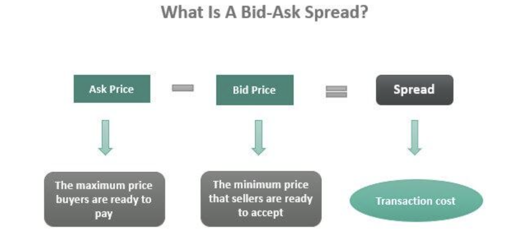

## Table of Contents

## What is a bid-ask spread?

The bid-ask spread is the difference between the highest price a buyer is willing to pay for an asset and the lowest price a seller is willing to accept. It's like the gap between what someone wants to buy something for and what someone else is willing to sell it for. This spread is important in trading because it helps determine the cost of buying and selling stocks, currencies, or other financial products.

In simpler terms, if you want to buy a stock, you look at the "ask" price, which is the lowest price sellers are offering. If you want to sell a stock, you look at the "bid" price, which is the highest price buyers are willing to pay. The difference between these two prices is the bid-ask spread. A smaller spread means the asset is more liquid, meaning it's easier to buy and sell without affecting the price much. A larger spread can make trading more expensive and might indicate less trading activity or higher risk.

## Why is the bid-ask spread important in financial markets?

The bid-ask spread is important in financial markets because it shows how easy or hard it is to buy or sell an asset. Imagine you want to buy a toy, and the store is selling it for $10, but you can only get someone to buy it from you for $8. That $2 difference is like the bid-ask spread. In the stock market, a smaller spread means the asset is more liquid, meaning lots of people want to buy and sell it, making it easier for you to trade without big price changes.

The spread also affects how much it costs to trade. If the spread is big, it's like paying a higher fee every time you buy or sell. This can make trading more expensive and might make people think twice before trading. On the other hand, a small spread means lower trading costs, which can encourage more trading and make the market more active. So, the bid-ask spread is a key thing to look at if you want to understand how a market works and how much it might cost to trade in it.

## How is the bid-ask spread calculated?

The bid-ask spread is calculated by taking the difference between the highest price a buyer is willing to pay (the bid price) and the lowest price a seller is willing to accept (the ask price). For example, if the highest bid for a stock is $50 and the lowest ask is $51, the bid-ask spread is $1. This simple calculation helps traders and investors understand the cost of trading a particular asset.

The bid-ask spread can also be expressed as a percentage of the ask price. To do this, you divide the spread by the ask price and then multiply by 100 to get a percentage. Using the same example, the spread is $1 and the ask price is $51, so the calculation would be ($1 / $51) * 100, which equals about 1.96%. This percentage can help compare the [liquidity](/wiki/liquidity-risk-premium) of different assets more easily.

## What factors influence the bid-ask spread?

Several things can affect how big or small the bid-ask spread is. One big [factor](/wiki/factor-investing) is how often people want to buy and sell the asset. If lots of people are trading, the spread is usually smaller because there are more buyers and sellers, making it easier to find someone who wants to trade at a price close to what you're looking for. On the other hand, if not many people are trading, the spread can be bigger because it's harder to find someone to trade with.

Another thing that can change the spread is how risky the asset is. If an asset is seen as risky or hard to predict, sellers might want a higher price to feel safe, making the spread bigger. Also, the size of the trade matters. If you want to buy or sell a lot of something, the spread might get bigger because it's harder to find someone to trade that much at once. Lastly, the place where you're trading can affect the spread. Some markets have lower costs and more competition, which can lead to smaller spreads.

So, the bid-ask spread isn't just a number; it's influenced by how popular the asset is, how risky it is, how big the trade is, and where you're trading. Understanding these factors can help you see why the spread might be big or small and make better trading choices.

## What are the different types of bid-ask spread models?

There are different ways to think about how the bid-ask spread happens. One way is the "inventory model." This model says that market makers, who help buy and sell stuff, have to keep some of the asset in stock. They might change the spread to make sure they don't run out of stock or have too much. It's like a store adjusting prices to make sure they have enough of a product on the shelves.

Another way is the "order processing model." This model says that the spread is there because it costs money to handle orders. Market makers need to pay for things like computers and people to make trades happen. So, they add a little extra to the price to cover these costs. It's like adding a fee to cover the costs of running a business.

The last way is the "asymmetric information model." This one says that some people know more about the asset than others. Market makers might make the spread bigger to protect themselves from people who know more and might try to take advantage. It's like a seller charging more because they think the buyer might know something they don't.

## How do market makers affect the bid-ask spread?

Market makers play a big role in setting the bid-ask spread. They are the people or companies that help make trading happen by always being ready to buy or sell an asset. When you want to buy or sell something, you often do it through a market maker. They decide the highest price they're willing to pay (the bid) and the lowest price they're willing to sell for (the ask). The difference between these two prices is the bid-ask spread. Market makers try to make this spread as small as possible to encourage more trading, but they also need to make sure it's big enough to cover their costs and make a little profit.

Sometimes, market makers change the spread based on how much of the asset they have. If they have too much of something, they might lower the ask price to sell it faster, making the spread smaller. If they don't have enough, they might raise the bid price to buy more, which can make the spread bigger. They also think about how risky the asset is. If they think it's risky, they might make the spread bigger to protect themselves from losing money. So, market makers are always balancing the need to keep trading smooth with the need to manage their own risks and costs.

## What is the role of liquidity in bid-ask spread modeling?

Liquidity is super important when it comes to figuring out the bid-ask spread. Imagine you're at a busy market where lots of people want to buy and sell the same thing. In this case, it's easy to find someone who wants to trade at a price close to what you're looking for, so the bid-ask spread will be small. This is because there are lots of buyers and sellers, making the asset very liquid. On the other hand, if you're at a quiet market where not many people want to trade, it's harder to find someone to trade with, so the spread will be bigger. Less trading means less liquidity, which makes the spread bigger.

Liquidity also affects how market makers set the spread. Market makers are like the helpers at the market who are always ready to buy or sell. When there's lots of trading, they can set a smaller spread because they can easily find someone to trade with. But if there's not much trading, they might set a bigger spread to make sure they can still make some money and cover their costs. So, liquidity is a big deal in deciding how big or small the bid-ask spread will be.

## How can statistical models be used to predict bid-ask spreads?

Statistical models help predict bid-ask spreads by looking at past data and finding patterns. These models use things like how often an asset is traded, how risky it is, and how much of it is being bought or sold at one time. By studying this data, the models can guess what the spread might be in the future. For example, if an asset is traded a lot and is not very risky, the model might predict a smaller spread because it's easy to find buyers and sellers.

These models also look at other things that might change the spread, like news about the company or changes in the market. They use fancy math to figure out how these factors might affect the spread. By putting all this information together, statistical models can give traders and investors a good idea of what the bid-ask spread might be, helping them make better decisions about when and how to trade.

## What are the limitations of current bid-ask spread models?

Current bid-ask spread models have some problems. One big problem is that they often don't think about how people feel or what they think might happen in the future. These models mostly look at numbers from the past, like how much an asset was traded or how risky it was. But they don't always consider things like news or rumors that can make people want to buy or sell more, which can change the spread a lot.

Another issue is that these models can be hard to use in real life. They are often based on ideas that don't always fit with how the market really works. For example, they might assume that everyone knows the same things about an asset, which isn't true. People have different information and opinions, and this can make the spread different from what the model predicts. So, while these models can give us some good guesses, they aren't perfect and can miss important things that affect the bid-ask spread.

## How do high-frequency trading strategies impact bid-ask spreads?

High-frequency trading ([HFT](/wiki/high-frequency-trading-strategies)) can make bid-ask spreads smaller. HFT uses super fast computers to buy and sell things very quickly. These traders often trade a lot, which means there are more people wanting to buy and sell at any time. When there are lots of people trading, it's easier to find someone who wants to trade at a price close to what you want, so the spread gets smaller. It's like having a busy market where lots of people are buying and selling, so prices stay close together.

But, HFT can also make things a bit tricky. Sometimes, these traders can make the market move a lot because they trade so fast. This can make the spread bigger for a short time because it's hard for other people to keep up with the fast changes. Also, if too many HFT traders are doing the same thing, they might all want to buy or sell at the same time, which can make the spread bigger. So, while HFT can help keep spreads small most of the time, it can also cause some big changes in the spread when things get too fast or too crowded.

## What advanced techniques are used in bid-ask spread modeling for exotic financial instruments?

For exotic financial instruments, like complex options or derivatives, advanced techniques in bid-ask spread modeling often use something called [machine learning](/wiki/machine-learning). Machine learning is like teaching a computer to find patterns in data by itself. It looks at a lot of information, like how often the instrument is traded, how risky it is, and even things like news or market trends. By learning from all this data, the computer can make better guesses about what the bid-ask spread might be for these tricky instruments. This is really helpful because exotic instruments can be hard to predict with regular models, so using machine learning can give traders a better idea of what to expect.

Another technique is called agent-based modeling. This is like creating a computer game where each player (or agent) acts like a trader in the market. These [agents](/wiki/agents) follow rules based on how real traders might behave, like trying to make money or avoiding risk. By watching how these agents trade with each other, the model can show how the bid-ask spread might change. This is useful for exotic instruments because it can show how different traders might react to new information or changes in the market, which can affect the spread in ways that are hard to predict with simpler models.

## How can machine learning improve bid-ask spread predictions?

Machine learning can make better guesses about bid-ask spreads by looking at a lot of different information all at once. It can learn from past data, like how often an asset was traded or how risky it was, and also consider things like news or market trends. This helps it understand how all these things together might change the spread. Because machine learning can find patterns in big piles of data that humans might miss, it can give more accurate predictions about what the spread might be in the future.

For example, if a company suddenly gets good news, machine learning can quickly see how that might make more people want to buy the stock, which could make the spread smaller. It can also look at how different traders might react to this news, which is something regular models might not be good at. By learning from all these different pieces of information, machine learning helps traders and investors make better choices about when and how to trade, making the market work smoother and more predictably.

## References & Further Reading

[1]: Lopez de Prado, M. (2018). ["Advances in Financial Machine Learning"](https://www.amazon.com/Advances-Financial-Machine-Learning-Marcos/dp/1119482089). Wiley.

[2]: Chan, E. P. (2008). ["Quantitative Trading: How to Build Your Own Algorithmic Trading Business"](https://github.com/ftvision/quant_trading_echan_book). John Wiley & Sons.

[3]: Aronson, D. R. (2007). ["Evidence-Based Technical Analysis: Applying the Scientific Method and Statistical Inference to Trading Signals"](https://www.amazon.com/Evidence-Based-Technical-Analysis-Scientific-Statistical/dp/0470008741). Wiley.

[4]: Jansen, S. (2020). ["Machine Learning for Algorithmic Trading - Second Edition: Predictive models to extract signals from market and alternative data for systematic trading strategies with Python"](https://github.com/stefan-jansen/machine-learning-for-trading). Packt Publishing.

[5]: Gould, M., & Porter, M. (2021). ["Algorithmic and High-Frequency Trading"](https://academic.oup.com/book/55158/chapter/424085051). Cambridge University Press. 

[6]: Hasbrouck, J. (2007). ["Empirical Market Microstructure: The Institutions, Economics, and Econometrics of Securities Trading"](https://academic.oup.com/book/52241). Oxford University Press. 

[7]: Foucault, T., Pagano, M., & Röell, A. (2013). ["Market Liquidity: Theory, Evidence, and Policy"](https://academic.oup.com/book/55158). Oxford University Press. 