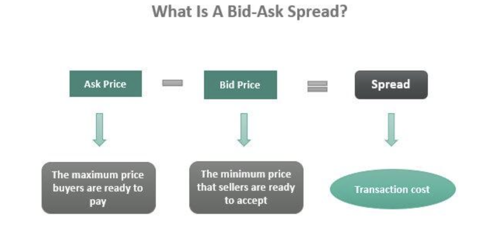

## Table of Contents

## What is the bid-ask spread?

The bid-ask spread is the difference between the highest price a buyer is willing to pay for an asset (the bid) and the lowest price a seller is willing to accept (the ask). It's like a gap between what someone wants to buy something for and what someone else is willing to sell it for. This spread is important because it helps determine the cost of trading and can reflect how easy or hard it is to buy or sell an asset.

In simpler terms, think of it like buying and selling items at a market. If you want to buy an apple, the highest price you're willing to pay is your bid. If the seller won't take less than a certain amount, that's their ask. The difference between your bid and their ask is the bid-ask spread. A smaller spread means it's easier and cheaper to trade, while a larger spread can make trading more expensive and difficult.

## How is the bid-ask spread calculated?

The bid-ask spread is calculated by finding the difference between the highest price someone is willing to pay for an asset (the bid price) and the lowest price someone is willing to sell it for (the ask price). For example, if the highest bid for a stock is $10 and the lowest ask is $10.05, the bid-ask spread is $0.05.

This spread can be shown in two ways: as a dollar amount or as a percentage of the asset's price. To find the percentage, you divide the spread by the ask price and then multiply by 100. Using the same example, the spread of $0.05 divided by the ask price of $10.05 gives you about 0.00497, and when you multiply by 100, you get a spread of about 0.5%. This percentage helps show how big the spread is compared to the price of the asset.

## Why is the bid-ask spread important for investors?

The bid-ask spread is really important for investors because it tells them how much it might cost to buy or sell an investment. When you want to buy a stock, you have to pay the ask price, which is a bit higher than the bid price. When you sell, you get the bid price, which is a bit lower than the ask price. So, the spread is like a little fee you pay every time you trade. If the spread is big, it can make your investment more expensive, and if it's small, it can save you money.

Also, the bid-ask spread can show how easy or hard it is to trade an asset. If a stock has a small spread, it means there are lots of people wanting to buy and sell it, so it's easy to trade. But if the spread is big, it might mean fewer people are interested, and it can be harder to buy or sell quickly. This can be really helpful for investors to know, because it helps them decide if a stock is a good choice for them.

## What factors influence the size of the bid-ask spread?

The size of the bid-ask spread can be influenced by how much people want to buy or sell a stock. If lots of people are interested in trading a stock, like a popular company everyone knows about, the spread will be small. This is because there are many buyers and sellers, so it's easy to match them up. But if a stock is not very popular or well-known, fewer people might want to trade it, making the spread bigger. This is because it's harder to find someone to buy or sell with, so the difference between what people are willing to pay and what they want to sell for gets larger.

Another thing that affects the bid-ask spread is how much the price of the stock moves around. If the price of a stock changes a lot and quickly, it can be risky for people who make markets, called market makers, to set their prices too close together. They might make the spread bigger to protect themselves from losing money if the price suddenly changes. Also, the cost of trading, like fees and taxes, can make the spread bigger because these costs need to be covered by the market makers. So, the more it costs to trade, the bigger the spread might be.

## How does market liquidity affect the bid-ask spread?

Market [liquidity](/wiki/liquidity-risk-premium) is all about how easy it is to buy or sell something without the price changing a lot. When a market is very liquid, it means there are lots of people wanting to buy and sell. This makes the bid-ask spread smaller because buyers and sellers can easily find each other. It's like a busy marketplace where everyone is trading, so you can quickly buy or sell at a price that's not too different from what others are willing to pay or accept.

On the other hand, if a market is not very liquid, it means fewer people are interested in trading. This can make the bid-ask spread bigger because it's harder to find someone to trade with. Imagine a quiet market where only a few people are around. If you want to buy something, you might have to pay more than you'd like because there aren't many sellers. And if you want to sell, you might have to accept less because there aren't many buyers. So, the less liquid a market is, the bigger the bid-ask spread tends to be.

## Can the bid-ask spread indicate the risk of a security?

Yes, the bid-ask spread can give you a hint about how risky a security might be. If the spread is big, it means there's a bigger gap between what people are willing to pay for it and what they want to sell it for. This can happen when the security is not very popular or when its price can change a lot quickly. A big spread can make it more expensive to trade, and it might mean that the security is riskier because it's harder to buy or sell it without losing money.

On the other hand, if the spread is small, it usually means the security is less risky. A small spread shows that lots of people are interested in trading it, and the price doesn't jump around too much. This makes it easier and cheaper to buy or sell the security, which is good if you want to avoid big losses. So, by looking at the bid-ask spread, you can get a sense of how risky a security might be.

## What is the relationship between bid-ask spread and trading volume?

The bid-ask spread and trading [volume](/wiki/volume-trading-strategy) are closely related. When a security has a high trading volume, it means a lot of people are buying and selling it. This high interest makes it easier to match buyers and sellers, which usually leads to a smaller bid-ask spread. Think of it like a busy market where everyone can find someone to trade with quickly, so the difference between what people want to buy and sell for is small.

On the other hand, if a security has a low trading volume, it means fewer people are interested in trading it. This can make the bid-ask spread bigger because it's harder to find someone to trade with. It's like a quiet market where you might have to wait a long time to find a buyer or seller, and the price difference between what people are willing to pay and what they want to sell for can be larger. So, generally, a higher trading volume leads to a smaller bid-ask spread, and a lower trading volume can lead to a larger spread.

## How do different types of orders impact the bid-ask spread?

Different types of orders can change the bid-ask spread. When people use market orders, they want to buy or sell right away at the best available price. This can make the spread smaller because it adds to the number of people wanting to trade, making it easier to match buyers and sellers. But if there are lots of market orders and not enough people on the other side, the price can move quickly, which might make the spread bigger for a short time.

Limit orders, on the other hand, let people set a specific price they're willing to buy or sell at. These orders can help keep the spread smaller because they add more choices for buyers and sellers. If someone puts in a limit order that's better than the current bid or ask, it can move the spread closer together. But if there are not many limit orders, and people are far apart on what they want to pay or sell for, the spread can stay big or even get bigger.

## What strategies can traders use to minimize the impact of the bid-ask spread?

Traders can use different strategies to make the bid-ask spread less of a problem. One way is to use limit orders instead of market orders. When you use a limit order, you set the price you want to buy or sell at. This can help you get a better deal and not have to pay the full ask price or sell at the lower bid price. Another strategy is to trade stocks that have a lot of people buying and selling them. These stocks usually have a smaller spread because it's easier to find someone to trade with.

Another thing traders can do is to watch the market and wait for the right time to trade. If you see that the spread is smaller at certain times of the day, you might want to trade then. Also, if you're trading a lot of shares, you can split your order into smaller pieces and trade them over time. This can help you get a better average price and not move the market too much, which can make the spread bigger. By using these strategies, traders can save money and make their trades more successful.

## How does the bid-ask spread vary across different markets and asset classes?

The bid-ask spread can be different depending on the market or type of asset you're looking at. In big stock markets like the New York Stock Exchange, where lots of people trade popular stocks, the spread is usually small. This is because there are many buyers and sellers, so it's easy to match them up. But in smaller markets or for less popular stocks, the spread can be bigger because fewer people are trading, making it harder to find someone to buy from or sell to.

The spread can also change a lot between different types of assets. For example, stocks of big companies usually have smaller spreads than stocks of small companies because more people are interested in them. In the bond market, the spread can be bigger because bonds are traded less often than stocks. And in the [forex](/wiki/forex-system) market, where people trade different currencies, the spread can be very small for major currency pairs like the US dollar and the Euro, but bigger for less common pairs. So, the type of market and the asset you're trading can make a big difference in the size of the bid-ask spread.

## What are the implications of a high bid-ask spread for market makers?

A high bid-ask spread can be good for market makers because it means they make more money from each trade. Market makers are the people who help people buy and sell things in the market. When the spread is big, they can buy something at a lower price and then sell it at a higher price, keeping the difference as profit. This extra money can help them cover the costs of doing business, like paying for the technology they need to make trades happen quickly.

But a high bid-ask spread can also be bad for market makers because it might mean fewer people want to trade. If the spread is too big, people might not want to buy or sell because it costs too much. This can make the market less busy, and market makers might not make as many trades. When fewer trades happen, market makers make less money overall, even if they make more on each trade. So, while a high spread can be good in some ways, it can also make the market less active and harder for market makers to do their job.

## How can advanced statistical models be used to predict changes in the bid-ask spread?

Advanced statistical models can help predict changes in the bid-ask spread by looking at past data and finding patterns. These models use things like how much a stock's price moves around, how many people are trading it, and even what's happening in the news to guess what the spread might do next. By studying lots of information, the models can see if the spread gets bigger or smaller at certain times or under certain conditions. This can help traders and market makers make better guesses about when to buy or sell.

These models can be really helpful because they can spot trends that people might not see just by looking at the numbers. For example, they might find that the spread gets bigger when there's a lot of uncertainty in the market, like before big news comes out. Or they might see that the spread changes when the trading volume goes up or down. By using these models, traders can be ready for changes in the spread and make smarter decisions about their trades.

## References & Further Reading

[1]: Harris, L. (2003). ["Trading & Exchanges: Market Microstructure for Practitioners"](https://www.amazon.com/Trading-Exchanges-Market-Microstructure-Practitioners/dp/0195144708). Oxford University Press.

[2]: Lopez de Prado, M. (2018). ["Advances in Financial Machine Learning"](https://www.amazon.com/Advances-Financial-Machine-Learning-Marcos/dp/1119482089). Wiley.

[3]: Jansen, S. (2018). ["Machine Learning for Algorithmic Trading"](https://github.com/stefan-jansen/machine-learning-for-trading). Packt Publishing.

[4]: Chan, E. P. (2009). ["Quantitative Trading: How to Build Your Own Algorithmic Trading Business"](https://github.com/ftvision/quant_trading_echan_book). Wiley.

[5]: Aldridge, I. (2013). ["High-Frequency Trading: A Practical Guide to Algorithmic Strategies and Trading Systems"](https://onlinelibrary.wiley.com/doi/pdf/10.1002/9781119203803.fmatter). Wiley.

[6]: Kissell, R. (2013). ["The Science of Algorithmic Trading and Portfolio Management"](https://www.sciencedirect.com/book/9780124016897/the-science-of-algorithmic-trading-and-portfolio-management). Academic Press.

[7]: Hull, J. C. (2018). ["Options, Futures, and Other Derivatives"](https://www.semanticscholar.org/paper/Options%2C-Futures%2C-and-Other-Derivatives-Hull/89bdee500c8623864fc9eb7a471546aa713acc44). Pearson.