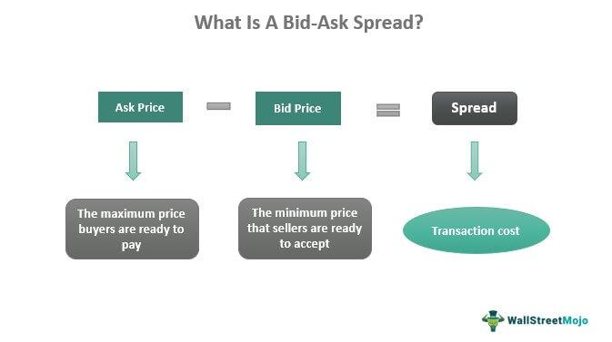

Financial markets operate as intricate ecosystems where a myriad of factors converge to shape trading dynamics. Within these markets, the bid-ask spread is a critical component, representing the difference in price between the highest amount a buyer is willing to pay (the bid) and the lowest figure a seller is prepared to accept (the ask). This spread is significant as it directly influences market liquidity, an essential attribute for both retail and institutional traders. A narrow bid-ask spread typically indicates a liquid market, where assets can be bought or sold with minimal price impact, whereas a wider spread often suggests lower liquidity and higher transaction costs.

Algorithmic trading, which over recent years has drastically transformed trading practices on financial markets, places a strong emphasis on optimizing the bid-ask spread. By utilizing advanced algorithms, traders can make rapid decisions and transactions, aiming to capitalize on even the smallest differences in the spread. This approach not only enhances the efficiency of market operations but also increases the precision of trading strategies.

This article aims to explore the nuances of bid-ask spread trading and examine the methods by which algorithmic trading strategies exploit these opportunities. It discusses the fundamental aspects of bid-ask spreads, the role of algorithmic trading in optimizing them, and the real-world implications and challenges that arise. Additionally, it will highlight the significance of technological advancements and strategic innovation in navigating and succeeding in contemporary trading environments. Through a comprehensive understanding of these elements, traders and investors can better position themselves to take advantage of bid-ask spreads in their trading endeavors.

## Table of Contents

## Understanding the Bid-Ask Spread

The bid-ask spread is a crucial concept in trading, serving as the differential between the highest price a buyer is prepared to pay for an asset (bid) and the lowest price a seller is willing to accept (ask). This spread represents an immediate transactional cost and significantly influences traders' decision-making processes and overall market behavior.

A narrow bid-ask spread is indicative of high market liquidity, enabling market participants to execute buy or sell orders quickly without causing substantial price fluctuations. For instance, in highly liquid markets such as major currency pairs in the Foreign Exchange market or large-cap stocks, the spread is typically minimal due to numerous buyers and sellers ensuring tight competition and price stability. Conversely, a wider spread is often characteristic of low liquidity environments, where fewer market participants lead to higher costs and potential delays in order execution. This disparity impacts how easily an asset can be traded and may lead to increased slippage, where the execution price deviates from the expected price due to market movements.

Several factors determine the size of the bid-ask spread. Trading volume is a primary determinant, as high trading volumes indicate an active market with many participants, typically resulting in narrower spreads. Market volatility also plays a significant role; during periods of high volatility, spreads may widen as market makers adjust prices to hedge against increased risk. Furthermore, participant behavior, including the order flow and market depth (the number of buy and sell orders at different price levels), can influence spread dynamics. A deeper understanding of these factors is essential for developing robust trading strategies, especially in algorithmic trading where programmatic precision is paramount.

In the context of [algorithmic trading](/wiki/algorithmic-trading) systems, understanding and effectively analyzing the bid-ask spread is indispensable. These systems can be programmed to swiftly analyze fluctuations in the spread, allowing traders to implement strategies that optimize execution costs. For example, algorithms might be designed to operate more aggressively in markets with consistently narrow spreads or to seek opportunities when spreads exhibit quantifiable patterns related to trading [volume](/wiki/volume-trading-strategy) and [volatility](/wiki/volatility-trading-strategies).

In conclusion, the bid-ask spread is a fundamental determinant of market [liquidity](/wiki/liquidity-risk-premium) and trading efficiency. Grasping its nuances is vital for traders, especially those employing algorithmic strategies, to effectively navigate the complexities of financial markets and optimize trading performance.

## Algorithmic Trading and the Bid-Ask Spread

Algorithmic trading, commonly known as algo trading, harnesses the power of computer algorithms to execute trades at unparalleled speeds and frequencies. These algorithms are designed to exploit market inefficiencies, such as the bid-ask spread. The bid-ask spread represents the difference between the highest price a buyer is willing to pay (bid) and the lowest price a seller is willing to accept (ask). 

The primary objective of algorithmic trading is to identify and capitalize on these small price differentials to achieve profitability. These algorithms analyze vast datasets, including historical and real-time market data, to pinpoint profitable trading opportunities. An algorithm might, for instance, detect a temporary disparity in the bid-ask spread for a particular stock and execute trades to profit from this discrepancy before it normalizes.

One notable subset of algorithmic trading is high-frequency trading ([HFT](/wiki/high-frequency-trading-strategies)), which specializes in executing a high volume of trades within extremely short timeframes, often milliseconds or microseconds. HFT strategies are particularly effective in capturing profits from bid-ask spreads due to their speed and precision. The rapid execution capabilities of HFT allow traders to systematically profit from minuscule differences in asset prices, which accumulate to substantial gains over numerous trades.

Moreover, high-frequency trading contributes significantly to market liquidity and efficiency. By continuously buying and selling securities, HFT strategies help narrow the bid-ask spread, making it easier and less costly for other market participants to execute trades. This increased liquidity is beneficial for the broader market as it facilitates smoother trading and reduces transaction costs.

Overall, the integration of algorithmic trading into the financial markets underscores the critical role of technology in modern trading environments. These advanced systems not only enhance the ability to profit from the bid-ask spread but also support more efficient and liquid markets. Implementing such strategies requires a sophisticated understanding of both market dynamics and technological tools.

## Strategies for Trading the Bid-Ask Spread

Several trading strategies are designed to exploit the bid-ask spread, particularly in the context of algorithmic and high-frequency trading. These strategies leverage technology and market knowledge to capture profits from the price differences inherent in the bid-ask spread.

One prevalent strategy is [market making](/wiki/market-making), wherein traders generate profits by providing liquidity in the market. Market makers post buy and sell orders on both sides of the spread. By constantly offering to buy securities at the bid price and selling them at the ask price, market makers capitalize on the spread. This process not only allows them to earn profits from the difference between the bid and ask prices but also stabilizes liquidity within the market. Market makers face risks associated with inventory management and the possibility of adverse price movements but can mitigate these through sophisticated algorithms and risk management strategies.

Arbitrage strategies involve the identification and exploitation of price discrepancies between various markets or securities. When two markets price the same or similar securities differently, an [arbitrage](/wiki/arbitrage) opportunity is presented. By buying the undervalued asset in one market and simultaneously selling it in an overvalued market, traders can profit from the price difference. Algorithmic trading systems are particularly adept at spotting such discrepancies across multiple markets and executing trades rapidly to capture the arbitrage profits.

Scalping is another strategy focused on making numerous small profits by exploiting tight spreads. Scalpers aim to execute a high volume of trades within short timeframes, benefiting from minor price fluctuations. Given the small profit margin per trade, successful [scalping](/wiki/gamma-scalping) relies on quick decision-making and execution, as well as low transaction costs. Algorithmic trading systems equipped with high-frequency capabilities are particularly suited to this strategy due to their ability to process vast amounts of data and execute trades instantaneously.

Mean reversion strategies are founded on the statistical concept that prices will revert to their historical average or mean over time. Traders utilizing this strategy monitor price deviations and enter trades with the expectation that prices will move back towards the mean. For instance, if an asset's price significantly deviates from its average, a trader might buy if the price is below the mean or sell if it is above, anticipating a reversion. This approach can be particularly effective within the context of the bid-ask spread if such deviations occur within the spread's dynamics. Algorithmic systems enable the continuous monitoring of price movements and execution of trades based on mathematical models of mean reversion, increasing the efficiency and likelihood of capturing profitable opportunities.

In summary, various strategies are employed to trade the bid-ask spread, each tailored to exploit different market conditions. The effectiveness of these strategies is amplified by algorithmic trading, which allows for rapid data processing and trade execution, making it particularly well-suited for environments characterized by narrow spreads and frequent price changes.

## Real-World Implications and Examples

The impact of the bid-ask spread and algorithmic trading is significant across both retail and institutional contexts. In highly liquid markets such as the S&P 500, bid-ask spreads are typically narrow. This narrow spread is attractive to algorithmic traders due to the potential for executing trades quickly and efficiently with minimal price slippage. The reduced transaction costs associated with narrow spreads make these markets particularly appealing for high-frequency trading strategies that profit from frequent trading on small price movements. 

In contrast, markets with wider spreads, such as penny stocks, may promise higher profit margins but come with increased risks and volatility. Wider spreads imply less liquidity, which can lead to more significant price fluctuations and potentially larger losses if the market moves unfavorably between the time a trade is initiated and executed. Traders must meticulously evaluate the risk-reward ratio when engaging with such markets, especially when employing algorithmic strategies that focus on capturing spreads.

Algorithmic trading firms like Hudson River Trading deploy sophisticated algorithms to capitalize on market inefficiencies and, specifically, to capture spreads. These firms use advanced computational models to analyze market data in real-time, identifying favorable trading opportunities across various securities and markets. The efficiency of these algorithms not only helps in capturing spreads but also aids in maintaining overall market efficiency by providing liquidity and narrowing spreads.

Real-world case studies of successful algorithmic trading implementations demonstrate the importance of cutting-edge technology and strategic execution. These case studies often reveal that the success of an algorithmic trading strategy hinges on its ability to adapt to changing market conditions, the robustness of its underlying technology, and its execution speed. Advanced [machine learning](/wiki/machine-learning) models and big data analytics commonly play a role in these strategies, enabling the identification of complex market patterns and the anticipation of price movements.

In summary, algorithmic trading strategies that target the bid-ask spread have substantial implications for market dynamics, enhancing liquidity, and reducing transaction costs. Traders, therefore, need to leverage state-of-the-art technology and maintain flexibility in their trading approaches to effectively capitalize on these opportunities.

## Challenges and Considerations

Trading the bid-ask spread in financial markets, while advantageous, is accompanied by several challenges and potential downsides. Market conditions play a significant role, with factors such as increased volatility or reduced liquidity causing spreads to widen unexpectedly. These conditions present a formidable challenge to trading strategies that rely on tighter spreads for profitability. For example, during periods of high volatility, the uncertainty and rapid price changes can lead to an expansion of spreads, disrupting planned trading strategies and leading to potential losses.

Another significant challenge is the high cost associated with the technology and infrastructure necessary for high-frequency trading (HFT). The need for sophisticated hardware, low-latency networks, and advanced algorithms to process vast amounts of data quickly is a significant investment that can pose a barrier to entry for smaller traders. This disparity in resources means that larger firms with the financial capability to implement and maintain advanced technological systems have a competitive advantage over smaller traders who cannot afford such infrastructure.

Regulatory scrutiny and changes present additional considerations. Regulatory frameworks, such as the Markets in Financial Instruments Directive II (MiFID II) in Europe, have been implemented to enhance market transparency and protect investors. However, these regulations may also influence spread dynamics. MiFID II, for example, mandates extensive reporting and transparency measures, affecting how spreads are quoted and traded. Compliance with such regulations can add complexity and costs to trading operations, necessitating adjustments in strategy and execution.

Successful spread trading, therefore, requires continuous optimization and effective risk management. Traders must be capable of adapting their strategies to emerging market conditions and regulatory requirements. This includes utilizing advanced analytics and real-time data to identify optimal trading opportunities and manage risks effectively. Continuous monitoring and adjustment of algorithms are necessary to ensure they remain effective in dynamic market environments. This dynamic nature of trading demands that firms not only have the technological edge but also be proactive in strategic innovation and adaptation to maintain profitability and market efficiency.

## Conclusion

The bid-ask spread is a crucial element in financial markets, serving as a key indicator of market liquidity and efficiency. This differential between the highest price a buyer is willing to pay and the lowest price a seller is willing to accept influences trading strategies profoundly. Algorithmic trading, particularly high-frequency trading (HFT), capitalizes on these spreads to achieve profitability. These sophisticated trading systems execute thousands of trades in fractions of a second, exploiting even minimal price discrepancies to generate profits and contribute to market efficiency.

Understanding and effectively trading the bid-ask spread requires advanced analysis and execution capabilities. Algorithms are meticulously designed to analyze real-time market data and make split-second trading decisions. The successful implementation of such strategies often relies on the integration of advanced technologies, including machine learning models and high-performance computing systems. These tools provide traders with enhanced precision and speed, enabling them to navigate the complexities of modern financial markets effectively.

As markets evolve, the importance of technology and strategic innovation in spread trading continues to grow. Financial markets have witnessed significant transformations driven by advancements in technology and changes in regulatory landscapes. For traders and investors, adapting to these changes is crucial. Keeping abreast of technological advances and regulatory shifts is essential for optimizing bid-ask spread trading strategies. 

Traders and investors must remain informed and adaptable to succeed in utilizing bid-ask spreads in their trading strategies. By staying current on industry developments and maintaining flexible strategies, participants can continue to capitalize on opportunities presented by the bid-ask spread. As technology and market conditions advance, the ability to adapt and innovate will define successful trading in this domain.

## References & Further Reading

[1]: Harris, L. (2003). ["Trading & Exchanges: Market Microstructure for Practitioners"](https://www.amazon.com/Trading-Exchanges-Market-Microstructure-Practitioners/dp/0195144708). Oxford University Press.

[2]: Lopez de Prado, M. (2018). ["Advances in Financial Machine Learning"](https://www.amazon.com/Advances-Financial-Machine-Learning-Marcos/dp/1119482089). Wiley.

[3]: Jansen, S. (2018). ["Machine Learning for Algorithmic Trading"](https://github.com/stefan-jansen/machine-learning-for-trading). Packt Publishing.

[4]: Chan, E. P. (2009). ["Quantitative Trading: How to Build Your Own Algorithmic Trading Business"](https://github.com/ftvision/quant_trading_echan_book). Wiley.

[5]: Aldridge, I. (2013). ["High-Frequency Trading: A Practical Guide to Algorithmic Strategies and Trading Systems"](https://onlinelibrary.wiley.com/doi/pdf/10.1002/9781119203803.fmatter). Wiley.

[6]: Kissell, R. (2013). ["The Science of Algorithmic Trading and Portfolio Management"](https://www.sciencedirect.com/book/9780124016897/the-science-of-algorithmic-trading-and-portfolio-management). Academic Press.

[7]: Hull, J. C. (2018). ["Options, Futures, and Other Derivatives"](https://www.semanticscholar.org/paper/Options%2C-Futures%2C-and-Other-Derivatives-Hull/89bdee500c8623864fc9eb7a471546aa713acc44). Pearson.