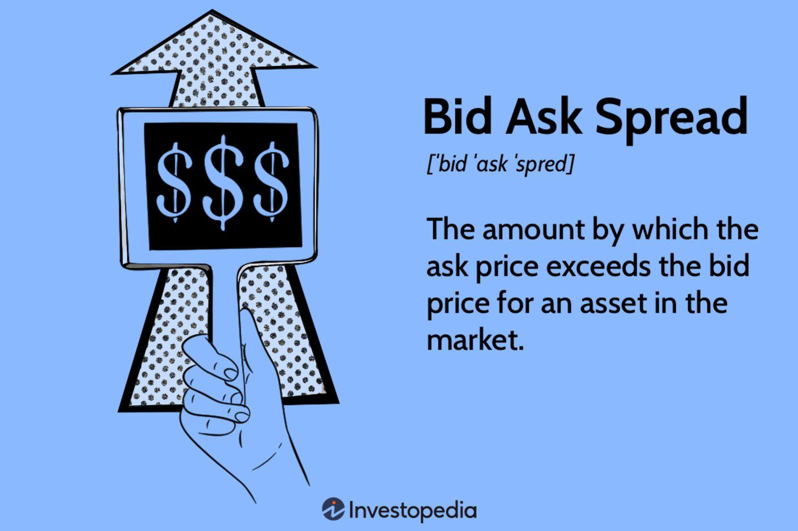

In the rapidly evolving landscape of financial markets, the bid-ask spread plays a crucial role in trading activities. This spread, defined as the difference between the price buyers are willing to pay (the bid) and the price sellers are willing to accept (the ask), serves as a key indicator of market liquidity and transaction costs. A narrow bid-ask spread generally signifies high liquidity and lower transaction costs, facilitating seamless trading. Conversely, a wide spread indicates lower liquidity and higher transaction costs, potentially hindering trade execution.

Algorithmic trading has fundamentally transformed how bid-ask spreads are leveraged, introducing unprecedented speed and efficiency in executing trades. By utilizing sophisticated algorithms, traders can execute transactions in milliseconds, optimizing trade outcomes by minimizing costs and exploiting small variations in bid-ask spreads. This technological advancement has significantly enhanced market liquidity, contributing to a more dynamic and efficient trading environment.



This article explores the complexities of the bid-ask spread and its substantial impact on algorithmic trading strategies, offering insights into how advancements in trading technologies continue to shape financial markets.

## Table of Contents

## Understanding Bid-Ask Spread

The bid-ask spread serves as a fundamental indicator of market conditions, providing insights into the transaction costs and liquidity of financial assets. It is defined as the difference between the bid price—the highest amount a buyer is prepared to pay—and the ask price—the lowest amount a seller is willing to accept. Mathematically, the bid-ask spread can be expressed as:

$$
\text{Spread} = \text{Ask Price} - \text{Bid Price}
$$

A narrow bid-ask spread typically suggests that the market is highly liquid, characterized by a greater number of buyers and sellers actively participating in transactions. This increased market activity often results in more favorable trading conditions, as assets can be bought and sold with minimal price concession.

Conversely, a wide bid-ask spread signifies lower market [liquidity](/wiki/liquidity-risk-premium), where fewer participants are available, leading to higher transaction costs. In such markets, traders might face challenges in executing trades at desirable prices, as significant price adjustments are necessary to accommodate lower liquidity levels.

The implications of bid-ask spreads are significant for traders, as these spreads directly affect potential profit margins. A well-informed trader takes into account the spread's size when making trading decisions, balancing the potential benefits against the intrinsic transaction costs embedded in wider spreads. Understanding these dynamics is essential for effective market participation and optimizing trading outcomes.

## Factors Influencing Bid-Ask Spread

Several factors impact the size of the bid-ask spread, with market liquidity, [volatility](/wiki/volatility-trading-strategies), and trading [volume](/wiki/volume-trading-strategy) playing pivotal roles.

Market liquidity is a primary [factor](/wiki/factor-investing) influencing bid-ask spreads. When an asset is highly liquid, it means there is a large number of buyers and sellers, allowing transactions to occur with ease. Consequently, the bid-ask spread in such markets tends to be narrow because the abundance of market participants facilitates price convergence between buyers and sellers. For instance, major currency pairs in the foreign exchange ([forex](/wiki/forex-system)) market, such as EUR/USD, typically exhibit narrow spreads due to high trading volumes and liquidity.

Volatility is another significant determinant of bid-ask spreads. High volatility in a market often results in wider spreads. This is because, during volatile periods, the uncertainty and risk associated with price fluctuations increase. Traders and market makers may widen spreads to compensate for the heightened risk of executing trades at unfavorable prices. For example, during economic announcements or geopolitical events, financial markets can experience sharp price movements, leading to temporarily increased bid-ask spreads.

Trading volume also affects bid-ask spreads. A higher trading volume generally suggests more active market participation and can contribute to tighter spreads. Conversely, when trading volumes are low, market participants might face difficulty in finding counterparties, resulting in wider spreads. This is particularly evident in smaller or less frequently traded stocks where lower liquidity can lead to significant spreads.

These factors collectively determine the dynamics of bid-ask spreads in various financial markets, influencing transaction costs and the ease with which trades can be executed effectively.

## Algorithmic Trading and Bid-Ask Spread

Algorithmic trading employs sophisticated computer algorithms to manage and execute trades at optimal prices. By leveraging the bid-ask spread—the difference between the highest price a buyer is willing to pay (bid) and the lowest price a seller is willing to accept (ask)—[algorithmic trading](/wiki/algorithmic-trading) can enhance the profitability of trading strategies. The core advantage of algorithmic systems lies in their ability to execute trades in milliseconds, thereby significantly reducing transaction costs and improving market liquidity by narrowing spreads.

One of the hallmarks of algorithmic trading is its capability to operate at speeds far beyond human reach. This speed enables algorithms to capture minute discrepancies in the bid-ask spread before they are corrected by market forces. The immediacy with which these algorithms operate allows for efficient [arbitrage](/wiki/arbitrage) opportunities, where bid and ask quotes temporarily diverge from fair value due to imbalances in supply and demand or latency in information dissemination. As algorithms constantly seek to profit from these price variations, they contribute to market efficiency by ensuring prices remain closely aligned with underlying market conditions.

In highly liquid markets, such as foreign exchange (Forex), the impact of algorithmic trading is even more pronounced. The Forex market, characterized by immense trading volume and liquidity, offers a fertile ground for algorithmic strategies. The narrow spreads in such markets mean small fluctuations can be capitalized upon quickly and with substantial turnover. Algorithmic trading systems continuously analyze live market data and adjust trading parameters to optimize outcomes, achieving substantial gains through high-frequency trading ([HFT](/wiki/high-frequency-trading-strategies)) techniques that maximize the number of profitable trades conducted within short timeframes.

Python and other programming languages are instrumental in developing and deploying algorithms. Simple algorithms might execute trades when specific conditions are met, while more complex ones might employ statistical models or [machine learning](/wiki/machine-learning) to predict price movements and adjust spreads dynamically. For example, an algo might use a moving average crossover strategy to identify potential trend reversals and place trades accordingly:

```python
import pandas as pd

def moving_average_crossover(prices, short_window=40, long_window=100):
    signals = pd.DataFrame(index=prices.index)
    signals['price'] = prices
    signals['short_mavg'] = prices.rolling(window=short_window, min_periods=1).mean()
    signals['long_mavg'] = prices.rolling(window=long_window, min_periods=1).mean()
    signals['signal'] = 0
    signals['signal'][short_window:] = np.where(signals['short_mavg'][short_window:] > signals['long_mavg'][short_window:], 1.0, 0.0)   
    signals['positions'] = signals['signal'].diff()
    return signals

# Example usage
prices = pd.Series([...])  # Replace with actual price data
signals = moving_average_crossover(prices)
```

In conclusion, algorithmic trading effectively capitalizes on the dynamics of bid-ask spreads, especially in high-liquidity environments. The capability of algorithms to respond with unmatched speed and accuracy enables them not only to reduce transaction costs but also to play a pivotal role in maintaining market stability and efficiency.

## Impact of Bid-Ask Spread on Trading Strategies

The bid-ask spread is a critical element for traders employing strategies like high-frequency trading (HFT) and market-making. In these strategies, understanding and optimizing the bid-ask spread can lead to significant advantages in transaction efficiency and cost management.

Traders utilize bid-ask spreads as indicators of current market conditions. A narrow spread often signals high liquidity and potential for quicker trade execution, while a wider spread may reflect low liquidity and higher transaction costs. The objective of many trading strategies is to buy assets at the bid price, which is the highest price a buyer is willing to pay, and sell at the ask price, the lowest price a seller will accept. This buy-low, sell-high approach ensures that traders profit from the inherent difference in the spread.

From a quantitative perspective, minimizing the bid-ask spread is necessary to reduce implicit transaction costs—costs not directly paid as fees but incurred through the mechanics of price differences. Traders employing HFT and market-making algorithms often devise methods that minimize these costs. For instance:

1. **Spread Quoting**: Market makers continuously quote both bid and ask prices, thereby capturing the spread as profit. The formula for profit from an individual trade can be expressed as:
$$
   \text{Profit} = (\text{Ask Price} - \text{Bid Price}) \times \text{Volume}

$$
   A narrow spread can mean lower profit per trade but potentially higher volume due to increased liquidity.

2. **Algorithmic Precision**: In high-frequency trading, algorithms are designed to operate within milliseconds. These programs exploit minute discrepancies in the spread across various markets, performing arbitrage trades with minimal risk.

3. **Liquidity Provision**: By providing liquidity, traders help narrow spreads. For market makers, participating in highly liquid markets allows them to frequently adjust bid/ask quotes, capturing the spread with reduced risk of holding positions that can lose value.

In essence, successful trading strategies hinge on the effective management of the bid-ask spread. By reducing these spreads, traders not only enhance profitability but also contribute to overall market efficiency. As markets become more competitive and liquid due to algorithmic trading, the ability to adeptly manage spreads will continue to be a crucial factor in trading success.

## Technological Advances in Algo Trading

Technological advancements have played a critical role in the evolution of algorithmic trading, significantly enhancing the efficiency with which bid-ask spreads are utilized. The integration of [artificial intelligence](/wiki/ai-artificial-intelligence) (AI) and machine learning (ML) into trading algorithms is a key development, allowing for more precise predictions of spread movements and the optimization of trading strategies.

AI systems, equipped with advanced data processing capabilities, analyze vast amounts of market data to detect patterns that may be invisible to human traders. This capability is particularly beneficial for predicting changes in the bid-ask spread, a task that requires analyzing real-time data on trading volumes, price fluctuations, and market sentiment. Machine learning algorithms optimize this process by continuously learning from new data, thus improving prediction accuracy over time.

The use of real-time data streams is another crucial technological advance. High-frequency trading platforms can process millions of data points per second, enabling traders to respond to spread changes almost instantaneously. This reduces the risk of slippage (the difference between the expected price of a trade and the actual price) and minimizes transaction costs.

Moreover, modern trading systems often employ advanced data analytics tools to enhance decision-making. These tools can assess a wide array of factors, such as market depth, historical price trends, and macroeconomic indicators, all of which contribute to a more comprehensive understanding of market conditions. As a result, traders can make informed decisions that lead to tighter bid-ask spreads, improving market liquidity and efficiency.

For example, an algorithm might be designed to monitor the depth of the [order book](/wiki/order-book-trading-strategies) and identify conditions likely to result in spread tightening or widening. In Python, a simple structure for such a monitoring algorithm might look like this:

```python
import pandas as pd

def analyze_spread(order_book_data):
    # Calculate bid-ask spread
    spread = order_book_data['ask_price'] - order_book_data['bid_price']

    # Analyze spread changes
    spread_changes = spread.diff()

    # Identify conditions for spread tightening or widening
    conditions = {
        'tighten': spread_changes[spread_changes < 0].count(),
        'widen': spread_changes[spread_changes > 0].count()
    }

    return conditions

# Example usage
order_book_data = pd.DataFrame({
    'bid_price': [101.2, 101.3, 101.4],
    'ask_price': [101.6, 101.7, 101.8]
})

conditions = analyze_spread(order_book_data)
print(conditions)
```

In this code snippet, `analyze_spread` calculates the spread based on order book data and identifies conditions likely to lead to spread tightening or widening by analyzing changes over time.

In conclusion, the integration of AI, machine learning, and real-time analytics in algorithmic trading has driven substantial improvements in the efficient utilization of bid-ask spreads. These technologies have not only enhanced prediction and execution capabilities but also contributed to the overall efficiency and liquidity of financial markets.

## Conclusion

The bid-ask spread is an essential element of trading in financial markets, directly affecting transaction costs and liquidity. A narrow spread generally indicates a more liquid market, where securities can be bought and sold with minimal price variation, thus lowering the implicit cost of trading. Conversely, a wider spread often reflects lower liquidity, which can increase trading costs due to the greater difference between buying and selling prices.

Algorithmic trading, with its ability to execute trades with speed and precision, has dramatically reshaped the landscape by efficiently utilizing bid-ask spreads. Through the use of sophisticated algorithms, traders can rapidly respond to market conditions, optimizing the timing and pricing of trades. This capability enhances liquidity and potentially narrows spreads by increasing market participation and competition among market makers.

As technology advances, the integration of artificial intelligence and machine learning in algorithmic trading is expected to deepen. These technologies can analyze vast quantities of data to predict spread fluctuations and craft strategies that anticipate market changes. The use of real-time analytics further aids in minimizing transaction costs and improving the decision-making process, thereby leading to tighter spreads and more efficient markets.

The ongoing evolution of technology suggests a strengthening relationship between bid-ask spreads and algorithmic trading. This evolving synergy is likely to create new opportunities for traders, enabling them to exploit market inefficiencies and enhance their trading strategies. As the financial markets become increasingly complex and data-driven, understanding and leveraging bid-ask spreads through advanced algorithms will remain a crucial aspect of successful trading strategies.

## FAQs

### What is a bid-ask spread, and why is it important?

The bid-ask spread is essential to financial markets, representing the gap between the highest price a buyer is willing to pay for an asset (the bid) and the lowest price a seller is willing to accept (the ask). This spread serves as a measure of market liquidity and transaction costs. A narrower spread typically indicates higher liquidity, meaning more activity and willing participants in the market, which generally reduces transaction costs. In contrast, a wider spread suggests lower liquidity, higher transaction costs, and potential difficulty in executing trades at desired prices.

### How does algorithmic trading impact bid-ask spreads?

Algorithmic trading utilizes computer algorithms to execute trades at optimal prices, frequently taking advantage of bid-ask spreads for profit. The speed and precision with which these algorithms operate allow them to execute trades within milliseconds, thereby enhancing market liquidity and reducing transaction costs. By efficiently matching buy and sell orders, algorithmic trading can help narrow the bid-ask spread, allowing for more efficient market participation. In highly liquid markets like foreign exchange (forex), algorithmic trading is particularly effective due to the vast number of transactions occurring within short time frames.

### What factors influence the size of bid-ask spreads?

Several factors influence the bid-ask spread's magnitude:

1. **Market Liquidity:** High liquidity indicates a large number of buyers and sellers, typically resulting in narrower spreads. In contrast, low liquidity can lead to wider spreads due to less market activity.

2. **Volatility:** Increased market volatility can cause wider spreads, as the risk and uncertainty rise, prompting traders to demand higher compensation for potential adverse price movements.

3. **Trading Volume:** Higher trading volumes often lead to narrower spreads, as more participants and transactions create competition and ease of trade execution.

4. **Market Conditions:** External factors such as economic news, events, and market sentiment shifts can temporarily widen spreads as traders adjust to new information.

### How can traders benefit from understanding bid-ask spreads?

Comprehending bid-ask spreads is vital for traders as it directly affects transaction costs and the ease of executing trades. Strategies like high-frequency trading and [market making](/wiki/market-making) rely on precise spread analysis to optimize trading decisions and improve profitability. By understanding these spreads, traders can:

- **Optimize Entry and Exit Points:** Traders can time their trades to benefit from tighter spreads, minimizing implicit transaction costs.

- **Mitigate Risk:** Awareness of spread fluctuations enables traders to anticipate costs and adjust their strategies accordingly, particularly in volatile markets.

- **Improve Strategy Efficiency:** By incorporating spread analysis, traders can enhance their algorithms to adjust execution strategies dynamically in response to changing market conditions.

Overall, mastery of bid-ask spread dynamics empowers traders to make informed decisions, ultimately enhancing their trading strategy's effectiveness.

## References & Further Reading

[1]: O'Hara, M. (1995). ["Market Microstructure Theory."](https://www.wiley.com/en-us/Market+Microstructure+Theory-p-9780631207610) Wiley-Blackwell.

[2]: Harris, L. (2002). ["Trading and Exchanges: Market Microstructure for Practitioners."](https://www.acsu.buffalo.edu/~keechung/MGF743/Readings/Trading-Exchanges-Market-Microstructure-Practitioners%20Draft%20Copy.pdf) Oxford University Press.

[3]: Narang, R. K. (2009). ["Inside the Black Box: The Simple Truth About Quantitative Trading."](https://onlinelibrary.wiley.com/doi/book/10.1002/9781118267738) Wiley.

[4]: Aldridge, I. (2013). ["High-Frequency Trading: A Practical Guide to Algorithmic Strategies and Trading Systems."](https://www.amazon.com/High-Frequency-Trading-Practical-Algorithmic-Strategies/dp/1118343506) Wiley.

[5]: Farmer, J. D., Patelli, P., & Zovko, I. I. (2005). ["The Predictive Power of Zero Intelligence in Financial Markets."](https://www.pnas.org/doi/abs/10.1073/pnas.0409157102) Proceedings of the National Academy of Sciences, 102(6), 2254–2259.