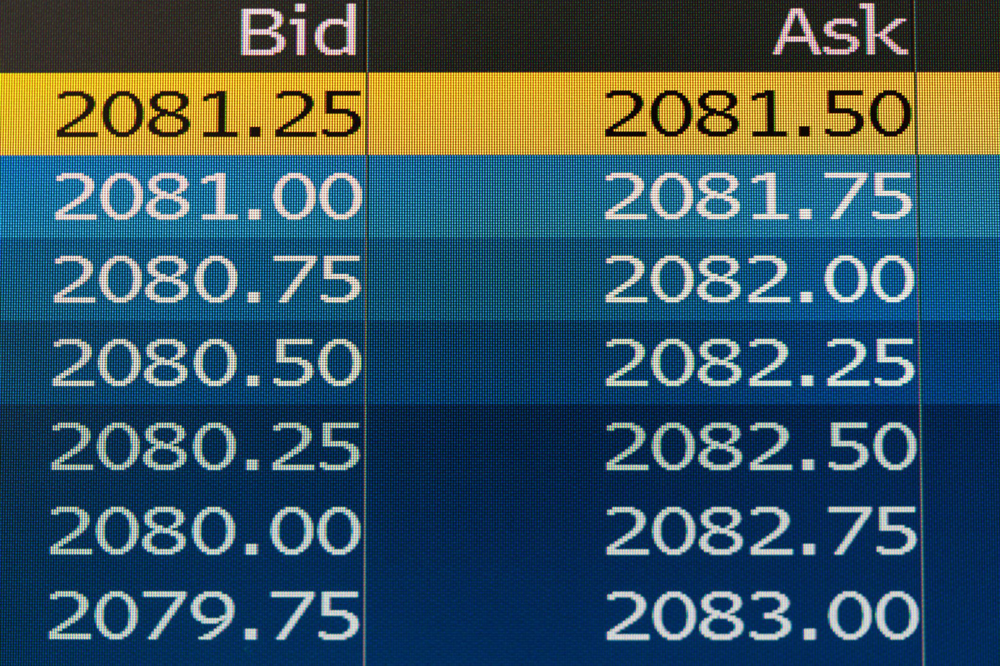

The bid-ask spread and bid-ask bounce are pivotal concepts in grasping the mechanics of financial markets. For traders, investors, and various market participants, comprehending these terms is critical, as they engage actively in trading activities. The bid-ask spread specifically denotes the difference between the bid price— the maximum price a buyer is willing to pay for an asset—and the ask price, which represents the minimum price a seller is willing to accept. This spread is an inherent feature of any financial market and serves as a fundamental indicator of market liquidity and transaction costs.

Conversely, bid-ask bounce refers to the fluctuating movement or oscillation of prices between these bid and ask levels. This bounce primarily illustrates the short-term volatility present within a market, driven by immediate trading actions and quote updates. These oscillations occur because prices often revert to the bid or ask levels following transactions, contributing to the appearance of market volatility, even when actual price movements are minimal.



An in-depth understanding of both the bid-ask spread and bid-ask bounce is essential for informed decision-making regarding trading and investment strategies. These concepts not only help assess transaction costs and market liquidity but also provide insights into the transient nature of price changes and potential opportunities for executing trades more effectively. By evaluating these dynamics, market participants can navigate the complex landscape of financial markets with greater strategic foresight, ultimately supporting better trading outcomes and investment decisions.

## Table of Contents

## Understanding the Bid-Ask Spread

The bid-ask spread is a fundamental concept in financial markets, representing the difference between the price at which buyers are willing to purchase an asset (bid) and the price at which sellers are willing to sell an asset (ask). This spread effectively measures market liquidity, with narrower spreads generally indicating higher liquidity. When a market is highly liquid, there are more participants willing to buy and sell assets, leading to tighter spreads. Conversely, in less liquid markets, the spreads tend to widen due to fewer participants.

A crucial aspect of the bid-ask spread is its role as an indicator of transaction costs. The spread itself represents the cost of trading an asset; wider spreads result in higher costs for executing trades. For instance, a trader looking to buy an asset at the ask price and then sell at the bid price immediately incurs a loss equal to the spread, thus highlighting its impact on the profitability of trading activities.

Market makers play a significant role in determining the bid-ask spread by providing liquidity to the exchange. These entities stand ready to buy and sell financial instruments, profiting from the spread itself. Their function is crucial in maintaining market efficiency as they absorb and supply liquidity. By placing both bid and ask quotes, market makers can capture the spread as profit. The ability of market makers to maintain narrow spreads depends on various factors, including market volatility and trading volume.

The relationship between the bid and ask prices can be summarized as:

$$
\text{Spread} = \text{Ask Price} - \text{Bid Price}
$$

This simple equation highlights a key source of income for market makers, as their strategy involves buying at the bid price and selling at the ask price, thus capturing the spread difference. This process not only aids in price discovery but also ensures that the market remains liquid and operational.

Understanding the bid-ask spread is vital for traders and investors, as it directly impacts trade execution costs and the time required for trades to be filled. By assessing the spread, market participants can gauge the [liquidity](/wiki/liquidity-risk-premium) of an asset class and strategize accordingly to minimize transaction costs while maximizing potential gains.

## Exploring Bid-Ask Bounce

Bid-ask bounce is a phenomenon characterized by the short-term oscillation of prices between the bid and ask levels. This movement is an intrinsic aspect of financial markets, manifesting as fluctuations that can sometimes be mistaken for [volatility](/wiki/volatility-trading-strategies). However, unlike traditional market volatility driven by changes in economic conditions or investor sentiment, bid-ask bounce primarily reflects the continuous updating of price quotes by market participants.

### Price Movements and Quote Updates

Bid-ask bounce arises from the way market orders are executed. When a buy order meets a sell order, a transaction occurs at the existing ask price, potentially shifting the subsequent market bid-ask quotes. This constant adjustment leads to minor "bounces" as prices revert quickly between the bid and ask levels without necessarily representing substantive market movements. These micro movements can influence how investors perceive market liquidity and trading costs.

### Impact on High-Frequency Trading

For high-frequency traders (HFTs), who execute thousands of transactions per second, understanding bid-ask bounce is crucial. These traders depend on small price differences and quick execution to capitalize on [arbitrage](/wiki/arbitrage) opportunities. The bid-ask bounce, hence, influences the strategies employed by HFTs, as it affects the predictability of price movements and the timing of order placements. Misestimating the bounce can result in reduced profits or increased trading costs due to slippage — the difference between expected and actual transaction prices.

### Technical Analysis Insights

In technical analysis, bid-ask bounce provides valuable insights into the underlying behavior of market participants. By analyzing the frequency and pattern of bounces, traders can infer the level of aggressiveness in buying or selling pressures. A [high frequency](/wiki/high-frequency-trading) of bounces might indicate a balanced market with equal buying and selling interest, whereas less frequent bounces could suggest dominance by one side. This information assists traders in making informed decisions regarding entry and [exit](/wiki/exit-strategy) points, maintaining optimal positions by adapting to dynamic market conditions.

By integrating both quantitative and qualitative analyses of bid-ask bounce, traders can refine their approaches to maximize efficiency and performance, particularly in environments where rapid decisions are paramount. Understanding the nuances of bid-ask dynamics is essential for developing robust trading algorithms that can navigate these short-term fluctuations with precision.

## Factors Influencing Bid-Ask Spread and Bounce

Liquidity is a primary determinant of the bid-ask spread and bid-ask bounce in financial markets. Generally, more liquid markets display narrower spreads, indicating lower transaction costs for traders. Liquidity is typically measured by the market's depth, i.e., the number of buy and sell orders at various price levels. In highly liquid markets, traders can execute large transactions with minimal impact on asset prices, resulting in less pronounced bid-ask bounces. Conversely, illiquid markets may feature wider spreads and more pronounced bounces due to limited buyer and seller presence.

Market volatility is another [factor](/wiki/factor-investing) influencing the bid-ask spread and bounce. In periods of high volatility, uncertainty about asset prices often leads to wider spreads. Traders demand a risk premium for holding assets in such unstable conditions, contributing to increased spread widths. High volatility can also exacerbate bid-ask bounces as rapid fluctuations in quote prices reflect changing market perceptions and participant actions.

Information asymmetry plays a critical role in determining bid-ask dynamics. When certain market participants have access to information that others do not, it can result in unevenly distributed knowledge about an asset's true value. This discrepancy can lead to wider spreads and significant bid-ask bounces as traders attempt to adjust for anticipated price movements. For instance, insider trading can create temporary inefficiencies that affect spread and bounce characteristics.

Trading [volume](/wiki/volume-trading-strategy) and order flow are intimately connected with spread and bounce behaviors. High trading volumes often result in narrower spreads due to increased competition among market participants, providing more opportunities for buying and selling at preferential prices. Additionally, robust order flow can stabilize bid-ask bounces by minimizing price gaps between successive trades. The interaction between trading volume and order flow thus tends to smoothen price movements and tighten spreads, presenting a more stable trading environment. 

These factors collectively shape the cost and risk associated with executing trades, underscoring the importance of understanding bid-ask dynamics for informed decision-making in financial markets.

## Impact of Bid-Ask Bounce on Algorithmic Trading

In [algorithmic trading](/wiki/algorithmic-trading), bid-ask bounce represents both a challenge and an opportunity for traders seeking to optimize their strategies. The phenomenon of bid-ask bounce, caused by rapid price oscillations between the bid and ask prices, can present arbitrage opportunities that algorithms are specifically designed to exploit. By analyzing the microstructure of the market, algorithms can detect patterns and predict short-term price movements with greater precision.

Algorithmic strategies often focus on the bid-ask spread as a potential indicator of price directionality. For instance, when the spread narrows, it might suggest increased market activity and potential price continuation in a given direction. Conversely, a widening spread may indicate market hesitation or volatility, prompting algorithms to adjust their trading tactics accordingly. 

### Exploiting Arbitrage Opportunities

Arbitrage strategies in algorithmic trading can profit from inefficiencies that arise due to bid-ask bounce. If an algorithm detects a temporary widening of the spread that deviates from the typical market conditions, it may execute simultaneous buy and sell orders to capture the price difference, thus generating a risk-free or minimal-risk profit. 

A simplified Python example of using an algorithm to exploit bid-ask spread might look like this:

```python
def bid_ask_arbitrage(bid, ask, threshold):
    if ask - bid > threshold:
        # Execute buy at bid, sell at ask
        profit = (ask - bid) - transaction_cost
        return profit
    return 0

def monitor_market(data_stream):
    threshold = 0.02  # Example threshold for spread
    net_profit = 0
    for bid, ask in data_stream:
        net_profit += bid_ask_arbitrage(bid, ask, threshold)
    return net_profit
```

### Enhancing Algorithm Effectiveness

Understanding the dynamics of bid-ask bounce is crucial for enhancing the accuracy and effectiveness of trading algorithms. Algorithms that incorporate real-time data on bid-ask spread and bounce are better equipped to execute trades at optimal prices. High-frequency trading ([HFT](/wiki/high-frequency-trading-strategies)) algorithms, for instance, leverage rapid data processing and decision-making to capitalize on micro-movements in price, thereby reducing the cost per trade and improving execution quality.

Moreover, by incorporating [machine learning](/wiki/machine-learning) techniques, algorithms can learn and adapt to the evolving patterns of bid-ask bounce over time, enhancing predictive capabilities and further optimizing trading strategies. These advanced algorithms can model complex relationships between bid-ask dynamics and external market factors, enabling traders to anticipate market behavior more effectively.

In summary, the bid-ask bounce serves as a critical component in algorithmic trading. By exploiting spread dynamics, algorithms can identify lucrative trading opportunities and enhance strategy performance, highlighting the importance of comprehensively understanding market microstructure in developing robust trading models.

## Navigating Bid-Ask Spread and Bounce in Different Market Conditions

Market conditions play a critical role in shaping the characteristics of the bid-ask spread and the bid-ask bounce. These factors are integral to trading strategies and directly impact the cost and execution of trades. In particular, liquidity is a key determinant of the spread and bounce behaviors. In less liquid markets, wider spreads and larger bounces are prevalent, posing challenges to traders who need to adjust their strategies accordingly.

### Influence of Market Liquidity

Liquidity refers to the ease with which an asset can be bought or sold in the market without affecting its price. In highly liquid markets, such as major currencies or large-cap stocks, competition among traders often results in narrower bid-ask spreads. Here, the frequent trading ensures that any imbalances in supply and demand are quickly corrected, minimizing the bid-ask bounce. Conversely, in less liquid markets—such as small-cap stocks, or niche commodities—the scarcity of buyers and sellers often leads to wider spreads and more pronounced bid-ask bounces. This situation arises because fewer market participants are available to quickly offset buy and sell orders.

### Impact of Volatility

Market volatility, characterized by rapid price movements, also influences the bid-ask spread and bounce. During periods of high volatility, increased uncertainty can cause market makers to widen the spread as a risk premium. This serves to protect them from potential adverse price movements. Consequently, traders might observe larger bounces between bid and ask prices, reflecting quick shifts in market sentiment. To navigate these conditions, traders often employ strategies such as volatility-based spreads which adjust the quote margins in line with the prevailing market risk.

### Strategic Adjustments by Traders

Given the dynamic nature of market conditions, traders often need to modify their strategies to manage transaction costs and optimize trade execution. In less liquid or highly volatile markets, strategies that emphasize limit orders rather than market orders become more prevalent. This approach allows traders to define acceptable bid or ask levels, minimizing the impact of wide spreads and avoiding the pitfalls of large bounces.

Here is an example of a simple Python code that traders can use to simulate how spreads might adjust based on market liquidity:

```python
import numpy as np

# Simulate liquidity conditions
liquidity_levels = ['High', 'Medium', 'Low']
spread_multiplier = {'High': 1, 'Medium': 2, 'Low': 3}

# Base spread
base_spread = 0.01

# Calculate spread based on liquidity level
def calculate_spread(liquidity, base_spread):
    return base_spread * spread_multiplier[liquidity]

# Simulate the effect of different liquidity conditions
for liquidity in liquidity_levels:
    spread = calculate_spread(liquidity, base_spread)
    print(f"Liquidity: {liquidity}, Spread: {spread:.2%}")
```

By adjusting their strategies based on liquidity and volatility, traders can better manage bid-ask outcomes. This strategic flexibility is crucial in mitigating the costs associated with executing trades and in maximizing profits under various market conditions.

## Mastering Bid-Ask Dynamics for Improved Trading Decisions

Mastering bid-ask dynamics is crucial for traders aiming to improve their trading strategies and boost profitability. A thorough comprehension of these dynamics enables traders to anticipate market behavior and implement more effective execution techniques. By accurately interpreting the bid-ask spread, which signifies the difference between the highest price a buyer is willing to pay (bid) and the lowest price a seller is willing to accept (ask), traders can gauge market liquidity and optimize their entry and exit points.

Strategies that integrate the understanding of spread and bounce dynamics can substantially lower transaction costs. For instance, a narrower bid-ask spread typically translates to reduced transaction expenses, as the cost of buying and selling an asset is minimized. High-frequency trading (HFT) strategies, in particular, thrive on exploiting the nuances of bid-ask spreads, aiming to capitalize on fleeting price inefficiencies. Algorithms programmed to identify optimal moments within these spreads can execute trades swiftly, capturing marginal profits with high accuracy.

Furthermore, an awareness of bid-ask bounce, which emerges from oscillations or fluctuations between bid and ask prices, offers insights into short-term market volatility and sentiment. These bounces often indicate temporary imbalances in supply and demand, which can be leveraged to predict imminent price movements. Traders utilizing technical analysis can observe patterns in these bounces to infer possible changes in market sentiment, enabling the development of strategies that respond to these fluctuations.

Understanding bid-ask dynamics not only aids in transactional efficiency but also provides valuable insights into broader market trends and sentiment. By correlating bid-ask activity with market conditions, traders can deduce potential price movements and adjust their strategies accordingly to maintain a competitive edge. Thus, mastering these dynamics not only facilitates improved trade execution but also enhances the ability to interpret market signals for informed decision-making.

## Conclusion

The bid-ask spread and bid-ask bounce are foundational elements in the trading and investment sectors, playing essential roles in shaping market dynamics. Understanding these concepts is vital as they offer valuable insights into market liquidity, transaction costs, and potential market inefficiencies that traders can exploit for profit. The bid-ask spread not only reflects the cost of trading but also indicates the level of market liquidity. A narrower spread suggests a more liquid market where transactions can be executed with lower costs, while a wider spread often signals a less liquid market with higher transaction costs. 

Furthermore, the bid-ask bounce, indicative of short-term volatility, is crucial for traders focused on high-frequency trading and algorithmic trading strategies. It highlights the intermittent price oscillations between the bid and ask prices, providing traders with data that can influence rapid trade decisions and strategies aimed at capitalizing on short-term market movements. Understanding these dynamics allows traders to refine their strategies, ensuring they are better positioned to execute trades efficiently and profitably.

Traders and investors, therefore, must craft strategies that effectively account for these dynamics, adjusting for different market conditions to manage costs and optimize trade execution. This approach not only aids in reducing transaction costs but also enhances the potential for achieving superior market outcomes. Mastery of bid-ask dynamics is essential for traders and investors aiming to navigate various market conditions successfully and improve their decision-making processes.

## References & Further Reading

[1]: ["Advances in Financial Machine Learning"](https://www.amazon.com/Advances-Financial-Machine-Learning-Marcos/dp/1119482089) by Marcos Lopez de Prado

[2]: ["Evidence-Based Technical Analysis: Applying the Scientific Method and Statistical Inference to Trading Signals"](https://www.amazon.com/Evidence-Based-Technical-Analysis-Scientific-Statistical/dp/0470008741) by David Aronson

[3]: ["Machine Learning for Algorithmic Trading"](https://github.com/stefan-jansen/machine-learning-for-trading) by Stefan Jansen

[4]: ["Quantitative Trading: How to Build Your Own Algorithmic Trading Business"](https://www.amazon.com/Quantitative-Trading-Build-Algorithmic-Business/dp/1119800064) by Ernest P. Chan

[5]: Hasbrouck, J. (1996). ["Order Characteristics and Stock Price Evolution: An Application to the bid-ask Bounce"](https://www.sciencedirect.com/science/article/pii/0304405X9500858C) The Journal of Finance, 51(5), 1791-1805.

[6]: Harris, L. (2002). ["Trading and Exchanges: Market Microstructure for Practitioners"](https://academic.oup.com/book/52292) Oxford University Press.

[7]: Madhavan, A. (2000). ["Market Microstructure: A Survey"](https://www.sciencedirect.com/science/article/pii/S1386418100000070) Journal of Financial Markets, 3(3), 205-258.