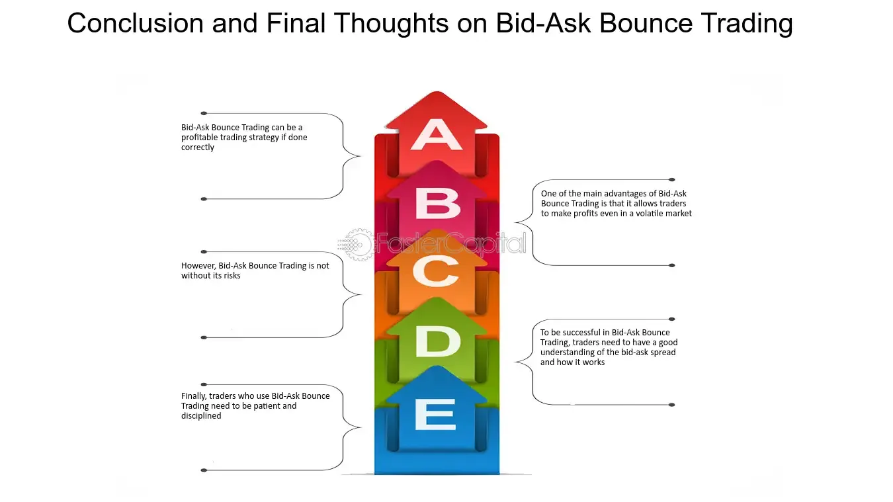

## Table of Contents

## What is the bid-ask spread?

The bid-ask spread is the difference between the highest price a buyer is willing to pay for an asset (the bid) and the lowest price a seller is willing to accept (the ask). It's like a small gap between what people want to buy something for and what people want to sell it for. This spread is important because it shows how much it might cost to trade that asset right away.

In simple terms, the bid-ask spread is a cost of trading. If you want to buy a stock, you'll have to pay the ask price, which is higher than the bid price. If you want to sell, you'll get the bid price, which is lower than the ask price. The bigger the spread, the more it costs to trade, and it can tell you how easy or hard it is to buy or sell that asset quickly.

## What is the bid-ask bounce?

The bid-ask bounce is a term used in trading to describe when a stock's price seems to jump back and forth between the bid and ask prices. Imagine you're watching a stock's price move on a chart. Sometimes, it looks like the price is bouncing between two levels. This can happen because of the way trades are made at the bid and ask prices.

When someone wants to buy a stock, they usually have to pay the ask price, which is a bit higher. When someone wants to sell, they get the bid price, which is a bit lower. If there are lots of trades happening quickly, the price can look like it's bouncing between these two prices. This can make the stock's price seem more unstable than it really is, but it's just a normal part of how trading works.

## How is the bid-ask spread calculated?

The bid-ask spread is calculated by taking the difference between the ask price and the bid price. The ask price is what sellers are willing to sell the stock for, and the bid price is what buyers are willing to pay for it. So, if the ask price is $10.05 and the bid price is $10.00, the bid-ask spread would be $10.05 - $10.00 = $0.05.

This spread can also be expressed as a percentage of the stock's price, which is called the bid-ask spread percentage. To find this, you divide the bid-ask spread by the ask price, then multiply by 100 to turn it into a percentage. Using our example, the spread percentage would be ($0.05 / $10.05) * 100 = 0.497%. This percentage helps traders understand the cost of trading relative to the price of the stock.

## What causes the bid-ask bounce?

The bid-ask bounce happens because of how trading works. When someone wants to buy a stock, they pay the ask price, which is higher. When someone wants to sell, they get the bid price, which is lower. These two prices are always a bit different, creating a gap called the bid-ask spread. When trades happen quickly, the price of the stock can seem to jump back and forth between these two prices. This jumping or bouncing is what we call the bid-ask bounce.

It's like watching a ball bounce between two lines on a chart. If there are a lot of trades, the price can look like it's moving up and down a lot. But really, it's just moving between the bid and ask prices. This can make the stock seem more unstable than it is, but it's a normal part of trading. It's important for traders to understand this so they don't get confused by the price movements.

## Why is the bid-ask spread important to traders and investors?

The bid-ask spread is important to traders and investors because it tells them the cost of trading a stock. When you want to buy a stock, you have to pay the ask price, which is a bit higher than the bid price. When you want to sell, you get the bid price, which is lower than the ask price. The difference between these two prices is the bid-ask spread. This spread is like a fee you pay every time you trade, so a bigger spread means it costs more to buy and sell. Traders and investors need to know this because it can affect how much money they make or lose.

Also, the bid-ask spread can show how easy or hard it is to trade a stock. If the spread is small, it means there are a lot of people wanting to buy and sell, so trading is easier and cheaper. But if the spread is big, it means fewer people are trading, and it might be harder to buy or sell quickly. This is important for investors because they might not want to trade stocks that are hard to buy or sell. Understanding the bid-ask spread helps them make better choices about which stocks to trade and when.

## How does the bid-ask bounce affect trading strategies?

The bid-ask bounce can make trading seem more confusing than it is. When you see a stock's price jumping back and forth between the bid and ask prices, it can look like the stock is moving a lot. But really, it's just bouncing between these two prices. This can trick traders into thinking the stock is more unstable than it really is. If traders don't understand this, they might make quick decisions based on the bouncing price, which can lead to mistakes in their trading strategies.

To deal with the bid-ask bounce, smart traders use strategies that look at the bigger picture. Instead of reacting to every little jump in price, they might wait for the stock to move past the bid-ask spread before making a trade. This way, they don't get caught up in the small price changes that happen because of the bid-ask bounce. By understanding that the bounce is normal and not a sign of big changes in the stock's value, traders can make better decisions and stick to their long-term plans.

## Can you explain the relationship between liquidity and the bid-ask spread?

Liquidity is all about how easy it is to buy or sell a stock without changing its price too much. When a stock is liquid, it means there are lots of people wanting to buy and sell it. This makes the bid-ask spread smaller because there's always someone ready to trade at a price close to the last trade. Think of it like a busy market where everyone is happy to trade at a fair price, so the difference between what buyers and sellers want is small.

On the other hand, when a stock is not very liquid, it's like a quiet market where not many people want to trade. This makes the bid-ask spread bigger because there's a bigger gap between what buyers are willing to pay and what sellers are willing to accept. If you want to buy or sell a stock that's not very liquid, you might have to accept a worse price, which means the cost of trading goes up. So, the more liquid a stock is, the smaller the bid-ask spread tends to be, and the easier and cheaper it is to trade.

## What impact does market volatility have on the bid-ask bounce?

Market [volatility](/wiki/volatility-trading-strategies) can make the bid-ask bounce more noticeable and frequent. When the market is volatile, prices move up and down a lot. This can cause more trades to happen at the bid and ask prices because people are trying to buy and sell quickly. As a result, the price of a stock can seem to jump back and forth between the bid and ask prices more often, making the bid-ask bounce more obvious. Traders might see this and think the stock is moving a lot, but it's just the effect of the bid-ask bounce during times of high volatility.

During periods of high market volatility, the bid-ask spread might also get wider. This happens because sellers might want more money to sell their stocks, and buyers might not be willing to pay as much. A wider spread can make the bid-ask bounce even more pronounced because the price has a bigger gap to jump across. Understanding this can help traders not to overreact to the price movements they see during volatile times and make better trading decisions.

## How do different types of orders affect the bid-ask spread?

Different types of orders can change the bid-ask spread by affecting how buyers and sellers interact in the market. For example, a market order is when someone wants to buy or sell a stock right away at the best available price. When lots of market orders come in, they can push the price towards the ask if people are buying, or towards the bid if people are selling. This can make the bid-ask spread smaller because more people are willing to trade at the current prices. On the other hand, if there are fewer market orders, the spread might stay the same or get bigger because there's less action in the market.

Limit orders, where someone sets a specific price they're willing to buy or sell at, can also affect the bid-ask spread. If someone puts in a limit order to buy at a price higher than the current bid, it might raise the bid price, making the spread smaller. If someone puts in a limit order to sell at a price lower than the current ask, it might lower the ask price, again making the spread smaller. But if these limit orders are far away from the current prices, they might not affect the spread much until the market moves closer to them. So, the type of orders traders use can make the bid-ask spread bigger or smaller depending on how they affect the buying and selling prices.

## What are some strategies to mitigate the effects of the bid-ask bounce?

One way to deal with the bid-ask bounce is to not make quick decisions based on the small price jumps you see. Instead of trying to trade every time the price moves a little, wait for the stock's price to move past the bid and ask prices. This helps you avoid getting caught up in the normal ups and downs of the bid-ask bounce. By waiting for a bigger move, you can make sure you're trading based on real changes in the stock's value, not just the bouncing between bid and ask.

Another strategy is to use limit orders instead of market orders. When you use a limit order, you set a specific price you're willing to buy or sell at. This can help you avoid the bid-ask bounce because you're not just taking the first price that comes along. You can set your buy limit order a bit below the current ask price and your sell limit order a bit above the current bid price. This way, you're more likely to get a better price and not be affected by the quick jumps in price caused by the bid-ask bounce.

## How do electronic trading platforms influence the bid-ask spread and bounce?

Electronic trading platforms have made it easier for people to buy and sell stocks quickly. This means more people can trade at the same time, which can make the bid-ask spread smaller. When lots of people are trading, there are always buyers and sellers ready to trade at prices close to the last trade. This makes the difference between the bid and ask prices smaller because everyone is more willing to trade at a fair price. So, electronic trading platforms can help make trading cheaper by reducing the bid-ask spread.

These platforms can also affect the bid-ask bounce. Because trades happen so fast on electronic platforms, the price can seem to jump back and forth between the bid and ask prices more often. This makes the bid-ask bounce more noticeable. Traders need to be careful not to get confused by these quick price changes and make bad decisions. By understanding that the bid-ask bounce is just a normal part of trading on electronic platforms, traders can stick to their plans and not be tricked by the bouncing prices.

## What advanced statistical models are used to analyze the bid-ask spread and bounce?

Advanced statistical models help traders understand the bid-ask spread and bounce better. One common model is the Autoregressive Conditional Heteroskedasticity (ARCH) model and its extensions like GARCH. These models look at how the bid-ask spread changes over time and how it's affected by things like how much the stock's price moves around. They can help traders predict what the spread might be in the future, which is useful for planning trades. Another model is the Vector Autoregression (VAR) model, which looks at how different things, like the bid-ask spread and the stock's price, affect each other. This can help traders see how the spread and the price might move together.

Another useful model is the Market Microstructure Model, which looks at how the bid-ask spread is affected by the way people trade. This model can help traders understand why the spread might be bigger or smaller at different times. It looks at things like how many people are trading, how fast they're trading, and what kind of orders they're using. By using these models, traders can get a better idea of what's happening with the bid-ask spread and bounce, and make smarter trading decisions.

## What is the Bid-Ask Spread and How Can We Understand It?

The bid-ask spread is a fundamental concept in financial markets, representing the difference between the price at which buyers are willing to purchase an asset (bid) and the price at which sellers are willing to sell an asset (ask). This spread effectively measures market liquidity, with narrower spreads generally indicating higher liquidity. When a market is highly liquid, there are more participants willing to buy and sell assets, leading to tighter spreads. Conversely, in less liquid markets, the spreads tend to widen due to fewer participants.

A crucial aspect of the bid-ask spread is its role as an indicator of transaction costs. The spread itself represents the cost of trading an asset; wider spreads result in higher costs for executing trades. For instance, a trader looking to buy an asset at the ask price and then sell at the bid price immediately incurs a loss equal to the spread, thus highlighting its impact on the profitability of trading activities.

Market makers play a significant role in determining the bid-ask spread by providing liquidity to the exchange. These entities stand ready to buy and sell financial instruments, profiting from the spread itself. Their function is crucial in maintaining market efficiency as they absorb and supply liquidity. By placing both bid and ask quotes, market makers can capture the spread as profit. The ability of market makers to maintain narrow spreads depends on various factors, including market volatility and trading [volume](/wiki/volume-trading-strategy).

The relationship between the bid and ask prices can be summarized as:

$$
\text{Spread} = \text{Ask Price} - \text{Bid Price}
$$

This simple equation highlights a key source of income for market makers, as their strategy involves buying at the bid price and selling at the ask price, thus capturing the spread difference. This process not only aids in price discovery but also ensures that the market remains liquid and operational.

Understanding the bid-ask spread is vital for traders and investors, as it directly impacts trade execution costs and the time required for trades to be filled. By assessing the spread, market participants can gauge the [liquidity](/wiki/liquidity-risk-premium) of an asset class and strategize accordingly to minimize transaction costs while maximizing potential gains.

## References & Further Reading

[1]: ["Advances in Financial Machine Learning"](https://www.amazon.com/Advances-Financial-Machine-Learning-Marcos/dp/1119482089) by Marcos Lopez de Prado

[2]: ["Evidence-Based Technical Analysis: Applying the Scientific Method and Statistical Inference to Trading Signals"](https://www.amazon.com/Evidence-Based-Technical-Analysis-Scientific-Statistical/dp/0470008741) by David Aronson

[3]: ["Machine Learning for Algorithmic Trading"](https://github.com/stefan-jansen/machine-learning-for-trading) by Stefan Jansen

[4]: ["Quantitative Trading: How to Build Your Own Algorithmic Trading Business"](https://www.amazon.com/Quantitative-Trading-Build-Algorithmic-Business/dp/1119800064) by Ernest P. Chan

[5]: Hasbrouck, J. (1996). ["Order Characteristics and Stock Price Evolution: An Application to the bid-ask Bounce"](https://www.sciencedirect.com/science/article/pii/0304405X9500858C) The Journal of Finance, 51(5), 1791-1805.

[6]: Harris, L. (2002). ["Trading and Exchanges: Market Microstructure for Practitioners"](https://academic.oup.com/book/52292) Oxford University Press.

[7]: Madhavan, A. (2000). ["Market Microstructure: A Survey"](https://www.sciencedirect.com/science/article/pii/S1386418100000070) Journal of Financial Markets, 3(3), 205-258.