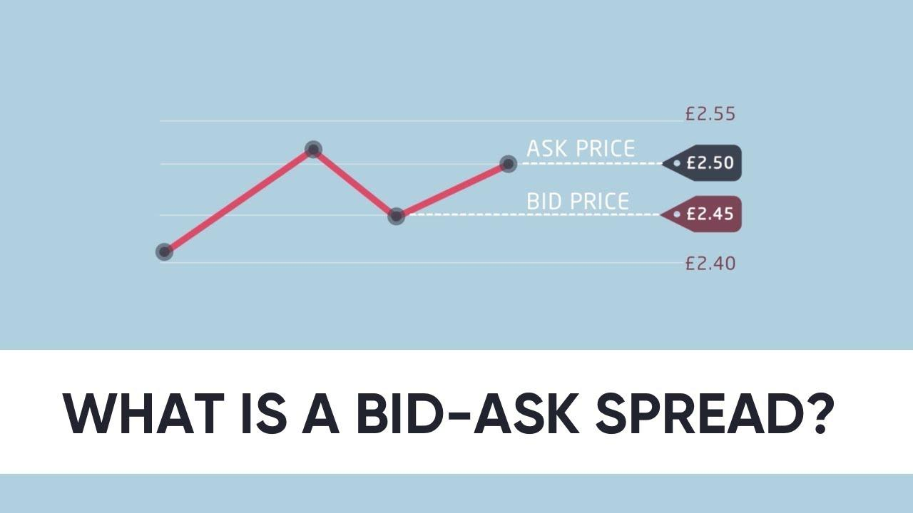
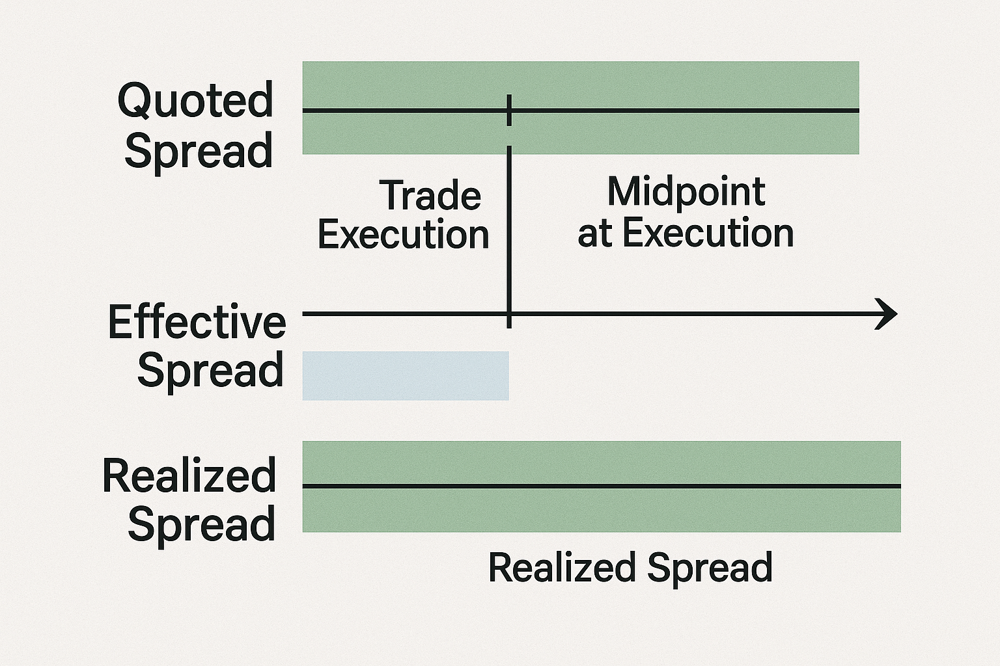
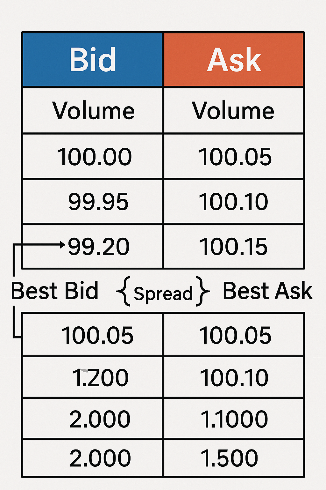
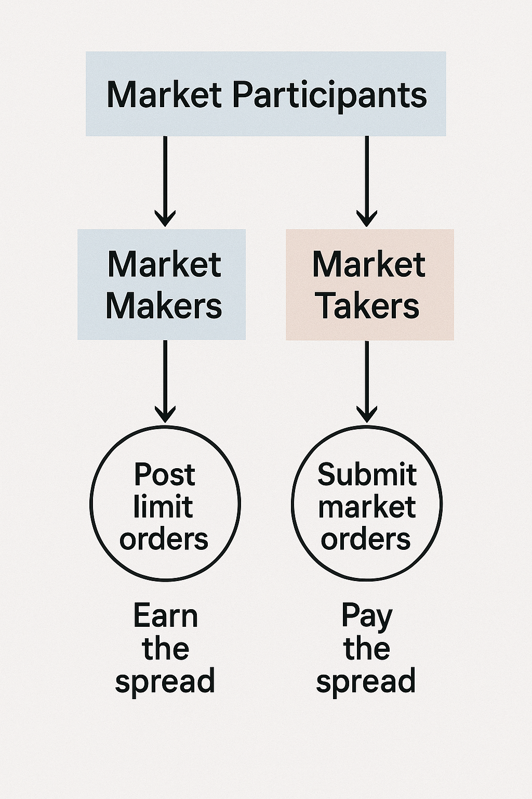

The *bid-ask spread* is the difference between the highest price that a buyer (bid) is willing to pay for an asset and the lowest price a seller (ask) is willing to accept. In simpler terms, if you’re looking at a quote for a stock at a given moment and see a *bid* of \$100 and an *ask* of \$100.05, the spread is \$0.05. This gap is **fundamental in trading**: it represents a cost you pay when you trade (if you buy at the ask or sell at the bid, you “cross the spread”) and it’s a source of profit for those who *make markets* (providing liquidity at bid/ask prices). The size of the spread is more than just a number – it tells a story about the market’s liquidity and trading activity. A small (tight) spread usually means lots of activity and competition between buyers and sellers, whereas a large (wide) spread can signal lower liquidity or higher uncertainty (risk) in the market.

To a beginner, the bid-ask spread might just seem like “pennies” difference, but it’s **crucial**. It’s effectively an *immediate transaction cost*. Every time you buy a stock at the ask and then sell at the bid, that spread is “lost” from your perspective as a trader and *earned* by a market maker who facilitated the trade. Brokers often say they earn money when traders “cross the spread” – meaning traders pay that gap as the price of getting into or out of a position **right now**. Understanding this concept is vital because it affects your trading profits, strategy execution, and even whether certain strategies are viable once real-world costs are considered.

## Table of Contents



## Types of Bid-Ask Spreads

When discussing the types of bid-ask spreads, it's essential to understand three key variations: quoted spread, effective spread, and realized spread, as each offers distinct insights into market behavior and transaction costs.

The quoted spread is the simplest form and is the difference between the highest price a buyer is willing to pay (the bid) and the lowest price a seller is willing to accept (the ask). Mathematically, it can be expressed as:

$$
\text{Quoted Spread} = \text{Ask Price} - \text{Bid Price}
$$

For example, if the bid price of a stock is $50 and the ask price is $52, the quoted spread is $2. This spread serves as an initial indicator of the transaction cost and liquidity for traders, impacting their decision-making process.

The effective spread provides a more nuanced view by considering price improvements that might occur when trades execute. Unlike the quoted spread, the effective spread accounts for the actual executed prices, reflecting the true cost of a transaction and potentially capturing mid-quote price movements. It can be calculated as:

$$
\text{Effective Spread} = 2 \times |\text{Execution Price} - \text{Midpoint Price}|
$$

where the midpoint price is the average of the bid and ask prices at the time of the trade. This measure highlights any improvements from the quoted prices due to the market participants capturing better prices during execution.

Realized spread sheds light on the cost of immediacy, which is the compensation liquidity providers earn for bearing instant market risks. It differs from the effective spread by focusing on the profitability of filling orders immediately without significant delay. It’s calculated after a certain time has elapsed post-execution, allowing for the evaluation of the market impact of an immediate trade:

$$
\text{Realized Spread} = 2 \times |\text{Execution Price} - \text{Midpoint Price After Time Interval}|
$$

This expression compares the execution price to the midpoint price at a later time, providing insight into any temporary market impact caused by the initial trade execution. By understanding these variations, traders and market analysts can better evaluate trade execution quality and costs, as well as the behavior of liquidity providers in the marketplace.


## Why Spreads Matter: Liquidity and Volatility

One of the key insights about bid-ask spreads is that they are a de facto **measure of market liquidity**. *Liquidity* generally means how easy it is to trade an asset without moving its price too much. When an asset has a lot of buyers and sellers actively trading (high liquidity), they tend to compete and cluster around a fair price, resulting in a tight spread. In contrast, if an asset is sparsely traded or investors are unsure of its value, the quotes from buyers and sellers may be far apart, leading to a wider spread (and higher implicit cost to trade it). In other words, *tight spreads = high liquidity*, and *wide spreads = low liquidity (or higher risk)*.

Several factors influence the spread:

* **Liquidity & Volume:** High trading volume and many active participants narrow the spread. With many buy and sell orders around the current price, competition forces the bid and ask closer together. If you look at a major currency pair like EUR/USD or a large-cap stock like Apple, the spread is often just a cent or even a fraction of a cent because these markets are very liquid (tons of trading activity).
* 
* **Volatility:** In volatile markets or during breaking news, spreads tend to widen. Why? Market makers are hesitant to quote a tight price when prices are jumping around – they offset the risk of sudden moves by quoting a larger spread. So you might notice that right when an earnings report comes out or during market turmoil, the bid-ask spread balloons as liquidity providers pull back. Higher uncertainty = bigger buffer (spread) to account for risk.

* **Order Size and Market Orders:** A large aggressive trade (market order) can *eat through* the available liquidity at the best prices. If someone suddenly tries to buy a huge quantity, they might consume all the shares being offered at the current ask and then start buying from sellers who wanted higher prices, thereby *pushing the ask up*. In the moments after such a large order, the spread might widen because the best bid was filled or the best ask was lifted. For example, a big market buy order might clear out the \$100.05 asks and next ask is at \$100.10, while the bid remains at \$100 – now the spread widened from \$0.05 to \$0.10. Conversely, **limit orders** (standing orders in the book) add liquidity. When new limit buy/sell orders join the market inside the current spread, they *narrow* the spread. Liquidity providers such as market makers do exactly this: by continuously placing limit bids and asks, they tighten the gap and create a more continuous market.

* **Market Hours and Structure:** Spreads are usually tightest during the most active trading hours (e.g. when the relevant exchange or market is open and overlapping with others) and wider in after-hours or illiquid sessions. Different market structures also impact spreads. Electronic order-driven markets (like NASDAQ) with lots of competition tend to have tighter spreads than, say, over-the-counter or specialist-driven markets for less-traded securities. In forex, major currency pairs (EUR/USD, USD/JPY, etc.) have tiny spreads (often a pip or less, which is 0.0001 in price) because of high liquidity, whereas exotic currency pairs can have much larger spreads due to lower liquidity. The same goes for commodities: gold or oil might trade with very small spreads, but something like an obscure metal or a low-volume crypto token could have a hefty spread reflecting the difficulty of finding a buyer/seller quickly.

The bid-ask spread therefore isn’t fixed – it **fluctuates with market conditions**. Traders monitor spread changes as an important signal. A sudden widening of spreads can indicate market stress or news, while consistently tightening spreads might show increasing liquidity or competition. For algorithmic traders, spread dynamics can even be a trading signal or input to decide when to trade or when to hold off.

## The Order Book and How the Spread is Set

To really grasp the spread, it helps to visualize the **order book**. The order book is essentially a list of buy orders (bids) and sell orders (asks) waiting to be executed, organized by price level. An example snapshot of a limit order book is shown below, with bids on the left and asks on the right:



In any order book, the **highest bid** and the **lowest ask** are the most competitive prices and form the **National Best Bid and Offer (NBBO)** in many markets (or simply the best market quotes). The *spread = best ask – best bid*. In the image above, you can see the top of the book: buyers are bidding up to \$2081.14, and sellers are asking as low as \$2081.23. If you wanted to buy instantly, you’d have to pay \$2081.23 (someone’s ask), and if you wanted to sell instantly, you’d receive \$2081.14 (someone’s bid). That \$0.09 difference is the spread, and no trades will occur until a buyer is willing to pay that \$2081.23 (or higher), or a seller is willing to accept \$2081.14 (or lower). In a liquid market, these numbers keep updating as new orders flow in.

**Order book dynamics:**

The spread can change in two ways – either **someone crosses it** (takes liquidity), or **someone improves it** (adds liquidity). If a buy market order comes in, it will hit the lowest ask (say at \$2081.23) and consume it; now the next-lowest ask might be higher (perhaps \$2081.50), so the spread widens unless the bid also moved. On the other hand, if a new participant places a limit sell order at \$2081.20 (slightly undercutting the previous ask of \$2081.23), this new order becomes the best ask and *narrows the spread*. The same logic applies to the bid side. Market makers and other liquidity providers routinely place orders inside the spread, competing to be the best bid or ask, thereby reducing the spread and making the market more tight. In fact, tight spreads are often a sign of healthy competition among market makers.

**Depth matters too:**

The spread only tells the price gap at the top of the book, but the *depth* of the order book (how many orders/size are available at each level beyond the best prices) also matters for large trades. If you place a very large order, you might sweep through multiple levels of the book – this means you’ll get a worse average price, and temporarily the spread might widen once your order is done because you removed a lot of liquidity. Traders often look at metrics like *order book depth* or *volume at best bid/ask* alongside the spread to judge how much size they can trade before impacting the price.

To summarize this section: The order book is where the **bid-ask spread is born**. The interplay of incoming market orders (which remove best bids/asks) and limit orders (which add new bids/asks) causes the spread to widen or tighten throughout the trading day. If you imagine an auction, the spread reflects the tiny gap between the highest price someone is shouting they’ll pay and the lowest price someone is willing to sell – until one side budges, that gap remains. A deep understanding of order book mechanics is part of market microstructure theory (see O’Hara, *Market Microstructure Theory* for an in-depth treatment).

## Market Participants: Makers vs. Takers and the Role of the Spread

When discussing spreads, you’ll often hear about **market makers** and **market takers** (or simply “takers”). These terms describe two fundamental roles in trading:

* **Market Makers (Liquidity Providers):** These are participants (often specialized firms or algorithms) that *post quotes* – i.e. they place limit orders to buy and sell. A market maker is willing to buy at the bid and sell at the ask, and by doing so, they *provide liquidity* to others. They *earn the spread* (or a portion of it) when trades occur. For example, a market maker might continuously quote a stock at \$10.00 bid, \$10.05 ask. If someone sells to them at \$10.00 and someone else buys from them at \$10.05, the market maker pockets \$0.05 profit (minus any costs). Market makers facilitate trading and in return, the spread is their compensation for the risk they take – prices could move against them while their orders are sitting out there. Modern electronic market makers, including many high-frequency trading (HFT) firms, engage in this activity across stocks, options, currencies, etc., updating their quotes rapidly. In fact, HFT firms *typically function as market makers*, supplying lots of the resting orders and thereby tightening spreads in many markets. More competition among market makers = narrower spreads (good for traders), but it also means market makers earn less per trade and rely on high volume and speed to profit.

* **Market Takers (Liquidity Takers):** These are traders who demand immediate execution – they *take liquidity* by hitting the bid or lifting the ask with market orders (or marketable limit orders). If you place a market order to buy 100 shares, you’ll get filled at the current ask, *paying the spread*. Takers are basically paying for immediacy; they want in or out *now* and the spread is the price of that convenience. Active traders, algorithmic *takers*, and anyone using market orders regularly are incurring this cost on each trade. For the taker, the spread is a negative slippage that they need to overcome with the asset’s price movement to make a profit on a trade.

These two types of participants are two sides of the same coin. A trade happens when a taker’s order matches with a maker’s resting order. The existence of a spread gives an **incentive for market making** – if spreads are wide, more traders might step in to provide quotes and capture that profit, which then tends to narrow the spread. If spreads are very tight, it’s often because competition among liquidity providers is intense (or regulations/technology have improved market efficiency). Some exchanges even have a *maker-taker fee model*: they **pay** rebates to market makers for adding liquidity and charge fees to takers, encouraging more liquidity provision.

**Why not always be a maker and avoid paying spreads?** Good question! In theory, a patient trader can try to avoid the spread by using limit orders (joining the makers). For instance, if the market is \$100.00 bid /\$100.05 ask and you want to buy, instead of paying \$100.05 you might place a limit buy at \$100.01 or \$100.00 and wait to see if you get filled. By doing so, you’d save a few cents *if* you get executed at your price. This is indeed a common approach – many strategies attempt to *improve execution* by not crossing the spread unless necessary. However, the trade-off is execution uncertainty: your order might not fill if the price moves away. In fast markets or if you urgently need to exit, you often have no choice but to be a taker. Active intraday traders will mix between posting and taking depending on strategy; meanwhile, pure market-making strategies focus on always providing quotes and profiting from spread capture, often managing inventory carefully so as not to accumulate a large position that could be hit by adverse price moves.



In summary, the bid-ask spread highlights a fundamental friction between immediacy and price. **Takers** pay for immediacy (they “eat” the spread), and **makers** earn compensation for providing liquidity (they “capture” the spread). This dynamic is central in microstructure discussions. The concept of *cost of immediacy* comes from classic studies like Stoll (2000) – basically, how much one must pay to trade *right now* as opposed to waiting.

## Types of Bid-Ask Spreads: Quoted, Effective, and Realized

So far we’ve talked about the spread at a single moment (the straightforward *quoted spread*). In more advanced discussions, especially in market microstructure research, there are a few flavors of spread to be aware of:

**Quoted Spread:**

This is the simplest – it’s literally the difference between the current ask and bid price. If the bid is \$50 and the ask is \$52, the quoted spread is \$2. It’s what we see on the Level 1 quote. This measure tells you *at this instant* what the trading cost is for a *small* trade (one that doesn’t surpass the available size at the best bid/ask). Traders often express this as an absolute amount (e.g. \$0.05) or as a percentage of the mid-price (e.g. \$0.05 on a \$100 stock is 0.05%). Highly liquid instruments might have quoted spreads of only a few basis points, while illiquid ones could have spreads of several percent.

**Effective Spread:**

The effective spread is a *post-trade* measure that reflects the actual execution price versus the midpoint of the bid-ask at the time of trade. It’s defined as **2 × | execution price – midpoint price |**. Why 2× the difference from the midpoint? Because it essentially measures what the round-trip cost would be relative to the midpoint. If you buy via a market order and get filled at \$52 when the market was \$50/\$52 (midpoint \$51), your execution is \$1 above the midpoint. That’s effectively half the quoted spread in this case. Multiply by 2 gives \$2, which equals the quoted spread if you paid the full ask. Effective spread will equal the quoted spread if you receive no price improvement. But if, say, you got price improvement (maybe your buy order got filled at \$51.90, some seller was willing to come down), then the effective spread would be smaller (\$51.90 vs mid \$51 is \$0.90 difference, ×2 = \$1.80 effective spread), reflecting that you actually traded at a better price than the worst quote. Effective spread is a better measure of the *actual cost paid by the trader* on that execution, and on average it captures the idea that some trades happen inside the quotes. Algorithmic execution tactics aim to *reduce* effective spreads – e.g., by splitting orders, providing liquidity, etc. – to lower trading costs.

**Realized Spread:**

This one is a bit trickier but very insightful. Realized spread measures the profitability of a round-trip for the liquidity provider, after some time has passed. It’s typically defined similarly to effective spread, but instead of comparing execution price to the midpoint at the time of trade, you compare the execution price to the midpoint *after a fixed time delay* (say 5 or 15 minutes). The formula can be given as **2 × | execution price – midpoint (later) |**. The idea is to account for *market impact*. If a market maker sells to you at \$52 (when the mid was \$51), initially they earned \$1 above mid (per share). But if 5 minutes later, the midpoint has moved to \$53 (maybe your buy pushed the price up due to demand), then from the market maker’s perspective, they actually sold too cheap – the price moved up after. In that case, the *realized spread* could even be negative (they would have been better off waiting). Conversely, if the midpoint drops after the trade (the market moves against the taker), the market maker’s decision looks great – they sold at \$52 and later the asset is valued at \$50 mid, so they gained by trading early. Realized spread thus measures the *real profit* to liquidity providers after accounting for any price movement *caused by or following the trade*. Another way to put it: it’s the part of the spread that the liquidity provider *gets to keep* after the market digests the trade. The difference between the *effective spread* (what the taker paid) and the *realized spread* (what the maker kept) is essentially the *price impact* or *information content* of the trade – often interpreted as how much the price moved due to possibly informed trading. This concept ties into the cost of immediacy and adverse selection. For example, if a trade was done with an informed trader, the price likely moves against the maker, yielding a smaller realized spread.

For most casual trading discussions, you won’t need to calculate effective or realized spreads manually, but it’s good to know these concepts exist. They are heavily used in trading cost analysis and academic research. For instance, researchers like Hasbrouck have methods to estimate effective spreads from daily data, and many broker execution reports will talk about “effective spread versus quoted spread” to show how well they executed your large order. If you’re building algorithms, you might use effective spread to evaluate slippage, and realized spread to evaluate how market makers are performing (are they getting picked off by informed traders or not).

## How Spreads Affect Trading Strategies and Backtests

Okay, we understand what the spread is and how it behaves – now *why do we, as traders or algo developers, care so much?* In short: **because spreads eat into your returns.** If your strategy doesn’t account for the bid-ask spread, you might be looking at a mirage of profits in a backtest that won’t materialize in the real world. Let’s break down the practical implications:

**Trading Costs and Slippage:**

The bid-ask spread is often the largest component of *transaction cost* for short-term and high-frequency strategies (sometimes even bigger than commissions). Every time you buy at market, you pay a few ticks more; every sell at market, you get a few ticks less. This “slippage” is directly proportional to the spread (assuming your order is small enough not to create extra slippage beyond the spread). For example, if a stock’s spread is \$0.10 and you always buy at the ask and sell at the bid, any round-trip trade has a \$0.10 handicap. If you hoped to make \$0.50 profit on that trade, it’s effectively only \$0.40 after accounting for spread. For an intraday scalper aiming for tiny profits on each trade, the spread can make the difference between a winning and losing strategy. **If your edge per trade is smaller than the spread, you *will* lose money** even with perfect predictions, because the entry/exit prices always include that penalty.

**Example – Scalping vs. Swing Trading:**

Suppose you’re a scalper trying to capture a 0.1% move multiple times a day on a moderately liquid stock that has a 0.1% spread. If you ignore the spread, your strategy might look great capturing those tiny moves. But once trading live, you realize every trade starts 0.1% in the hole (because you buy slightly high and sell slightly low). That means your target move just covers the cost, and any slip further and you net a loss. On the other hand, a swing trader holding for a 10% move won’t be too bothered by a 0.1% spread on entry and exit – it’s a negligible cost in the grand scheme (though still a cost to acknowledge). So, the shorter the timeframe and smaller the typical price move you seek, the **more critical spreads (and commissions) become**. High-frequency trading (HFT) strategies might do thousands of trades a day, often profiting only fractions of a cent per share – they absolutely must minimize spread costs by either making markets or using advanced execution tactics. It’s not uncommon that a naive backtest shows a high-frequency strategy making a fortune, but once realistic spreads/slippage are applied, the profit disappears or turns into a loss.

**Backtesting Considerations:**

When backtesting, especially at intraday frequencies, you **must model the spread and execution** to get a realistic result. There are a few ways:

* **Midpoint vs. Trade Prices:** If you use midpoint prices (average of bid/ask) as your execution in a backtest, you’re assuming zero spread cost – unrealistic unless you assume perfect passive fills. If you use last traded prices, you might still need to consider that a market order would have actually executed at last price plus or minus half the spread on average. A simple fix is to subtract half the spread on entry and half on exit (so one spread total per round trip) from any profit calculation. Many backtesters do this by widening the buy price and sell price in the simulation.

* **Explicit Spread Model:** Some backtesting frameworks allow you to input a fixed spread or even a dynamic spread model. For example, you could program your strategy to buy at `current_price + spread/2` and sell at `current_price - spread/2` to mimic crossing half the spread each way. If you have historical bid/ask data, you can use the actual spread at that time in your model.

* **Slippage Models:** Beyond the raw spread, slippage can include getting worse prices for larger orders. Some models (like market impact models) might subtract an extra amount proportional to your order size or volatility. In many cases, though, simply accounting for the basic spread is an excellent first step – it often turns an over-optimistic backtest into a much more sober one. As an example, a strategy that trades very frequently on small signals might show a 20% annual return with no costs, but once you put, say, a \$0.01 cost per share (spread) on each trade, that return could dwindle to near 0% or negative. It’s always better to simulate these costs *up front* rather than be surprised in live trading.

Let’s illustrate the impact with a simple example in Python:

**Example: Calculating the Bid-Ask Spread from Quote Data**

Imagine we have some raw quote data (bid and ask prices) for an asset over time. We’ll calculate the spread at each time and maybe the average spread. In practice, such data could come from a live feed or a historical Level-1 quote dataset. For simplicity, we’ll use a small made-up list of quotes here:

```python
# Sample quote data: each entry has a timestamp, bid, and ask
quotes = [
    {"time": "09:30:00", "bid": 100.10, "ask": 100.15},
    {"time": "09:30:01", "bid": 100.10, "ask": 100.14},
    {"time": "09:30:02", "bid": 100.09, "ask": 100.12},
    {"time": "09:30:03", "bid": 100.08, "ask": 100.10},
]

# Calculate spreads for each quote
spreads = []
for q in quotes:
    spread = q["ask"] - q["bid"]
    spreads.append(spread)
    print(f'Time {q["time"]}: Bid={q["bid"]:.2f}, Ask={q["ask"]:.2f}, Spread={spread:.2f}')

# Compute average spread over this period
avg_spread = sum(spreads) / len(spreads)
print(f"Average spread: {avg_spread:.2f}")
```

Running this snippet would output something like:

```
Time 09:30:00: Bid=100.10, Ask=100.15, Spread=0.05  
Time 09:30:01: Bid=100.10, Ask=100.14, Spread=0.04  
Time 09:30:02: Bid=100.09, Ask=100.12, Spread=0.03  
Time 09:30:03: Bid=100.08, Ask=100.10, Spread=0.02  
Average spread: 0.04
```

We can see the spread in this mock data started at \$0.05 and tightened to \$0.02 over a few seconds, with an average of \$0.04. In a real scenario, you might load thousands of rows from a file or an API and compute similar statistics. This could help you understand when spreads are wider (e.g., maybe wider at market open or close, and tighter during mid-day) and how much spread you’d typically pay for a trade. If you have access to the [Papers With Backtest datasets](https://paperswithbacktest.com/datasets), you could fetch real intraday quote data to do this kind of analysis and plotting (e.g., histogram of spread values throughout the day).

**Example: Simulating Spread Impact on Strategy PnL**

Now, let’s simulate a very simple high-frequency strategy to see how spreads can make a huge difference. Consider a hypothetical strategy that does a trade every minute, trying to capture small price movements. We’ll simulate a sequence of minute-by-minute price changes (some up, some down) and assume our strategy **always guesses the direction correctly** for the sake of illustrating maximum potential profit. We’ll compare the P\&L if we ignore spreads versus if we account for a fixed spread cost on each trade.

```python
import numpy as np

np.random.seed(42)
# Simulate 1000 minute-to-minute price changes (in % or relative terms)
# Let's say the price moves with a tiny upward drift on average, but mostly small fluctuations
price_changes = np.random.normal(loc=0.0002, scale=0.001, size=1000)  # 0.02% avg move, 0.1% volatility per minute

# Assume we trade on every change (always in the correct direction of the change for illustration)
gross_pnl = 0.0
net_pnl = 0.0
spread_cost = 0.0005  # 0.05% cost per trade (e.g., 5 bps, roughly equivalent to say a 5-cent spread on a $100 stock)

for change in price_changes:
    trade_profit = abs(change)  # profit from the move (we capture the absolute change by being on the right side)
    gross_pnl += trade_profit
    net_pnl += trade_profit - spread_cost  # subtract spread cost per trade

print(f"Gross PnL (no spread): {gross_pnl*100:.2f}%")
print(f"Net PnL (with {spread_cost*100:.2f}% spread each trade): {net_pnl*100:.2f}%")
```

In this simulation, `price_changes` are drawn from a normal distribution with mean 0.02% and std 0.1%. That means on average the price is drifting slightly up, and our “perfect” strategy (unrealistically) captures those moves. The gross P\&L is basically the sum of absolute changes – with 1000 trades, gross P\&L might come out to a few percent. However, we set a spread cost of 0.05% per trade. The net P\&L subtracts 0.05% each time. If you run this, you might see output roughly like:

```
Gross PnL (no spread): ~2.50%  
Net PnL (with 0.05% spread each trade): -2.50%
```

*(Your exact numbers will vary each run since the price changes are random, but on average the net P\&L will be around -2% to -3% in this setup.)*

This demonstrates a striking point: even with a slight edge (we had an upward drift in prices and assumed 100% win rate on direction), the **spread cost flipped the outcome from profitable to unprofitable**. In our example, paying 0.05% each trade, 1000 times, cost about 50% in total (!) – wiping out the \~2.5% gross gains and turning them into a loss. In reality, no strategy wins every trade like this, so the impact of spreads is even more severe when you factor in losing trades (where you pay the spread *and* lose on the price movement).

The takeaway for traders and backtesters: **Always incorporate realistic spread and slippage assumptions.** It’s better to be pleasantly surprised by *lower* trading costs in live trading than devastated that your backtest didn’t account for this friction. Many trading platforms and libraries include parameters for spread/slippage for this reason. If you’re coding your own backtest, you can manually subtract spreads as shown or use the approach of simulating trades at the bid/ask instead of the mid.

High-frequency trading firms invest enormous resources to minimize these costs – for example, by colocating their servers to reduce latency (so they can perhaps earn rebates or post orders instead of taking). Some HFT strategies essentially *are* market making: they profit almost entirely by earning the spread on many, many small trades, and they avoid taking liquidity unless absolutely necessary. This only works if you’re super fast and can manage the risk, but it highlights how crucial spread is at those scales. Other strategies might use statistical models to decide when paying the spread is worth it – if the expected move is much larger than the spread, then go for it; if not, maybe wait or don’t trade.

## Conclusion

The bid-ask spread may start as a simple concept – just a difference between two prices – but as we’ve explored, it has rich implications in trading. It reflects *liquidity* and *market conditions*, influences how different market participants behave, and represents a very real cost of doing business in the markets. For beginners, recognizing that every trade has an implicit cost (the spread) is an important step toward understanding why sometimes your strategy’s paper profits don’t translate into real profits. For more advanced traders, diving into spread dynamics is part of understanding **market microstructure** – how orders are executed, how prices move, and how different participants (HFTs, market makers, institutional traders) interact. Concepts like quoted, effective, and realized spread give us tools to measure and analyze trading costs and liquidity in detail.

In practice, always keep an eye on the spread of the instruments you trade. A “tight” one-cent spread market is a completely different environment than a thinly traded stock with a \$1 spread. Adapt your strategy accordingly: if you’re trading something with a wide spread, perhaps use limit orders and be patient; if you’re trading a tight spread asset aggressively, make sure the edge is enough to cover that spread repeatedly. And when backtesting, **be generous in accounting for spreads/slippage** – it’s better to build a strategy that survives robust cost assumptions than to discover later that costs obliterate your edge.

Finally, if you want to explore further, check out resources like the *Papers With Backtest* [**datasets and toolbox**][PWB Toolbox] on GitHub, which provide data and utilities for backtesting strategies (you could, for instance, test how applying different spread assumptions changes a strategy’s performance). Also, the references and readings below include some classic papers and books on trading costs and market microstructure for those interested in the theory behind it. In the trading world, *knowledge of the bid-ask spread and its effects is power* – it helps you trade smarter, whether you’re a day trader shaving off pennies or a quant developer designing an algorithmic execution strategy. Good luck and tight spreads!


## References & Further Reading

[1]: Stoll, H. R. (2000). ["Friction"](https://onlinelibrary.wiley.com/doi/abs/10.1111/0022-1082.00259) The Journal of Finance, 55(4), 1479-1514.

[2]: Hasbrouck, J. (2009). ["Trading Costs and Returns for US Equities: Estimating Effective Costs from Daily Data."](https://www.jstor.org/stable/20488006) The Review of Financial Studies, 22(3), 1221-1256.

[3]: O'Hara, M. (1995). ["Market Microstructure Theory."](https://www.semanticscholar.org/paper/Market-Microstructure-Theory-O'Hara/2bd0833b023f3270a2a6bf301e86b8e02e2f28ed) Blackwell Business.

[4]: Harris, L. (2003). ["Trading and Exchanges: Market Microstructure for Practitioners."](https://www.amazon.com/Trading-Exchanges-Market-Microstructure-Practitioners/dp/0195144708) Oxford University Press.

[5]: Bouchaud, J. P., Farmer, J. D., & Lillo, F. (2009). ["How Markets Slowly Digest Changes in Supply and Demand."](https://arxiv.org/abs/0809.0822) Handbook of Financial Markets: Dynamics and Evolution.

[6]: Menkveld, A. J. (2013). ["High Frequency Trading and the New-Market Makers."](https://www.sciencedirect.com/science/article/pii/S1386418113000281) Journal of Financial Markets, 16(4), 712-740.