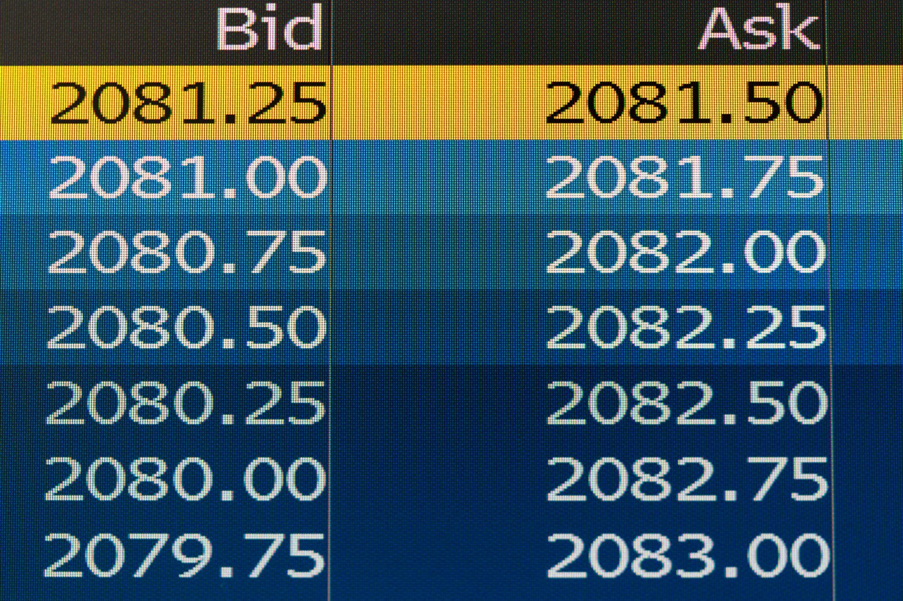

## Table of Contents

## What is a bid–ask spread?

A bid-ask spread is the difference between the highest price a buyer is willing to pay for a stock (the bid) and the lowest price a seller is willing to accept (the ask). It's like a gap between what people want to buy something for and what people want to sell it for. This spread is important because it shows how much it might cost to buy and then quickly sell a stock.

The size of the bid-ask spread can tell us about the stock's liquidity, which means how easy it is to buy or sell the stock. A small spread usually means the stock is very liquid and lots of people are trading it. A larger spread might mean the stock is less liquid, and it could be harder to trade. The spread also helps dealers make money, as they buy at the lower bid price and sell at the higher ask price.

## How is the bid–ask spread calculated?

The bid-ask spread is calculated by taking the difference between the highest price someone is willing to pay for a stock (the bid) and the lowest price someone is willing to sell it for (the ask). For example, if the highest bid for a stock is $50 and the lowest ask is $52, then the bid-ask spread is $52 - $50 = $2.

This spread is important because it shows how much it might cost you to buy and then quickly sell a stock. If you buy at the ask price of $52 and then immediately sell at the bid price of $50, you lose $2 per share due to the spread. The size of the spread can also tell you about the stock's [liquidity](/wiki/liquidity-risk-premium). A smaller spread means the stock is easier to trade, while a larger spread might mean it's harder to buy or sell quickly.

## Why is the bid–ask spread important for investors?

The bid-ask spread is important for investors because it shows how much it might cost to buy and then quickly sell a stock. If you buy a stock at the ask price and then sell it right away at the bid price, you lose money equal to the spread. For example, if the ask price is $52 and the bid price is $50, you lose $2 per share. This cost can add up, especially if you trade a lot of shares or trade often.

The size of the bid-ask spread also tells investors about how easy it is to buy or sell a stock, which is called liquidity. A small spread means the stock is very liquid and lots of people are trading it, so it's easier to buy and sell. A larger spread means the stock is less liquid, and it might be harder to trade quickly. Understanding the spread helps investors make better decisions about when and what to trade.

## What factors influence the size of the bid–ask spread?

The size of the bid-ask spread can be influenced by many things. One big factor is how much people want to buy or sell the stock, which is called liquidity. If lots of people want to trade a stock, it's easier to buy and sell, so the spread is usually smaller. But if fewer people are trading, the spread can be bigger because it's harder to find someone to trade with. Another factor is how much the stock's price moves around. If the price changes a lot, dealers might want a bigger spread to cover their risk.

Another thing that can affect the spread is how much information is out there about the stock. If there's a lot of news or reports about a company, the spread might be smaller because people feel more sure about the stock's value. But if there's not much information, the spread can be bigger because it's harder to know what the stock is worth. Also, the size of the company matters. Big companies usually have smaller spreads because more people trade their stocks. Smaller companies might have bigger spreads because fewer people are interested in trading them.

## How does market liquidity affect the bid–ask spread?

Market liquidity is like how easy it is to buy or sell something without moving the price too much. When a stock is very liquid, it means lots of people want to trade it. This makes the bid-ask spread smaller because there are always buyers and sellers ready to trade. If you want to sell your stock, you can find someone to buy it quickly, and if you want to buy, you can find someone to sell to you right away. So, a high liquidity means a smaller spread, which is good for investors because it costs less to trade.

On the other hand, if a stock is not very liquid, it means fewer people want to trade it. This makes the bid-ask spread bigger because it's harder to find someone to buy or sell with. If you want to sell your stock, you might have to wait longer or accept a lower price. And if you want to buy, you might have to pay more. So, low liquidity means a bigger spread, which can make trading more expensive and riskier for investors.

## Can you explain the difference between a wide and a narrow bid–ask spread?

A wide bid-ask spread means there's a big difference between what someone is willing to pay for a stock and what someone is willing to sell it for. This usually happens when not many people want to trade the stock, so it's harder to find someone to buy or sell with. A wide spread can make trading more expensive because if you buy at the higher ask price and then sell at the lower bid price, you lose more money. It's like trying to buy something in a store where the price is high, but when you want to sell it back, the store will only give you a much lower price.

A narrow bid-ask spread means there's only a small difference between the buying and selling prices. This happens when lots of people want to trade the stock, so it's easy to find someone to buy or sell with. A narrow spread is good for investors because it costs less to trade. If you buy at the ask price and then sell at the bid price, you lose less money. It's like buying something in a store where the price to buy and sell back is almost the same, so you don't lose much if you need to trade quickly.

## How does the bid–ask spread impact trading costs?

The bid-ask spread directly affects how much it costs to trade a stock. When you buy a stock, you pay the ask price, which is the lowest price someone is willing to sell at. When you sell, you get the bid price, which is the highest price someone is willing to pay. The difference between these two prices is the bid-ask spread. If you buy a stock and then sell it right away, you lose money equal to this spread. So, a bigger spread means it costs more to trade, while a smaller spread means it costs less.

For example, if the ask price is $52 and the bid price is $50, the spread is $2. If you buy at $52 and then sell at $50, you lose $2 per share just from trading. This cost can add up, especially if you trade a lot or trade many shares. That's why investors pay attention to the bid-ask spread. A smaller spread means the stock is easier and cheaper to trade, while a larger spread can make trading more expensive and riskier.

## What role does the bid–ask spread play in market efficiency?

The bid-ask spread is important for how well a market works, which we call market efficiency. When the spread is small, it means the market is very efficient. It's easy to buy and sell stocks because lots of people are trading, and the prices to buy and sell are close together. This helps make sure that the price of a stock is a good reflection of what it's really worth because people can trade quickly without losing much money.

On the other hand, a big spread can make a market less efficient. If the spread is large, it's harder and more expensive to trade. Fewer people want to trade, so it's harder to find someone to buy or sell with. This can make the stock price less accurate because it's harder for the market to quickly adjust to new information. So, a smaller bid-ask spread helps make the market work better by making trading easier and keeping prices more accurate.

## How do electronic trading platforms influence the bid–ask spread?

Electronic trading platforms have made the bid-ask spread smaller for many stocks. These platforms let lots of people from all over the world trade at the same time. This means there are more buyers and sellers, which makes the stock more liquid. When a stock is very liquid, it's easier to find someone to trade with, so the difference between what people want to buy for and sell for gets smaller. This is good for investors because it costs less to trade.

However, electronic trading platforms can also make the spread bigger for some stocks. If a stock is not very popular or if there's not much trading going on, the platform might not help much. In these cases, there are still not many people wanting to trade, so it's hard to find someone to buy or sell with. This can keep the spread wide, making trading more expensive. So, while electronic platforms can help make trading cheaper for popular stocks, they might not always help for less popular ones.

## What are some strategies traders use to minimize the impact of the bid–ask spread?

Traders use different strategies to make the bid-ask spread less of a problem. One way is to trade stocks that have a small spread. These are usually stocks from big companies that lots of people want to trade. By [picking](/wiki/asset-class-picking) these stocks, traders can buy and sell without losing much money on the spread. Another way is to use limit orders instead of market orders. A limit order lets you set the price you want to buy or sell at, so you can try to get a better deal than the current ask or bid price.

Another strategy is to trade during times when the market is very busy, like right when it opens or closes. More people trading means the spread might be smaller because it's easier to find someone to trade with. Some traders also look at the [order book](/wiki/order-book-trading-strategies) to see where other people are setting their buy and sell prices. By doing this, they can try to place their orders in a way that gets them a better price and makes the spread less of an issue.

## How does the bid–ask spread vary across different types of securities?

The bid-ask spread can be different for different kinds of securities. Stocks from big companies, like those in the S&P 500, usually have a small spread. This is because lots of people want to trade these stocks, so it's easy to buy and sell them. On the other hand, stocks from smaller companies might have a bigger spread. Fewer people want to trade these stocks, so it's harder to find someone to buy or sell with, which makes the spread larger. Bonds can also have different spreads. Government bonds usually have a small spread because they are very safe and lots of people trade them. But corporate bonds, especially from smaller companies, can have a bigger spread because they are riskier and fewer people trade them.

Options and futures also have bid-ask spreads, and these can vary a lot. Options on stocks that are traded a lot, like those on big company stocks, tend to have smaller spreads. But options on stocks that are not traded as much can have bigger spreads. Futures contracts on things like commodities or indexes can have different spreads too. If the futures are for something that lots of people trade, like oil or the S&P 500, the spread will be smaller. But if it's for something that fewer people trade, the spread can be bigger. So, the type of security and how much people want to trade it can make a big difference in the size of the bid-ask spread.

## What advanced statistical models are used to predict and analyze bid–ask spreads?

Advanced statistical models help predict and analyze bid-ask spreads by looking at different things that can affect the spread. One common model is the autoregressive conditional heteroskedasticity (ARCH) model and its extension, the generalized autoregressive conditional heteroskedasticity (GARCH) model. These models look at how the spread changes over time and how past spreads can help predict future ones. They also consider things like how much the stock's price moves around, how many people are trading, and how easy it is to trade the stock. By using these models, traders can get a better idea of what the spread might be in the future and plan their trades better.

Another useful model is the vector autoregression (VAR) model, which looks at how different things, like the stock's price, trading [volume](/wiki/volume-trading-strategy), and the spread, affect each other. This model can help traders see how changes in one thing might lead to changes in the spread. Machine learning models, like random forests and neural networks, are also used to predict bid-ask spreads. These models can look at lots of different information, like news about the company, how the market is doing, and even social media posts, to make better predictions. By using these advanced models, traders can make smarter decisions and maybe save money on trading costs.

## What are the types of bid-ask spreads?

When discussing the types of bid-ask spreads, it's essential to understand three key variations: quoted spread, effective spread, and realized spread, as each offers distinct insights into market behavior and transaction costs.

The quoted spread is the simplest form and is the difference between the highest price a buyer is willing to pay (the bid) and the lowest price a seller is willing to accept (the ask). Mathematically, it can be expressed as:

$$
\text{Quoted Spread} = \text{Ask Price} - \text{Bid Price}
$$

For example, if the bid price of a stock is $50 and the ask price is $52, the quoted spread is $2. This spread serves as an initial indicator of the transaction cost and liquidity for traders, impacting their decision-making process.

The effective spread provides a more nuanced view by considering price improvements that might occur when trades execute. Unlike the quoted spread, the effective spread accounts for the actual executed prices, reflecting the true cost of a transaction and potentially capturing mid-quote price movements. It can be calculated as:

$$
\text{Effective Spread} = 2 \times |\text{Execution Price} - \text{Midpoint Price}|
$$

where the midpoint price is the average of the bid and ask prices at the time of the trade. This measure highlights any improvements from the quoted prices due to the market participants capturing better prices during execution.

Realized spread sheds light on the cost of immediacy, which is the compensation liquidity providers earn for bearing instant market risks. It differs from the effective spread by focusing on the profitability of filling orders immediately without significant delay. It’s calculated after a certain time has elapsed post-execution, allowing for the evaluation of the market impact of an immediate trade:

$$
\text{Realized Spread} = 2 \times |\text{Execution Price} - \text{Midpoint Price After Time Interval}|
$$

This expression compares the execution price to the midpoint price at a later time, providing insight into any temporary market impact caused by the initial trade execution. By understanding these variations, traders and market analysts can better evaluate trade execution quality and costs, as well as the behavior of liquidity providers in the marketplace.

## What are Practical Examples of Bid-Ask Spread?

When analyzing bid-ask spreads, practical examples can provide valuable insights into the dynamics at play in different markets. Let's examine some instances, focusing on the currency markets and metals trading.

### Currency Spread Example: EUR/USD Pair

The EUR/USD pair is one of the most traded currency pairs globally, known for its high liquidity. The bid-ask spread in this pair is typically narrow, reflecting the constant and significant trading volume. Suppose the bid price (price a buyer is willing to pay) is 1.1170, and the ask price (price a seller is willing to accept) is 1.1172. The bid-ask spread is calculated as:

$$
\text{Bid-Ask Spread} = \text{Ask Price} - \text{Bid Price} = 1.1172 - 1.1170 = 0.0002
$$

This spread, equivalent to 2 pips, is relatively small, denoting tight spreads typical in the EUR/USD due to its liquidity. However, during periods of low liquidity or high [volatility](/wiki/volatility-trading-strategies), the spread might widen, impacting transaction costs for traders.

### Metals Trading Spreads: Gold and Silver versus Rare Metals

The bid-ask spread in metals trading can vary significantly between widely traded metals like gold and silver and rarer metals. For instance, gold might have a bid price of $1,800 per ounce and an ask price of $1,801, producing a narrow spread of $1. This represents a highly liquid market where tight spreads are common.

In contrast, rare metals like tungsten or rhodium, which are traded with less frequency, often exhibit much wider spreads. Suppose rhodium has a bid price of $10,000 per ounce and an ask price of $10,500. The resulting spread of $500 reflects the lower liquidity and higher relative transaction costs associated with trading these metals.

### Real-World Implications

Understanding bid-ask spreads is crucial for market participants because they directly affect trading costs. In currency markets, tighter spreads in pairs like EUR/USD facilitate less costly transactions, encouraging higher frequency trading and market liquidity. Conversely, larger spreads in less liquid markets, like rare metals, can deter market entry or demand a larger price move for profitability, impacting trading strategies.

Market conditions, economic announcements, and technological advancements in trading platforms also influence spreads. Traders must remain vigilant and adaptive, incorporating these [factor](/wiki/factor-investing)s into their decision-making process to optimize trade efficiency and cost-effectiveness. By appreciating the variations in bid-ask spreads across different assets, traders can tailor their approaches to best suit the market environment, enhancing their potential for successful trading strategies.

## References & Further Reading

[1]: Stoll, H. R. (2000). ["Friction"](https://onlinelibrary.wiley.com/doi/abs/10.1111/0022-1082.00259) The Journal of Finance, 55(4), 1479-1514.

[2]: Hasbrouck, J. (2009). ["Trading Costs and Returns for US Equities: Estimating Effective Costs from Daily Data."](https://www.jstor.org/stable/20488006) The Review of Financial Studies, 22(3), 1221-1256.

[3]: O'Hara, M. (1995). ["Market Microstructure Theory."](https://www.semanticscholar.org/paper/Market-Microstructure-Theory-O'Hara/2bd0833b023f3270a2a6bf301e86b8e02e2f28ed) Blackwell Business.

[4]: Harris, L. (2003). ["Trading and Exchanges: Market Microstructure for Practitioners."](https://www.amazon.com/Trading-Exchanges-Market-Microstructure-Practitioners/dp/0195144708) Oxford University Press.

[5]: Bouchaud, J. P., Farmer, J. D., & Lillo, F. (2009). ["How Markets Slowly Digest Changes in Supply and Demand."](https://arxiv.org/abs/0809.0822) Handbook of Financial Markets: Dynamics and Evolution.

[6]: Menkveld, A. J. (2013). ["High Frequency Trading and the New-Market Makers."](https://www.sciencedirect.com/science/article/pii/S1386418113000281) Journal of Financial Markets, 16(4), 712-740.