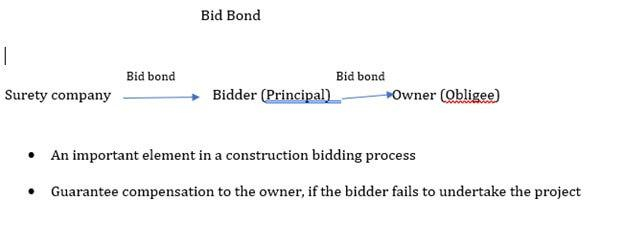

## Table of Contents

## What is a bid bond?

A bid bond is a type of guarantee that a contractor gives to a project owner. It promises that if the contractor wins the bid, they will sign the contract and provide the required performance bond. If the contractor fails to do this, the bid bond makes sure the project owner is not left in a bad spot. The bond usually covers a small percentage of the total bid amount, often around 5-10%.

Bid bonds are important because they help keep the bidding process fair and trustworthy. They encourage contractors to make serious bids and stick to their promises. If a contractor backs out after winning a bid, the project owner can use the money from the bid bond to cover the costs of finding a new contractor. This way, the project can keep moving forward without big delays or extra costs.

## What is a performance bond?

A performance bond is a type of guarantee that a contractor gives to a project owner. It promises that the contractor will finish the job according to the terms of the contract. If the contractor fails to do the work properly or doesn't finish it, the performance bond helps the project owner. The bond usually covers the full amount of the contract, so the owner can use the money to hire someone else to finish the job.

Performance bonds are important because they protect the project owner from losing money if the contractor doesn't do what they promised. They give the owner peace of mind, knowing that they have a backup plan if things go wrong. This makes it easier for the owner to trust the contractor and move forward with the project.

## How do bid bonds and performance bonds differ in their purpose?

Bid bonds and performance bonds both help protect project owners, but they do this in different ways. A bid bond is like a promise from a contractor that they will take the job if they win the bid. It makes sure the contractor doesn't back out after winning, which would leave the project owner in a tough spot. The bid bond covers a small part of the total bid amount, usually 5-10%.

On the other hand, a performance bond is a promise that the contractor will do the job right and finish it on time. If the contractor messes up or doesn't finish the job, the performance bond helps the project owner pay for someone else to finish it. This bond covers the whole amount of the contract, so it's a bigger safety net for the owner.

## Who typically requires a bid bond?

Usually, it's the project owner who asks for a bid bond. This could be a government agency, a company, or someone building a house. They want to make sure that the contractor who wins the bid will actually do the job. If the contractor backs out, the bid bond helps the owner find someone else without losing a lot of money.

Bid bonds are common in big projects like building roads, bridges, or big buildings. They help keep the bidding process fair and trustworthy. The project owner can feel more confident knowing that the contractors are serious about their bids and will stick to their promises.

## Who typically requires a performance bond?

A performance bond is usually asked for by the project owner. This could be a government, a business, or someone building a home. They want to make sure that the contractor will finish the job right and on time. If the contractor does not do a good job or leaves the project unfinished, the performance bond helps the owner pay someone else to finish it.

Performance bonds are common in big projects like building roads, schools, or offices. They give the project owner peace of mind. They know that if the contractor does not do what they promised, they have a way to get the job done without losing a lot of money.

## What are the financial implications of a bid bond for a contractor?

A bid bond can have important money effects for a contractor. When a contractor gets a bid bond, they have to pay a small fee to the surety company that gives the bond. This fee is usually a small part of the total bid amount, like 1% to 3%. The contractor also needs to show the surety company that they are good with money and can do the job well. If the contractor does not meet these needs, they might not get the bond, and they could lose the chance to work on the project.

If the contractor wins the bid but then decides not to take the job, they could lose the full amount of the bid bond. This amount is usually 5% to 10% of the total bid. Losing this money can be a big problem for the contractor, and it might make it hard for them to get bid bonds in the future. So, it's very important for contractors to be sure they can do the job before they bid on it.

## What are the financial implications of a performance bond for a contractor?

A performance bond can have big money effects for a contractor. When a contractor gets a performance bond, they pay a fee to the surety company that gives the bond. This fee is usually a small part of the total contract amount, often between 0.5% and 2%. The contractor also has to show the surety company that they are good with money and can do the job well. If they can't meet these needs, they might not get the bond, and they could lose the chance to work on the project.

If the contractor does not finish the job right or on time, the performance bond could cost them a lot of money. The bond covers the full amount of the contract, so if the contractor fails, the surety company might have to pay the project owner to get someone else to finish the job. The contractor would then have to pay the surety company back for this money. This could be a big problem for the contractor and might make it hard for them to get performance bonds in the future. So, it's very important for contractors to be sure they can do the job before they agree to it.

## How does the process of obtaining a bid bond work?

When a contractor wants to bid on a project, they need to get a bid bond. They start by talking to a surety company, which is like an insurance company for bonds. The contractor fills out a form and gives the surety company information about their business, like how much money they have and what projects they've done before. The surety company looks at this information to decide if the contractor is a good risk. If they think the contractor can do the job and pay back any money if needed, they will give them the bid bond. The contractor has to pay a small fee for the bond, usually 1% to 3% of the total bid amount.

Once the contractor gets the bid bond, they can include it with their bid when they send it to the project owner. The bid bond shows the project owner that the contractor is serious about doing the job if they win the bid. If the contractor wins the bid but then decides not to take the job, the project owner can use the money from the bid bond to find another contractor. This way, the project can keep going without big delays or extra costs. The bid bond usually covers 5% to 10% of the total bid amount, so it's a big deal for the contractor to make sure they can do the job if they win.

## How does the process of obtaining a performance bond work?

When a contractor wins a bid and wants to start the project, they need to get a performance bond. They start by talking to a surety company, which is a special kind of insurance company for bonds. The contractor fills out a form and gives the surety company information about their business, like how much money they have and what projects they've done before. The surety company looks at this information to see if the contractor is a good risk. If they think the contractor can do the job and pay back any money if needed, they will give them the performance bond. The contractor has to pay a small fee for the bond, usually 0.5% to 2% of the total contract amount.

Once the contractor gets the performance bond, they can give it to the project owner. The performance bond shows the project owner that the contractor will finish the job right and on time. If the contractor does not do a good job or leaves the project unfinished, the project owner can use the money from the performance bond to pay someone else to finish it. The performance bond usually covers the full amount of the contract, so it's a big deal for the contractor to make sure they can do the job well. If they mess up, they might have to pay a lot of money back to the surety company.

## What are the common scenarios where a bid bond might be forfeited?

A bid bond might be forfeited if a contractor wins a bid but then decides not to take the job. This can happen if the contractor finds a better opportunity or if they realize they can't do the job after all. When this happens, the project owner can keep the money from the bid bond to help pay for finding another contractor. This keeps the project moving forward without big delays or extra costs for the owner.

Another common scenario is when a contractor wins a bid but then can't get the required performance bond. Sometimes, after winning a bid, the contractor needs to show they can do the job by getting a performance bond. If they can't get this bond because they don't have enough money or a good enough track record, they might have to give up the bid. In this case, the bid bond is forfeited to help the project owner find someone else to do the job.

## What are the common scenarios where a performance bond might be claimed?

A performance bond might be claimed if the contractor does not finish the job on time. Sometimes, projects have a deadline that the contractor has to meet. If they can't finish the work by this date, the project owner can use the money from the performance bond to hire someone else to finish the job quickly. This helps the project stay on track and not get delayed too much.

Another common scenario is when the contractor does not do the job right. If the work is not good enough or does not meet the standards set in the contract, the project owner can claim the performance bond. They can use the money to fix the mistakes or hire another contractor to do the work properly. This makes sure the project is done well, even if the first contractor did not do a good job.

## How can a contractor mitigate the risks associated with bid bonds and performance bonds?

A contractor can lower the risks with bid bonds by being very careful when they bid on a job. They should only bid on projects they are sure they can do well. It's important to check their money and make sure they can get a performance bond if they win. They should also read the bid rules carefully and understand what they need to do to keep the bid bond. If they are not sure about a project, it's better not to bid at all than to risk losing the bid bond money.

For performance bonds, a contractor can reduce risks by planning the project well and keeping good records. They should make sure they have enough money and workers to finish the job on time. It's also good to talk to the project owner often and let them know about any problems early. If something goes wrong, the contractor should try to fix it quickly. This way, they can avoid the project owner claiming the performance bond and having to pay a lot of money back to the surety company.

## References & Further Reading

[1]: Bergstra, J., Bardenet, R., Bengio, Y., & Kégl, B. (2011). ["Algorithms for Hyper-Parameter Optimization."](https://papers.nips.cc/paper/4443-algorithms-for-hyper-parameter-optimization) Advances in Neural Information Processing Systems 24.

[2]: ["Advances in Financial Machine Learning"](https://www.amazon.com/Advances-Financial-Machine-Learning-Marcos/dp/1119482089) by Marcos Lopez de Prado

[3]: ["Evidence-Based Technical Analysis: Applying the Scientific Method and Statistical Inference to Trading Signals"](https://www.amazon.com/Evidence-Based-Technical-Analysis-Scientific-Statistical/dp/0470008741) by David Aronson

[4]: ["Machine Learning for Algorithmic Trading"](https://github.com/stefan-jansen/machine-learning-for-trading) by Stefan Jansen

[5]: ["Quantitative Trading: How to Build Your Own Algorithmic Trading Business"](https://www.amazon.com/Quantitative-Trading-Build-Algorithmic-Business/dp/1119800064) by Ernest P. Chan