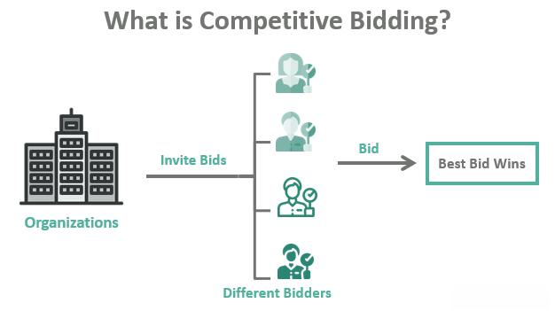

In the world of trading and investments, the concepts of bidding and bid processes play crucial roles. Bidding occurs in various markets, from stock exchanges to real estate, and even in government contracts. As markets evolve, bidding mechanisms have become more sophisticated and are integral to the functionality of different sectors.

With technological advancements, bid algo trading has emerged as a significant element in the modern financial landscape. This development has transformed how bids are placed and executed, enabling precision, speed, and efficiency. Algorithmic trading utilizes computer algorithms to execute trading strategies, thus offering traders a competitive edge through automation and data analysis.

Understanding these dynamics allows investors and traders to navigate the complexities of contemporary markets better. This article will provide insights into the fundamental aspects of bids and bidding processes, highlighting the key components that drive successful trading strategies. Moreover, the evolving role of algorithms in trading will be explored, specifically focusing on how they enhance bidding processes to achieve more effective outcomes.

Technological innovations in trading and investment strategies continue to redefine financial ventures. For all participants, from novice traders to seasoned investors, mastering the intricacies of bidding and algorithmic processes is crucial. These skills are essential for maximizing returns and minimizing risks in an ever-changing market environment, ensuring that participants remain competitive and well-positioned for future opportunities.

## Table of Contents

## Understanding the Basics: Types of Bids

Bidding plays a fundamental role in executing various financial transactions and asset acquisitions, serving as a mechanism to determine the price and allocation of goods or contracts in the market. There are several types of bids, each with its unique characteristics and applicable scenarios, which can significantly impact strategies in trading and investment activities.

Auction Bids are a prominent form where multiple participants compete to acquire an asset by placing progressively higher offers, often seen in real estate and art markets. In this dynamic environment, bidders assess the value of the asset and adjust their offers accordingly, based on their valuation and the bids of competitors. Auction theory, a branch of economics, provides insight into the strategies participants might employ to maximize their outcomes. A common model used in these scenarios is the English auction, where the price ascends until only the highest bidder remains.

Sealed Bids are typically used in tender processes, where bidders submit their offers without knowledge of the competitors' bids. This format is prevalent in government and corporate contracts, as it aims to encourage fair competition and honest disclosure of pricing intentions. The key to success in sealed bidding is to offer a competitive price while ensuring the bid aligns with the stipulated requirements in the tender. The sealed-bid auction can be modeled as a game of incomplete information, where each participant aims to estimate others' valuations without direct knowledge.

Online Bids have gained significant traction with the rise of eCommerce platforms, facilitating virtual auctions and competitions. These bids leverage digital platforms like eBay, allowing participants worldwide to engage in buying and selling through various auction models, including English, Dutch, and Vickrey auctions. The transparency and accessibility of online bids have democratized bidding opportunities, enabling users to participate from any location.

Being familiar with these different types of bids can better inform strategies in various trading and investment scenarios. Understanding the mechanics and strategic implications of each bid type allows traders and investors to tailor their approaches, enhancing their chances of successful transactions. Furthermore, integrating bidding types into [algorithmic trading](/wiki/algorithmic-trading) strategies can optimize outcomes by leveraging technology to analyze bid patterns and market dynamics in real-time.

## The Bidding Process: Essential Steps

The bidding process is a structured and methodical procedure essential for individuals and organizations aiming to acquire valuable goods, services, or contracts. It is composed of several critical phases that, when executed effectively, ensure the successful procurement of desired assets or agreements.

A key initial phase in the bidding process is pre-qualification. During this stage, potential bidders are assessed against specific criteria to determine their eligibility or capability to fulfill the contract requirements. Pre-qualification ensures that only suitable candidates proceed, making the overall process efficient and competitive.

Following pre-qualification, bid preparation becomes the focal point. This phase requires bidders to meticulously draft their proposals, ensuring all requirements and specifications are addressed comprehensively. Effective bid preparation involves thorough market research, cost analysis, and a strategic approach to highlight the bidder’s expertise and value proposition.

During submission, bidders formally present their proposals to the issuer within a stipulated deadline. The submission phase is critical, as late or incomplete bids are typically disqualified, regardless of merit. In auction-style bids, submissions might involve real-time bidding, either online or in physical settings, where competitors adjust their bids dynamically in response to market conditions and rival offers.

Post-submission, evaluation is conducted by the issuer, who assesses all proposals based on predefined criteria such as price, technical capability, and overall value. This phase may involve multiple rounds of discussions or clarifications with bidders to ensure a thorough understanding of proposals. Evaluation aims to identify the proposal that best meets the needs and objectives of the issuer.

The culminating phase of the bidding process is the contract award. Here, the issuer formally accepts a proposal, and contract negotiations may ensue to finalize details before formalizing the agreement. This phase confirms the transition from bidder to contractor, marking the successful conclusion of the bidding process.

Corporate and government contracts often necessitate a more formalized and detailed response to specific requests for proposals (RFPs). These require bidders to adhere to stringent guidelines and demonstrate an ability to deliver on complex specifications.

Strategic planning is intrinsic throughout the bidding process, with companies customizing their bids to align with issuer specifications and expectations. The ability to tailor proposals effectively to meet these demands is crucial for achieving a favorable outcome in competitive bidding environments.

## Bid Algo Trading: The Technological Edge

Algorithmic trading fundamentally transforms the execution of bids within financial markets, offering a technological edge crucial for modern trading environments. At its core, bid algo trading leverages advanced software and algorithms to automate the bidding process. This automation facilitates a speed and accuracy unattainable through manual bidding, thereby enhancing the efficiency of trades.

The primary advantage of algorithmic strategies lies in their ability to process vast amounts of financial data in real-time, allowing traders to respond immediately to fluctuating market conditions. By optimizing the timing and method of bids, these algorithms help maximize trading outcomes. This real-time adaptability is essential for maintaining competitiveness in dynamic markets, where conditions can change second by second.

One prominent feature in bid algo trading is the "Bid Wanted in Competition" (BWIC) mechanism. BWIC is particularly beneficial to institutional investors aiming for competitive pricing on various securities. By integrating BWIC with sophisticated algorithmic systems, traders can ensure transparency and privacy while significantly enhancing the speed of transactions. This alignment allows for an efficient market environment, benefiting buyers and sellers through optimized transaction costs and pricing structures.

Incorporating bid algo trading into financial strategies is increasingly viewed as essential. As markets become more competitive and fast-paced, the ability to adapt rapidly via algorithms is more critical than ever. The integration of these technologies not only streamlines trading operations but also positions traders to exploit pricing inefficiencies and respond swiftly to new market intelligence. Embracing these tools is crucial for anyone aiming to stay ahead in today's financial landscape, where the margin for error is slim and the demands for precision are high.

## Challenges and Opportunities in Bid Algo Trading

Bid algorithmic trading, while offering numerous advantages, presents distinct challenges that traders and investors must navigate. A primary challenge is the inherent market [volatility](/wiki/volatility-trading-strategies). Financial markets are known for their unpredictable fluctuations, which can expose algorithmic strategies to increased risks. Algorithms designed to execute trades must be robust enough to handle sudden market changes without incurring significant losses.

Another challenge is technology-driven errors, often stemming from the complexity of algorithmic systems. Errors in code or data processing can result in incorrect trades, leading to financial losses. Developers must rigorously test and validate algorithms to mitigate such risks, ensuring they perform as intended under various market conditions.

Regulatory compliance is another critical challenge. Financial markets are highly regulated to ensure transparency and fairness. Algorithmic trading strategies must adhere to these regulations, which often vary by country and region. Compliance requires continuous monitoring and adjustment of algorithms to align with the evolving legal landscape.

Moreover, algorithmic trading systems must effectively respond to rapid market conditions. The speed at which these systems operate can be both an advantage and a risk. High-frequency trading, for example, can lead to amplified market movements and require sophisticated risk management strategies.

Despite these challenges, bid algo trading opens up significant opportunities. The integration of [artificial intelligence](/wiki/ai-artificial-intelligence) (AI) and [machine learning](/wiki/machine-learning) can enhance decision-making processes. These technologies allow for the development of predictive models that can analyze vast amounts of data, helping traders anticipate market trends and optimize bidding strategies.

Algorithmic trading also has the potential to improve market [liquidity](/wiki/liquidity-risk-premium) and reduce transaction costs. By facilitating faster and more efficient trades, algorithms can help maintain a steady flow of transactions, enhancing market stability. The reduction in transaction costs further incentivizes participation in algo trading.

Looking ahead, blockchain technology may become increasingly integrated with algorithmic trading. Blockchain's decentralized and secure nature can provide enhanced transparency and security in trade execution. This integration could lead to innovations like smart contracts, which automatically enforce trading agreements.

To succeed in bid algo trading, continuous adaptation and strategic innovation are paramount. Traders and developers must keep abreast of technological advances and regulatory changes, ensuring that their systems remain competitive and compliant. By leveraging the latest advancements, stakeholders can optimize their strategies and capitalize on opportunities in the dynamic field of algorithmic trading.

## Conclusion

The landscape of bids, bidding processes, and algorithmic trading is vast and continuously evolving. Understanding various types of bids and the intricacies of the bidding process is essential for traders and investors, as these elements form the backbone of strategic decision-making in the financial arena. Mastering the dynamics of auction bids, sealed bids, and online bids empowers market participants to make informed choices that can enhance their investment outcomes.

Algorithmic trading stands at the forefront of trading innovation, offering efficiencies previously unattainable. By automating bids and utilizing real-time data, algorithmic trading systems enable traders to execute transactions with speed and precision, significantly improving the accuracy of market speculation and execution. This technological advancement allows for a competitive edge in a rapidly shifting market environment.

As technology continues to progress, the precision and potential of bid algo trading are anticipated to reshape financial markets further. The integration of sophisticated algorithms, artificial intelligence, and machine learning is poised to drive the evolution of trading strategies. These advancements will likely result in improved liquidity and reduced transaction costs, offering significant benefits to market participants.

Investors and professionals are encouraged to remain informed and adapt to technological shifts to remain competitive. Staying abreast of emerging tools and strategies not only mitigates risks but also opens avenues for enhanced profits. By continuously learning and embracing technological innovations, stakeholders can ensure their strategies remain robust in an ever-changing financial landscape.

Exploring both challenges and opportunities in the bid algo trading space is imperative for optimizing strategies for future success. While the automation and speed provided by these technologies present substantial advantages, they also demand vigilance in risk management, regulatory compliance, and strategic foresight. Balancing these aspects will be crucial for those looking to harness the full potential of bid algo trading in transforming their financial ventures.

## References & Further Reading

[1]: Bergstra, J., Bardenet, R., Bengio, Y., & Kégl, B. (2011). ["Algorithms for Hyper-Parameter Optimization."](https://papers.nips.cc/paper/4443-algorithms-for-hyper-parameter-optimization) Advances in Neural Information Processing Systems 24.

[2]: ["Advances in Financial Machine Learning"](https://www.amazon.com/Advances-Financial-Machine-Learning-Marcos/dp/1119482089) by Marcos Lopez de Prado

[3]: ["Evidence-Based Technical Analysis: Applying the Scientific Method and Statistical Inference to Trading Signals"](https://www.wiley.com/en-us/Evidence+Based+Technical+Analysis%3A+Applying+the+Scientific+Method+and+Statistical+Inference+to+Trading+Signals-p-9780470008744) by David Aronson

[4]: ["Machine Learning for Algorithmic Trading"](https://github.com/PacktPublishing/Machine-Learning-for-Algorithmic-Trading-Second-Edition) by Stefan Jansen

[5]: ["Quantitative Trading: How to Build Your Own Algorithmic Trading Business"](https://www.amazon.com/Quantitative-Trading-Build-Algorithmic-Business/dp/0470284889) by Ernest P. Chan