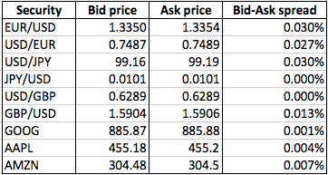

## Table of Contents

## What is a bid price?

A bid price is the highest price that a buyer is willing to pay for something, like a stock or a product at an auction. In the stock market, the bid price is shown alongside the ask price, which is the lowest price a seller is willing to accept. The difference between the bid and ask price is called the bid-ask spread. This spread is important because it shows how much the price can change from one trade to the next.

In an auction, the bid price is what people offer to pay for an item. As more people bid, the price goes up until no one is willing to pay more. The highest bid at the end of the auction wins the item. Bidding can be exciting because it involves competition and can lead to paying more than you planned if you get caught up in the moment.

## What is an ask price?

The ask price is the lowest price a seller is willing to accept for something, like a stock or a product. In the stock market, you'll see the ask price next to the bid price, which is the highest price a buyer is willing to pay. The difference between these two prices is called the bid-ask spread. This spread is important because it shows how much the price might change from one trade to another.

In an auction, the ask price can be thought of as the starting price set by the seller. As people bid higher, the ask price can go up if the seller decides to accept higher bids. But usually, the ask price stays the same until someone bids at or above it. This makes auctions exciting because people keep bidding until no one wants to pay more, and the highest bidder wins the item.

## How do bid and ask prices relate to each other?

Bid and ask prices work together in the market to help people buy and sell things. The bid price is the highest amount a buyer wants to pay for something, like a stock or a product. The ask price is the lowest amount a seller is willing to accept for that same thing. When someone wants to buy, they look at the ask price to see how much they need to pay. When someone wants to sell, they look at the bid price to see how much they can get.

The difference between the bid and ask prices is called the bid-ask spread. This spread is important because it shows how much the price might change from one trade to another. If the spread is small, it means buyers and sellers agree more on the price, and it's easier to trade. If the spread is big, it can be harder to trade because buyers and sellers are far apart on what they think the price should be. In auctions, the bid price keeps going up as people bid more, trying to meet or beat the ask price until no one wants to pay more.

## Where can you find bid and ask prices?

You can find bid and ask prices in many places where people buy and sell things. One common place is in the stock market. If you look at a stock's information on a trading platform or financial news website, you'll see the bid and ask prices right there. They help you know the highest price someone wants to pay for a stock and the lowest price someone is willing to sell it for.

Another place to see bid and ask prices is at auctions. When you go to an auction, whether it's for art, cars, or anything else, you'll see the starting price, which is like the ask price. As people start bidding, you'll see the bid prices go up. The goal is for the bid price to meet or beat the ask price so someone can buy the item.

## Why are bid and ask prices important in trading?

Bid and ask prices are important in trading because they show you what people are willing to pay and what sellers are willing to accept for something, like a stock or a product. When you want to buy a stock, you look at the ask price to see how much you need to pay. When you want to sell, you check the bid price to see how much you can get. This helps you make smart choices about when to buy or sell.

The difference between the bid and ask prices, called the bid-ask spread, is also important. A small spread means that buyers and sellers agree more on the price, making it easier to trade. A big spread means they are far apart, which can make trading harder. Knowing the bid and ask prices helps you understand the market better and trade more effectively.

## How does the bid-ask spread affect trading?

The bid-ask spread is the difference between the highest price someone wants to pay for a stock (the bid price) and the lowest price someone is willing to sell it for (the ask price). This spread is important because it shows how easy or hard it is to trade. If the spread is small, it means buyers and sellers agree more on what the stock is worth, so it's easier to buy and sell. But if the spread is big, it means they don't agree much, and it can be harder to make a trade.

A big bid-ask spread can also cost you more money. When you buy a stock, you pay the ask price, which is higher than the bid price. When you sell, you get the bid price, which is lower than the ask price. So, the bigger the spread, the more you lose just from buying and selling. Traders need to think about the bid-ask spread because it can affect how much money they make or lose from trading.

## What factors influence the bid and ask prices?

Many things can change the bid and ask prices. One big thing is how much people want to buy or sell something. If lots of people want to buy a stock, the bid price might go up because buyers are willing to pay more. If lots of people want to sell a stock, the ask price might go down because sellers want to get rid of it fast. Another thing that can change these prices is news about a company or the economy. Good news can make people want to buy more, pushing up the bid price. Bad news can make people want to sell more, pushing down the ask price.

The overall market mood also plays a role. If everyone feels good about the market, bid prices might go up because people are willing to pay more. If everyone feels bad about the market, ask prices might go down because sellers want to sell quickly. Also, how easy it is to trade a stock can affect the bid and ask prices. Stocks that are easy to trade usually have smaller differences between the bid and ask prices because there are lots of buyers and sellers. Stocks that are hard to trade can have bigger differences because there are fewer people trading them.

## Can bid and ask prices change, and if so, how quickly?

Yes, bid and ask prices can change, and they can change very quickly. In the stock market, these prices can move in seconds because they depend on what people are willing to buy and sell right now. If a lot of people suddenly want to buy a stock, the bid price can go up fast. If many people want to sell a stock all at once, the ask price can go down quickly. News about a company or the economy can also make these prices change fast, like if a company reports good earnings or if there's a big event in the world.

How fast bid and ask prices change can also depend on how easy it is to trade a stock. Stocks that are easy to trade, like those of big companies, usually have prices that change quickly because there are always lots of people buying and selling. Stocks that are harder to trade, like those of smaller companies, might not change as fast because there are fewer people trading them. But even with these stocks, prices can still change quickly if something important happens.

## How do market makers use bid and ask prices?

Market makers are people or companies that help make sure there are always buyers and sellers in the market. They do this by setting bid and ask prices for stocks. The bid price is the highest price the market maker is willing to pay to buy a stock, and the ask price is the lowest price they are willing to sell it for. By doing this, market makers make it easier for other people to trade because they can always buy from or sell to the market maker.

Market makers make money from the difference between the bid and ask prices, called the bid-ask spread. If they buy a stock at the bid price and then sell it at the ask price, they make a little bit of money on each trade. They have to be careful to set these prices right because if they set them too high or too low, people might not want to trade with them. By keeping the market moving and setting good bid and ask prices, market makers help keep the market working smoothly.

## What is the impact of high-frequency trading on bid and ask prices?

High-frequency trading ([HFT](/wiki/high-frequency-trading-strategies)) can change bid and ask prices very fast. HFT is when computers trade stocks very quickly, often in just a few seconds. These computers use special math to decide when to buy and sell. Because they trade so fast, they can change the bid and ask prices a lot. If many high-frequency traders want to buy a stock, the bid price can go up quickly. If they want to sell, the ask price can go down just as fast.

This fast trading can make the market more exciting but also more risky. The bid-ask spread might get smaller because high-frequency traders are always buying and selling, which can make it easier for other people to trade. But it can also make the market more confusing because prices can change so quickly. Sometimes, high-frequency trading can even cause big price swings if lots of traders decide to buy or sell at the same time. So, while HFT can help keep the market moving, it can also make it harder to predict what will happen next.

## How can understanding bid and ask prices improve trading strategies?

Understanding bid and ask prices can help you make better trading choices. When you know the bid price is the highest someone wants to pay and the ask price is the lowest someone will sell for, you can see how much people think a stock is worth right now. This helps you decide if it's a good time to buy or sell. If the bid price is close to the ask price, it means people agree more on the value, and it's easier to trade. But if there's a big difference, it might be harder to trade and more risky.

Using this knowledge can also help you plan your trades better. For example, if you see the bid price going up fast, it might mean more people want to buy, so it could be a good time to sell your stock for a higher price. If the ask price is going down, it might mean more people want to sell, so it could be a good time to buy at a lower price. By watching how these prices change, you can time your trades to make more money and avoid losing too much.

## What are some advanced techniques for analyzing bid and ask price dynamics?

One advanced way to look at bid and ask prices is by using something called [order book](/wiki/order-book-trading-strategies) analysis. An order book shows all the current bid and ask prices for a stock, along with how many shares people want to buy or sell at each price. By studying the order book, you can see if there are a lot of people wanting to buy or sell at certain prices. This can help you guess if the price might go up or down soon. For example, if you see a lot of buy orders at a higher price, it might mean the price is going to go up because more people want to buy.

Another technique is to use something called the [volume](/wiki/volume-trading-strategy)-weighted average price (VWAP). VWAP shows the average price of a stock, taking into account how many shares were traded at different prices. Traders use VWAP to see if the current bid and ask prices are good deals compared to the average price. If the current ask price is lower than the VWAP, it might be a good time to buy because you're getting a better deal than average. If the bid price is higher than the VWAP, it might be a good time to sell because you're getting more than the average price.

Lastly, you can use market depth analysis to understand bid and ask prices better. Market depth shows how many buy and sell orders there are at different prices, kind of like a snapshot of the order book. By looking at market depth, you can see if there's a lot of interest in buying or selling at certain prices. If there are a lot of buy orders at prices just above the current bid, it might mean the price could go up soon. If there are a lot of sell orders at prices just below the current ask, it might mean the price could go down. These techniques help traders make smarter choices by giving them a clearer picture of what's happening with bid and ask prices.

## References & Further Reading

[1]: Harris, L. (2003). ["Trading and Exchanges: Market Microstructure for Practitioners."](https://www.amazon.com/Trading-Exchanges-Market-Microstructure-Practitioners/dp/0195144708) Oxford University Press.

[2]: Aldridge, I. (2010). ["High-Frequency Trading: A Practical Guide to Algorithmic Strategies and Trading Systems."](https://www.ahmetbeyefendi.com/wp-content/uploads/2020/07/High-Frequency-Trading-Irene-Aldridge.pdf) Wiley.

[3]: Hasbrouck, J. (2007). ["Empirical Market Microstructure: The Institutions, Economics, and Econometrics of Securities Trading."](https://archive.org/details/empiricalmarketm0000hasb) Oxford University Press.

[4]: Cartea, Á., Jaimungal, S., & Penalva, J. (2015). ["Algorithmic and High-Frequency Trading."](https://assets.cambridge.org/97811070/91146/frontmatter/9781107091146_frontmatter.pdf) Cambridge University Press.

[5]: De Prado, M. L. (2018). ["Advances in Financial Machine Learning."](https://www.amazon.com/Advances-Financial-Machine-Learning-Marcos/dp/1119482089) Wiley.