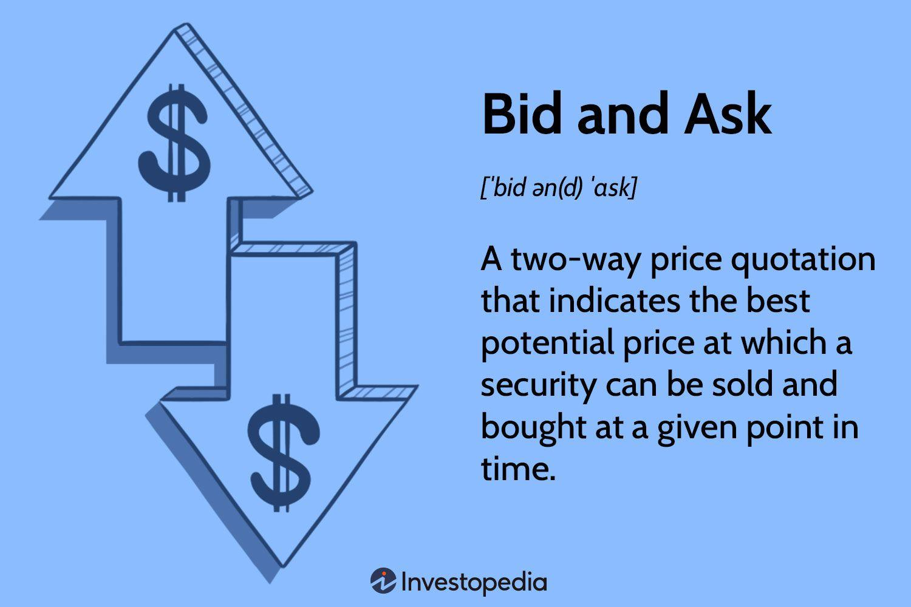

## Table of Contents

## What is a bid price in finance?

A bid price in finance is the highest price that someone is willing to pay for a stock, bond, or other financial asset at a given time. It's like when you're at a store and you see a price tag on an item; the bid price is what buyers are offering to pay for that item in the financial market. If you want to sell your stock, you would look at the bid price to see what you could get for it right now.

The bid price is important because it helps set the market value of a security. It's one half of the bid-ask spread, which is the difference between the highest price a buyer will pay (the bid) and the lowest price a seller will accept (the ask). This spread can tell you how easy or hard it might be to buy or sell the security. A smaller spread usually means the security is more liquid, meaning it's easier to buy and sell quickly.

## How does a bid price differ from an ask price?

The bid price is what someone is willing to pay to buy a stock or other financial asset. It's like when you go to a store and see how much money people are offering for an item. In the stock market, if you want to sell your stock, you look at the bid price to see what you can get for it right now. It's the highest amount a buyer is ready to spend at that moment.

The ask price, on the other hand, is what someone wants to be paid when they sell their stock or asset. It's like the price tag on an item in a store, showing what the seller expects to get. In the stock market, if you want to buy a stock, you look at the ask price to see how much you need to pay. It's the lowest amount a seller is willing to accept at that time.

The difference between the bid price and the ask price is called the bid-ask spread. This spread can tell you how easy or hard it might be to buy or sell the stock. A smaller spread usually means it's easier to trade the stock quickly because there's not a big gap between what buyers are willing to pay and what sellers want to receive.

## Where can you find bid prices in financial markets?

You can find bid prices in financial markets on trading platforms and stock exchange websites. These platforms show real-time data, so you can see the current bid price for any stock or financial asset you're interested in. For example, if you go to a website like the New York Stock Exchange or use an app like Robinhood, you'll see the bid price listed right next to the stock's symbol.

Bid prices are also available through financial news websites and apps. Sites like Bloomberg, Yahoo Finance, and Google Finance display bid prices along with other important market data. This makes it easy for anyone to check the bid price without needing to be directly involved in trading. So, whether you're a professional trader or just curious about a stock's value, you can easily find the bid price online.

## Why is the bid price important for investors?

The bid price is important for investors because it tells them the highest amount someone is willing to pay for a stock or asset at any given time. If an investor wants to sell their stock, they look at the bid price to see what they can get for it right away. This helps them decide if it's a good time to sell or if they should wait for a higher bid. The bid price gives investors a clear idea of the current market value of their investments.

Also, the bid price is one half of the bid-ask spread, which is the difference between the highest price a buyer will pay and the lowest price a seller will accept. A smaller bid-ask spread means the stock is more liquid, meaning it's easier to buy and sell quickly. This is important for investors because it can affect how fast they can get in and out of their investments. Understanding the bid price helps investors make better decisions about when to buy or sell, and how to manage their portfolios effectively.

## How do bid prices affect the liquidity of a security?

Bid prices play a big role in how easy or hard it is to buy or sell a security, which we call [liquidity](/wiki/liquidity-risk-premium). The bid price is the highest amount someone is willing to pay for a stock or asset at that moment. If the bid price is close to the ask price (the lowest price a seller will accept), it means the bid-ask spread is small. A small bid-ask spread shows that there are lots of buyers and sellers ready to trade, making it easier and quicker for investors to buy or sell their securities.

On the other hand, if the bid price is much lower than the ask price, it means the bid-ask spread is large. A large spread suggests that there might not be as many people wanting to buy or sell the security right away. This can make it harder for investors to trade quickly because they might have to wait for a better bid price or accept a lower price than they wanted. So, the bid price helps show how liquid a security is, which is important for investors when they are deciding when to make their trades.

## What factors influence the bid price of a stock?

Several things can change the bid price of a stock. One big thing is how much people want to buy the stock. If lots of people want to buy it, the bid price might go up because buyers will offer more money to get it. On the other hand, if fewer people want to buy, the bid price might go down because there's less competition among buyers. Also, news about the company, like good earnings reports or new products, can make people want to buy more and push the bid price up. Bad news, like scandals or poor performance, can make the bid price drop as people lose interest.

Another [factor](/wiki/factor-investing) is the overall market mood. If the stock market is doing well and people feel confident, they might be willing to pay more for stocks, which can raise the bid price. But if the market is down and people are worried, they might not want to spend as much, and the bid price could fall. The actions of big investors, like mutual funds or hedge funds, can also affect the bid price. If these big players start buying a lot of a stock, the bid price can go up because their demand pushes the price higher. If they start selling, the bid price might go down as they flood the market with shares.

## Can the bid price be higher than the ask price, and if so, under what circumstances?

Normally, the bid price is lower than the ask price because the bid is what someone is willing to pay to buy a stock, and the ask is what someone wants to be paid to sell it. But in some rare situations, the bid price can be higher than the ask price. This can happen when there's a lot of confusion or very fast trading in the market, like during a big news event or a sudden change in stock prices.

For example, if a company announces unexpectedly good news, lots of people might want to buy the stock at the same time. This rush can make the bid price jump up quickly. At the same time, if some sellers don't realize how much the stock's value has gone up, they might still be asking for a lower price. So, for a short moment, the bid price could be higher than the ask price until the market settles down and everyone's prices catch up.

## How do bid prices function in electronic trading systems?

In electronic trading systems, the bid price is shown on the trading screen next to the stock's symbol. This price is updated all the time to show the highest amount someone is willing to pay for the stock right now. When you want to sell your stock, you look at the bid price to see what you can get for it. If you agree with the bid price, you can sell your stock at that amount. The system matches your sell order with a buyer who is willing to pay that bid price.

These systems work fast and use computers to make sure buying and selling happen smoothly. The bid price helps keep things fair by showing everyone what the current highest offer is. This way, all traders can see the same information and make their decisions based on the latest prices. If the bid price changes a lot, it can mean there's a lot of interest in the stock, or something important happened that's affecting its value.

## What role do bid prices play in market depth and order book dynamics?

Bid prices are really important for understanding how deep the market is and how the [order book](/wiki/order-book-trading-strategies) works. The order book is like a list that shows all the buy and sell orders for a stock. The bid price is the highest price someone is willing to pay to buy the stock. When you look at the order book, you can see different bid prices and how many shares people want to buy at each price. This helps show the market depth, which means how many shares you can buy or sell at different prices. If there are lots of bids at different prices, it means the market is deep and there's a lot of interest in the stock.

The bid prices also affect how the order book changes over time. When new bids come in or old ones are taken away, the bid prices can move up or down. This movement can make other traders change their orders too. For example, if a new high bid comes in, it might make other people want to bid higher too, which can push the stock's price up. On the other hand, if lots of bids are taken away, it might make the stock's price go down because there's less interest. So, bid prices are a big part of how the order book works and how the market stays balanced.

## How can changes in bid prices signal market trends or shifts in investor sentiment?

Changes in bid prices can tell us a lot about what's happening in the market and how investors are feeling. If the bid prices for a stock start going up, it usually means more people want to buy it. This can be a sign that investors are feeling good about the stock or the market in general. They might think the company is doing well or that the economy is getting better. When bid prices keep going up, it can start a trend where more and more people want to buy, pushing the stock's price even higher.

On the other hand, if bid prices start dropping, it can mean that investors are getting worried or losing interest. They might be selling their stocks because they think the company is not doing well or that the market might go down. When bid prices go down, it can start a trend where more people want to sell, which can make the stock's price fall. So, by watching how bid prices change, you can get a good idea of what investors are thinking and where the market might be headed.

## What are the strategies traders use to manipulate or take advantage of bid prices?

Traders sometimes use strategies to try and change or use bid prices to their advantage. One common way is called "spoofing." This is when a trader puts in a big order to buy a stock at a high bid price, but they don't really want to buy it. They just want to make other people think there's a lot of interest in the stock, so the price goes up. Then, when the price is higher, the trader cancels their big order and sells the stock they already own at the higher price. This can make them money, but it's not fair to other traders and is against the rules.

Another strategy is called "front running." This happens when a trader knows about a big order that's coming and they put in their own order first. For example, if they know someone is about to buy a lot of a stock, they might quickly put in a bid to buy it at a slightly higher price. When the big order comes in, it pushes the stock's price up, and the trader can sell their shares at the higher price. This can be hard to spot and can be illegal if the trader is using inside information. Both spoofing and front running are ways traders try to use bid prices to make money, but they can hurt other investors and the fairness of the market.

## How do bid prices in options markets differ from those in stock markets?

In options markets, the bid price works a bit differently than in stock markets. An option gives you the right to buy or sell a stock at a certain price before a certain date. The bid price in options markets is what someone is willing to pay to buy that right from you. Because options are more complicated than stocks, their bid prices can change a lot based on things like how much time is left before the option expires, how much the stock's price is moving around, and how far the stock's current price is from the option's strike price.

In stock markets, the bid price is simpler. It's just the highest amount someone is willing to pay to buy the stock right now. The bid price in stock markets is mainly affected by how much people want to buy the stock and how the company is doing. While both markets use bid prices to show what buyers are willing to pay, the factors that change these prices are different because options are more complex and depend on more things than just the stock's price.

## What are the Tools and Technologies for Successful Algo Trading?

In the domain of [algorithmic trading](/wiki/algorithmic-trading), the successful implementation of strategies depends heavily on the tools and technologies employed. Key among these are data feeds, trading platforms, and risk management systems, each playing a crucial role in enhancing performance and execution precision.

### Data Feeds

Data feeds provide the real-time and historical market data necessary for algorithmic systems to make informed trading decisions. These feeds encompass a wide range of data types, including price quotes, market depth, and financial news. The accuracy and speed of data delivery are paramount; even minor delays can result in missed trading opportunities or suboptimal trade execution. For effective algo trading, traders often rely on high-frequency data feeds known as tick-by-tick feeds, which offer the most granular level of market information.

### Trading Platforms

Trading platforms are the backbone of algorithmic trading systems, offering the environment where strategies are developed, tested, and executed. Robust platforms such as MetaTrader are popular choices due to their comprehensive suite of features, including charting tools, back-testing capabilities, and support for automated trading through Expert Advisors (EAs). These platforms often provide their own scripting languages (e.g., MQL4/5 for MetaTrader) to enable the customization of trading strategies.

Additionally, the use of Application Programming Interfaces (APIs) allows traders to integrate their own algorithms with trading platforms. APIs facilitate the automation of trading activities, enabling direct interaction with broker services to place trades, retrieve account information, and manage orders programmatically. A typical Python example for utilizing an API in algorithmic trading might involve using the `requests` library to interact with a broker's REST API:

```python
import requests

# Example of retrieving account balance via API
url = "https://api.broker.com/v1/account"
headers = {
    "Authorization": "Bearer YOUR_ACCESS_TOKEN",
    "Content-Type": "application/json"
}

response = requests.get(url, headers=headers)

if response.status_code == 200:
    account_info = response.json()
    print("Account Balance:", account_info['balance'])
else:
    print("Failed to fetch account information:", response.status_code)
```

### Risk Management Systems

Risk management systems are indispensable in safeguarding investments against adverse market movements and operational failures. These systems analyze potential risk factors and enforce predetermined risk parameters, such as maximum drawdown limits and stop-loss settings. Automated systems can quickly execute these protective measures without human intervention, thereby mitigating the impact of [volatility](/wiki/volatility-trading-strategies) and unpredictable market events.

Implementing effective risk management requires an understanding of both quantitative models and intuitive metrics. A common approach is the Value-at-Risk (VaR) model, which estimates the potential loss of a portfolio over a specific time frame with a given confidence level. The formula for a simple VaR calculation might involve:

$$
\text{VaR} = Z \times \sigma \times \sqrt{t}
$$

Where $Z$ is the Z-score corresponding to the desired confidence level, $\sigma$ is the standard deviation of the portfolio's returns, and $t$ is the time period.

In conclusion, data feeds, trading platforms, and risk management systems are foundational components that enable effective algorithmic trading. By leveraging these technologies, traders can enhance their strategy execution capabilities and maintain a competitive edge in fast-paced markets.

## References & Further Reading

[1]: ["Advances in Financial Machine Learning"](https://www.amazon.com/Advances-Financial-Machine-Learning-Marcos/dp/1119482089) by Marcos Lopez de Prado

[2]: ["Evidence-Based Technical Analysis: Applying the Scientific Method and Statistical Inference to Trading Signals"](https://www.semanticscholar.org/paper/Evidence-Based-Technical-Analysis%3A-Applying-the-and-Aronson/3b33df8737f1772e9e14d66a08c9696f140a2ee1) by David Aronson

[3]: ["Machine Learning for Algorithmic Trading"](https://github.com/PacktPublishing/Machine-Learning-for-Algorithmic-Trading-Second-Edition) by Stefan Jansen

[4]: ["Quantitative Trading: How to Build Your Own Algorithmic Trading Business"](https://www.amazon.com/Quantitative-Trading-Build-Algorithmic-Business/dp/1119800064) by Ernest P. Chan

[5]: ["Algorithmic Trading and DMA: An Introduction to Direct Access Trading Strategies"](https://www.amazon.com/Algorithmic-Trading-DMA-introduction-strategies/dp/0956399207) by Barry Johnson

[6]: Hasbrouck, J. (1995). ["One Security, Many Markets: Determining the Effects of Market Fragmentation on Liquidity and Price Discovery"](https://www.parisinsidersguide.com/ile-de-la-cite.html). The Journal of Finance, Volume 50, Issue 4, pages 1175-1199.

[7]: Aldridge, I. (2013). ["High-Frequency Trading: A Practical Guide to Algorithmic Strategies and Trading Systems"](https://books.google.com/books/about/High_Frequency_Trading.html?id=6l0DDQAAQBAJ). Wiley Finance.