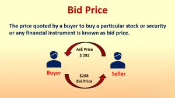

Algorithmic trading has brought about a significant transformation in the finance sector, markedly altering traditional market operations. By employing computer algorithms to rapidly execute trades, it provides unprecedented access to market dynamics, reshaping how transactions are conducted. This article will focus on key concepts such as bid price and the mechanics of algorithmic trading, crucial for those engaged in financial markets.

Bid price, a fundamental concept in trading, represents the highest amount a buyer is willing to pay for a security. Its significance lies in the determination of the spread—the difference between the bid price and the offer price—directly impacting trading costs and profit margins. Understanding bid price dynamics can empower traders to optimize trade executions, leading to more informed and strategic decisions.



Simultaneously, algorithmic trading has revolutionized trading by leveraging computer programs to perform high-speed and efficient transactions based on pre-defined criteria and market data. This shift not only enhances precision but also eliminates human emotion, potentially reducing the risk of errors related to psychological biases. Algorithms can process large volumes of data, adapting to changing market conditions in real-time, which can be a game-changer for market participants seeking an edge.

In conclusion, staying informed about these concepts and continuously adapting to technological advancements in trading can offer a competitive advantage in today's rapidly evolving financial markets. Understanding key terminologies and strategies related to bid prices and algorithmic trading is essential for anyone aiming to succeed in this environment.

## Table of Contents

## Understanding Bid Price in Finance

Bid price is a fundamental element in financial markets, serving as a key indicator of the willingness of buyers to purchase a security at a specific maximum price. It forms one side of a market’s bid-ask spread, the other being the ask (or offer) price, which is the minimum price at which sellers are willing to sell. The difference between these two prices, known as the spread, is a crucial determinant of trading costs. A tighter spread, characterized by closer bid and ask prices, often signifies higher liquidity and lower transaction costs, making the market more attractive to traders.

In the stock market, the bid price reflects the highest amount a buyer is willing to pay for a share of a company at any given moment. For instance, if a stock's bid price is $50, a buyer is prepared to purchase the stock at $50 per share, but not higher. Stock exchanges like the New York Stock Exchange (NYSE) or NASDAQ facilitate these transactions, constantly updating bid prices as market conditions fluctuate.

The foreign exchange ([forex](/wiki/forex-system)) market operates similarly, with bid prices denoting the amount a trader is willing to pay for a currency pair. Consider the EUR/USD currency pair; if the bid price is 1.1200, a buyer is ready to pay 1.1200 USD for 1 Euro. Forex markets, recognized for their [liquidity](/wiki/liquidity-risk-premium) and round-the-clock trading, often experience tighter spreads compared to other financial markets, further highlighting the importance of the bid price in trade executions.

Algorithmic and high-frequency traders pay significant attention to bid prices, as rapid changes in these prices can signal potential trading opportunities. The role of bid prices extends beyond simple buying intent, influencing traders' strategies, from deciding entry and [exit](/wiki/exit-strategy) points to managing slippage, which occurs when an execution price differs from the intended price due to market movements.

Understanding the dynamics of bid prices can therefore offer traders an essential insight into market conditions and trading efficiency. Calculating the spread as a straightforward subtraction — Spread = Ask Price - Bid Price — provides a quantitative measure of the implied cost of trading in the market. Consequently, a comprehensive grasp of bid prices and their implications can lead to more informed trading decisions, enhancing the potential for profitability in both stock and forex markets.

## The Role of Algo Trading

Algorithmic trading, often referred to as algo trading, revolutionizes the way financial markets operate by using computer programs to perform trades at high speed, a feat that is unattainable by human traders. This technology leverages algorithms, which are essentially a set of predefined rules, to automate trading strategies. 

The primary benefit of algo trading is its ability to execute trades efficiently and with precision. Algorithms are designed to scan market conditions and execute trades based on pre-determined criteria, such as timing, price, or quantity, thus eliminating human error and emotional biases. These predefined criteria, or triggers, can be based on a wide range of data inputs including historical price trends, news feeds, statistical models, or real-time market data. Once the conditions specified in the algorithm are met, the system automatically executes the orders.

For instance, a simple example of an algorithmic strategy might be a moving average crossover system. An algorithm can be designed to buy a stock when its short-term moving average crosses above its long-term moving average and to sell when the opposite occurs. This type of technical indicator-based strategy exemplifies how algorithms can be systematically deployed without direct human intervention.

Python has become a popular programming language for implementing [algorithmic trading](/wiki/algorithmic-trading) systems due to its simplicity and robust libraries. For example, using the Pandas library in Python, traders can easily handle large sets of time-series data and apply their trading algorithms. Here is a simple Python code snippet demonstrating a moving average crossover strategy:

```python
import pandas as pd
import numpy as np

# Load market data into a pandas DataFrame
data = pd.read_csv('stock_data.csv')
data['SMA_short'] = data['Close'].rolling(window=40).mean()
data['SMA_long'] = data['Close'].rolling(window=100).mean()

# Generate signals
data['Signal'] = np.where(data['SMA_short'] > data['SMA_long'], 1, 0)

# Execute trades based on signals
data['Position'] = data['Signal'].diff()
```

In this example, 'SMA_short' and 'SMA_long' represent the short-term and long-term moving averages, respectively. The 'Signal' column indicates when a buy signal (1) occurs and 'Position' marks the point at which a trade should be executed.

In sum, the integration of algorithms in trading is transforming how trades are conducted across global markets. Through the use of sophisticated data analysis and execution based on triggers, algorithmic trading provides a systematic approach that enhances speed and accuracy, enabling traders to capitalize on opportunities that would be impossible to capture manually. This method not only augments market liquidity but also narrows spreads, thereby offering numerous advantages to market participants.

## Advantages and Disadvantages of Algo Trading

Algorithmic trading, often dubbed algo trading, has markedly reshaped the landscape of financial market operations by employing automated, pre-programmed trading instructions. One of its foremost advantages is the removal of human emotional biases, which can lead to suboptimal trading decisions. By executing trades based purely on data and set algorithms, it mitigates the risk of rash decisions driven by fear or greed, thus promoting discipline in trading.

Additionally, algo trading enhances speed and accuracy in executing trades. Computers can process market data and execute orders in fractions of a second, outpacing human capabilities and capturing opportunities promptly. This speed is advantageous in markets where price movements are rapid, allowing traders to capitalize on short-lived opportunities. Furthermore, by executing trades at the optimal price, algo trading minimizes transaction costs and reduces market impact.

However, algorithmic trading is not without its challenges. A significant risk is the dependency on technology. System failures or network outages can disrupt trading operations, leading to substantial financial losses. Furthermore, the effectiveness of an algorithm is contingent on the integrity of the data it processes. Faulty or incomplete data can lead to erroneous trading decisions, undermining the reliability of the system.

Another concern is the potential over-optimization of strategies. Often termed as "curve fitting," this occurs when algorithms are excessively tailored to historical data, leading to impressive past performance but poor real-world execution. This phenomenon highlights the necessity for robust testing across diverse market conditions to ensure algorithms are resilient and adaptable.

Moreover, while automated systems aim to eliminate emotional bias, they are not entirely void of influence. The design and parameters of the algorithm reflect the biases and assumptions of its developers, which can embed systemic biases into trading strategies.

In summary, while algo trading offers substantial efficiencies and helps in eliminating emotional biases, traders must be cognizant of the technological reliance and the potential pitfalls of over-optimization. A balanced approach is crucial, combining rigorous testing and continuous monitoring to navigate these complexities effectively.

## Strategies in Algorithmic Trading

Algorithmic trading employs a variety of strategies, each capitalizing on distinct market behaviors to identify profitable trading opportunities. Among the most prevalent strategies are trend-following, mean reversion, and [arbitrage](/wiki/arbitrage). Understanding these approaches allows traders to optimize their algorithmic trading systems and adapt effectively to different market environments.

### Trend-Following

Trend-following strategies are based on identifying and capitalizing on the direction of market trends. This approach presumes that securities exhibiting strong historical trends will likely continue in the same direction. Trend-following algorithms typically rely on technical indicators such as moving averages, [momentum](/wiki/momentum) indicators, and channels to signal trading opportunities. 

For instance, a simple trend-following algorithm may use moving average crossovers. When a shorter-period moving average crosses above a longer-period moving average, it signals a possible upward trend, triggering a buy order. Conversely, when the shorter-period moving average crosses below the longer-period average, it suggests a downward trend, prompting a sell order.

Here's a basic Python example illustrating a moving average crossover strategy:

```python
import pandas as pd
import numpy as np

def moving_average_crossover(data, short_window=40, long_window=100):
    signals = pd.DataFrame(index=data.index)
    signals['price'] = data['Close']

    # Create short/long simple moving average columns
    signals['short_mavg'] = signals['price'].rolling(window=short_window, min_periods=1, center=False).mean()
    signals['long_mavg'] = signals['price'].rolling(window=long_window, min_periods=1, center=False).mean()

    # Create signals
    signals['signal'] = 0.0
    signals['signal'][short_window:] = np.where(signals['short_mavg'][short_window:] > signals['long_mavg'][short_window:], 1.0, 0.0)   
    signals['positions'] = signals['signal'].diff()

    return signals
```

### Mean Reversion

Mean reversion strategies operate on the assumption that asset prices tend to revert to their historical mean or average level over time. Algorithms designed for mean reversion analyze statistical measures such as standard deviation and price distributions to identify assets that deviate significantly from their average values. 

A common mean reversion strategy uses the Bollinger Bands indicator, which defines [volatility](/wiki/volatility-trading-strategies) bands above and below a moving average. If a price breaches these bands, it indicates potential reversion back toward the mean. Buy signals are generated when prices fall below the lower band, while sell signals are triggered when prices exceed the upper band.

### Arbitrage

Arbitrage strategies exploit price discrepancies across different markets or instruments. By simultaneously buying and selling related assets, traders can capitalize on inefficiencies within the markets. Arbitrage can be segmented into various types, such as [statistical arbitrage](/wiki/statistical-arbitrage), index arbitrage, and merger arbitrage, among others. 

For example, statistical arbitrage involves leveraging advanced statistical models to exploit relative pricing inefficiencies between securities, often requiring fast execution speeds and sophisticated risk management protocols. Unlike typical market speculation, arbitrage seeks risk-free profit by exploiting market anomalies.

These strategies exemplify how algorithmic trading can be adapted to diverse market conditions. Automated systems using trend-following strategies capitalize on persistent market movements, mean reversion algorithms benefit from temporary price anomalies, and arbitrage strategies utilize market inefficiencies to secure profits. By mastering these strategies, traders can enhance their trading systems, ensuring they are robust, adaptable, and capable of navigating the complexities of global markets.

## Tools and Technologies for Successful Algo Trading

In the domain of algorithmic trading, the successful implementation of strategies depends heavily on the tools and technologies employed. Key among these are data feeds, trading platforms, and risk management systems, each playing a crucial role in enhancing performance and execution precision.

### Data Feeds

Data feeds provide the real-time and historical market data necessary for algorithmic systems to make informed trading decisions. These feeds encompass a wide range of data types, including price quotes, market depth, and financial news. The accuracy and speed of data delivery are paramount; even minor delays can result in missed trading opportunities or suboptimal trade execution. For effective algo trading, traders often rely on high-frequency data feeds known as tick-by-tick feeds, which offer the most granular level of market information.

### Trading Platforms

Trading platforms are the backbone of algorithmic trading systems, offering the environment where strategies are developed, tested, and executed. Robust platforms such as MetaTrader are popular choices due to their comprehensive suite of features, including charting tools, back-testing capabilities, and support for automated trading through Expert Advisors (EAs). These platforms often provide their own scripting languages (e.g., MQL4/5 for MetaTrader) to enable the customization of trading strategies.

Additionally, the use of Application Programming Interfaces (APIs) allows traders to integrate their own algorithms with trading platforms. APIs facilitate the automation of trading activities, enabling direct interaction with broker services to place trades, retrieve account information, and manage orders programmatically. A typical Python example for utilizing an API in algorithmic trading might involve using the `requests` library to interact with a broker's REST API:

```python
import requests

# Example of retrieving account balance via API
url = "https://api.broker.com/v1/account"
headers = {
    "Authorization": "Bearer YOUR_ACCESS_TOKEN",
    "Content-Type": "application/json"
}

response = requests.get(url, headers=headers)

if response.status_code == 200:
    account_info = response.json()
    print("Account Balance:", account_info['balance'])
else:
    print("Failed to fetch account information:", response.status_code)
```

### Risk Management Systems

Risk management systems are indispensable in safeguarding investments against adverse market movements and operational failures. These systems analyze potential risk factors and enforce predetermined risk parameters, such as maximum drawdown limits and stop-loss settings. Automated systems can quickly execute these protective measures without human intervention, thereby mitigating the impact of volatility and unpredictable market events.

Implementing effective risk management requires an understanding of both quantitative models and intuitive metrics. A common approach is the Value-at-Risk (VaR) model, which estimates the potential loss of a portfolio over a specific time frame with a given confidence level. The formula for a simple VaR calculation might involve:

$$
\text{VaR} = Z \times \sigma \times \sqrt{t}
$$

Where $Z$ is the Z-score corresponding to the desired confidence level, $\sigma$ is the standard deviation of the portfolio's returns, and $t$ is the time period.

In conclusion, data feeds, trading platforms, and risk management systems are foundational components that enable effective algorithmic trading. By leveraging these technologies, traders can enhance their strategy execution capabilities and maintain a competitive edge in fast-paced markets.

## Conclusion

The convergence of bid price dynamics and algorithmic trading strategies creates a robust framework for modern trading that can significantly enhance market participation. Understanding how bid prices influence trading operations allows traders to optimize execution costs and leverage market movements effectively. Algorithmic strategies, with their ability to process vast quantities of data swiftly and act on nuanced market signals, offer a complementary approach that can exploit these bid price insights.

Learning about bid price mechanics and algorithmic systems empowers traders to make informed decisions. This knowledge helps them navigate complex markets with greater precision and potentially achieve more favorable trading outcomes. Traders who are well-versed in these areas can better anticipate market shifts and adjust their strategies accordingly, maintaining a competitive edge.

As the financial landscape continuously evolves, staying abreast of new technologies and methodologies is essential. The rapid pace of advancements in algorithmic trading tools, such as enhanced trading platforms and sophisticated data analytics, underscores the need for ongoing education and adaptation. By embracing these changes and updating their skill sets, traders can position themselves to capitalize on emerging opportunities and mitigate risks, ensuring success in increasingly dynamic markets.

## References & Further Reading

[1]: ["Advances in Financial Machine Learning"](https://www.amazon.com/Advances-Financial-Machine-Learning-Marcos/dp/1119482089) by Marcos Lopez de Prado

[2]: ["Evidence-Based Technical Analysis: Applying the Scientific Method and Statistical Inference to Trading Signals"](https://www.semanticscholar.org/paper/Evidence-Based-Technical-Analysis%3A-Applying-the-and-Aronson/3b33df8737f1772e9e14d66a08c9696f140a2ee1) by David Aronson

[3]: ["Machine Learning for Algorithmic Trading"](https://github.com/PacktPublishing/Machine-Learning-for-Algorithmic-Trading-Second-Edition) by Stefan Jansen

[4]: ["Quantitative Trading: How to Build Your Own Algorithmic Trading Business"](https://www.amazon.com/Quantitative-Trading-Build-Algorithmic-Business/dp/1119800064) by Ernest P. Chan

[5]: ["Algorithmic Trading and DMA: An Introduction to Direct Access Trading Strategies"](https://www.amazon.com/Algorithmic-Trading-DMA-introduction-strategies/dp/0956399207) by Barry Johnson

[6]: Hasbrouck, J. (1995). ["One Security, Many Markets: Determining the Effects of Market Fragmentation on Liquidity and Price Discovery"](https://www.parisinsidersguide.com/ile-de-la-cite.html). The Journal of Finance, Volume 50, Issue 4, pages 1175-1199.

[7]: Aldridge, I. (2013). ["High-Frequency Trading: A Practical Guide to Algorithmic Strategies and Trading Systems"](https://books.google.com/books/about/High_Frequency_Trading.html?id=6l0DDQAAQBAJ). Wiley Finance.