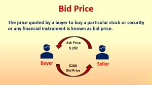

In algorithmic trading, the bid price is a critical concept, referring to the highest price a buyer is willing to pay for a particular asset at any given moment. This price plays a vital role in the execution of trades and the overall functioning of financial markets, as it helps determine the market's liquidity and depth. Understanding the bid price is essential for traders and financial analysts because it impacts the decision-making process involved in executing trades. By comprehending bid price dynamics, traders can develop more effective trading strategies, optimize entry and exit points, and enhance portfolio performance.

The purpose of this article is to provide readers with a comprehensive understanding of the bid price, especially in the context of modern algorithmic trading. We will explore how the bid price is utilized within algorithmic trading strategies, the differences and relationships between bid and ask prices, and the way bid prices can influence trading decisions and strategies. Readers will gain insights into the complexity of financial markets and the significance of bid price analysis in the development of successful trading algorithms. Additionally, the article will offer an overview of the tools and technologies available for analyzing bid prices, providing a robust framework for understanding their application in real-world trading scenarios.



## Table of Contents

## Understanding Bid Price

The bid price represents the highest price a buyer is willing to pay for a security in the marketplace. It serves as a critical parameter in understanding market dynamics as it directly reflects the demand for a specific asset. A precise understanding of the bid price allows traders and financial analysts to gauge market sentiment and make informed decisions.

In trading, the bid price is continually juxtaposed with the ask price, which signifies the lowest price a seller is willing to accept for the same security. This interaction forms the basis of what is known as the bid–ask spread. The spread is an essential indicator of market liquidity and efficiency. A narrow bid–ask spread suggests a liquid market with high trading activity, facilitating easier trades. In contrast, a wide spread is typically indicative of less liquidity, which might lead to increased transaction costs for traders.

Mathematically, the bid–ask spread is expressed as:

$$
\text{Bid-Ask Spread} = \text{Ask Price} - \text{Bid Price}
$$

The bid price plays a pivotal role in financial markets and trading for several reasons. It is used to determine the market's interest in an asset at any given moment, influencing the entry and [exit](/wiki/exit-strategy) points for traders. When investors analyze market conditions, they often observe changes in the bid price to predict future price movements. Furthermore, in the presence of multiple bidders, the highest bid price offers insights into the maximum value buyers assign to the security, which can trigger price changes and affect market trends.

Overall, understanding the bid price is fundamental for engaging successfully in trading. Its relationship with the ask price and the resulting bid–ask spread provide invaluable information about market conditions, ultimately assisting traders in developing and optimizing their trading strategies.

## Bid Price in Algorithmic Trading

Algorithmic trading is a trading approach that leverages computer algorithms to execute trades at optimal speeds and precision. These algorithms are built to automatically make trading decisions, execute orders, and manage portfolios based on pre-defined strategies and market conditions. In today's fast-paced financial markets, [algorithmic trading](/wiki/algorithmic-trading) has become indispensable due to its ability to process vast amounts of data and execute trades faster than human traders. It enhances market [liquidity](/wiki/liquidity-risk-premium), reduces transaction costs, and limits the impact of human emotions on trading decisions.

Bid price plays a pivotal role in algorithmic trading. It is the highest price that a buyer is willing to pay for an asset. Accurate determination and utilization of the bid price are crucial for designing effective algorithmic trading strategies. Algorithms continuously scan for bid prices across various exchanges or trading platforms to identify the best opportunities for buying assets. By analyzing bid data, algorithms can determine market trends and liquidity, thereby making informed trading decisions while minimizing the risk of adverse price movements.

One common algorithmic model that relies heavily on bid price is the market-making algorithm. Market makers provide liquidity to financial markets by continuously quoting bid and ask prices for a financial instrument. They profit from the spread, which is the difference between the bid and ask price. The algorithm calculates optimal bid prices based on market conditions, historical price data, and [order book](/wiki/order-book-trading-strategies) analysis. Consider the following Python example that illustrates a basic conceptual framework of a market-making algorithm:

```python
class MarketMaker:
    def __init__(self, initial_bid_price, spread):
        self.bid_price = initial_bid_price
        self.spread = spread

    def update_prices(self, market_data):
        # Update bid price based on market data
        self.bid_price = self.calculate_optimal_bid(market_data)

    def calculate_optimal_bid(self, market_data):
        # Implement price calculation logic here
        return market_data['current_price'] - self.spread / 2

    def place_orders(self):
        # Place buy orders at the bid price
        print(f"Placing buy order at bid price: {self.bid_price}")

# Example usage
market_maker = MarketMaker(initial_bid_price=100, spread=1)
market_data = {'current_price': 101}
market_maker.update_prices(market_data)
market_maker.place_orders()
```

In this example, the market maker sets an initial bid price and adjusts it based on the current market data using a simple strategy where the bid price is slightly lower than the current market price. Although simplistic, this example highlights how bid prices are dynamically adjusted by algorithms to efficiently execute trades.

In summary, bid prices are integral to algorithmic trading as they help automate and optimize trading activities. Algorithms use bid prices to determine market conditions, ensure liquidity, and achieve cost-effective trades. Through models like market-making, bid prices contribute to developing robust trading strategies that drive the efficiency and effectiveness of algorithmic trading systems.

## Impact of Bid Price on Trading Strategies

The bid price plays a pivotal role in shaping trading strategies, influencing decisions that traders make to optimize their positions. Understanding how bid price affects trading requires not only recognizing its function as the maximum price a buyer is prepared to pay but also considering the broader market implications.

The bid price can determine the timing of trade entries and exits. Traders aiming to buy at an ideal price frequently monitor the bid price to ensure they enter at the lowest possible point for profitability. Similarly, selling decisions may be influenced by anticipated changes in the bid price, where traders might hold off on selling if they expect an increase.

A classic trading strategy that effectively utilizes bid price is the market-making strategy. In this approach, market makers profit from the bid-ask spread by continuously buying at the bid price and selling at the ask price. Their goal is to provide liquidity to the market while capturing the spread. For example, if a stock has a bid price of $10 and an ask price of $10.05, a market maker would buy shares at $10 and immediately try to sell at $10.05, profiting $0.05 per share before costs. Success hinges on accurately predicting and reacting to fluctuations in the bid price to maintain profitability without exposing oneself to unacceptable levels of risk.

However, relying heavily on the bid price presents potential pitfalls. First, the market's dynamic nature means that bid prices can change rapidly, sometimes rendering real-time data obsolete faster than a trader can react. Secondly, the bid price only offers half of the market's sentiment picture—the ask price is equally crucial to gauge market supply and demand effectively. Overemphasis on bid price without adequate consideration of the ask price or broader market conditions could lead to poor trading decisions. Additionally, during periods of low liquidity or high [volatility](/wiki/volatility-trading-strategies), the bid-ask spread can widen significantly, making market-making strategies riskier and potentially less profitable due to widened spreads and slippage.

Thus, successful trading strategies incorporate bid price as one of many [factor](/wiki/factor-investing)s, ensuring that decisions are supported by comprehensive market analysis and other indicators. This balanced approach helps mitigate the risks associated with depending solely on bid price for trading decisions.

## Bidding War and Its Implications

A bidding war occurs when multiple buyers compete to purchase an asset or security, each incrementally increasing their bids to outdo the others. This competitive scenario is characterized by rapidly changing bid prices and heightened market activity. Bidding wars typically arise in markets with high demand but limited supply, such as during stock market booms or in commodities with fluctuating availability. They can also manifest in situations where assets are perceived to have a unique or strategic value, attracting intense interest from numerous parties.

The impact of bidding wars on bid price and market dynamics is significant. As buyers continually raise their bids, the bid price experiences upward pressure, potentially leading to inflated values. This escalation can narrow or even invert the bid-ask spread, the difference between what buyers are willing to pay (bid) and what sellers are asking (ask). A narrower spread often indicates high liquidity and can result in more rapid price movements, contributing to market volatility.

Real-world examples of bidding wars can be observed across various financial markets. In the stock market, Initial Public Offerings (IPOs) often see bidding wars, particularly for high-profile technology companies or firms with promising growth potential. During such events, the heightened competition can drive the stock price well above initial estimates. Similarly, in the commodities market, bidding wars can occur for precious metals like gold during times of economic uncertainty, as investors seek safe-haven assets.

These scenarios underscore the critical role of bid price dynamics in trading strategies. While bidding wars can offer opportunities for substantial short-term gains, they also [carry](/wiki/carry-trading) the risk of overvaluation and subsequent price corrections. Traders and analysts must therefore exercise caution, employing strategies that account for potential market reversals following such heightened interactions. Understanding the conditions and implications of bidding wars is essential for informed decision-making in today's fast-paced and competitive financial markets.

## Tools and Technologies for Analyzing Bid Price

In today's fast-paced financial markets, effectively analyzing bid prices is crucial for making informed trading decisions. Several tools and technologies have been developed to assist traders in tracking and analyzing bid prices on various trading platforms. These tools primarily aim to provide real-time data, improve trading efficiency, and enhance decision-making processes.

A popular category of trading software used for bid price analysis is algorithmic trading platforms. Systems such as MetaTrader, NinjaTrader, and TradingView integrate sophisticated algorithms that help traders follow bid price movements. These platforms not only offer real-time access to bid and ask prices but also provide advanced charting tools, indicators, and customizable dashboards. Through such features, traders can develop and backtest strategies that incorporate bid price dynamics, ensuring they capitalize on price discrepancies and fluctuations.

Another significant tool for analyzing bid price is FIX (Financial Information Exchange) Protocol-based trading systems. FIX protocol enhances communication between financial institutions by providing standardized real-time exchange of bid and ask price data. This ensures that traders have timely access to market data, which is critical for algorithmic and high-frequency trading strategies.

Advanced trading algorithms, such as market-making algorithms, heavily rely on bid price data. These algorithms continuously analyze bid prices to quote both buy and sell prices and earn a spread. Python, with libraries like NumPy and pandas, is often employed to develop custom algorithms for bid price analysis. Here's a simplistic example of Python code that can help track bid price movements:

```python
import pandas as pd

# Sample bid prices data
data = {'Time': ['09:00', '09:01', '09:02'],
        'Bid Price': [100.5, 101.0, 102.5]}

df = pd.DataFrame(data)
print(df)

def analyze_bid_price(prices):
    return prices.mean(), prices.max(), prices.min()

mean_price, max_price, min_price = analyze_bid_price(df['Bid Price'])
print(f"Average Bid Price: {mean_price}, Max Bid Price: {max_price}, Min Bid Price: {min_price}")
```

The integration of machine learning models into trading platforms also represents an advanced approach to bid price analysis. These models can predict future bid price movements based on historical data patterns, aiding traders in developing more proactive and profitable strategies.

The benefits of using these technologies are manifold. They provide higher accuracy in predicting market directions through real-time analysis of bid and ask data. Enhanced computational capabilities allow traders to execute trades at optimal prices, significantly reducing transaction costs. Moreover, by leveraging these technologies, traders can gain a competitive edge in rapidly evolving market conditions, making them indispensable tools for modern trading.

## Conclusion

The bid price is a critical component in algorithmic trading and broader market activities, serving as a cornerstone in price determination and trading strategy formulation. It represents the highest price that a buyer is willing to pay for an asset, forming one half of the bid-ask spread, which is vital for understanding market liquidity and pricing mechanics. Recognizing the nuances of bid price allows traders and financial analysts to develop more effective strategies, as it affects decision-making processes and trade executions. 

Algorithmic trading leverages this concept extensively, with algorithms using bid prices to execute trades efficiently, manage risk, and optimize profits. Market-making algorithms, for instance, rely on continually updating bid prices to maintain market liquidity and balance supply and demand. The centrality of bid price analysis is underscored by the emergence of bidding wars, which can dramatically alter market dynamics by increasing volatility and price movements, further highlighting its impact.

As trading technologies advance, the capacity to analyze bid price data becomes increasingly sophisticated. Tools and software designed for this task provide insights and enable traders to respond swiftly to market changes. With continuous innovations in [machine learning](/wiki/machine-learning) and [artificial intelligence](/wiki/ai-artificial-intelligence), the future of bid price analysis is promising, offering the potential for more precise market predictions and adaptive trading strategies. As financial markets evolve, understanding and leveraging the bid price will remain a pivotal element for success in algorithmic trading and beyond.

## References & Further Reading

[1]: Harris, L. (2003). ["Trading and Exchanges: Market Microstructure for Practitioners"](https://www.amazon.com/Trading-Exchanges-Market-Microstructure-Practitioners/dp/0195144708). Oxford University Press.

[2]: Madhavan, A. (2000). ["Market Microstructure: A Survey."](http://eecs.harvard.edu/~cat/cs/diss/paperlinks/madhavan-microstructure.pdf) The Review of Financial Studies, 13(2), 205-250.

[3]: Hasbrouck, J. (2007). ["Empirical Market Microstructure: The Institutions, Economics, and Econometrics of Securities Trading."](https://academic.oup.com/book/52241) Oxford University Press.

[4]: Duhigg, C. (2009). ["The Physics of a Bidding War."](https://books.google.com/books/about/The_Power_of_Habit.html?id=O1MInVXd_aoC) The New York Times Magazine.

[5]: Aldridge, I. (2013). ["High-Frequency Trading: A Practical Guide to Algorithmic Strategies and Trading Systems."](https://www.amazon.com/High-Frequency-Trading-Practical-Algorithmic-Strategies/dp/1118343506) Wiley Finance.

[6]: Narang, R. K. (2009). ["Inside the Black Box: The Simple Truth About Quantitative Trading."](https://onlinelibrary.wiley.com/doi/book/10.1002/9781118267738) Wiley Trading.