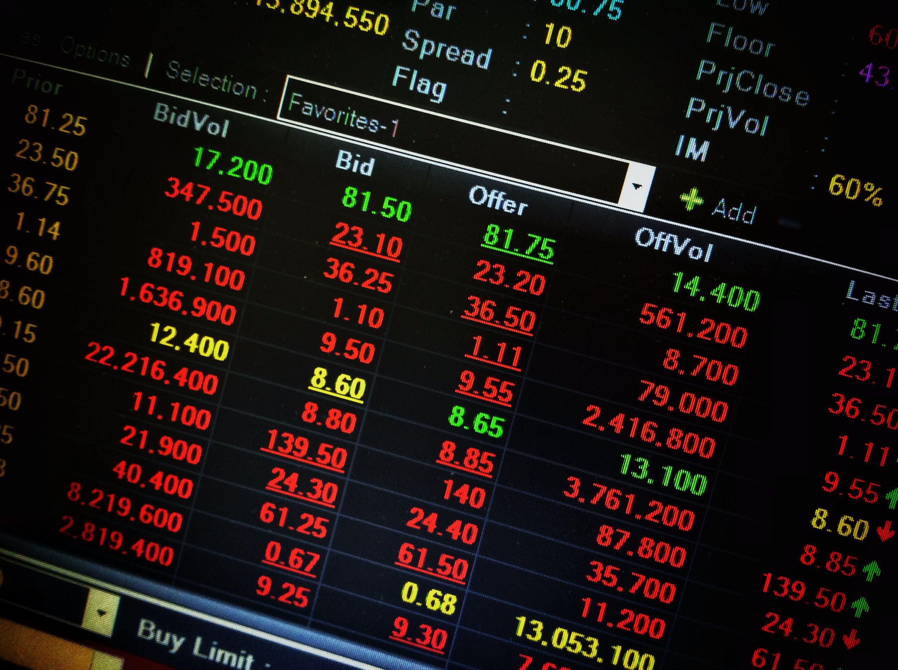

## Table of Contents

## What is a Bid Tick?

A Bid Tick is a term used in stock trading. It shows if the current bid price of a stock is higher or lower than the last bid price. Traders use Bid Ticks to understand the direction of the market.

If the Bid Tick is positive, it means the current bid price is higher than the last one. This can suggest that more people want to buy the stock, which might push the price up. If the Bid Tick is negative, it means the current bid price is lower. This might show that fewer people want to buy, which could push the price down.

## How does a Bid Tick work?

A Bid Tick works by comparing the current bid price of a stock to the previous bid price. The bid price is what buyers are willing to pay for a stock. If the current bid price is higher than the last one, the Bid Tick is positive. This means that buyers are willing to pay more than before, which can be a sign that the stock's price might go up. If the current bid price is lower than the last one, the Bid Tick is negative. This means buyers are willing to pay less, which can be a sign that the stock's price might go down.

Traders watch Bid Ticks to get a quick idea of the market's direction. A string of positive Bid Ticks might show that demand for the stock is growing, suggesting a bullish trend. On the other hand, a string of negative Bid Ticks might show that demand is dropping, suggesting a bearish trend. By keeping an eye on these ticks, traders can make better decisions about when to buy or sell stocks.

## What is the significance of a Bid Tick in trading?

A Bid Tick is important in trading because it helps traders see if the price of a stock is going up or down. It does this by showing if the current bid price is higher or lower than the last bid price. If the Bid Tick is positive, it means more people want to buy the stock at a higher price, which can make the stock's price go up. If the Bid Tick is negative, it means fewer people want to buy at the current price, which can make the stock's price go down.

Traders use Bid Ticks to make quick decisions. If they see a lot of positive Bid Ticks, they might think the stock's price will keep going up, so they might buy it. If they see a lot of negative Bid Ticks, they might think the price will keep going down, so they might sell it. By watching Bid Ticks, traders can get a sense of the market's direction and adjust their trading strategies accordingly.

## How is a Bid Tick different from an Ask Tick?

A Bid Tick and an Ask Tick are both used in trading to show how prices are changing, but they focus on different things. A Bid Tick looks at the bid price, which is the highest price that someone is willing to pay for a stock. If the current bid price is higher than the last one, the Bid Tick is positive, meaning more people want to buy at a higher price. If it's lower, the Bid Tick is negative, showing less interest in buying at the current price.

An Ask Tick, on the other hand, looks at the ask price, which is the lowest price that someone is willing to sell a stock for. If the current ask price is higher than the last one, the Ask Tick is positive, meaning sellers want more money for their stock. If it's lower, the Ask Tick is negative, showing sellers are willing to accept less money. By watching both Bid Ticks and Ask Ticks, traders can get a fuller picture of what's happening in the market and make better trading decisions.

## What is the Bid Tick Index?

The Bid Tick Index is a tool used in trading to show how many stocks are going up in price compared to how many are going down. It does this by looking at the Bid Ticks of all stocks in a market. If more stocks have positive Bid Ticks than negative ones, the Bid Tick Index will be positive, meaning more stocks are going up in price. If more stocks have negative Bid Ticks, the index will be negative, showing that more stocks are going down in price.

Traders use the Bid Tick Index to get a quick idea of the overall market direction. If the index is positive, it suggests that the market is moving up, which might be a good time to buy stocks. If the index is negative, it suggests the market is moving down, which might be a good time to sell. By keeping an eye on the Bid Tick Index, traders can make better decisions about their trades based on the general mood of the market.

## How is the Bid Tick Index calculated?

The Bid Tick Index is calculated by looking at the Bid Ticks of all the stocks in a market. A Bid Tick shows if the current bid price of a stock is higher or lower than the last bid price. If more stocks have a higher bid price than before, the Bid Tick Index will be positive. If more stocks have a lower bid price, the index will be negative.

To find the Bid Tick Index, you count up all the stocks with positive Bid Ticks and all the stocks with negative Bid Ticks. Then, you subtract the number of stocks with negative Bid Ticks from the number of stocks with positive Bid Ticks. The result is the Bid Tick Index, which tells you if more stocks are going up or down in price.

## What does a positive Bid Tick indicate?

A positive Bid Tick means that the current bid price for a stock is higher than it was before. This shows that buyers are willing to pay more for the stock now than they were in the last trade. When this happens, it can be a sign that more people want to buy the stock, which might make its price go up.

Traders look at positive Bid Ticks to see if the market is moving in a good direction. If they see a lot of positive Bid Ticks, they might think it's a good time to buy the stock because its price could keep going up. This helps them make quick decisions about when to buy or sell.

## What does a negative Bid Tick indicate?

A negative Bid Tick means that the current bid price for a stock is lower than it was in the last trade. This shows that buyers are willing to pay less for the stock now than before. When this happens, it can be a sign that fewer people want to buy the stock, which might make its price go down.

Traders watch for negative Bid Ticks to understand if the market is moving in a bad direction. If they see a lot of negative Bid Ticks, they might think it's a good time to sell the stock because its price could keep going down. This helps them make quick decisions about when to buy or sell.

## How can traders use Bid Tick data to inform their strategies?

Traders can use Bid Tick data to understand if the price of a stock might go up or down. By watching if the Bid Ticks are mostly positive or negative, traders can see if more people want to buy the stock or if they are losing interest. If they see a lot of positive Bid Ticks, it means buyers are willing to pay more, so the stock's price might go up. This could be a good time to buy the stock. On the other hand, if they see a lot of negative Bid Ticks, it means buyers are willing to pay less, so the stock's price might go down. This could be a good time to sell the stock.

By keeping an eye on the Bid Tick Index, which shows the overall direction of the market, traders can make even better decisions. If the Bid Tick Index is positive, it means more stocks are going up in price, which might be a good sign for the whole market. Traders might decide to buy more stocks or hold onto what they have. If the Bid Tick Index is negative, it means more stocks are going down in price, which might be a warning sign. Traders might decide to sell their stocks or wait for a better time to buy. Using Bid Tick data helps traders stay on top of market trends and make smart choices.

## What are the limitations of using Bid Tick as a trading indicator?

Using Bid Tick as a trading indicator has some limitations. It only shows if the current bid price is higher or lower than the last one, but it doesn't tell you why the price changed. There could be many reasons for a change in the bid price, like news about the company or changes in the economy, but the Bid Tick doesn't give you that information. So, it can be hard to know if a positive or negative Bid Tick is a sign of a long-term trend or just a short-term change.

Another limitation is that Bid Tick can be misleading if you only look at it by itself. For example, a stock might have a positive Bid Tick, but if the overall market is going down, the stock's price might still go down too. Traders need to use Bid Tick along with other indicators and market information to get a full picture. Relying too much on Bid Tick without considering other factors can lead to bad trading decisions.

## How does the Bid Tick relate to market sentiment?

The Bid Tick gives traders a quick way to see if people feel good or bad about a stock. When the Bid Tick is positive, it means more people want to buy the stock at a higher price. This can show that people feel good about the stock and think its price will go up. If the Bid Tick is negative, it means fewer people want to buy at the current price, showing that people might feel bad about the stock and think its price will go down.

But, the Bid Tick only shows a small part of how people feel about the stock. It doesn't tell you why people feel that way. There could be news or other things happening that affect how people think about the stock. So, while the Bid Tick can give a quick idea of market sentiment, traders need to look at other things too to really understand how people feel about the stock.

## What advanced techniques can be used to analyze Bid Tick data for expert trading?

Expert traders can use advanced techniques like combining Bid Tick data with other indicators to get a better understanding of the market. They might look at the Bid Tick along with the Ask Tick to see both the buying and selling sides of the market. By doing this, they can see if the market is balanced or if one side is stronger. They might also use technical analysis tools, like moving averages or [momentum](/wiki/momentum) indicators, to see if the Bid Tick data fits with other signs of where the market is going. This helps them make more accurate predictions about what will happen next with the stock's price.

Another technique is to use [algorithmic trading](/wiki/algorithmic-trading) strategies that include Bid Tick data. These strategies use computers to quickly analyze Bid Ticks and other data points to make trading decisions. For example, an algorithm might be set up to buy a stock when it sees a certain number of positive Bid Ticks in a row, or to sell when it sees a lot of negative Bid Ticks. This can help traders take advantage of short-term price movements that they might miss if they were trading manually. By using these advanced techniques, expert traders can use Bid Tick data more effectively to improve their trading results.

## References & Further Reading

[1]: Bergstra, J., Bardenet, R., Bengio, Y., & Kégl, B. (2011). ["Algorithms for Hyper-Parameter Optimization."](https://proceedings.neurips.cc/paper/2011/file/86e8f7ab32cfd12577bc2619bc635690-Paper.pdf) Advances in Neural Information Processing Systems 24.

[2]: ["Advances in Financial Machine Learning"](https://www.amazon.com/Advances-Financial-Machine-Learning-Marcos/dp/1119482089) by Marcos Lopez de Prado

[3]: ["Evidence-Based Technical Analysis: Applying the Scientific Method and Statistical Inference to Trading Signals"](https://www.amazon.com/Evidence-Based-Technical-Analysis-Scientific-Statistical/dp/0470008741) by David Aronson

[4]: ["Machine Learning for Algorithmic Trading"](https://github.com/stefan-jansen/machine-learning-for-trading) by Stefan Jansen

[5]: ["Quantitative Trading: How to Build Your Own Algorithmic Trading Business"](https://www.amazon.com/Quantitative-Trading-Build-Algorithmic-Business/dp/1119800064) by Ernest P. Chan