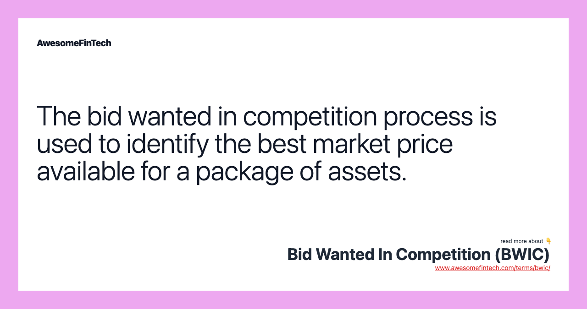

## Table of Contents

## What is a Bid Wanted in Competition (BWIC)?

A Bid Wanted in Competition (BWIC) is a process used in the financial markets where a seller of securities, like bonds, asks for bids from multiple buyers. The seller wants to find the best price for their securities by creating a competition among buyers. This is common in the bond market, where large investors or institutions might want to sell a big amount of bonds.

In a BWIC, the seller sends out details about the securities they want to sell to potential buyers. These buyers then look at the information and decide how much they are willing to pay. They send their bids back to the seller. The seller then chooses the highest bid, making sure they get the best possible price for their securities. This method helps make sure the sale is fair and open, giving the seller the best deal.

## How does the BWIC process work?

The BWIC process starts when a seller wants to sell securities like bonds. The seller sends out information about what they want to sell to different buyers. These buyers could be banks, investment firms, or other big investors. The information includes details like the type of securities, how many they are, and any other important facts. The buyers then look at this information and think about how much they want to pay for the securities.

After looking at the information, the buyers send their bids back to the seller. Each buyer tries to offer a good price to win the securities. The seller then looks at all the bids and picks the highest one. This way, the seller gets the best price for their securities. The whole process is meant to be fair and open, making sure the seller gets the best deal possible.

## Who typically initiates a BWIC?

A BWIC is usually started by someone who wants to sell a bunch of securities, like bonds. This person could be a big investor, a bank, or a company that has a lot of bonds and wants to sell them. They might want to sell because they need money, or because they think the price of the bonds will go down soon.

When they decide to start a BWIC, the seller sends out information about the bonds to different buyers. These buyers could be other banks, investment firms, or anyone else who might want to buy the bonds. The seller does this to make sure they can get the best price by letting lots of people compete to buy the bonds.

## What types of assets are commonly involved in BWICs?

BWICs are mostly used for selling bonds. Bonds are like IOUs that companies or governments give out to borrow money. They promise to pay back the money with interest over time. When someone wants to sell a lot of bonds at once, they use a BWIC to get the best price. This is common in the bond market because selling a big amount of bonds can be hard, and a BWIC helps make sure the seller gets a good deal.

Besides bonds, other types of securities can also be sold through a BWIC. These can include things like mortgage-backed securities, which are bonds made up of home loans, or asset-backed securities, which are bonds made from other types of loans or debts. Using a BWIC for these securities works the same way as with bonds. The seller sends out information about what they want to sell, and buyers compete to offer the best price. This helps the seller get the most money for their securities.

## What are the benefits of using a BWIC for sellers?

Using a BWIC helps sellers get the best price for their securities. When a seller wants to sell a lot of bonds or other securities, they can ask many buyers to compete against each other. This competition makes buyers offer higher prices to win the securities. So, the seller can pick the highest bid and get more money than if they sold to just one buyer.

Another benefit is that BWICs make the selling process fair and open. Instead of selling to just one buyer, the seller lets everyone know about the securities and gives them a chance to bid. This openness can make buyers trust the process more and might even bring in more buyers. This way, the seller can be sure they are getting a good deal and that the sale is done in a way that is clear to everyone.

## What are the potential risks for buyers participating in a BWIC?

When buyers join a BWIC, they take a chance that they might not win the securities they want. Because many buyers are competing, there's a good chance someone else will offer a higher price. If a buyer really wants the securities, they might have to bid more than they planned, which could mean spending more money than they wanted.

Another risk is that the securities might not be worth as much as the buyer thought. They might find out after buying that the bonds or other securities have problems, like the company that issued them is in trouble. This can make the securities lose value, and the buyer could lose money. So, it's important for buyers to do their homework and check everything carefully before they bid.

## How does a BWIC differ from a traditional auction?

A BWIC and a traditional auction both involve selling something to the highest bidder, but they work a bit differently. In a BWIC, the seller is usually trying to sell securities like bonds. The seller sends information about the securities to a group of buyers and asks them to compete for the best price. This is more focused and often used in the financial world where selling a large amount of securities needs to be done carefully to get the best deal.

A traditional auction, on the other hand, can be used to sell all sorts of things, not just securities. It can be open to the public, where anyone can come and bid. The auction might happen in person, like at an auction house, or online. The big difference is that a BWIC is more private and targeted, while a traditional auction can be more open and might attract a wider range of bidders.

## What role do investment banks play in the BWIC process?

Investment banks help a lot in the BWIC process. They act like helpers for the seller. The seller, who might be another bank or a big investor, gives the investment bank the job of selling their securities, like bonds. The investment bank then sends out information about the securities to other buyers. These buyers could be other banks, investment firms, or big investors. The investment bank makes sure the information is clear and that the buyers understand what they are bidding on.

The investment bank also collects all the bids from the buyers. They look at all the bids and help the seller pick the best one. This way, the seller can get the highest price for their securities. The investment bank makes the whole process smooth and fair. They also make sure that everything is done the right way, following the rules of the financial world. This helps the seller trust that they are getting a good deal.

## Can you explain the pricing mechanism in a BWIC?

In a BWIC, the pricing works by letting buyers compete to offer the highest price for the securities. The seller sends out details about the bonds or other securities they want to sell to different buyers. These buyers then look at the information and decide how much they are willing to pay. Each buyer sends back their bid, trying to offer a good price to win the securities. The seller then looks at all the bids and chooses the highest one. This way, the seller gets the best price for their securities because the buyers are competing against each other.

The whole idea of the pricing in a BWIC is to make sure the seller gets a fair and good deal. By letting lots of buyers know about the securities and giving them a chance to bid, the seller can be sure they are getting the highest price possible. This is different from just selling to one buyer, where the seller might not know if they are getting a good price. The competition among buyers in a BWIC helps the seller feel confident that they are getting the best value for their securities.

## How has technology impacted the BWIC process?

Technology has made the BWIC process a lot easier and faster. Before, sellers had to send out information about the securities they wanted to sell by mail or fax, which took a long time. Now, they can use emails and special online platforms to share this information quickly with lots of buyers all over the world. This means more people can see the securities and bid on them, which can help the seller get a better price.

Also, technology helps make the BWIC process more clear and fair. With online platforms, everyone can see the bids as they come in, and it's easier to keep track of everything. This openness can make buyers trust the process more and might even bring in more buyers. Plus, technology can help with checking the securities to make sure they are worth what the seller says they are. This can make the whole process smoother and more reliable for everyone involved.

## What are some best practices for buyers in a BWIC?

When taking part in a BWIC, buyers should do their homework first. They need to check the details of the securities carefully. This means looking at things like the price, how much the securities are worth, and any risks. Buyers should also think about how much they want to spend and not bid more than they can afford. It's good to set a maximum price they are willing to pay before they start bidding.

Buyers should also keep an eye on what other people are bidding. This can help them decide if they need to offer more to win the securities. It's important to stay calm and not get too excited during the bidding. Sometimes, waiting a bit before making a final bid can help them get a better deal. By being careful and smart, buyers can make sure they are getting a good price for the securities they want.

## Can you provide real-world examples of successful BWIC transactions?

One example of a successful BWIC transaction happened when a big bank wanted to sell a lot of bonds. They used a BWIC to find the best price. The bank sent out information about the bonds to different buyers, like other banks and investment firms. Many buyers looked at the information and sent back their bids. The bank picked the highest bid and sold the bonds for a good price. This helped the bank get more money than if they had sold the bonds to just one buyer.

Another example is when a company wanted to sell some mortgage-backed securities. They used a BWIC to make sure they got the best deal. The company shared details about the securities with a bunch of buyers. After looking at the information, the buyers sent in their bids. The company chose the highest bid and sold the securities at a great price. This showed how using a BWIC can help sellers get the most money for their securities.

## References & Further Reading

[1]: Johnson, B. (2009). ["Algorithmic Trading and DMA: An Introduction to Direct Access Trading Strategies"](https://archive.org/details/algorithmictradi0000john). 4Myeloma Press.

[2]: Broadie, M. (2010). ["Modern Portfolio Theory and Investment Analysis"](https://archive.org/details/modernportfoliot0000unse_j1v7_8thed). Wiley.

[3]: Lopez de Prado, M. (2018). ["Advances in Financial Machine Learning"](https://www.amazon.com/Advances-Financial-Machine-Learning-Marcos/dp/1119482089). Wiley.

[4]: Bank for International Settlements. (2018). ["Artificial intelligence and machine learning in financial services: Market developments and financial stability implications."](https://www.bis.org/fsi/publ/insights35.pdf).

[5]: World Economic Forum. (2018). ["The New Physics of Financial Services: Understanding how artificial intelligence is transforming the financial ecosystem."](https://www.weforum.org/publications/the-new-physics-of-financial-services-how-artificial-intelligence-is-transforming-the-financial-ecosystem/).

[6]: Chan, E. P. (2008). ["Quantitative Trading: How to Build Your Own Algorithmic Trading Business"](https://github.com/ftvision/quant_trading_echan_book). Wiley.

[7]: Aronson, D. R. (2007). ["Evidence-Based Technical Analysis: Applying the Scientific Method and Statistical Inference to Trading Signals"](https://onlinelibrary.wiley.com/doi/book/10.1002/9781118268315). Wiley.

[8]: Jansen, S. (2020). ["Machine Learning for Algorithmic Trading: Predictive models to extract signals from market and alternative data for systematic trading strategies with Python"](https://www.amazon.com/Machine-Learning-Algorithmic-Trading-alternative/dp/1839217715). Packt Publishing.