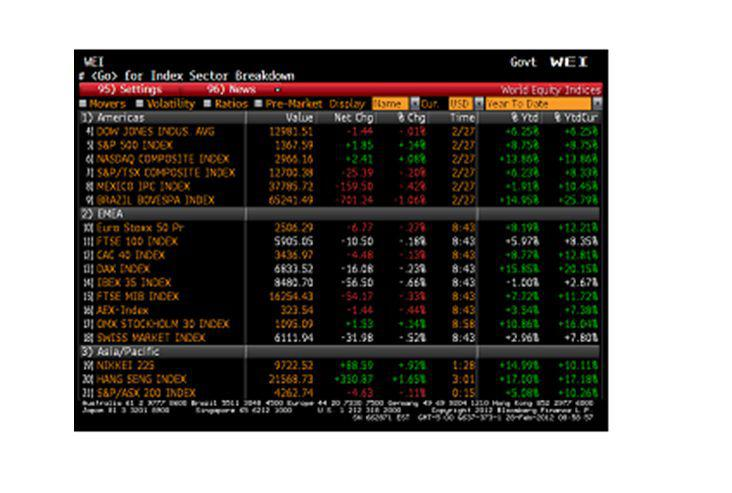

Auction strategies represent a captivating domain where bidding techniques such as the Bid Whacker and algorithmic trading serve as essential tools for gaining a competitive edge. These strategies enable participants to efficiently navigate auctions, maximizing their chances of securing desirable items or deals. By mastering these tactics, individuals and organizations can optimize their bidding performance and achieve superior outcomes.

One of the critical elements in auction strategies is timing. The ability to accurately assess when to place a bid can substantially impact the success of an auction. Competent bidders understand how to leverage the timing of their bids to exert influence over their competitors, often leading to more favorable results. Alongside timing, extensive research forms the backbone of effective auction strategies. A deep understanding of item values, market trends, and competitor behavior allows for more informed decision-making, essential for formulating effective bidding plans.



Psychological factors play a significant role in auction dynamics, influencing bidder behavior and decision-making processes. Recognizing and countering the psychological strategies employed by competitors, such as intimidation or feigned disinterest, can provide a strategic advantage. A successful bidding approach often employs a mix of confidence, patience, and the ability to read the auction environment and participants effectively.

Strategic thinking is fundamental to winning auctions. Participants must account for both the tangible aspects of the auction, such as item valuation and bid increments, and the intangible dynamics, including competitor behavior and psychological maneuvering. By considering all these factors, bidders can craft personalized strategies that increase the likelihood of auction success.

This guide aims to elucidate the complexities of auction strategies, focusing on efficient techniques like Bid Whacker and algorithmic trading. Understanding these approaches not only demystifies the bidding process but also empowers participants to refine their tactics, ensuring they are well-prepared to face the challenges of competitive auction environments. Through the exploration of various strategies outlined in this guide, participants will be equipped with the knowledge necessary to excel in auctions.

## Table of Contents

## Understanding Auction Dynamics

Auctions serve as complex marketplaces where various elements, including strategies, timing, and psychological factors, interplay to influence the outcomes. These dynamics are pivotal in formulating a successful bidding strategy. Auctions can be categorized by format, such as English auctions, Dutch auctions, sealed-bid auctions, and Vickrey auctions, each offering unique strategic considerations.

In an English auction, bidders openly place sequentially higher bids, often leading to competitive bidding wars. The primary strategy involves careful timing to avoid showing too much interest too early, thus escalating prices. In contrast, Dutch auctions, where prices descend until a bid is accepted, reward swift decision-making and often require an acute understanding of market values to prevent overpaying.

Timing is a critical [factor](/wiki/factor-investing) across all auction formats. Strategically placing bids as deadlines approach can influence perceptions of value and induce pressure on other participants. This concept aligns with the "endowment effect," where bidders may assign higher value to an item as they feel closer to acquiring it, especially as the auction nears conclusion. Additionally, the "winner’s curse" is a psychological phenomenon where the winning bid in common value auctions often exceeds the item's intrinsic value. Understanding these psychological traps enables better decision-making by calibrating bids within calculated limits.

Effective auction strategies must account for these dynamics. Analyzing competitors, understanding auction rules, and leveraging historical data can inform the timing and extent of bids. Game theory provides a mathematical framework to anticipate competitor behavior and strategize accordingly, considering moves that maximize expected value while minimizing risks.

Auction dynamics encapsulate a multi-dimensional analysis of game theory, psychology, and strategic timing, forming the foundation of effective bidding strategies. Adaptation to specific auction formats, coupled with an understanding of time-based and psychological influences, enhances the probability of a successful auction outcome.

## Exploring Bid Whacker Techniques

The Bid Whacker strategy represents a distinctive approach within auction tactics, characterized by its unconventional practice of selling below the current bid price. This strategy distinguishes itself from traditional bidding techniques, which typically focus on incremental bidding to outbid competitors. Instead, Bid Whackers aggressively undercut the prevailing bid, aiming to quickly dispose of assets or proprietary items. This can result in rapid transactions but may yield lower returns than standard tactics.

The efficacy of the Bid Whacker strategy is heavily influenced by market conditions. It becomes a viable strategy in volatile markets where rapid shifts in demand and supply can be expected. In such environments, the potential for price fluctuations can encourage sellers to adopt quicker transaction strategies, often prioritizing speed over maximum profit. Furthermore, Bid Whacking can be advantageous during economic downturns, where sellers might be driven by [liquidity](/wiki/liquidity-risk-premium) needs and are therefore willing to accept lower offers to secure immediate cash flow.

Despite its potential advantages, Bid Whacking comes with inherent risks. The primary risk involves selling assets at prices below market value, which can lead to diminished earnings compared to conventional auction methods. The strategy requires precise market analysis and prediction to avoid substantial losses. Additionally, there is the risk of reputation damage if buyers perceive frequent use of Bid Whacking as a sign of asset desperation or quality issues.

Examples of successful Bid Whacker strategies are often seen in financial markets, particularly in the trading of distressed securities or during liquidation events. Companies or individuals needing swift liquidation might leverage the strategy to ensure asset turnover, even if that means accepting lower-than-anticipated bids.

In conclusion, while the Bid Whacker strategy can facilitate swift transactions within certain auction environments, it demands rigorous market analysis and a willingness to prioritize transaction speed over optimal pricing. This approach, though risky, can be effective under specific market conditions or financial constraints, providing a unique alternative to traditional bidding strategies.

## Algorithmic Trading in Auctions

Algorithmic trading represents a significant shift in how auctions are conducted, leveraging advanced technologies to automate and enhance bidding processes. This technique utilizes complex algorithms to make trading decisions, execute bids, and manage auction strategies, often with minimal human intervention. The fundamental premise of [algorithmic trading](/wiki/algorithmic-trading) is to use a set of predefined rules or instructions—such as timing, price, or [volume](/wiki/volume-trading-strategy)—to execute trades at optimal conditions.

One of the primary benefits of adopting algorithms in auctions is the increased efficiency they offer. Algorithms can process vast amounts of data quickly, allowing for real-time analysis and execution of bids. This capability not only speeds up the bidding process but also reduces the likelihood of human error, providing a significant edge in competitive auctions. By automating the execution of trades, participants can respond to market changes with greater agility and precision.

The technology underpinning algorithmic trading is sophisticated, blending elements of quantitative analysis, computer science, and financial theory. At its core, algorithmic trading relies on high-frequency trading ([HFT](/wiki/high-frequency-trading-strategies)) systems and advanced computational models. These systems can analyze multiple market variables simultaneously, enabling traders to identify patterns and potential opportunities that might be overlooked by manual processes.

Artificial intelligence (AI) and [machine learning](/wiki/machine-learning) (ML) are becoming increasingly integral to algorithmic trading in auctions. Machine learning models, for instance, can be trained to predict market movements based on historical data, improving the accuracy and efficiency of bidding strategies. AI techniques can adapt to new information and evolving market conditions, enabling more dynamic and informed decision-making processes. This adaptability makes AI-driven algorithms particularly valuable in volatile auction markets where conditions can change rapidly.

However, the rise of algorithmic trading is not without its challenges, particularly concerning ethical and regulatory considerations. The speed and complexity of these systems can lead to issues such as market manipulation, where algorithms are used to artificially influence prices. Additionally, the lack of transparency in algorithmic decisions raises concerns about accountability and fairness in the auction process. Regulators are increasingly scrutinizing algorithmic trading practices to ensure they align with broader market ethics and do not undermine the integrity of auctions.

Overall, algorithmic trading is transforming the landscape of auctions, providing participants with tools to optimize their strategies and improve their chances of success. However, as this technology continues to evolve, balancing innovation with ethical responsibility will be crucial to maintaining fair and transparent auction markets.

## Combining Strategies for Optimal Results

The integration of Bid Whacker techniques with algorithmic trading offers a sophisticated approach to achieving optimal bidding outcomes in diverse auction environments. The Bid Whacker strategy, characterized by its unconventional approach of executing sales below the bid price, complements algorithmic trading techniques, which utilize advanced computational algorithms to make instantaneous decisions. This hybrid approach leverages the strengths of both methods to navigate the complexities and dynamics of auctions effectively.

### Tailoring Strategies to Auction Environments

The successful combination of Bid Whacker strategies with algorithmic trading must be adapted to fit various auction environments. For instance, in aggressive, fast-paced auctions, algorithms can quickly analyze patterns and market conditions, deploying Bid Whacker tactics when they spot opportunities to sell assets profitably below the bid price due to expected market rebounds. Conversely, in less volatile markets, a slower, more calculated approach may be employed, utilizing data-driven insights to refine the timing and conditions for implementing Bid Whacker strategies.

### Case Studies of Hybrid Approaches

There are numerous instances where the integration of these strategies has led to successful outcomes. In financial markets, trading companies have implemented algorithmic systems that dynamically adjust Bid Whacker techniques based on real-time data analysis, leading to competitive advantages. These companies often deploy algorithms to identify undervalued assets, executing trades at strategic moments to exploit short-term market inefficiencies. This approach has been documented in financial literature, showcasing its efficacy in increasing profit margins while minimizing exposure to risk.

### Real-Time Strategy Adjustment

The ability to adjust strategies in real-time is crucial for handling auction progressions effectively. Algorithms can be programmed to continuously monitor market indicators and competitor behaviors, making split-second decisions that optimize the use of Bid Whacker strategies. Algorithms may also utilize machine learning to predict market movements and adjust bidding tactics accordingly. A simple Python script using machine learning libraries such as TensorFlow or Scikit-learn could be employed for forecasting price fluctuations:

```python
from sklearn.linear_model import LinearRegression
import numpy as np

# Sample data: previous auction closing prices and resulting final bid
closing_prices = np.array([[100], [102], [101], [105], [107]]) 
final_bids = np.array([102, 103, 105, 108, 110])

# Model training
model = LinearRegression()
model.fit(closing_prices, final_bids)

# Predict final bid for a new closing price
new_closing_price = np.array([[104]])
predicted_final_bid = model.predict(new_closing_price)
```

In this scenario, the model could predict the likely final bid at any given closing price, allowing traders to adjust bidding strategies dynamically.

### Continuous Learning and Adaptation

The integration of Bid Whacker techniques with algorithmic trading necessitates continuous learning and adaptation. As market conditions evolve and new data becomes available, strategies must be reevaluated and adjusted. This iterative process ensures that traders remain competitive and can capitalize on emerging trends and opportunities. Moreover, leveraging data analytics tools and maintaining an agile mindset in strategy formulation is essential for staying ahead in competitive auction markets.

In summary, the combination of Bid Whacker strategies with algorithmic trading presents a powerful approach for enhancing bidding performance. Tailoring these strategies to specific auction environments, learning from real-time data and past experiences, and maintaining an adaptive mindset are pivotal for achieving superior outcomes.

## Tips for Thriving in Competitive Auction Markets

Preparing effectively for competitive auction markets requires strategic foresight and a thorough understanding of market dynamics. A critical starting point is conducting comprehensive research and data gathering. This involves analyzing historical auction data, understanding the market trends, and knowing the behaviors of potential competitors. Access to accurate data allows bidders to make informed decisions, assess the fair value of items, and anticipate potential price fluctuations.

Setting realistic goals and being aware of one's financial limits is paramount. It's crucial to determine a maximum bid before engaging in the auction to avoid overspending. This can be influenced by budget constraints, the item's strategic value, and the results of pre-auction analysis. Discipline in adhering to set financial limits ensures that bidders do not fall prey to the so-called "winner's curse," where winning an auction comes at a cost well above the item's intrinsic value.

Outsmarting competitors demands strategic and well-timed bids. Timing is essential – late-stage bidding, or "sniping," can be a useful tactic in some auction formats to prevent competitors from reacting to your bid. Additionally, understanding auction patterns, such as peak bidding times and competitor strategies, can inform the decision on when to place a bid. Staying unpredictable can also disrupt competitors' strategies.

Learning from past auction experiences is key to refining future strategies. Keeping a detailed record of past auctions, including pricing trends and competitor behaviors, can serve as a valuable reference. Analyzing these records helps identify which strategies were successful and where improvements are needed. Engaging in post-auction assessments allows bidders to continuously adapt and improve their approaches.

Incorporating these tips can significantly increase the chances of success in competitive auctions, equipping bidders with the skills needed to navigate complex auction environments effectively.

## References & Further Reading

[1]: Bergstra, J., Bardenet, R., Bengio, Y., & Kégl, B. (2011). ["Algorithms for Hyper-Parameter Optimization."](https://dl.acm.org/doi/10.5555/2986459.2986743) Advances in Neural Information Processing Systems 24.

[2]: ["Advances in Financial Machine Learning"](https://www.amazon.com/Advances-Financial-Machine-Learning-Marcos/dp/1119482089) by Marcos Lopez de Prado

[3]: Osborne, M. J. (2004). ["An Introduction to Game Theory."](https://mathematicalolympiads.files.wordpress.com/2012/08/martin_j-_osborne-an_introduction_to_game_theory-oxford_university_press_usa2003.pdf) Oxford University Press.

[4]: ["Evidence-Based Technical Analysis: Applying the Scientific Method and Statistical Inference to Trading Signals"](https://www.amazon.com/Evidence-Based-Technical-Analysis-Scientific-Statistical/dp/0470008741) by David Aronson

[5]: ["Machine Learning for Algorithmic Trading"](https://github.com/stefan-jansen/machine-learning-for-trading) by Stefan Jansen

[6]: Parsons, J. E., Polychronopoulos, A., & Yang, J. (2015). ["Market Behavior and Bid Price Formation in Standard Procurement Auctions: A Review of the Literature."](https://pubs.aeaweb.org/doi/pdfplus/10.1257/jel.20141203) Journal of Economic Literature, 53(1), 31-86.

[7]: ["Quantitative Trading: How to Build Your Own Algorithmic Trading Business"](https://www.amazon.com/Quantitative-Trading-Build-Algorithmic-Business/dp/1119800064) by Ernest P. Chan