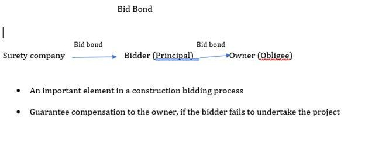

In today's dynamic financial markets, investment strategies are constantly evolving to leverage technological advancements and market mechanisms. With technological innovations such as algorithmic trading, the landscape of how investments are executed has drastically transformed. Algorithmic trading employs sophisticated algorithms to automate trading decisions, enabling rapid execution that surpasses human capabilities. This speed and efficiency have added a technological edge to financial markets, changing the traditional concepts of bidding and price determination.

The process of bidding up securities is an essential concept that illustrates the impact of these technological and market changes on investment activities. Bidding up refers to the act of increasing the offer price for a security, often occurring in markets experiencing upward momentum. This practice can result in higher market prices and reflects investor sentiment and confidence.



Algorithmic trading, in particular, has significantly altered the bidding processes by providing speed and precision. It reduces manual errors and enables traders to capitalize on market opportunities more effectively. The growing reliance on such technology indicates a shift towards more data-driven decision-making in trading. Consequently, understanding the interplay between these elements is vital for investors aiming to navigate and thrive within this complex trading environment.

Investors must grasp these concepts to effectively manage risks and seize opportunities in today's financial landscape. By understanding how bidding up influences market prices and acknowledging the role of algorithmic trading, investors can develop strategies that align with modern market dynamics, ensuring they are well-positioned in an ever-changing environment.

## Table of Contents

## Understanding Bidding Up Securities

Bidding up in securities markets is a strategic action where investors raise the price they are willing to pay for a particular security. This approach is most commonly seen in rising markets, where the demand for assets drives investor behavior. The primary tool for executing this strategy is the limit order, which allows investors to specify the maximum price they are prepared to pay. By employing limit orders, investors aim to secure desired securities without exceeding their budget, thus preventing themselves from being priced out during periods of market momentum.

In rising markets, the use of bidding up is advantageous as it helps investors secure trades that might otherwise be elusive if prices surge unexpectedly. For instance, if an investor places a limit order to purchase stock at $100 but the market price rises to $105, their order remains unfulfilled unless they increase their bid. By adjusting their bid upward, they maintain a competitive stance, increasing their chances of acquiring the stock before prices climb even higher.

However, the widespread application of this strategy can have broader market implications. As more investors engage in bidding up, the aggregate effect is an upward pressure on market prices. This phenomenon is particularly evident during heightened economic activities or anticipated events that boost investor confidence, such as presidential elections or major policy announcements. The collective expectation of favorable outcomes can trigger a wave of increased bids, thereby escalating the market prices of securities involved.

To illustrate, imagine a scenario before a presidential election when investors anticipate policies that are perceived as beneficial to certain industries. This expectation can lead to a surge in bidding activities for stocks within those sectors, causing prices to rise as investor confidence increases. As more participants raise their bids in competition, the market price naturally escalates, demonstrating how individual bidding strategies can influence broader market trends.

While bidding up serves as a valuable tool for investors aiming to secure their desired positions in dynamic markets, it also highlights the intricate balance between individual strategies and market-wide repercussions. The understanding of this interplay is crucial for investors seeking to navigate and capitalize on the complexities inherent in contemporary financial markets.

## Financial Mechanisms in Bidding Processes

Various financial mechanisms significantly influence the bidding process in securities markets, with auction models and sealed bids being two prevalent methods. Auction bids, commonly used in art, real estate, and commodity markets, involve multiple participants actively raising their bids to acquire a desired asset. This process creates a competitive environment that can drive prices upward, thus accurately reflecting market demand and supply dynamics. The auction model ensures that the asset is allocated to the bidder who values it the most, effectively determining the optimal price through open competition.

Sealed bids, on the other hand, are predominantly utilized in government contracts and corporate tenders. In this method, each bidder submits their offer confidentially without knowing the bids of their competitors. The highest bid, or sometimes the most cost-effective depending on the criteria set forth by the tendering entity, wins the bid. This process aims to eliminate bias and provides fairness in competitive bidding since bidders cannot influence each other's offers.

These mechanisms play vital roles in determining market dynamics, pricing, and the allocation of securities. Auction models allow for price discovery, ensuring that the price reflects the true market value influenced by buyer competition. Sealed bids provide a structured and fair platform ideal for scenarios where transparency and confidentiality are paramount. 

Understanding these bidding processes is crucial for investors as it aids in strategizing effectively within securities markets. For example, in auction scenarios, knowing the competitive environment and potential price ranges can help investors determine the maximum price they are willing to bid. In sealed bid situations, developing a thorough understanding of market conditions and competitors’ valuation approaches is critical for formulating winning bids without overpaying. 

By comprehending these financial mechanisms, investors can not only optimize their participation in securities markets but also enhance the potential for favorable investment outcomes.

## Algorithmic Trading: Transforming Bidding Processes

Algorithmic trading, often referred to as algo trading, has fundamentally changed the way trading strategies, including bidding processes, are executed in financial markets. By employing computer algorithms, this approach automates trades, offering unprecedented speed and precision. The automation of bidding ensures that trades are carried out swiftly, reducing the likelihood of human error and exploiting market conditions effectively. This efficiency is particularly critical in high-frequency trading environments where milliseconds can make a significant difference.

One notable innovation is the integration of the Bid Wanted in Competition (BWIC) process into these algorithmic systems. BWIC involves soliciting offers from potential buyers to determine the best price for securities being sold, often employed by institutional investors to manage large portfolios. Incorporating this process into algorithmic frameworks allows traders to manage large volumes of bids quickly and consistently, sharpening the competitive edge in a rapidly moving market.

Algorithmic trading systems utilize real-time data analytics and sophisticated algorithms to optimize decision-making processes. These systems can assess market trends, predict price movements, and execute trades with minimal delay. For instance, a Python-based algorithm might analyze historical price data to forecast future trends using a simple moving average approach:

```python
import pandas as pd

# Assume 'data' is a pandas DataFrame with a 'price' column and a datetime index
data['SMA'] = data['price'].rolling(window=20).mean()

def check_buy_signal(data):
    # Buy when the current price is greater than the 20-day SMA
    return data['price'].iloc[-1] > data['SMA'].iloc[-1]

# Example usage
if check_buy_signal(data):
    print("Buy Signal Detected!")
```

This process ensures that trading actions are based on well-analyzed patterns rather than speculative guesswork, thus maximizing trading outcomes.

The transformation brought about by [algorithmic trading](/wiki/algorithmic-trading) in bidding processes extends beyond mere execution. It enables traders to access global markets, providing [liquidity](/wiki/liquidity-risk-premium) and depth. This access facilitates competitive pricing, contributing to market efficiency and transparency. Furthermore, the implementation of AI and [machine learning](/wiki/machine-learning) within these systems enhances their predictive capabilities and adaptability, allowing for continuous learning and improvement.

In summary, algorithmic trading plays an essential role in modern securities markets, with its ability to automate complex processes and execute trades with precision. As it continues to evolve, its impact on market dynamics and investment strategies is profound, offering new opportunities for investors to optimize their trading outcomes through technology-driven insights.

## Challenges and Opportunities in Bid Algo Trading

Bid algorithmic trading, while providing numerous advantages such as enhanced speed and efficiency, comes with its own set of challenges and opportunities that traders must address to optimize their strategies.

### Challenges

**Market Volatility**: One of the primary challenges in bid algo trading is managing market volatility. Rapid price swings can affect algorithmic strategies and result in unfavorable trade executions. Algorithms need to be equipped with adaptive features that can respond to such unpredictable conditions without causing significant losses.

**Technological Errors**: The reliance on technology introduces the possibility of errors, such as software glitches or hardware failures. These errors can result in incorrect bid placements or missed opportunities. Therefore, robust testing environments and real-time monitoring systems are essential to mitigate these risks.

**Regulatory Compliance**: As financial markets are heavily regulated, ensuring that algorithmic trading strategies comply with the legal framework is crucial. Changes in regulations can impact the operation of trading algorithms, and non-compliance can lead to severe penalties. Traders must keep abreast of regulatory developments and incorporate necessary compliance measures into their trading systems.

### Opportunities

**Improved Market Liquidity**: Algorithmic trading can significantly enhance market liquidity by increasing the frequency and volume of trades. This increased liquidity helps in narrowing bid-ask spreads, which can benefit traders by reducing the cost of executing trades.

**Reduced Transaction Costs**: Automation allows for the execution of trades at optimal prices and times, minimizing the impact of bid-ask spreads and slippage. By leveraging high-frequency and volume trading, transaction costs are often reduced, resulting in cost-effective trading strategies.

**Enhanced Decision-Making**: Innovations in artificial intelligence and machine learning empower algorithmic systems to process vast amounts of data and identify trading patterns or anomalies with greater accuracy. These insights facilitate informed decision-making and can yield better trading outcomes.

### Future Advancements

**Blockchain Integration**: The potential integration of blockchain technology holds promise for advancing transparency and security in bid algo trading. Blockchain can provide a decentralized and tamper-proof ledger for recording transactions, enhancing the trust and reliability of trading systems.

Balancing these challenges with the available opportunities is critical for traders aiming to leverage bid algorithmic trading effectively. Continuous innovation, combined with rigorous risk management and compliance measures, will be pivotal in navigating the complexities and harnessing the benefits of a rapidly advancing trading landscape.

## Conclusion

The interplay between bidding mechanisms and algorithmic trading is fundamentally transforming investment strategies and influencing market dynamics. Mastery of these complex bidding processes, alongside harnessing cutting-edge technological advancements, has become crucial for contemporary investors aiming to thrive in today's financial markets.

Algorithmic trading, with its ability to provide a technological edge, significantly enhances trading precision and efficiency. By leveraging sophisticated algorithms, traders can execute orders at optimal prices, minimize manual errors, and respond swiftly to market movements. This technological precision surpasses traditional methods, positioning investors to make informed decisions efficiently.

As markets continue to evolve, the ability to learn from and adapt to innovative tools and strategies becomes increasingly vital. Investors must remain agile, assimilating new methodologies and integrating them effectively into their trading strategies. By doing so, they not only mitigate risks associated with volatile market conditions but also seize opportunities to drive maximized returns.

In conclusion, a profound understanding of the synergies between bidding processes and algorithmic trading can unlock new avenues for optimizing investments. This knowledge empowers investors to navigate a rapidly advancing financial landscape, ultimately enhancing their potential for success in modern markets.

## References & Further Reading

[1]: Aldridge, I. (2013). ["High-Frequency Trading: A Practical Guide to Algorithmic Strategies and Trading Systems"](https://www.amazon.com/High-Frequency-Trading-Practical-Algorithmic-Strategies/dp/1118343506). Wiley.

[2]: Narang, R.K. (2013). ["Inside the Black Box: A Simple Guide to Quantitative and High-Frequency Trading"](https://onlinelibrary.wiley.com/doi/book/10.1002/9781118662717). Wiley.

[3]: Kissell, R. (2013). ["The Science of Algorithmic Trading and Portfolio Management"](https://www.sciencedirect.com/book/9780124016897/the-science-of-algorithmic-trading-and-portfolio-management). Academic Press.

[4]: Cartea, Á., Jaimungal, S., & Penalva, J. (2015). ["Algorithmic and High-Frequency Trading"](https://assets.cambridge.org/97811070/91146/frontmatter/9781107091146_frontmatter.pdf). Cambridge University Press.

[5]: Hasbrouck, J. (2007). ["Empirical Market Microstructure: The Institutions, Economics, and Econometrics of Securities Trading"](https://academic.oup.com/book/52241). Oxford University Press.

[6]: ["The Impact of Market Microstructure on Institutions' Trading Costs"](https://www.sciencedirect.com/science/article/pii/S1386418104000382) by Hendershott, T., Jones, C. M., & Menkveld, A. J. (Journal of Financial Economics, 2011).

[7]: Harris, L. (2003). ["Trading and Exchanges: Market Microstructure for Practitioners"](https://academic.oup.com/book/52292). Oxford University Press.