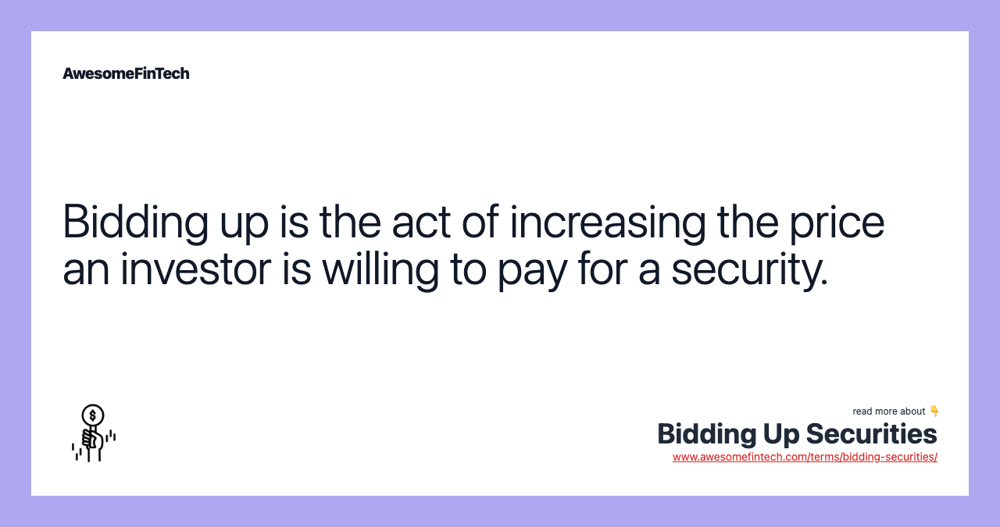

## Table of Contents

## What is bidding up securities?

Bidding up securities means that people are willing to pay more money for stocks, bonds, or other financial assets. This happens when a lot of people want to buy the same security, causing the price to go up. For example, if many people think a company will do well in the future, they might all try to buy its stock, pushing the price higher.

When securities are bid up, it can be a sign that investors are confident about the future of the company or the market. However, it can also lead to a bubble, where the price becomes too high compared to the real value of the security. If too many people are bidding up securities without good reasons, it might lead to a big drop in prices later, which can hurt investors.

## Why do investors bid up securities?

Investors bid up securities because they believe the price of those securities will keep going up. They might think a company is going to make more money in the future or that the whole market is going to do well. When a lot of people think this way, they all want to buy the same securities, and this pushes the price higher. It's like a lot of people wanting to buy the same toy at a store, so the price goes up because everyone wants it.

Sometimes, investors bid up securities because they hear other people talking about them. If a stock is in the news a lot or if famous investors are buying it, more people might want to buy it too. This can make the price go up even if the company isn't doing anything special. But it's important for investors to be careful because if everyone is bidding up a security for no good reason, the price can fall quickly, and people can lose money.

## What are the basic mechanisms involved in bidding up securities?

Bidding up securities happens when many people want to buy the same stock or bond, causing the price to go up. It starts when someone decides to buy a security because they think it will be worth more later. They put in an order to buy it at a certain price. If a lot of other people think the same way, they also put in orders to buy it. When more people want to buy than there are securities available, the price goes up because buyers have to offer more money to get it.

This process can keep going as more and more people jump in to buy the security. Sometimes, it's because they see the price going up and don't want to miss out. Other times, it's because they hear about the security from news or other investors. The more people who want to buy, the higher the price can go. But if the price gets too high and people start thinking it won't go up anymore, they might stop buying, and the price can fall back down.

## Can you explain the role of supply and demand in bidding up securities?

The role of supply and demand in bidding up securities is simple but important. Supply is how many securities, like stocks or bonds, are available to buy. Demand is how many people want to buy those securities. When more people want to buy a security than there are securities available, the price goes up. It's like when a popular toy is hard to find in stores; the price goes up because everyone wants it.

In the stock market, if a lot of people think a company is going to do well, they all try to buy its stock. This makes the demand higher than the supply, and the price goes up. The price keeps going up as long as more people want to buy than there are stocks to sell. But if fewer people want to buy, or if the company doesn't do as well as expected, the demand can drop, and the price can go down. So, supply and demand are always pushing and pulling the prices of securities.

## What are some common strategies used by investors to bid up securities?

Investors use different ways to bid up securities. One common way is to buy a lot of a security at once. When they do this, it can make other people think something big is happening, so they might want to buy it too. This can make the price go up because more people are trying to buy it. Another way is to spread the word about a security. If an investor talks about it on social media or in the news, more people might hear about it and want to buy it, pushing the price higher.

Sometimes, investors use a strategy called [momentum](/wiki/momentum) investing. This means they buy securities that are already going up in price. They think the price will keep going up because more people will want to buy it. This can make the price go up even more. But it's important to be careful because if everyone stops buying, the price can fall quickly. So, these strategies can help bid up securities, but they also come with risks.

## How does market sentiment influence the bidding up of securities?

Market sentiment is how people feel about the market or a specific security. If a lot of people feel good about a company or the whole market, they might want to buy more securities. This can make the price go up because everyone is trying to buy at the same time. For example, if people hear good news about a company, like it's going to make more money soon, they might think the stock price will go up. So, they all try to buy the stock, and this pushes the price higher.

But if people start to feel bad about the market or a company, they might want to sell their securities. This can make the price go down because there are more people trying to sell than buy. Market sentiment can change quickly based on news, what other investors are doing, or even just rumors. So, it's important for investors to think about how people feel when they decide to buy or sell securities.

## What are the potential risks associated with bidding up securities?

Bidding up securities can be risky. One big risk is that the price might go too high and not match what the company is really worth. If a lot of people are buying a stock because they think it will keep going up, but it doesn't, the price can drop fast. This can hurt investors who bought the stock at a high price. They might lose money if they have to sell it for less than they paid.

Another risk is that the market can change quickly. If something bad happens, like a company not doing well or the economy slowing down, people might want to sell their securities. This can make the price go down a lot. Also, if a lot of people are bidding up a security just because others are doing it, without good reasons, it can create a bubble. When the bubble bursts, the price can fall sharply, and investors can lose a lot of money. So, it's important for investors to be careful and think about why they are buying a security.

## Can you provide examples of securities that have been bid up in the past?

One example of a security that was bid up in the past is Tesla stock. A few years ago, a lot of people started buying Tesla stock because they thought the company was going to do really well in the future. They heard about Tesla's plans to make more electric cars and other cool projects. As more and more people wanted to buy Tesla stock, the price went up a lot. But some people thought the price got too high compared to what the company was really worth.

Another example is Bitcoin. A few years ago, Bitcoin's price started going up fast because a lot of people wanted to buy it. They heard about other people making money with Bitcoin and thought they could do the same. As more people tried to buy Bitcoin, the price kept going up. But then, the price fell a lot because some people thought it was too high and stopped buying. This shows how bidding up securities can be risky because the price can go down just as fast as it goes up.

## How do regulatory bodies monitor and control the practice of bidding up securities?

Regulatory bodies like the Securities and Exchange Commission (SEC) in the United States keep an eye on the stock market to make sure people are not doing things that could hurt other investors. They watch for signs that someone might be trying to bid up securities in a way that's not fair, like spreading false information or working together with others to push the price up. If they find out someone is doing this, they can stop them and even make them pay a fine or go to court.

Sometimes, regulatory bodies also make rules to help control bidding up securities. For example, they might set rules about how much information companies have to share with the public, so investors can make better choices. They also look at trading patterns to see if anything looks strange or if the price of a security is going up too fast without a good reason. By doing this, they try to keep the market fair for everyone and stop people from getting hurt by sudden price changes.

## What advanced techniques can traders use to anticipate and capitalize on securities being bid up?

Traders can use advanced techniques like technical analysis to anticipate when securities might be bid up. Technical analysis involves looking at charts and patterns to see how the price of a security has moved in the past. Traders look for signs that the price might start going up, like when the price breaks out of a certain range or when more people are buying than selling. They might also use tools like moving averages or the Relative Strength Index (RSI) to help them decide when to buy. By watching these patterns and indicators, traders can try to buy a security just before a lot of other people start bidding it up, hoping to make a profit as the price rises.

Another technique traders use is [fundamental analysis](/wiki/fundamental-analysis), which involves looking at the company's financial health and future prospects. If a company is doing well and is likely to keep doing well, more people might want to buy its stock, pushing the price up. Traders look at things like the company's earnings, how much money it's making, and what it's planning to do in the future. They might also pay attention to news and announcements from the company, which can affect how people feel about it. By understanding these factors, traders can try to buy the security before it gets bid up, hoping to sell it later at a higher price. Both technical and fundamental analysis help traders make smarter decisions about when to buy and sell, but they come with risks because no one can predict the future for sure.

## How does the bidding up of securities affect the broader market and economy?

When people bid up securities, it can make the whole stock market go up. If a lot of people are buying stocks and pushing their prices higher, it can make other people feel good about the market too. They might think the economy is doing well, so they want to buy more stocks. This can make the stock market keep going up, which is good for people who own stocks because their investments are worth more. But it can also make things more expensive for new investors who want to buy stocks, because the prices are already high.

However, if securities get bid up too much and the prices are too high compared to what the companies are really worth, it can be bad for the economy. If a lot of people are buying stocks just because they think the prices will keep going up, without good reasons, it can create a bubble. When the bubble bursts and the prices fall, it can hurt a lot of people who invested in those stocks. This can make people feel less confident about the economy, and they might spend less money. If people spend less, it can slow down the economy and even lead to a recession. So, bidding up securities can have big effects on the whole market and the economy.

## What are the ethical considerations and potential legal implications of intentionally bidding up securities?

Intentionally bidding up securities can be a problem because it's not fair to other people. If someone knows they are pushing the price up on purpose, they might be trying to trick other investors into buying at a higher price. This is called market manipulation, and it's not right because it can hurt people who don't know what's going on. They might buy the security thinking it's a good deal, but then lose money when the price falls back down. It's important for everyone to have a fair chance in the market, and intentionally bidding up securities goes against that.

There can also be legal trouble for people who intentionally bid up securities. In many places, there are laws against market manipulation. If someone gets caught doing this, they could face fines or even go to jail. The people who watch over the market, like the Securities and Exchange Commission (SEC) in the United States, are always looking for signs of this kind of behavior. They want to keep the market honest and safe for everyone. So, it's not just about being ethical; it's also about staying out of legal trouble.

## References & Further Reading

[1]: Aldridge, I. (2013). ["High-Frequency Trading: A Practical Guide to Algorithmic Strategies and Trading Systems"](https://www.amazon.com/High-Frequency-Trading-Practical-Algorithmic-Strategies/dp/1118343506). Wiley.

[2]: Narang, R.K. (2013). ["Inside the Black Box: A Simple Guide to Quantitative and High-Frequency Trading"](https://onlinelibrary.wiley.com/doi/book/10.1002/9781118662717). Wiley.

[3]: Kissell, R. (2013). ["The Science of Algorithmic Trading and Portfolio Management"](https://www.sciencedirect.com/book/9780124016897/the-science-of-algorithmic-trading-and-portfolio-management). Academic Press.

[4]: Cartea, Á., Jaimungal, S., & Penalva, J. (2015). ["Algorithmic and High-Frequency Trading"](https://assets.cambridge.org/97811070/91146/frontmatter/9781107091146_frontmatter.pdf). Cambridge University Press.

[5]: Hasbrouck, J. (2007). ["Empirical Market Microstructure: The Institutions, Economics, and Econometrics of Securities Trading"](https://academic.oup.com/book/52241). Oxford University Press.

[6]: ["The Impact of Market Microstructure on Institutions' Trading Costs"](https://www.sciencedirect.com/science/article/pii/S1386418104000382) by Hendershott, T., Jones, C. M., & Menkveld, A. J. (Journal of Financial Economics, 2011).

[7]: Harris, L. (2003). ["Trading and Exchanges: Market Microstructure for Practitioners"](https://academic.oup.com/book/52292). Oxford University Press.