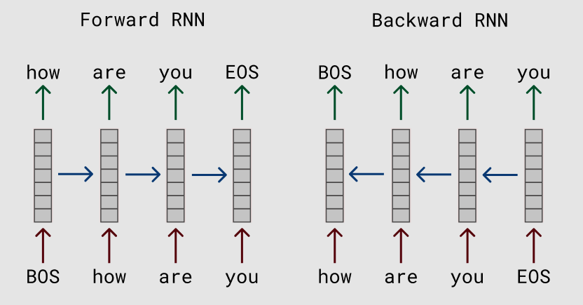

## Table of Contents

## What is a Bidirectional Language Model?

A bidirectional language model is a type of artificial intelligence model that understands and processes text by looking at the words before and after a specific word. This is different from older models that only looked at the words that came before. By considering the context from both sides, bidirectional models can better understand the meaning of words and sentences. This makes them very useful for tasks like answering questions, translating languages, and helping with writing.

One popular example of a bidirectional language model is BERT, which stands for Bidirectional Encoder Representations from Transformers. BERT was created by Google and it changed how we approach many language tasks. It works by training on a lot of text and learning how words relate to each other from both directions. This helps BERT to predict missing words in a sentence or understand the overall meaning of a text better than models that only look in one direction.

## How does a Bidirectional Language Model differ from traditional language models?

Traditional language models, often called unidirectional models, predict the next word in a sequence by only considering the words that come before it. Imagine you're trying to guess the next word in a sentence; you'd only use the words you've already seen. These models are good for tasks like auto-completing text or generating new sentences, but they can miss important context that comes later in the text.

Bidirectional language models, on the other hand, look at the words before and after the word they're trying to understand. This means they can use the full context of a sentence to better grasp its meaning. For example, if you're reading a sentence and you come across an ambiguous word, knowing what comes after it can help you figure out what it means. This makes bidirectional models, like BERT, much better at tasks that need a deep understanding of language, such as answering questions or summarizing texts.

The key difference is that bidirectional models can see the whole picture, while traditional models only see half of it. This full context awareness allows bidirectional models to perform better in many language tasks. However, this also makes them more complex to train because they need to process information from both directions at the same time.

## What are the key components of a Bidirectional Language Model?

The main part of a bidirectional language model is the transformer architecture. This is like a brain that helps the model understand and create text. The transformer has layers called encoders and decoders. For bidirectional models, the encoders are very important because they look at the whole sentence at once. They use something called self-attention to figure out which words are important and how they relate to each other. This helps the model see the full context, both before and after a word.

Another key component is the training data. Bidirectional models need a lot of text to learn from. This text can come from [books](/wiki/algo-trading-books), websites, or other places. The model reads this text and tries to predict missing words or understand the meaning of sentences. By doing this over and over, the model gets better at understanding language. The more and better the training data, the smarter the model becomes.

Lastly, the model uses a technique called masked language modeling. This means it hides some words in a sentence and tries to guess what they are. For example, if the sentence is "I like to eat [MASK] and bananas," the model would try to guess that the missing word is "apples." This helps the model learn from both sides of the sentence. By using these components together, bidirectional language models can understand and work with language in a very smart way.

## Can you explain the concept of context in Bidirectional Language Models?

Context in bidirectional language models is all about understanding the meaning of words by looking at the words around them. Imagine you're reading a story and you come across a word that could mean different things. If you only look at the words before it, you might guess wrong. But if you can also see the words that come after it, you get a better idea of what it really means. Bidirectional models do this by reading the whole sentence at once. They use the full context to figure out the best meaning of each word.

For example, if you see the word "bank" in a sentence, it could mean a place where you keep money or the side of a river. If the sentence is "I went to the bank to deposit money," the words after "bank" help you know it's about money. But if the sentence is "I sat by the bank of the river," the words after "bank" tell you it's about a river. Bidirectional models use this kind of context to understand language better than models that only look one way. This makes them really good at tasks like answering questions or helping with writing.

## What are some common applications of Bidirectional Language Models?

Bidirectional language models are used in many helpful ways. One big use is in search engines. When you type a question into a search engine, these models help understand what you really want to know. They look at all the words in your question to give you the best answers. This makes searching the internet easier and more accurate. Another use is in chatbots and virtual helpers. These models help them understand what you're saying and give you useful answers. This makes talking to a computer feel more like talking to a person.

Another common use is in writing tools. Bidirectional models can help you write better by suggesting the right words or fixing mistakes. They look at the whole sentence to make sure the suggestions make sense. This is really helpful for people who write a lot, like students or authors. They also help with translating languages. When you use a translation app, these models make sure the translation is correct by looking at the full context of the sentence. This makes it easier to understand and communicate in different languages.

## How does training a Bidirectional Language Model work?

Training a bidirectional language model involves feeding it a lot of text data so it can learn how words relate to each other in different contexts. The model reads sentences and tries to predict missing words. For example, if the sentence is "I like to eat [MASK] and bananas," the model tries to guess that the missing word is "apples." This technique is called masked language modeling. By doing this over and over with many different sentences, the model learns to understand the full context of words, both before and after them. The more data the model sees, the better it gets at understanding language.

The training process uses a special kind of [neural network](/wiki/neural-network) called a transformer. The transformer has layers called encoders that look at the whole sentence at once. They use something called self-attention to figure out which words are important and how they relate to each other. This helps the model see the full context of a sentence. Training a bidirectional model is more complex than training older models because it needs to process information from both directions at the same time. But this extra work makes the model much better at understanding and working with language.

## What challenges are faced when implementing Bidirectional Language Models?

Training bidirectional language models can be really hard because they need a lot of computer power. These models look at the whole sentence at once, which means they have to do a lot of calculations. This makes them slower to train than older models that only look at words one at a time. Also, they need a lot of text to learn from. Finding enough good data can be tough, and it takes a long time to go through all of it. This makes training these models expensive and time-consuming.

Another challenge is that bidirectional models can be hard to understand. They use complex math to figure out how words relate to each other, and it's not always clear why they make certain choices. This can make it hard to trust the model or fix it when it makes mistakes. Also, because they are so good at understanding language, there's a worry that they might be used in harmful ways, like spreading false information or invading privacy. So, people working on these models have to be careful to use them responsibly.

## Can you describe the architecture of a popular Bidirectional Language Model like BERT?

BERT, which stands for Bidirectional Encoder Representations from Transformers, uses a special kind of structure called the transformer architecture. The core part of BERT is its encoder layers. These layers look at the whole sentence at once and use something called self-attention to figure out which words are important and how they relate to each other. Imagine you're reading a sentence and you want to know what each word means. Self-attention helps BERT understand how each word connects to the others, both before and after it. BERT has many of these encoder layers stacked on top of each other, usually 12 or 24, depending on the size of the model. Each layer gets a bit better at understanding the sentence, and by the end, BERT has a good grasp of the full context.

Training BERT involves a technique called masked language modeling. During training, BERT reads sentences where some words are hidden, or "masked." For example, if the sentence is "I like to eat [MASK] and bananas," BERT tries to guess that the missing word is "apples." It does this by looking at the words around the mask and using what it knows about language to make the best guess. This helps BERT learn from both sides of the sentence. BERT also uses another technique called next sentence prediction, where it tries to guess if two sentences follow each other in a text. By doing these tasks over and over with lots of different sentences, BERT gets better at understanding and working with language.

## How do Bidirectional Language Models handle long-range dependencies in text?

Bidirectional language models like BERT handle long-range dependencies in text by using a special part of their structure called self-attention. Imagine you're reading a long story and you need to remember something from the beginning to understand something at the end. Self-attention helps the model focus on different parts of the sentence, no matter how far apart they are. This means the model can see how words at the start of a sentence connect to words at the end, helping it understand the whole meaning better.

For example, if a sentence says "The man who was walking his dog in the park yesterday is my uncle," the model needs to know that "man" and "uncle" are the same person. Self-attention lets the model look at "man" and "uncle" together, even though they are far apart in the sentence. This way, the model can understand long sentences and keep track of important details throughout the text.

## What are the performance metrics typically used to evaluate Bidirectional Language Models?

Bidirectional language models are often judged by how well they do on different language tasks. One common way to measure their performance is with something called accuracy. This means checking how often the model gets the right answer. For example, if the model is answering questions, accuracy would show how many questions it answers correctly. Another important metric is F1 score, which is a mix of precision and recall. Precision is about how many of the model's answers are right, and recall is about how many right answers the model finds. The F1 score helps balance these two things to give a good overall picture of the model's performance.

There are also other ways to see how well these models work. One is perplexity, which measures how surprised the model is by the text it sees. A lower perplexity means the model understands the text better. Another metric is BLEU score, often used for translation tasks. It compares the model's translations to human translations to see how similar they are. By using these different metrics, people can get a full view of how well a bidirectional language model works on different kinds of language tasks.

## How can Bidirectional Language Models be fine-tuned for specific tasks?

Fine-tuning a bidirectional language model means teaching it to be really good at a specific job, like answering questions or translating languages. You start with a model that already knows a lot about language from being trained on a huge amount of text. Then, you give it more examples of the specific job you want it to do. For example, if you want the model to answer questions about science, you show it lots of science questions and answers. The model learns from these examples and gets better at the task. This process is like giving the model special training to make it an expert in one area.

During fine-tuning, you use a technique called transfer learning. This means the model takes what it already knows about language and uses it to learn the new task faster. You also need to be careful not to overfit the model, which means making sure it doesn't just memorize the examples you give it but learns to handle new examples too. To do this, you split your data into a training set and a validation set. You use the training set to teach the model and the validation set to check how well it's doing. If the model does well on both sets, you know it's learning the task without just memorizing the examples.

## What are the latest advancements in Bidirectional Language Model research?

Recent advancements in bidirectional language models have focused on making them more efficient and powerful. One big step forward is the development of models like RoBERTa, which is an improved version of BERT. RoBERTa uses more training data and trains for longer, making it better at understanding language. Another advancement is ALBERT, which is designed to be lighter and faster than BERT. ALBERT uses a technique called parameter sharing, which means it uses fewer resources to do the same job. These new models show that we can make bidirectional language models work better and faster, which is great for using them in more places.

Another exciting area of research is in making these models more able to handle different languages. For example, the model called XLM-R (XLM-RoBERTa) can understand and work with many languages at once. This is really helpful for tasks like translating languages or answering questions in different languages. Researchers are also working on making these models more transparent and easier to understand. They are trying to figure out why the models make certain choices, which can help us trust them more and use them in safer ways. These advancements are helping bidirectional language models become even more useful and reliable.