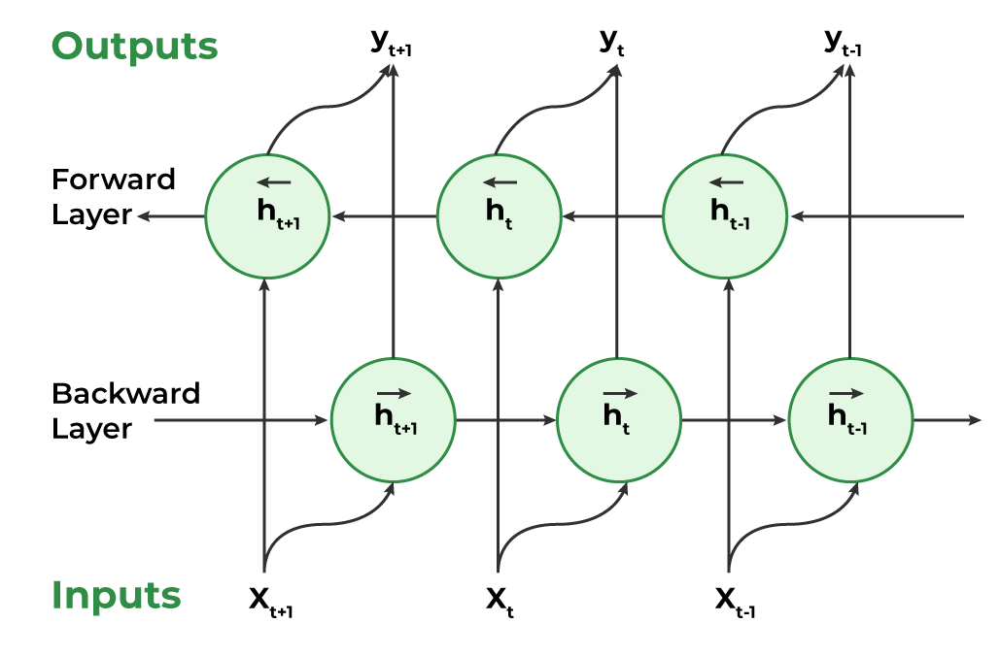

## Table of Contents

## What is a Recurrent Neural Network (RNN)?

A Recurrent Neural Network (RNN) is a type of artificial neural network designed to work with sequences of data. Unlike traditional neural networks, which process inputs independently, RNNs have a special kind of memory that allows them to retain information about previous inputs in the sequence. This makes them particularly useful for tasks like language translation, speech recognition, and time series prediction, where understanding the context from earlier parts of the data is crucial.

The key feature of an RNN is its ability to use internal loops to pass information from one step of the sequence to the next. Imagine reading a sentence: to understand the meaning of a word, you need to know the words that came before it. RNNs do something similar by keeping a 'hidden state' that gets updated at each step. This hidden state acts like a memory, allowing the network to make predictions based not just on the current input, but also on what it has seen before. While simple RNNs can struggle with long sequences due to issues like vanishing gradients, more advanced types like Long Short-Term Memory (LSTM) and Gated Recurrent Unit (GRU) networks help overcome these challenges.

## How does a Bidirectional Recurrent Neural Network (BiRNN) differ from a standard RNN?

A Bidirectional Recurrent Neural Network (BiRNN) is different from a standard RNN because it looks at the data in two directions: forward and backward. In a standard RNN, information flows only from past to future. This means it processes the sequence step by step, using what it has seen before to make predictions. But a BiRNN adds another layer that processes the sequence in reverse, from future to past. By doing this, it can use information from both the past and the future to understand the current input better.

For example, when processing a sentence, a standard RNN would read it from left to right, using earlier words to predict the meaning of later words. A BiRNN, on the other hand, would also read the sentence from right to left. This way, it can use words that come after the current word to help understand its meaning. This is especially useful in tasks like language translation or speech recognition, where context from both sides of a word or phrase can be important. By combining the outputs of both the forward and backward layers, a BiRNN can make more accurate predictions than a standard RNN.

## What are the main components of a BiRNN?

A BiRNN has two main parts: a forward RNN and a backward RNN. The forward RNN processes the sequence from start to end, just like a regular RNN. It looks at each item in the sequence one by one and uses what it has seen before to understand the current item. The backward RNN does the opposite; it starts from the end of the sequence and moves to the beginning. It uses information from later items to help understand earlier ones. Both of these RNNs work together in a BiRNN, allowing it to use information from both the past and the future to make better predictions.

The outputs from the forward and backward RNNs are then combined to give the final result. This can be done in different ways, but a common method is to concatenate or add the outputs at each time step. For example, if $$h_t^f$$ is the output of the forward RNN at time step $$t$$ and $$h_t^b$$ is the output of the backward RNN at the same time step, the combined output might be $$h_t = [h_t^f, h_t^b]$$ or $$h_t = h_t^f + h_t^b$$. This combined output is what the BiRNN uses to make its predictions or decisions, taking advantage of the full context of the sequence.

## How do BiRNNs process sequential data in both directions?

A BiRNN processes sequential data in both directions by using two separate RNNs: one that reads the sequence from start to end, and another that reads it from end to start. The first RNN, called the forward RNN, looks at each item in the sequence one by one, using what it has seen before to understand the current item. For example, when reading a sentence, it uses the earlier words to help understand the later ones. The second RNN, called the backward RNN, does the opposite. It starts from the last item and moves backward, using information from later items to help understand earlier ones. In the same sentence example, it uses the later words to help understand the earlier ones.

Both the forward and backward RNNs work together in a BiRNN. At each step in the sequence, the forward RNN gives an output, let's call it $$h_t^f$$, and the backward RNN gives its own output, let's call it $$h_t^b$$. These outputs are then combined to give the final result for that step. A common way to combine them is to put them together, so the combined output at time step $$t$$ might be $$h_t = [h_t^f, h_t^b]$$. This way, the BiRNN can use information from both the past and the future to make better predictions or decisions about the current item in the sequence.

## What are the advantages of using BiRNNs over unidirectional RNNs?

BiRNNs have a big advantage over unidirectional RNNs because they can look at the data in both directions. This means they can use information from the past and the future to understand the present better. Imagine you're reading a sentence. A unidirectional RNN only uses the words before the one you're reading to guess its meaning. But a BiRNN also uses the words after it, giving it more context to work with. This makes BiRNNs much better at tasks like understanding languages, where knowing what comes before and after a word can be really helpful.

Another advantage of BiRNNs is that they can capture dependencies in the data that unidirectional RNNs might miss. For example, in a sentence, the meaning of a word can depend on words that come later. A unidirectional RNN can't see these future words, but a BiRNN can. By combining the information from both directions, BiRNNs can make more accurate predictions and understand the data more deeply. This is why BiRNNs are often used in tasks like speech recognition and machine translation, where understanding the whole context is important.

## Can you explain the concept of BiGRU and how it relates to BiRNNs?

A BiGRU, or Bidirectional Gated Recurrent Unit, is a type of BiRNN that uses GRU cells instead of the standard RNN cells. GRUs are a bit like RNNs but are better at remembering things over long sequences. They do this with special parts called gates that decide what information to keep or throw away. In a BiGRU, you have two sets of these GRU cells: one set reads the data from start to end, and the other set reads it from end to start. This means a BiGRU can use information from both the past and the future to understand what's happening right now, just like a BiRNN.

The main difference between a BiGRU and a BiRNN is the type of cell they use. While a BiRNN uses regular RNN cells, a BiGRU uses GRU cells, which are more advanced and better at handling long sequences. This makes BiGRUs even more powerful for tasks like understanding languages or recognizing speech. In both BiRNNs and BiGRUs, the outputs from the forward and backward parts are combined to make the final prediction. For example, if $$h_t^f$$ is the output from the forward GRU at time step $$t$$ and $$h_t^b$$ is the output from the backward GRU at the same time step, the combined output might be $$h_t = [h_t^f, h_t^b]$$ or $$h_t = h_t^f + h_t^b$$. This way, BiGRUs can use the full context of the data to make better guesses about what's going on.

## How does a CNN BiLSTM model incorporate both Convolutional Neural Networks and BiRNNs?

A CNN BiLSTM model combines Convolutional Neural Networks (CNNs) with Bidirectional Long Short-Term Memory networks (BiLSTMs). CNNs are great at [picking](/wiki/asset-class-picking) out important features from data like images or text. They use special filters to look at small parts of the data and then put those parts together to understand the whole thing. In a CNN BiLSTM model, the CNN part first looks at the input data and finds these important features. Then, it passes these features to the BiLSTM part. The BiLSTM, which is a type of BiRNN, looks at the sequence of these features in both directions, from start to end and from end to start. This helps it understand the context of the features better, using information from both the past and the future.

For example, if you're trying to understand a sentence, the CNN part might pick out important words or phrases. Then, the BiLSTM part would look at these words in both directions to understand how they relate to each other. The BiLSTM uses special cells called LSTMs, which are good at remembering things over long sequences. They have gates that decide what information to keep or throw away. By combining the strengths of CNNs and BiLSTMs, the model can both pick out important features and understand how they fit together in the sequence. This makes CNN BiLSTM models very powerful for tasks like text classification, sentiment analysis, or even image captioning, where understanding both the features and their context is important.

## What is GRIN and how does it enhance the capabilities of BiRNNs?

GRIN stands for Gated Recurrent Independent Network, and it's a way to make BiRNNs even better at understanding sequences. In a regular BiRNN, the forward and backward parts work together but are kind of separate. GRIN changes this by adding a special part that helps the forward and backward parts talk to each other more. This special part is called a "gating mechanism," and it decides what information from the forward part should go to the backward part and vice versa. By doing this, GRIN helps the BiRNN understand the sequence more deeply because it can use information from both directions more effectively.

For example, when reading a sentence, a BiRNN with GRIN can use the words that come before and after a certain word to understand it better. The gating mechanism in GRIN lets the network know which words are most important to pay attention to, no matter if they come before or after. This makes the BiRNN smarter at tasks like language translation or speech recognition because it can capture the full context of the sequence. So, GRIN enhances BiRNNs by making them better at using information from both the past and the future to understand what's happening right now.

## What are U-RNNs and how do they differ from traditional BiRNNs?

U-RNNs, or Universal Recurrent Neural Networks, are a type of RNN that tries to be good at understanding all kinds of sequences, not just one kind. They do this by using a special way of connecting the neurons that lets them see the whole sequence at once, no matter how long it is. In a traditional BiRNN, you have two parts: one that reads the sequence from start to end, and another that reads it from end to start. But U-RNNs don't need these two parts because they can look at the whole sequence in one go, making them more flexible and powerful.

The main difference between U-RNNs and traditional BiRNNs is how they handle the sequence. In a BiRNN, the forward and backward parts work together but are kind of separate. They each look at the sequence in their own way and then combine their results. But in a U-RNN, there's no need for separate forward and backward parts because the network can see everything at once. This means U-RNNs can be better at tasks where the whole sequence matters, like understanding languages or predicting what might happen next in a video. By looking at the entire sequence together, U-RNNs can capture patterns and relationships that might be harder for a BiRNN to see.

## How can BiRNNs be applied in natural language processing tasks?

BiRNNs are really useful in natural language processing because they can understand sentences by looking at the words in both directions. Imagine you're reading a sentence. A BiRNN can use the words that come before and after a certain word to figure out what it means. This is helpful for tasks like translating languages, where knowing the whole context of a sentence can make the translation better. For example, when translating a sentence from English to Spanish, a BiRNN can use the words around a certain word to choose the right Spanish word.

Another way BiRNNs are used in natural language processing is for understanding the feelings in a piece of text, called sentiment analysis. If you want to know if a review is positive or negative, a BiRNN can read the whole review and use the words before and after to understand the overall feeling. This is better than just looking at each word by itself because sometimes the meaning of a word can change depending on what comes before or after it. By using both the past and the future, BiRNNs can do a better job at understanding languages and making sense of what people are saying or writing.

## What are some common challenges and limitations when training BiRNNs?

One of the main challenges when training BiRNNs is dealing with the problem of vanishing gradients. This happens when the network is trying to learn from long sequences. The gradients, which tell the network how to change its weights to get better, can become very small as they move through the layers. This makes it hard for the network to learn from the early parts of the sequence. To help with this, people often use special types of BiRNNs like BiLSTMs or BiGRUs, which have gates that help keep the gradients from getting too small.

Another limitation of BiRNNs is that they can take a lot of time and computer power to train. Because they need to process the sequence in both directions, they have to go through the data twice, once forward and once backward. This can make training slower and more expensive, especially for very long sequences. To make things a bit easier, people sometimes use techniques like truncating the sequence into smaller parts or using special hardware like GPUs to speed things up.

## How can one optimize the performance of BiRNNs for complex sequence prediction tasks?

To optimize the performance of BiRNNs for complex sequence prediction tasks, one effective approach is to use advanced architectures like BiLSTMs or BiGRUs. These models have special parts called gates that help them remember important information over long sequences. This can solve the problem of vanishing gradients, where the network struggles to learn from the early parts of the sequence. Another way to boost performance is by using techniques like attention mechanisms. Attention helps the BiRNN focus on the most important parts of the sequence, which can make its predictions more accurate. For example, when translating a sentence, attention can help the model pay more attention to the words that are key to understanding the meaning.

Another important strategy is to carefully tune the hyperparameters of the BiRNN. This includes choosing the right number of layers, the number of hidden units in each layer, and the learning rate. These settings can make a big difference in how well the model learns. For instance, if the learning rate is too high, the model might miss important details, but if it's too low, training can take too long. Additionally, using techniques like batch normalization can help stabilize the training process and improve the model's performance. By combining these methods, you can make your BiRNN better at handling complex sequence prediction tasks.

## References & Further Reading

[1]: Graves, A., & Schmidhuber, J. (2005). ["Framewise phoneme classification with bidirectional LSTM networks."](https://ieeexplore.ieee.org/document/1556215) IEEE International Conference on Acoustics, Speech, and Signal Processing.

[2]: Hochreiter, S., & Schmidhuber, J. (1997). ["Long short-term memory."](https://dl.acm.org/doi/10.1162/neco.1997.9.8.1735) Neural Computation, 9(8), 1735–1780.

[3]: Schuster, M., & Paliwal, K. K. (1997). ["Bidirectional recurrent neural networks."](https://ieeexplore.ieee.org/document/650093) IEEE Transactions on Signal Processing, 45(11), 2673–2681.

[4]: Cho, K., et al. (2014). ["Learning Phrase Representations using RNN Encoder-Decoder for Statistical Machine Translation."](https://arxiv.org/abs/1406.1078) arXiv preprint arXiv:1406.1078.

[5]: Bahdanau, D., Cho, K., & Bengio, Y. (2015). ["Neural Machine Translation by Jointly Learning to Align and Translate."](https://arxiv.org/abs/1409.0473) arXiv preprint arXiv:1409.0473.

[6]: Goldberg, Y. (2017). ["Neural Network Methods for Natural Language Processing."](https://link.springer.com/book/10.1007/978-3-031-02165-7) Synthesis Lectures on Human Language Technologies, Morgan & Claypool Publishers.

[7]: Olah, C. (2015). ["Understanding LSTM Networks."](https://colah.github.io/posts/2015-08-Understanding-LSTMs/) [Blog post]. Retrieved from colah.github.io.

[8]: Maas, A. L., et al. (2011). ["Learning Word Vectors for Sentiment Analysis."](https://aclanthology.org/P11-1015/) Proceedings of the 49th Annual Meeting of the Association for Computational Linguistics: Human Language Technologies.