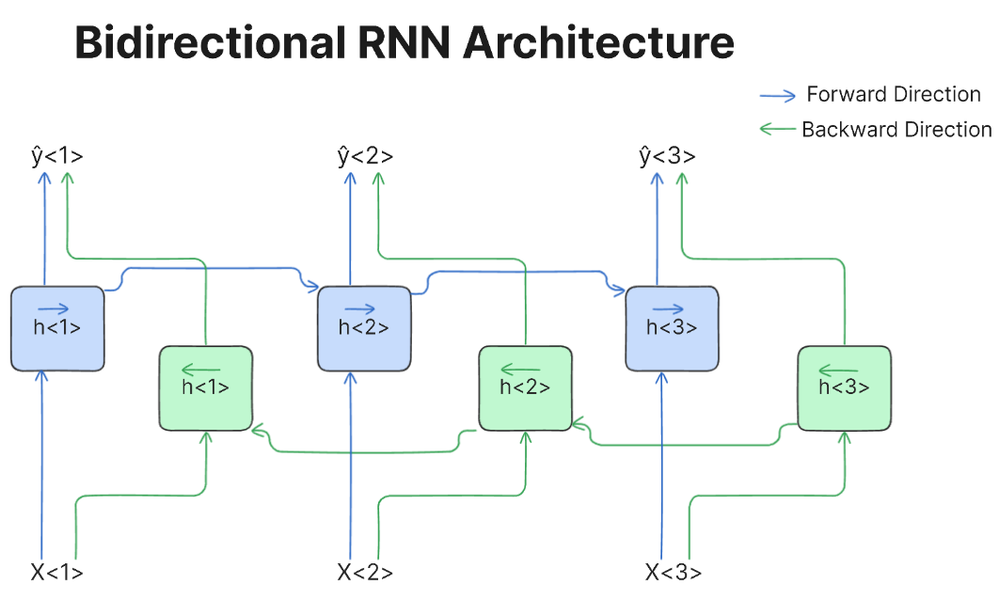

## Table of Contents

## What is bidirectional machine learning?

Bidirectional machine learning is a type of machine learning where the model can process information in both directions, from past to future and from future to past. This approach is particularly useful in understanding sequences of data, like text or time series, where the context from both sides can help in making better predictions or understanding the data more accurately. For example, in language processing, knowing the words that come before and after a specific word can help in better understanding its meaning.

A common application of bidirectional machine learning is in neural networks, specifically in models like the Bidirectional Long Short-Term Memory (LSTM) networks. These models use two separate LSTM layers, one processing the input sequence from left to right and the other from right to left. By combining the outputs of these two layers, the model can capture dependencies in the data that a unidirectional model might miss. This makes bidirectional models very effective for tasks such as speech recognition, where understanding the entire context of a sentence can improve accuracy.

## How does bidirectional machine learning differ from unidirectional machine learning?

Bidirectional machine learning and unidirectional machine learning differ mainly in how they process data. In unidirectional machine learning, data is processed in one direction, usually from past to future. This means the model looks at the data as it comes in, like reading a book from start to finish. This approach is good for tasks where future information isn't needed to understand the current data, such as predicting the next word in a sentence based on the previous words.

On the other hand, bidirectional machine learning processes data in both directions, from past to future and future to past. This is like reading a book forwards and backwards at the same time. By doing this, the model can see the full context of the data, which can be very helpful for understanding things like language, where knowing what comes before and after a word can change its meaning. For example, in a bidirectional model, understanding a sentence like "He went to the bank" can be better because the model knows if "bank" refers to a river or a financial institution based on surrounding words.

In practical terms, bidirectional models, like Bidirectional LSTMs, use two layers of processing: one layer reads the data from left to right, and another reads it from right to left. These layers then combine their outputs to make predictions or classifications. This approach can lead to better results in tasks like speech recognition or text analysis, where context is important. Unidirectional models, while simpler, might miss out on this full context and perform less accurately in such tasks.

## What are the primary applications of bidirectional machine learning?

Bidirectional [machine learning](/wiki/machine-learning) is mainly used in tasks where understanding the full context of data is important. One big area is in natural language processing (NLP). For example, when a computer tries to understand what people are saying or writing, it helps a lot to look at the words before and after a specific word. This can make things like speech recognition and text translation much better. If someone says "I saw a bank," knowing if the next word is "river" or "account" can change the meaning completely. So, bidirectional models, like Bidirectional LSTMs, are really good at these kinds of tasks.

Another important use is in time series analysis, where data changes over time. For example, in predicting stock prices or weather forecasts, looking at past and future data can give a better understanding of trends. A bidirectional model can look at data from both directions to make more accurate predictions. This is helpful in many fields, like finance or meteorology, where knowing the full picture can lead to better decisions. So, bidirectional machine learning helps in understanding and predicting things that change over time by using all the available information.

## Can you explain the basic architecture of a bidirectional model?

The basic architecture of a bidirectional model, like a Bidirectional LSTM, involves using two separate layers to process the input data. One layer reads the data from left to right, which means it starts from the beginning and goes to the end. The other layer reads the data from right to left, starting at the end and going back to the beginning. Each of these layers is typically an LSTM (Long Short-Term Memory) network, which is good at remembering information over long sequences.

After both layers have processed the data, their outputs are combined to form the final output of the model. This combination can be done in different ways, but usually, it's just adding the outputs of the two layers together. This way, the model gets to use information from both the past and the future to understand the data better. For example, if you're trying to predict the next word in a sentence, knowing the words before and after can help a lot.

## What are the advantages of using bidirectional models in machine learning?

Bidirectional models in machine learning are really good at understanding things like sentences or time series data. They look at the data from both directions, which means they can see the full context. This is super helpful when you're trying to understand what a word means in a sentence or predict what's going to happen next in a sequence. For example, if you're trying to understand if "bank" means a river or a place to put money, knowing the words before and after helps a lot. So, bidirectional models can make better predictions and understand data more accurately than models that only look at data one way.

Another big advantage of bidirectional models is that they can capture patterns that might be missed by models that only look forward. This is especially useful in tasks like speech recognition or language translation. When you're trying to understand or translate what someone is saying, knowing the whole sentence can make a big difference. Bidirectional models can use this full context to improve their performance, making them more reliable and accurate in real-world applications. This is why they are often used in areas where understanding the full context of data is important.

## What challenges might one face when implementing bidirectional machine learning?

Implementing bidirectional machine learning can be tricky because it needs more computing power and time. Since bidirectional models look at data from both directions, they have to do twice the work compared to unidirectional models. This means they take longer to train and need more powerful computers. For example, if you're using a bidirectional LSTM for language processing, your computer has to handle two LSTM layers at the same time, which can slow things down and make it harder to use on devices with limited resources.

Another challenge is that bidirectional models can be harder to understand and explain. Because they use information from the future and the past, it can be tough to figure out why the model made a certain prediction. This is called the "black box" problem, where it's hard to see how the model works inside. If you're using these models in areas where you need to explain your decisions, like in healthcare or finance, this can be a big problem. You need to be able to trust and explain the model's decisions, and bidirectional models can make that harder.

## How does bidirectional processing improve the performance of models like RNNs or transformers?

Bidirectional processing helps models like RNNs or transformers understand data better by looking at it from both directions. For example, when a model is trying to understand a sentence, knowing what comes before and after a word can change its meaning. If you read "I saw a bank," knowing if the next word is "river" or "account" helps a lot. Bidirectional models, like Bidirectional LSTMs, use two layers: one reads the sentence from left to right, and the other from right to left. By combining what these layers learn, the model gets a fuller picture of the data, which makes it better at tasks like speech recognition or language translation.

In transformers, bidirectional processing is used in models like BERT (Bidirectional Encoder Representations from Transformers). Transformers don't use layers that read in one direction like RNNs; instead, they look at all the words in a sentence at the same time. This means they can understand the context from both sides right from the start. By doing this, transformers can learn the relationships between words more effectively, which improves their performance in tasks like answering questions or filling in missing words in a sentence. So, bidirectional processing helps these models use all the information available to make smarter and more accurate predictions.

## What specific algorithms or techniques are commonly used in bidirectional machine learning?

One common technique used in bidirectional machine learning is the Bidirectional Long Short-Term Memory (LSTM) network. This type of model uses two LSTM layers: one that reads the data from left to right and another that reads it from right to left. By combining the outputs of these two layers, the model can capture patterns and dependencies in the data that a unidirectional model might miss. This is really helpful in tasks like understanding sentences or predicting what will happen next in a sequence. For example, if you're trying to understand what "bank" means in a sentence, knowing the words before and after it can help a lot.

Another important technique is the use of bidirectional transformers, like BERT (Bidirectional Encoder Representations from Transformers). Unlike LSTMs, transformers look at all the words in a sentence at the same time, which means they can understand the context from both sides right from the start. This makes them very good at tasks like answering questions or filling in missing words in a sentence. BERT, for example, has been trained on a huge amount of text and can understand the relationships between words really well. By using bidirectional processing, these models can use all the information available to make smarter and more accurate predictions.

## How can bidirectional models be evaluated and what metrics are important?

To evaluate bidirectional models, you need to use metrics that show how well the model understands and predicts data. Common metrics for this include accuracy, which measures how often the model gets things right, and F1 score, which is a balance between precision (how many of the model's positive predictions are correct) and recall (how many of the actual positives the model catches). For language tasks, you might also use metrics like BLEU score for translation or ROUGE for text summarization. These metrics help you see if the model is doing a good job at understanding sentences or predicting what comes next.

When you're working with bidirectional models like Bidirectional LSTMs or BERT, it's important to test them on different kinds of data to make sure they work well in different situations. You can split your data into training, validation, and test sets. The training set is used to teach the model, the validation set helps you tune the model's settings, and the test set checks how well the model works on new data it hasn't seen before. By looking at these metrics across different sets, you can get a good idea of how reliable and accurate your bidirectional model is.

## What are some real-world examples where bidirectional machine learning has been successfully applied?

Bidirectional machine learning has been successfully used in speech recognition systems. For example, Amazon's Alexa and Google Assistant use bidirectional models to understand what people are saying. When someone speaks, the model looks at the whole sentence, not just the words that come before. This helps the system understand the context better and make fewer mistakes. If someone says "Turn on the light in the kitchen," knowing the words "kitchen" and "light" helps the system figure out what to do, even if the words are spoken quickly or with background noise.

Another real-world example is in language translation. Google Translate uses bidirectional models like transformers to translate text from one language to another. These models look at the entire sentence in both the original and target languages, which helps them keep the meaning and context right. For instance, if you're translating "I saw a bank" from English to Spanish, knowing if "bank" means a river or a financial institution can change the translation completely. Bidirectional models help make these translations more accurate and natural-sounding.

## How do you train a bidirectional model and what are the considerations for optimizing its performance?

To train a bidirectional model like a Bidirectional LSTM or a transformer, you start by preparing your data. You split it into three parts: training, validation, and test sets. The training set is used to teach the model, the validation set helps you adjust the model's settings, and the test set checks how well the model works on new data. You feed the training data into the model, letting it see the sequences from both directions. For example, if you're training a Bidirectional LSTM for language processing, you'll have two LSTM layers, one reading the text from left to right and the other from right to left. The model learns by adjusting its internal weights to minimize the difference between its predictions and the actual data. This process, called backpropagation, helps the model get better over time.

Optimizing the performance of a bidirectional model involves several considerations. First, you need to choose the right hyperparameters, like the number of layers, the size of the layers, and the learning rate. These settings can affect how quickly and well the model learns. You can use the validation set to try different settings and see which ones work best. Another important thing is to make sure your model doesn't overfit, which means it learns the training data too well but doesn't work on new data. You can prevent overfitting by using techniques like dropout, where you randomly ignore some of the model's connections during training, or by using regularization, which adds a penalty to the model's complexity. Finally, having enough computing power is key because bidirectional models need to process data in both directions, which can take more time and resources.

## What are the current research trends and future directions in bidirectional machine learning?

One of the current research trends in bidirectional machine learning is improving the efficiency of these models. Researchers are working on ways to make bidirectional models, like Bidirectional LSTMs and transformers, faster and less resource-intensive. This is important because these models need to process data in both directions, which can take a lot of time and computing power. One approach is to use techniques like pruning, where parts of the model that don't contribute much to the final output are removed. Another trend is exploring new architectures that can capture bidirectional context more effectively without the need for two separate processing layers. For example, some researchers are looking into models that can process data in both directions at the same time, which could make them faster and more efficient.

Another area of focus is applying bidirectional models to new types of data and tasks. While bidirectional machine learning has been very successful in natural language processing and speech recognition, researchers are now trying to use these models in fields like healthcare and finance. For example, bidirectional models could help predict stock prices by looking at past and future data to understand market trends better. In healthcare, these models could be used to analyze patient data over time to predict health outcomes. The future direction of bidirectional machine learning also includes developing more interpretable models. Since bidirectional models can be hard to understand due to their complexity, researchers are working on ways to make them more transparent and easier to explain, which is crucial for applications where decisions need to be justified.